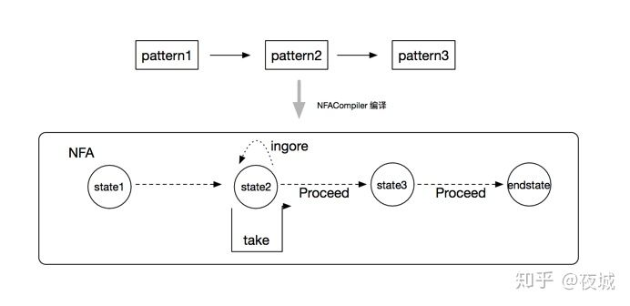
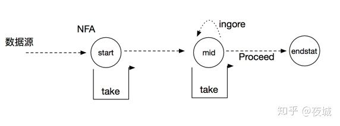

## 什么是复杂事件CEP？

一个或多个由简单事件构成的事件流通过一定的规则匹配，然后输出用户想得到的数据，满足规则的复杂事件。


## 特征：

- 目标：从有序的简单事件流中发现一些高阶特征

- 输入：一个或多个由简单事件构成的事件流

- 处理：识别简单事件之间的内在联系，多个符合一定规则的简单事件构成复杂事件

- 输出：满足规则的复杂事件


## CEP架构


### CEP-NFA

### CEP-NFA是什么？

Flink 的每个模式包含多个状态，模式匹配的过程就是状态转换的过程，每个状态(state)可以理解成由Pattern构成，为了从当前的状态转换成下一个状态，用户可以在Pattern上指定条件，用于状态的过滤和转换。

实际上Flink CEP 首先需要用户创建定义一个个pattern，然后通过链表将由前后逻辑关系的pattern串在一起，构成模式匹配的逻辑表达。然后需要用户利用NFACompiler，将模式进行分拆，创建出NFA(非确定有限自动机)对象，NFA包含了该次模式匹配的各个状态和状态间转换的表达式。整个示意图就像如下：



### CEP-三种状态迁移边

- Take: 表示事件匹配成功，将当前状态更新到新状态，并前进到“下一个”状态；
- Procceed: 当事件来到的时候，当前状态不发生变化，在状态转换图中事件直接“前进”到下一个目标状态；
- IGNORE: 当事件来到的时候，如果匹配不成功，忽略当前事件，当前状态不发生任何变化。

为了更好的理解上述概念，我们利用下面代码，构建一个nfa：

```java
//构建链接patterns
Pattern pattern = Pattern
    .begin("start")
    .where(new SimpleCondition() {
        private static final long serialVersionUID = 5726188262756267490L;
        @Override
        public boolean filter(Event value) throws Exception {
            return value.getName().equals("c");
        }
    })
    .followedBy("middle")
    .where(new SimpleCondition() {
        private static final long serialVersionUID = 5726188262756267490L; 
        @Override
        public boolean filter(Event value) throws Exception { 
            return value.getName().equals("a");
        }
    })
    .optional(); 
//创建nfa
NFA nfa = NFACompiler.compile(pattern, Event.createTypeSerializer(), false);
```

例如构建的nfa的状态示意图如下所示：



此时如果我们加入数据源如下, 理论上的输出结果应该是[event1] 和 [event1，event4]。

```
Event event0 = new Event(40, "x", 1.0); 
Event event1 = new Event(40, "c", 1.0); 
Event event2 = new Event(42, "b", 2.0); 
Event event3 = new Event(43, "b", 2.0); 
Event event4 = new Event(44, "a", 2.0); 
Event event5 = new Event(45, "b", 5.0); 
```

下面我们来分析下，当第一条消息event0来的时候，由于start状态只有Take状态迁移边，这时event0匹配失败，消息被丢失，start状态不发生任何变化；当第二条消息event1来的时候，匹配成功，这时用event1更新start当前状态，并且进入下一个状态，既mid状态。而这是我们发现mid状态存在Proceed状态迁移边，以为着事件来临时，可以直接进入下一个状态，这里就是endstat状态，说明匹配结束，存在第一个匹配结果[event1]；当第三条消息event2来临时，由于之前我们已经进入了mid状态，所以nfa会让我们先匹配mid的条件，匹配失败，由于mid状态存在Ingore状态迁移边，所以当前mid状态不发生变化，event2继续往回匹配start的条件，匹配失败，这时event2被丢弃；同样的event3也不会影响nfa的所有状态，被丢弃。当第五条消息event4来临时，匹配mid的条件成功，更新当前mid状态，并且进入“下一个状态”，那就是endstat状态，说明匹配结束，存在第二个匹配结果[event1, event4]。

### CEP 共享缓存SharedBuffer

在引入SharedBuffer概念之前，我们先把上图的例子改一下，将原先pattern1 和 pattern2的连接关系由next，改成followedByAny。

```java
Pattern pattern2 = pattern1.followedByAny("pattern2")
    .where(new SimpleCondition() {
        private static final long serialVersionUID = 5726188262756267490L;
        @Override
        public boolean filter(Event value) throws Exception {
            return value.getName().equals("b");
        }
    });
```

followedByAny是非严格的匹配连接关系。表示前一个pattern匹配的事件和后面一个pattern的事件间可以间隔多个任意元素。所以上述的例子输出结果是[event1, event2]、[event4, event5]和[event1, event5]。当匹配event1成功后，由于event2还没到来，需要将event1保存到state1，这样每个状态需要缓冲堆栈来保存匹配成功的事件，我们把各个状态的对应缓冲堆栈集称之为缓冲区。由于上述例子有三种输出，理论上我们需要创建三个独立的缓冲区。

