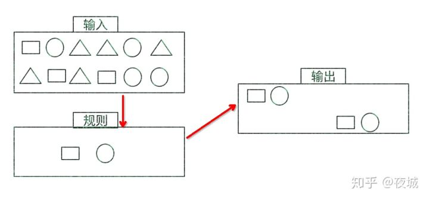
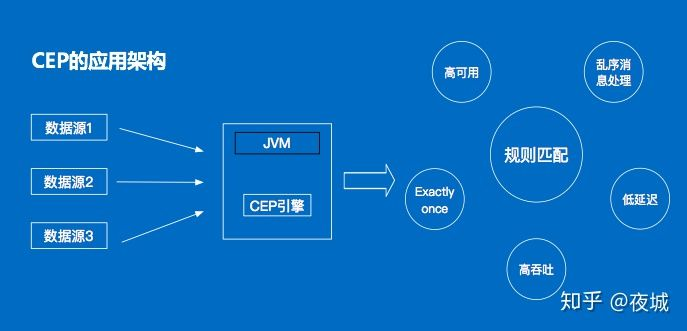
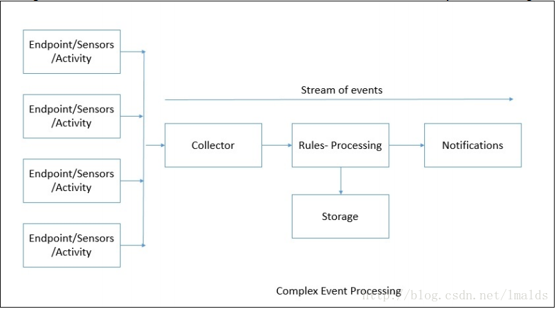
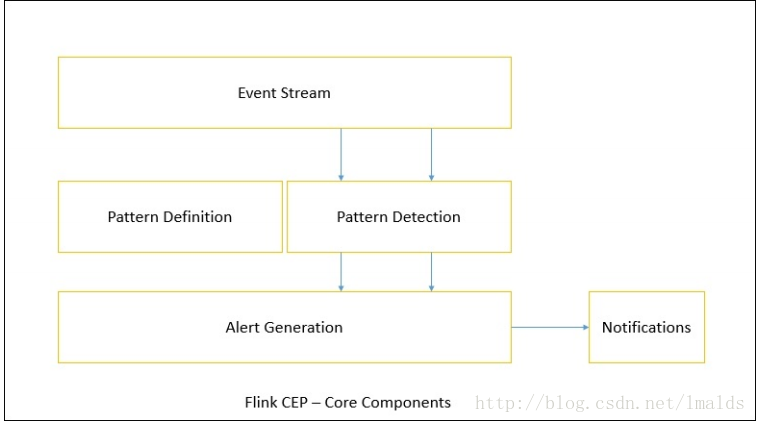
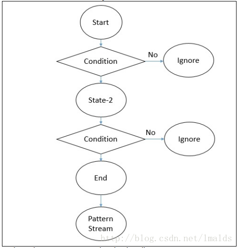

## 什么是复杂事件CEP？

一个或多个由简单事件构成的事件流通过一定的规则匹配，然后输出用户想得到的数据，满足规则的复杂事件。


## 特征：

- 目标：从有序的简单事件流中发现一些高阶特征

- 输入：一个或多个由简单事件构成的事件流

- 处理：识别简单事件之间的内在联系，多个符合一定规则的简单事件构成复杂事件

- 输出：满足规则的复杂事件



## CEP架构



CEP用于分析低延迟、频繁产生的不同来源的事件流。CEP可以帮助在复杂的、不相关的事件流中找出有意义的模式和复杂的关系，以接近实时或准实时的获得通知并阻止一些行为。

CEP支持在流上进行模式匹配，根据模式的条件不同，分为连续的条件或不连续的条件；模式的条件允许有时间的限制，当在条件范围内没有达到满足的条件时，会导致模式匹配超时。

CEP的工作流图：



看起来很简单，但是它有很多不同的功能：

1. 输入的流数据，尽快产生结果
2. 在2个event流上，基于时间进行聚合类的计算
3. 提供实时/准实时的警告和通知
4. 在多样的数据源中产生关联并分析模式
5. 高吞吐、低延迟的处理

市场上有多种CEP的解决方案，例如Spark、Samza、Beam等，但他们都没有提供专门的library支持。但是Flink提供了专门的CEP library。

## Flink CEP

Flink为CEP提供了专门的Flink CEP library，它包含如下组件：

1. Event Stream
2. pattern定义
3. pattern检测
4. 生成Alert



首先，开发人员要在DataStream流上定义出模式条件，之后Flink CEP引擎进行模式检测，必要时生成告警。

为了使用Flink CEP，我们需要导入依赖：

```xml
<dependency>
  <groupId>org.apache.flink</groupId>
  <artifactId>flink-cep_2.10</artifactId>
  <version>1.2.0</version>
</dependency>
```

### Event Streams

我们首先需要为Stream Event设计java pojo，但是注意，由于要对event对象进行对比，所以我们需要重写hashCode()方法和equals()方法。下面进行监控温度事件流。

创建抽象类MonitoringEvent，重写hashCode()和equals()方法；再创建POJO：TemperatureEvent，同样重写hashCode()和equals()方法： 

MonitoringEvent：

```java
package flink.cep;


public abstract class MonitoringEvent {
    private String machineName;

    public String getMachineName() {
        return machineName;
    }

    public void setMachineName(String machineName) {
        this.machineName = machineName;
    }

    @Override
    public int hashCode() {
        final int prime = 31;
        int result = 1;
        result = prime * result + ((machineName == null) ? 0 : machineName.hashCode());

        return result;
    }

    @Override
    public boolean equals(Object obj) {
        if(this == obj) return true;
        if(obj == null) return false;
        if(getClass() != obj.getClass()) return false;
        MonitoringEvent other = (MonitoringEvent) obj;
        if(machineName == null) {
            if(other.machineName != null) {
                return false;
            }else if(!machineName.equals(other.machineName)) {
                return false;
            }
        }
        return true;
    }

    public MonitoringEvent(String machineName) {
        super();
        this.machineName = machineName;
    }
}
```

TemperatureEvent：

```java
package flink.cep;


public class TemperatureEvent extends MonitoringEvent{

    public TemperatureEvent(String machineName) {
        super(machineName);
    }

    private double temperature;

    public double getTemperature() {
        return temperature;
    }

    public void setTemperature(double temperature) {
        this.temperature = temperature;
    }

    @Override
    public int hashCode() {
        final int prime = 31;
        int result = super.hashCode();
        long temp;
        temp = Double.doubleToLongBits(temperature);
        result = (int) (prime * result +(temp ^ (temp >>> 32)));

        return result;
    }

    @Override
    public boolean equals(Object obj) {
        if(this == obj) return true;
        if(!super.equals(obj)) return false;
        if(getClass() != obj.getClass()) return false;

        TemperatureEvent other = (TemperatureEvent) obj;
        if(Double.doubleToLongBits(temperature) != Double.doubleToLongBits(other.temperature)) return false;
        return true;
    }

    @Override
    public String toString() {
        return "TemperatureEvent [getTemperature()=" + getTemperature() + ", getMachineName=" + getTemperature() + "]";
    }

    public TemperatureEvent(String machineName, double temperature) {
        super(machineName);
        this.temperature = temperature;
    }
}
```

创建env，创建source：

```java
package temp;


import flink.cep.TemperatureEvent;
import org.apache.flink.streaming.api.datastream.DataStream;
import org.apache.flink.streaming.api.environment.StreamExecutionEnvironment;

public class Test {

    public static void main(String[] args) {
        StreamExecutionEnvironment env = StreamExecutionEnvironment.getExecutionEnvironment();

        DataStream<TemperatureEvent> inputEventStream = env.fromElements(
                new TemperatureEvent("xyz",22.0),
                new TemperatureEvent("xyz",20.1), new TemperatureEvent("xyz",21.1),
                new TemperatureEvent("xyz",22.2), new TemperatureEvent("xyz",22.1),
                new TemperatureEvent("xyz",22.3), new TemperatureEvent("xyz",22.1),
                new TemperatureEvent("xyz",22.4), new TemperatureEvent("xyz",22.7),
                new TemperatureEvent("xyz",27.0));
    }
}
```

### Pattern API

每个Pattern都应该包含几个步骤，或者叫做state。从一个state到另一个state，通常我们需要定义一些条件，例如下列的代码：

```java
DataStream<Event> input = ...

Pattern<Event, ?> pattern = Pattern.begin("start").where(evt -> evt.getId() == 42)
    .next("middle").subtype(SubEvent.class).where(subEvt -> subEvt.getVolume() >= 10.0)
    .followedBy("end").where(evt -> evt.getName().equals("end"));

PatternStream<Event> patternStream = CEP.pattern(input, pattern);

DataStream<Alert> result = patternStream.select(pattern -> {
    return createAlertFrom(pattern);
});
```



每个state都应该有一个标示：

```java
Pattern<Event, ?> start = Pattern.<Event>begin("start");
```

每个state都需要有一个唯一的名字，而且需要一个filter来过滤条件：

```java
start.where(new FilterFunction<Event>() {
    @Override
    public boolean filter(Event value) {
        return ... // some condition
    }
});
```

我们也可以通过subtype来限制event的子类型：

```java
start.subtype(SubEvent.class).where(new FilterFunction<SubEvent>() {
    @Override
    public boolean filter(SubEvent value) {
        return ... // some condition
    }
});
```

事实上，你可以多次调用subtype和where方法；而且如果where条件是不相关的，你可以通过or来指定一个单独的filter函数：

```java
pattern.where(new FilterFunction<Event>() {
    @Override
    public boolean filter(Event value) {
        return ... // some condition
    }
}).or(new FilterFunction<Event>() {
    @Override
    public boolean filter(Event value) {
        return ... // or condition
    }
});
```

之后，我们可以在此条件基础上，通过next或者followedBy方法切换到下一个state，next的意思是说上一步符合条件的元素之后紧挨着的元素；而followedBy并不要求一定是挨着的元素。这两者分别称为严格近邻和非严格近邻。

```java
Pattern<Event, ?> strictNext = start.next("middle");
```

```java
Pattern<Event, ?> nonStrictNext = start.followedBy("middle");
```

最后，我们可以将所有的Pattern的条件限定在一定的时间范围内：

```java
next.within(Time.seconds(10));
```

这个时间可以是processing time，也可以是Event time。

### Pattern 检测

通过一个input DataStream以及刚刚我们定义的Pattern，我们可以创建一个PatternStream：

```java
DataStream<Event> input = ...
Pattern<Event, ?> pattern = ...

PatternStream<Event> patternStream = CEP.pattern(input, pattern);
```

一旦获得PatternStream，我们就可以通过select或flatSelect，从一个Map序列找到我们需要的告警信息。

#### select

select方法需要实现一个PatternSelectFunction，通过select方法来输出需要的警告。它接受一个Map对，包含string/event，其中key为state的名字，event则为真是的Event。

```java
class MyPatternSelectFunction<IN, OUT> implements PatternSelectFunction<IN, OUT> {
    @Override
    public OUT select(Map<String, IN> pattern) {
        IN startEvent = pattern.get("start");
        IN endEvent = pattern.get("end");
        return new OUT(startEvent, endEvent);
    }
}
```

其返回值仅为1条记录。

#### flatSelect

通过实现PatternFlatSelectFunction，实现与select相似的功能。唯一的区别就是flatSelect方法可以返回多条记录。

```java
class MyPatternFlatSelectFunction<IN, OUT> implements PatternFlatSelectFunction<IN, OUT> {
    @Override
    public void select(Map<String, IN> pattern, Collector<OUT> collector) {
        IN startEvent = pattern.get("start");
        IN endEvent = pattern.get("end");

        for (int i = 0; i < startEvent.getValue(); i++ ) {
            collector.collect(new OUT(startEvent, endEvent));
        }
    }
}
```

### 超时事件的处理

通过within方法，我们的parttern规则限定在一定的窗口范围内。当有超过窗口时间后还到达的event，我们可以通过在select或flatSelect中，实现PatternTimeoutFunction/PatternFlatTimeoutFunction来处理这种情况。

```java
PatternStream<Event> patternStream = CEP.pattern(input, pattern);

DataStream<Either<TimeoutEvent, ComplexEvent>> result = patternStream.select(
    new PatternTimeoutFunction<Event, TimeoutEvent>() {...},
    new PatternSelectFunction<Event, ComplexEvent>() {...}
);

DataStream<Either<TimeoutEvent, ComplexEvent>> flatResult = patternStream.flatSelect(
    new PatternFlatTimeoutFunction<Event, TimeoutEvent>() {...},
    new PatternFlatSelectFunction<Event, ComplexEvent>() {...}
);
```

## 例子

我们继续最开始时的温度检测的例子。

我们创建一个Alert类，表示在满足一定的pattern条件后，需要告警的内容：

```java
package flink.cep;


public class Alert {

    private String message;

    public String getMessage() {
        return message;
    }

    public void setMessage(String message) {
        this.message = message;
    }

    public Alert(String message) {
        this.message = message;
    }

    @Override
    public String toString() {
        return "Alert [message=" + message + "]";
    }

    @Override
    public int hashCode() {
        final int prime = 31;
        int result = 1;
        result = prime * result + ((message == null) ? 0 : message.hashCode());
        return result;
    }

    @Override
    public boolean equals(Object obj) {
        if(this == obj) return true;
        if(obj == null) return false;
        if(getClass() != obj.getClass()) return false;

        Alert other = (Alert) obj;

        if(message == null) {
            if(other.message != null) {
                return false;
            }else if(!message.equals(other.message)) {
                return false;
            }
        }
        return true;
    }
}
```

最后，我们定义一个Pattern：当Event的温度超过26度时，立刻产生一个Alert信息，最终实现如下：

```java
import flink.cep.Alert;
import flink.cep.TemperatureEvent;
import org.apache.flink.api.common.functions.FilterFunction;
import org.apache.flink.cep.CEP;
import org.apache.flink.cep.PatternSelectFunction;
import org.apache.flink.cep.pattern.Pattern;
import org.apache.flink.streaming.api.datastream.DataStream;
import org.apache.flink.streaming.api.environment.StreamExecutionEnvironment;
import org.apache.flink.streaming.api.windowing.time.Time;

import java.util.Map;

public class Test {

    public static void main(String[] args) throws Exception{
        StreamExecutionEnvironment env = StreamExecutionEnvironment.getExecutionEnvironment();
        env.setParallelism(1);

        // DataStream : source
        DataStream<TemperatureEvent> inputEventStream = env.fromElements(new TemperatureEvent("xyz",22.0),
                new TemperatureEvent("xyz",20.1), new TemperatureEvent("xyz",21.1),
                new TemperatureEvent("xyz",22.2), new TemperatureEvent("xyz",22.1),
                new TemperatureEvent("xyz",22.3), new TemperatureEvent("xyz",22.1),
                new TemperatureEvent("xyz",22.4), new TemperatureEvent("xyz",22.7),
                new TemperatureEvent("xyz",27.0), new TemperatureEvent("xyz",30.0));

        // 定义Pattern，检查10秒钟内温度是否高于26度
        Pattern<TemperatureEvent,?> warningPattern = Pattern.<TemperatureEvent>begin("start")
                .subtype(TemperatureEvent.class)
                .where(new FilterFunction<TemperatureEvent>() {
                    private static final long serialVersionUID = 1L;

                    @Override
                    public boolean filter(TemperatureEvent value) throws Exception {
                        if(value.getTemperature() >= 26.0){
                            return true;
                        }
                        return false;
                    }
                })
                .within(Time.seconds(10));

        //匹配pattern并select事件,符合条件的发生警告，即输出
        DataStream<Alert> patternStream = CEP.pattern(inputEventStream, warningPattern)
                .select(new PatternSelectFunction<TemperatureEvent, Alert>() {
                    private static final long serialVersionUID = 1L;

                    @Override
                    public Alert select(Map<String, TemperatureEvent> event) throws Exception {
                        return new Alert("Temperature Rise Detected: " + event.get("start").getTemperature() + " on machine name: " + event.get("start").getMachineName());
                    }
                });

        patternStream.print();

        env.execute("CEP on Temperature Sensor");
    }
}
```

这个pattern非常简单，只要TemperatureEvent中有超过26度的记录，就发出一条警告。


