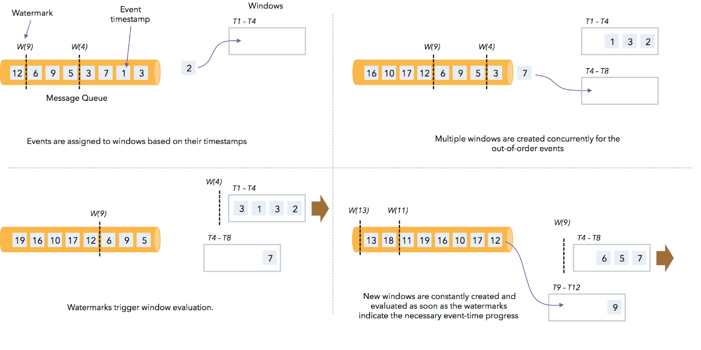

## 1. watermark的概念

watermark是一种衡量Event Time进展的机制, 它是数据本身的一个隐藏属性. 通常基于Event Time的数据, 自身都包含一个timestamp, 例如1472693399700(2016-09-01 09:29:59.700), 而这条数据的watermark时间则可能是: 

```
watermark(1472693399700) = 1472693396700(2016-09-01 09:29:56.700)
```

这条数据的watermark时间是什么含义呢? 即: timestamp小于1472693396700(2016-09-01 09:29:56.700)的数据, 都已经到达了。

## 2. watermark有什么用?

watermark是用于处理乱序事件的, 而正确的处理乱序事件, 通常用watermark机制结合window来实现.

我们知道, 流处理从事件产生, 到流经source, 再到operator, 中间是有一个过程和时间的. 虽然大部分情况下, 流到operator的数据都是按照事件产生的时间顺序来的, 但是也不排除由于网络、背压等原因, 导致乱序的产生(out-of-order或者说late element)。

但是对于late element, 我们又不能无限期的等下去, 必须要有个机制来保证一个特定的时间后, 必须触发window去进行计算了. 这个特别的机制, 就是watermark.

## 3. watermark如何分配?

通常, 在接收到source的数据后, 应该立刻生成watermark; 但是, 也可以在source后, 应用简单的map或者filter操作, 然后再生成watermark.

生成watermark的方式主要有2大类:

1. With Periodic Watermarks
2. With Punctuated Watermarks

第一种可以定义一个最大允许乱序的时间, 这种情况应用较多.

我们主要来围绕Periodic Watermarks来说明, 下面是生成periodic watermark的方法:

```scala
/**
 * This generator generates watermarks assuming that elements come out of order to a certain degree only.
 * The latest elements for a certain timestamp t will arrive at most n milliseconds after the earliest
 * elements for timestamp t.
 */
class BoundedOutOfOrdernessGenerator extends AssignerWithPeriodicWatermarks[MyEvent] {

    val maxOutOfOrderness = 3500L; // 3.5 seconds

    var currentMaxTimestamp: Long;

    override def extractTimestamp(element: MyEvent, previousElementTimestamp: Long): Long = {
        val timestamp = element.getCreationTime()
        currentMaxTimestamp = max(timestamp, currentMaxTimestamp)
        timestamp;
    }

    override def getCurrentWatermark(): Watermark = {
        // return the watermark as current highest timestamp minus the out-of-orderness bound
        new Watermark(currentMaxTimestamp - maxOutOfOrderness);
    }
}
```

程序中有一个extractTimestamp方法, 就是根据数据本身的Event time来获取; 还有一个getCurrentWatermar方法, 是用currentMaxTimestamp - maxOutOfOrderness来获取的.

这里的概念有点抽象, 下面我们结合数据, 在window中来实际演示下每个element的timestamp和watermark是多少, 以及何时触发window.

## 4. 生成并跟踪watermark代码

### 4.1 程序说明

我们从socket接收数据, 然后经过map后立刻抽取timetamp并生成watermark, 之后应用window来看看watermark和event time如何变化, 才导致window被触发的.

### 4.2 代码如下

```scala
import java.text.SimpleDateFormat

import org.apache.flink.streaming.api.scala._
import org.apache.flink.streaming.api.TimeCharacteristic
import org.apache.flink.streaming.api.functions.AssignerWithPeriodicWatermarks
import org.apache.flink.streaming.api.scala.StreamExecutionEnvironment
import org.apache.flink.streaming.api.scala.function.WindowFunction
import org.apache.flink.streaming.api.watermark.Watermark
import org.apache.flink.streaming.api.windowing.assigners.TumblingEventTimeWindows
import org.apache.flink.streaming.api.windowing.time.Time
import org.apache.flink.streaming.api.windowing.windows.TimeWindow
import org.apache.flink.util.Collector


object WatermarkTest {

  def main(args: Array[String]): Unit = {
    if (args.length != 2) {
      System.err.println("USAGE:\nSocketWatermarkTest <hostname> <port>")
      return
    }

    val hostName = args(0)
    val port = args(1).toInt

    val env = StreamExecutionEnvironment.getExecutionEnvironment
    env.setStreamTimeCharacteristic(TimeCharacteristic.EventTime)

    val input = env.socketTextStream(hostName,port)

    val inputMap = input.map(f=> {
      val arr = f.split("\\W+")
      val code = arr(0)
      val time = arr(1).toLong
      (code,time)
    })

    val watermark = inputMap.assignTimestampsAndWatermarks(new AssignerWithPeriodicWatermarks[(String,Long)] {

      var currentMaxTimestamp = 0L
      val maxOutOfOrderness = 10000L//最大允许的乱序时间是10s

      var a : Watermark = null

      val format = new SimpleDateFormat("yyyy-MM-dd HH:mm:ss.SSS")

      override def getCurrentWatermark: Watermark = {
        a = new Watermark(currentMaxTimestamp - maxOutOfOrderness)
        a
      }

      override def extractTimestamp(t: (String,Long), l: Long): Long = {
        val timestamp = t._2
        currentMaxTimestamp = Math.max(timestamp, currentMaxTimestamp)
        println("timestamp:" + t._1 +","+ t._2 + "|" +format.format(t._2) +","+  currentMaxTimestamp + "|"+ format.format(currentMaxTimestamp) + ","+ a.toString)
        timestamp
      }
    })

    val window = watermark
    .keyBy(_._1)
    .window(TumblingEventTimeWindows.of(Time.seconds(3)))
    .apply(new WindowFunctionTest)

    window.print()

    env.execute()
  }

  class WindowFunctionTest extends WindowFunction[(String,Long),(String, Int,String,String,String,String),String,TimeWindow]{

    override def apply(key: String, window: TimeWindow, input: Iterable[(String, Long)], out: Collector[(String, Int,String,String,String,String)]): Unit = {
      val list = input.toList.sortBy(_._2)
      val format = new SimpleDateFormat("yyyy-MM-dd HH:mm:ss.SSS")
      out.collect(key,input.size,format.format(list.head._2),format.format(list.last._2),format.format(window.getStart),format.format(window.getEnd))
    }
  }
}
```

### 4.3 程序详解

1. 接收socket数据.
2. 将每行数据按照字符分隔, 每行map成一个tuple类型(code, time).
3. 抽取timestamp生成watermark. 并打印(code, time, 格式化的time, currentMaxTimestamp, currentMaxTimestamp的格式化时间, watermark时间). 
4. event time每隔3秒触发一次窗口, 输出(code, 窗口内元素个数, 窗口内最早元素的时间, 窗口内最晚元素的时间, 窗口自身开始时间, 窗口自身结束时间).

**注意**: new AssignerWithPeriodicWatermarks[(String, Long)]中有抽取timestamp和生成watermark 2个方法, 在执行时, 它是先抽取timestamp, 后生成watermark, 因此我们在这里print的watermark时间, 其实是上一条的watermark时间, 我们到数据输出时再解释.

## 5. 通过数据跟踪watermark的时间

我们重点看看watermark与timestamp的时间, 并通过数据来看看window的触发时机.

首先, 我们开启socket, 输入第一条数据:

```
000001,1461756862000
```

输出的out文件如下:

```
timestamp:000001,1461756862000|2016-04-27 19:34:22.000,1461756862000|2016-04-27 19:34:22.000,Watermark @ -10000
```

这里, 看下watermark的值, -10000, 即0-10000得到的. 这就说明程序先执行timestamp, 后执行watermark. 所以, 每条记录打印出的watermark, 都应该是上一条的watermark. 为了观察方便，我汇总了输出如下:

Key | Event Time | currentMaxTimestamp | Watermark
-----|----------------|------------------------|------------------
000001 | 1461756862000<br>2016-04-27 19:34:22.000 | 1461756862000<br>2016-04-27 19:34:22.000 | 1461756852000<br>2016-04-27 19:34:12.000 


此时, wartermark的时间按照逻辑, 已经落后于currentMaxTimestamp10秒了. 我们继续输入:


```
000001,1461756862000
000001,1461756866000
```

此时, 输出内容如下:

```
timestamp:000001,1461756862000|2016-04-27 19:34:22.000,1461756862000|2016-04-27 19:34:22.000,Watermark @ -10000
timestamp:000001,1461756866000|2016-04-27 19:34:26.000,1461756866000|2016-04-27 19:34:26.000,Watermark @ 1461756852000
```

Key | Event Time | currentMaxTimestamp | Watermark
-----|----------------|------------------------|------------------
000001 | 1461756862000<br>2016-04-27 19:34:22.000 | 1461756862000<br>2016-04-27 19:34:22.000 | 1461756852000<br>2016-04-27 19:34:12.000
000001 |1461756866000<br>2016-04-27 19:34:26.000 | 1461756866000<br>2016-04-27 19:34:26.000 | 1461756856000<br>2016-04-27 19:34:16.000


我们继续输入, 这时我们再次输入:


```
000001,1461756862000
000001,1461756866000
000001,1461756872000
```

输出如下:

```
timestamp:000001,1461756862000|2016-04-27 19:34:22.000,1461756862000|2016-04-27 19:34:22.000,Watermark @ -10000
timestamp:000001,1461756866000|2016-04-27 19:34:26.000,1461756866000|2016-04-27 19:34:26.000,Watermark @ 1461756852000
timestamp:000001,1461756872000|2016-04-27 19:34:32.000,1461756872000|2016-04-27 19:34:32.000,Watermark @ 1461756856000
```

汇总如下:

Key | Event Time | currentMaxTimestamp | Watermark
-----|----------------|------------------------|------------------
000001 | 1461756862000<br><u>2016-04-27 19:34:22.000</u> | 1461756862000<br>2016-04-27 19:34:22.000 | 1461756852000<br>2016-04-27 19:34:12.000
000001 |1461756866000<br>2016-04-27 19:34:26.000 | 1461756866000<br>2016-04-27 19:34:26.000 | 1461756856000<br>2016-04-27 19:34:16.000
000001 | 1461756872000<br>2016-04-27 19:34:32.000 | 1461756872000<br>2016-04-27 19:34:32.000 | 1461756862000<br><u>2016-04-27 19:34:22.000</u> 

到这里, window仍然没有被触发, 此时watermark的时间已经等于了第一条数据的Event Time了. 那么window到底什么时候被触发呢? 我们再次输入:

```
000001,1461756862000
000001,1461756866000
000001,1461756872000
000001,1461756873000
```

输出:

```
timestamp:000001,1461756862000|2016-04-27 19:34:22.000,1461756862000|2016-04-27 19:34:22.000,Watermark @ -10000
timestamp:000001,1461756866000|2016-04-27 19:34:26.000,1461756866000|2016-04-27 19:34:26.000,Watermark @ 1461756852000
timestamp:000001,1461756872000|2016-04-27 19:34:32.000,1461756872000|2016-04-27 19:34:32.000,Watermark @ 1461756856000
timestamp:000001,1461756873000|2016-04-27 19:34:33.000,1461756873000|2016-04-27 19:34:33.000,Watermark @ 1461756862000
```

汇总:
Key | Event Time | currentMaxTimestamp | Watermark
-----|----------------|------------------------|------------------
000001 | 1461756862000<br><u>2016-04-27 19:34:22.000</u> | 1461756862000<br>2016-04-27 19:34:22.000 | 1461756852000<br>2016-04-27 19:34:12.000
000001 |1461756866000<br>2016-04-27 19:34:26.000 | 1461756866000<br>2016-04-27 19:34:26.000 | 1461756856000<br>2016-04-27 19:34:16.000
000001 | 1461756872000<br>2016-04-27 19:34:32.000 | 1461756872000<br>2016-04-27 19:34:32.000 | 1461756862000<br>2016-04-27 19:34:22.000 
000001 | 1461756873000<br>2016-04-27 19:34:33.000 | 1461756873000<br>2016-04-27 19:34:32.000 | 1461756863000<br><u>2016-04-27 19:34:23.000</u> 

OK, window仍然没有触发, 此时, 我们的数据已经发到2016-04-27 19:34:33.000了, 最早的数据已经过去了11秒了, 还没有开始计算. 那是不是要等到13(10+3)秒过去了, 才开始触发window呢? 答案是否定的.

我们再次增加1秒, 输入:

```
000001,1461756862000
000001,1461756866000
000001,1461756872000
000001,1461756873000
000001,1461756874000
```

输出:

```
timestamp:000001,1461756862000|2016-04-27 19:34:22.000,1461756862000|2016-04-27 19:34:22.000,Watermark @ -10000
timestamp:000001,1461756866000|2016-04-27 19:34:26.000,1461756866000|2016-04-27 19:34:26.000,Watermark @ 1461756852000
timestamp:000001,1461756872000|2016-04-27 19:34:32.000,1461756872000|2016-04-27 19:34:32.000,Watermark @ 1461756856000
timestamp:000001,1461756873000|2016-04-27 19:34:33.000,1461756873000|2016-04-27 19:34:33.000,Watermark @ 1461756862000
timestamp:000001,1461756874000|2016-04-27 19:34:34.000,1461756874000|2016-04-27 19:34:34.000,Watermark @ 1461756863000
(000001,1,2016-04-27 19:34:22.000,2016-04-27 19:34:22.000,2016-04-27 19:34:21.000,2016-04-27 19:34:24.000)
```

汇总:
Key | Event Time | currentMaxTimestamp | Watermark | window
-----|----------------|------------------------|------------------|-------------
000001 | 1461756862000<br><u>2016-04-27 19:34:22.000</u> | 1461756862000<br>2016-04-27 19:34:22.000 | 1461756852000<br>2016-04-27 19:34:12.000|
000001 |1461756866000<br>2016-04-27 19:34:26.000 | 1461756866000<br>2016-04-27 19:34:26.000 | 1461756856000<br>2016-04-27 19:34:16.000|
000001 | 1461756872000<br>2016-04-27 19:34:32.000 | 1461756872000<br>2016-04-27 19:34:32.000 | 1461756862000<br>2016-04-27 19:34:22.000 |
000001 | 1461756873000<br>2016-04-27 19:34:33.000 | 1461756873000<br>2016-04-27 19:34:32.000 | 1461756863000<br>2016-04-27 19:34:23.000|
000001 | 1461756874000<br>2016-04-27 19:34:34.000 | 1461756874000<br>2016-04-27 19:34:34.000 | 1461756864000<br><u>2016-04-27 19:34:24.000</u>|[19:34:21.000, 19:34:24.000)

到这里，我们做一个说明:

window的触发机制, 是先按照自然时间将window划分, 如果window大小是3秒, 那么1分钟内会把window划分为如下的形式:

```
[00:00:00,00:00:03)
[00:00:03,00:00:06)
...
[00:00:57,00:01:00)
```

如果window大小是10秒，则window会被分为如下的形式：

```
[00:00:00,00:00:10)
[00:00:10,00:00:20)
...
[00:00:50,00:01:00)
```

window的设定无关数据本身, 而是系统定义好了的.

输入的数据中, 根据自身的Event Time, 将数据划分到不同的window中, 如果window中有数据, 则当watermark时间>=Event Time时, 就符合了window触发的条件了, 最终决定window触发, 还是由数据本身的Event Time所属的window中的window_end_time决定.

上面的测试中, 最后一条数据到达后, 其水位线已经升至19:34:24秒, 正好是最早的一条记录所在window的window_end_time, 所以window就被触发了。

为了验证window的触发机制，我们继续输入数据： 

```
000001,1461756862000
000001,1461756866000
000001,1461756872000
000001,1461756873000
000001,1461756874000
000001,1461756876000
```

输出： 

```
timestamp:000001,1461756862000|2016-04-27 19:34:22.000,1461756862000|2016-04-27 19:34:22.000,Watermark @ -10000
timestamp:000001,1461756866000|2016-04-27 19:34:26.000,1461756866000|2016-04-27 19:34:26.000,Watermark @ 1461756852000
timestamp:000001,1461756872000|2016-04-27 19:34:32.000,1461756872000|2016-04-27 19:34:32.000,Watermark @ 1461756856000
timestamp:000001,1461756873000|2016-04-27 19:34:33.000,1461756873000|2016-04-27 19:34:33.000,Watermark @ 1461756862000
timestamp:000001,1461756874000|2016-04-27 19:34:34.000,1461756874000|2016-04-27 19:34:34.000,Watermark @ 1461756863000
(000001,1,2016-04-27 19:34:22.000,2016-04-27 19:34:22.000,2016-04-27 19:34:21.000,2016-04-27 19:34:24.000)
timestamp:000001,1461756876000|2016-04-27 19:34:36.000,1461756876000|2016-04-27 19:34:36.000,Watermark @ 1461756864000
```

汇总:
Key | Event Time | currentMaxTimestamp | Watermark | window
-----|----------------|------------------------|------------------|-------------
000001 | 1461756862000<br>2016-04-27 19:34:22.000 | 1461756862000<br>2016-04-27 19:34:22.000 | 1461756852000<br>2016-04-27 19:34:12.000|
000001 |1461756866000<br><u>2016-04-27 19:34:26.000</u> | 1461756866000<br>2016-04-27 19:34:26.000 | 1461756856000<br>2016-04-27 19:34:16.000|
000001 | 1461756872000<br>2016-04-27 19:34:32.000 | 1461756872000<br>2016-04-27 19:34:32.000 | 1461756862000<br>2016-04-27 19:34:22.000 |
000001 | 1461756873000<br>2016-04-27 19:34:33.000 | 1461756873000<br>2016-04-27 19:34:32.000 | 1461756863000<br>2016-04-27 19:34:23.000|
000001 | 1461756874000<br>2016-04-27 19:34:34.000 | 1461756874000<br>2016-04-27 19:34:34.000 | 1461756864000<br>2016-04-27 19:34:24.000 |[19:34:21.000, 19:34:24.000)
000001 | 1461756876000<br>2016-04-27 19:34:36.000 | 1461756876000<br>2016-04-27 19:34:36.000|1461756866000<br><u>2016-04-27 19:34:26.000</u>|

此时，watermark时间虽然已经达到了第二条数据的时间，但是由于其没有达到第二条数据所在window的结束时间，所以window并没有被触发。那么，第二条数据所在的window时间是：

```
[19:34:24,19:34:27)
```

也就是说，我们必须输入一个19:34:27秒的数据，第二条数据所在的window才会被触发。我们继续输入： 

```
000001,1461756862000
000001,1461756866000
000001,1461756872000
000001,1461756873000
000001,1461756874000
000001,1461756876000
000001,1461756877000
```

输出：

```
timestamp:000001,1461756862000|2016-04-27 19:34:22.000,1461756862000|2016-04-27 19:34:22.000,Watermark @ -10000
timestamp:000001,1461756866000|2016-04-27 19:34:26.000,1461756866000|2016-04-27 19:34:26.000,Watermark @ 1461756852000
timestamp:000001,1461756872000|2016-04-27 19:34:32.000,1461756872000|2016-04-27 19:34:32.000,Watermark @ 1461756856000
timestamp:000001,1461756873000|2016-04-27 19:34:33.000,1461756873000|2016-04-27 19:34:33.000,Watermark @ 1461756862000
timestamp:000001,1461756874000|2016-04-27 19:34:34.000,1461756874000|2016-04-27 19:34:34.000,Watermark @ 1461756863000
(000001,1,2016-04-27 19:34:22.000,2016-04-27 19:34:22.000,2016-04-27 19:34:21.000,2016-04-27 19:34:24.000)
timestamp:000001,1461756876000|2016-04-27 19:34:36.000,1461756876000|2016-04-27 19:34:36.000,Watermark @ 1461756864000
timestamp:000001,1461756877000|2016-04-27 19:34:37.000,1461756877000|2016-04-27 19:34:37.000,Watermark @ 1461756866000
(000001,1,2016-04-27 19:34:26.000,2016-04-27 19:34:26.000,2016-04-27 19:34:24.000,2016-04-27 19:34:27.000)
```

汇总：
Key | Event Time | currentMaxTimestamp | Watermark | window
-----|----------------|------------------------|------------------|-------------
000001 | 1461756862000<br>2016-04-27 19:34:22.000 | 1461756862000<br>2016-04-27 19:34:22.000 | 1461756852000<br>2016-04-27 19:34:12.000|
000001 |1461756866000<br><u>2016-04-27 19:34:26.000</u> | 1461756866000<br>2016-04-27 19:34:26.000 | 1461756856000<br>2016-04-27 19:34:16.000|
000001 | 1461756872000<br>2016-04-27 19:34:32.000 | 1461756872000<br>2016-04-27 19:34:32.000 | 1461756862000<br>2016-04-27 19:34:22.000 |
000001 | 1461756873000<br>2016-04-27 19:34:33.000 | 1461756873000<br>2016-04-27 19:34:33.000 | 1461756863000<br>2016-04-27 19:34:23.000|
000001 | 1461756874000<br>2016-04-27 19:34:34.000 | 1461756874000<br>2016-04-27 19:34:34.000 | 1461756864000<br>2016-04-27 19:34:24.000 |[19:34:21.000, 19:34:24.000)
000001 | 1461756876000<br>2016-04-27 19:34:36.000 | 1461756876000<br>2016-04-27 19:34:36.000|1461756866000<br><u>2016-04-27 19:34:26.000</u>|
000001 | 1461756877000<br>2016-04-27 19:34:37.000 | 1461756877000<br>2016-04-27 19:34:37.000 | 1461756867000<br><u>2016-04-27 19:34:27.000</u> | [19:34:24.000, 19:34:27.000)

此时，我们已经看到，window的触发要符合以下几个条件：


1. watermark时间 >= window_end_time
2. 在[window_start_time,window_end_time)中有数据存在


同时满足了以上2个条件，window才会触发。

而且，这里要强调一点，watermark是一个全局的值，不是某一个key下的值，所以即使不是同一个key的数据，其warmark也会增加，例如： 

输入：

```
000002,1461756879000
```

输出：

```
timestamp:000002,1461756879000|2016-04-27 19:34:39.000,1461756879000|2016-04-27 19:34:39.000,Watermark @ 1461756867000
```

我们看到，currentMaxTimestamp也增加了。


## 6. watermark+window处理乱序

我们上面的测试，数据都是按照时间顺序递增的，现在，我们输入一些乱序的（late）数据，看看watermark结合window机制，是如何处理乱序的。 
输入： 

```
000001,1461756862000
000001,1461756866000    
000001,1461756872000        
000001,1461756873000
000001,1461756874000
000001,1461756876000
000001,1461756877000
000002,1461756879000
000001,1461756871000
```

输出:

```
timestamp:000001,1461756862000|2016-04-27 19:34:22.000,1461756862000|2016-04-27 19:34:22.000,Watermark @ -10000
timestamp:000001,1461756866000|2016-04-27 19:34:26.000,1461756866000|2016-04-27 19:34:26.000,Watermark @ 1461756852000
timestamp:000001,1461756872000|2016-04-27 19:34:32.000,1461756872000|2016-04-27 19:34:32.000,Watermark @ 1461756856000
timestamp:000001,1461756873000|2016-04-27 19:34:33.000,1461756873000|2016-04-27 19:34:33.000,Watermark @ 1461756862000
timestamp:000001,1461756874000|2016-04-27 19:34:34.000,1461756874000|2016-04-27 19:34:34.000,Watermark @ 1461756863000
(000001,1,2016-04-27 19:34:22.000,2016-04-27 19:34:22.000,2016-04-27 19:34:21.000,2016-04-27 19:34:24.000)
timestamp:000001,1461756876000|2016-04-27 19:34:36.000,1461756876000|2016-04-27 19:34:36.000,Watermark @ 1461756864000
timestamp:000001,1461756877000|2016-04-27 19:34:37.000,1461756877000|2016-04-27 19:34:37.000,Watermark @ 1461756866000
(000001,1,2016-04-27 19:34:26.000,2016-04-27 19:34:26.000,2016-04-27 19:34:24.000,2016-04-27 19:34:27.000)
timestamp:000002,1461756879000|2016-04-27 19:34:39.000,1461756879000|2016-04-27 19:34:39.000,Watermark @ 1461756867000
timestamp:000001,1461756871000|2016-04-27 19:34:31.000,1461756879000|2016-04-27 19:34:39.000,Watermark @ 1461756869000
```

汇总:
Key | Event Time | currentMaxTimestamp | Watermark | window
-----|----------------|------------------------|------------------|-------------
000001 | 1461756872000<br>2016-04-27 19:34:32.000 | 1461756872000<br>2016-04-27 19:34:32.000 | 1461756862000<br>2016-04-27 19:34:22.000 |
000001 |1461756873000<br><u>2016-04-27 19:34:33.000</u> | 1461756873000<br>2016-04-27 19:34:33.000 | 1461756863000<br>2016-04-27 19:34:23.000 |
000001 | 1461756874000<br>2016-04-27 19:34:34.000 | 1461756874000<br>2016-04-27 19:34:34.000 | 1461756864000<br>2016-04-27 19:34:24.000 |
000001 | 1461756876000<br>2016-04-27 19:34:36.000 | 1461756876000<br>2016-04-27 19:34:36.000 | 1461756866000<br>2016-04-27 19:34:26.000 |
000001 | 1461756877000<br>2016-04-27 19:34:37.000 | 1461756877000<br>2016-04-27 19:34:37.000 | 1461756867000<br>2016-04-27 19:34:27.000 |[19:34:21.000, 19:34:24.000)
000001 | 1461756879000<br>2016-04-27 19:34:39.000 | 1461756879000<br>2016-04-27 19:34:39.000 |1461756869000<br><u>2016-04-27 19:34:29.000</u>|
000001 | 1461756871000<br>2016-04-27 19:34:31.000 | 1461756879000<br>2016-04-27 19:34:39.000 | 1461756869000<br><u>2016-04-27 19:34:29.000</u> | [19:34:24.000, 19:34:27.000)

可以看到，虽然我们输入了一个19:34:31的数据，但是currentMaxTimestamp和watermark都没变。此时，按照我们上面提到的公式：

```
1. watermark时间 >= window_end_time
2. 在[window_start_time,window_end_time)中有数据存在
```

watermark时间（19:34:29） < window_end_time（19:34:33），因此不能触发window。

那如果我们再次输入一条19:34:43的数据，此时watermark时间会升高到19:34:33，这时的window一定就会触发了，我们试一试： 

输入:

```
000001,1461756862000
000001,1461756866000
000001,1461756872000
000001,1461756873000
000001,1461756874000
000001,1461756876000
000001,1461756877000
000002,1461756879000
000001,1461756871000
000001,1461756873000
000001,1461756883000
```

输出:

```
timestamp:000001,1461756862000|2016-04-27 19:34:22.000,1461756862000|2016-04-27 19:34:22.000,Watermark @ -10000
timestamp:000001,1461756866000|2016-04-27 19:34:26.000,1461756866000|2016-04-27 19:34:26.000,Watermark @ 1461756852000
timestamp:000001,1461756872000|2016-04-27 19:34:32.000,1461756872000|2016-04-27 19:34:32.000,Watermark @ 1461756856000
timestamp:000001,1461756873000|2016-04-27 19:34:33.000,1461756873000|2016-04-27 19:34:33.000,Watermark @ 1461756862000
timestamp:000001,1461756874000|2016-04-27 19:34:34.000,1461756874000|2016-04-27 19:34:34.000,Watermark @ 1461756863000
(000001,1,2016-04-27 19:34:22.000,2016-04-27 19:34:22.000,2016-04-27 19:34:21.000,2016-04-27 19:34:24.000)
timestamp:000001,1461756876000|2016-04-27 19:34:36.000,1461756876000|2016-04-27 19:34:36.000,Watermark @ 1461756864000
timestamp:000001,1461756877000|2016-04-27 19:34:37.000,1461756877000|2016-04-27 19:34:37.000,Watermark @ 1461756866000
(000001,1,2016-04-27 19:34:26.000,2016-04-27 19:34:26.000,2016-04-27 19:34:24.000,2016-04-27 19:34:27.000)
timestamp:000002,1461756879000|2016-04-27 19:34:39.000,1461756879000|2016-04-27 19:34:39.000,Watermark @ 1461756867000
timestamp:000001,1461756871000|2016-04-27 19:34:31.000,1461756879000|2016-04-27 19:34:39.000,Watermark @ 1461756869000
timestamp:000001,1461756873000|2016-04-27 19:34:33.000,1461756879000|2016-04-27 19:34:39.000,Watermark @ 1461756869000
timestamp:000001,1461756883000|2016-04-27 19:34:43.000,1461756883000|2016-04-27 19:34:43.000,Watermark @ 1461756869000
(000001,2,2016-04-27 19:34:31.000,2016-04-27 19:34:32.000,2016-04-27 19:34:30.000,2016-04-27 19:34:33.000)
```

这里，我么看到，窗口中有2个数据，19:34:31和19:34:32的，但是没有19:34:33的数据，原因是窗口是一个前闭后开的区间，19:34:33的数据是属于[19:34:33,19:34:36)的窗口的。

上边的结果，已经表明，对于out-of-order的数据，Flink可以通过watermark机制结合window的操作，来处理一定范围内的乱序数据。那么对于“迟到”太多的数据，Flink是怎么处理的呢？

## 7. late element的处理

我们输入一个乱序很多的（其实只要Event Time < watermark时间）数据来测试下： 
输入： 

```
000001,1461756862000
000001,1461756866000
000001,1461756872000
000001,1461756873000
000001,1461756874000
000001,1461756876000
000001,1461756877000
000002,1461756879000
000001,1461756871000
000001,1461756873000
000001,1461756883000
000002,1461756872000
```

输出：

```
timestamp:000001,1461756862000|2016-04-27 19:34:22.000,1461756862000|2016-04-27 19:34:22.000,Watermark @ -10000
timestamp:000001,1461756866000|2016-04-27 19:34:26.000,1461756866000|2016-04-27 19:34:26.000,Watermark @ 1461756852000
timestamp:000001,1461756872000|2016-04-27 19:34:32.000,1461756872000|2016-04-27 19:34:32.000,Watermark @ 1461756856000
timestamp:000001,1461756873000|2016-04-27 19:34:33.000,1461756873000|2016-04-27 19:34:33.000,Watermark @ 1461756862000
timestamp:000001,1461756874000|2016-04-27 19:34:34.000,1461756874000|2016-04-27 19:34:34.000,Watermark @ 1461756863000
(000001,1,2016-04-27 19:34:22.000,2016-04-27 19:34:22.000,2016-04-27 19:34:21.000,2016-04-27 19:34:24.000)
timestamp:000001,1461756876000|2016-04-27 19:34:36.000,1461756876000|2016-04-27 19:34:36.000,Watermark @ 1461756864000
timestamp:000001,1461756877000|2016-04-27 19:34:37.000,1461756877000|2016-04-27 19:34:37.000,Watermark @ 1461756866000
(000001,1,2016-04-27 19:34:26.000,2016-04-27 19:34:26.000,2016-04-27 19:34:24.000,2016-04-27 19:34:27.000)
timestamp:000002,1461756879000|2016-04-27 19:34:39.000,1461756879000|2016-04-27 19:34:39.000,Watermark @ 1461756867000
timestamp:000001,1461756871000|2016-04-27 19:34:31.000,1461756879000|2016-04-27 19:34:39.000,Watermark @ 1461756869000
timestamp:000001,1461756873000|2016-04-27 19:34:33.000,1461756879000|2016-04-27 19:34:39.000,Watermark @ 1461756869000
timestamp:000001,1461756883000|2016-04-27 19:34:43.000,1461756883000|2016-04-27 19:34:43.000,Watermark @ 1461756869000
(000001,2,2016-04-27 19:34:31.000,2016-04-27 19:34:32.000,2016-04-27 19:34:30.000,2016-04-27 19:34:33.000)
timestamp:000002,1461756872000|2016-04-27 19:34:32.000,1461756883000|2016-04-27 19:34:43.000,Watermark @ 1461756873000
```

我们看到，我们输入的数据是19:34:32的，而当前watermark时间已经来到了19:34:33，Event Time < watermark时间，所以来一条就触发一个window。


## 8. 总结

### 8.1. Flink如何处理乱序？

```
watermark+window机制
```

window中可以对input进行按照Event Time排序，使得完全按照Event Time发生的顺序去处理数据，以达到处理乱序数据的目的。

### 8.2. Flink何时触发window？

```
1、Event Time < watermark时间（对于late element太多的数据而言）
```

或者

```
1、watermark时间 >= window_end_time（对于out-of-order以及正常的数据而言）
2、在[window_start_time,window_end_time)中有数据存在
```

### 8.3. Flink应该如何设置最大乱序时间？

这个要结合自己的业务以及数据情况去设置。如果maxOutOfOrderness设置的太小，而自身数据发送时由于网络等原因导致乱序或者late太多，那么最终的结果就是会有很多单条的数据在window中被触发，数据的正确性影响太大。

## 9. 示意图一张

