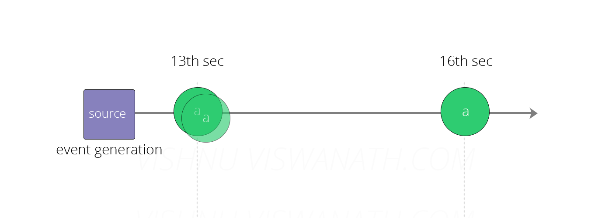
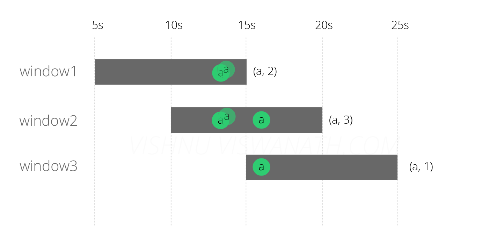
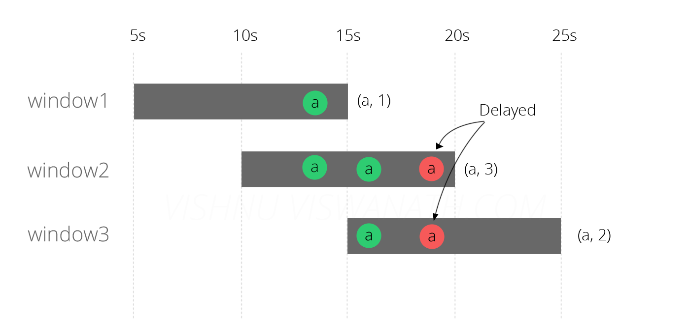
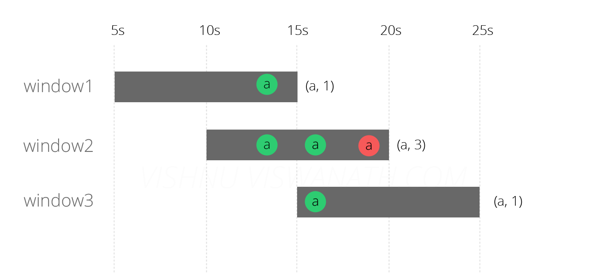
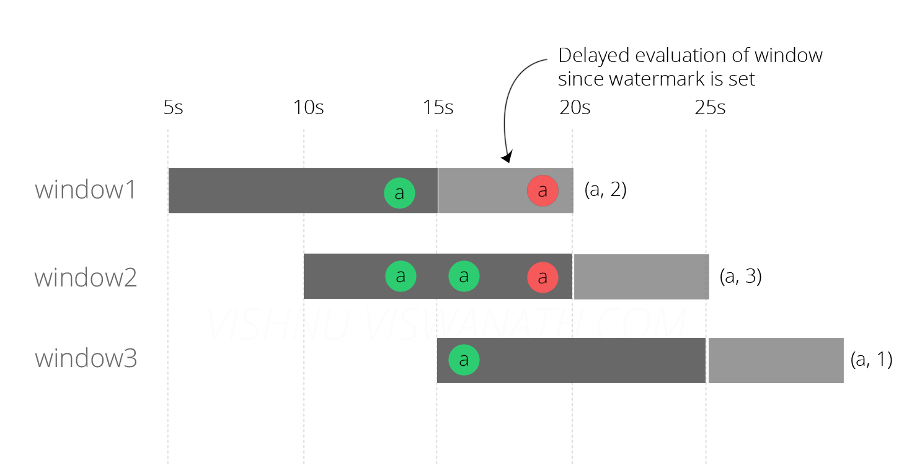

If you are building a Realtime streaming application, Event Time processing is one of the features that you will have to use sooner or later. Since in most of the real-world use cases messages arrive out-of-order, there should be some way through which the system you build understands the fact that messages could arrive late and handle them accordingly. In this blog post, we will see why we need Event Time processing and how we can enable it in ApacheFlink.

**EventTime** is the time at which an event occurred in the real-world and **ProcessingTime** is the time at which that event is processed by the Flink system. To understand the importance of Event Time processing, we will first start by building a Processing Time based system and see it’s drawback.


We will create a [SlidingWindow](http://vishnuviswanath.com/flink_streaming.html) of size 10 seconds which slides every 5 seconds and at the end of the window, the system will emit the number of messages that were received during that time. Once you understand how EventTime processing works with respect to a SlidingWindow, it will not be difficult to understand how it works for a [TumblingWindow](http://vishnuviswanath.com/flink_streaming.html) as well. So let’s get started.


### **ProcessingTime based system**


For this example we expect messages to have the format **value,timestamp** where value is the message and timestamp is the time at which this message was generated at the source. Since we are now building a Processing Time based system, the code below ignores the timestamp part.


*It is an important aspect to understand that the messages should contain the information on when it was generated. Flink or any other system is not a magic box that can somehow figure this out by itself. Later we will see that, Event Time processing extracts this timestamp information to handle late messages.*


```scala
val text = senv.socketTextStream("localhost", 9999)
val counts = text.map {(m: String) => (m.split(",")(0), 1) }
    .keyBy(0)
    .timeWindow(Time.seconds(10), Time.seconds(5))
    .sum(1)
counts.print
senv.execute("ProcessingTime processing example")
```

#### **Case 1: Messages arrive without delay**

Suppose the source generated three messages of the type **a** at times 13th second, 13th second and 16th second respectively. (Hours and minutes are not important here since the window size is only 10 seconds).



These messages will fall into the windows as follows. The first two messages that were generated at 13th sec will fall into both window1[5s-15s] and window2[10s-20s] and the third message generated at 16th second will fall into window2[10s-20s] and window3[15s-25s]. The final counts emitted by each window will be (a,2), (a,3) and (a,1) respectively.



This output can be considered as the expected behavior. Now we will look at what happens when one of the message arrives late into the system.

#### **Case 2: Messages arrive in delay**

Now suppose one of the messages (generated at 13th second) arrived at a delay of 6 seconds(at 19th second), may be due to some network congestion. Can you guess which all windows would this message fall into?



The delayed message fell into window 2 and 3, since 19 is within the range *10-20* and *15-25*. It did not cause any problem to the calculation in window2 (because the message was anyways supposed to fall into that window) but it affected the result of window1 and window3. We will now try to fix this problem by using EventTime processing.


### **EventTime based system**


To enable EventTime processing, we need a timestamp extractor that extracts the event time information from the message. Remember that the messages were of the format *value,timestamp*. The *extractTimestamp* method gets the timestamp part and returns it as a Long. Ignore the *getCurrentWatermark* method for now, we will come back to it later.


```scala
class TimestampExtractor extends AssignerWithPeriodicWatermarks[String] with Serializable {
  override def extractTimestamp(e: String, prevElementTimestamp: Long) = {
    e.split(",")(1).toLong 
  }
  override def getCurrentWatermark(): Watermark = { 
      new Watermark(System.currentTimeMillis)
  }
}
```

We now need to set this timestamp extractor and also set the **TimeCharactersistic** as EventTime. Rest of the code remains the same as in the case of ProcessingTime.


```scala
senv.setStreamTimeCharacteristic(TimeCharacteristic.EventTime)
val text = senv.socketTextStream("localhost", 9999)
                .assignTimestampsAndWatermarks(new TimestampExtractor) 
val counts = text.map {(m: String) => (m.split(",")(0), 1) }
      .keyBy(0)
      .timeWindow(Time.seconds(10), Time.seconds(5))
      .sum(1)
counts.print
senv.execute("EventTime processing example")
```

The result of running the above code is shown in the diagram below.



The results look better, the windows 2 and 3 now emitted correct result, but window1 is still wrong. Flink did not assign the delayed message to window 3 because it now checked the message’s event time and understood that it did not fall in that window. But why didn’t it assign the message to window 1?. The reason is that by the time the delayed message reached the system(at 19th second), the evaluation of window 1 has already finished (at 15th second). Let us now try to fix this issue by using the Watermark.

*Note that in window 2, the delayed message was still placed at 19th second, not at 13th second(it's event time). This depiction in the figure was intentional to indicate that the messages within a window are not sorted according to it's event time. (this might change in future)*

## **Watermarks**

Watermarks is a very important and interesting idea and I will try to give you a brief overview about it. If you are interested in learning more, you can watch this awesome [talk](https://www.youtube.com/watch?v=3UfZN59Nsk8) from Google and also read this [blog](http://data-artisans.com/how-apache-flink-enables-new-streaming-applications-part-1/) from dataArtisans. A Watermark is essentially a timestamp. When an Operator in Flink receives a watermark, it understands(assumes) that it is not going to see any message older than that timestamp. Hence watermark can also be thought of as a way of telling Flink how far it is, in the “EventTime”.

For the purpose of this example, think of it as a way of telling Flink how much delayed a message can be. In the last attempt, we set the watermark as the current system time. It was, therefore, not expecting any delayed messages. We will now set the watermark as **current time - 5 seconds**, which tells Flink to expect messages to be a maximum of 5 seconds dealy - This is because each window will be evaluated only when the watermark passes through it. Since our watermark is current time - 5 seconds, the first window [5s-15s] will be evaluated only at 20th second. Similarly the window [10s-20s] will be evaluated at 25th second and so on.

```scala
override def getCurrentWatermark(): Watermark = { 
      new Watermark(System.currentTimeMillis - 5000)
  }
```

*Here we are assuming that the eventtime is 5 seconds older than the current system time, but that is not always the case. In many cases it will be better to hold the max timestamp received so far(which is extracted from the message) and subtract the expected delay from it.*

The result of running the code after making above changes is:



Finally we have the correct result, all the three windows now emit counts as expected - which is (a,2), (a,3) and (a,1).


## **Allowed Lateness**

In our earlier approach where we used “watermark - delay”, the window would not fire until the watermark is past window_length + delay. If you want to accommodate late events, and want the window to fire on-time you can use **Allowed Lateness**. If allowed lateness is set, Flink will not discard message unless it is past the *window_end_time + allowed lateness*. Once a late message is received, Flink will extract it’s timestamp and check if it is within the allowed lateness, then it will check whether to FIRE the window or not (as per the Trigger set). Hence, note that a window might fire multiple times in this approach, and you might want to make your sink idempotent - if you need exactly once processing.

### **Conclusion**

The importance of real-time stream processing systems has grown lately and having to deal with delayed message is part of any such system you build. In this blog post, we saw how late arriving messages can affect the results of your system and how ApacheFlink’s Event Time processing capabilities can be used to solve them. That concludes the post, Thanks for reading! 