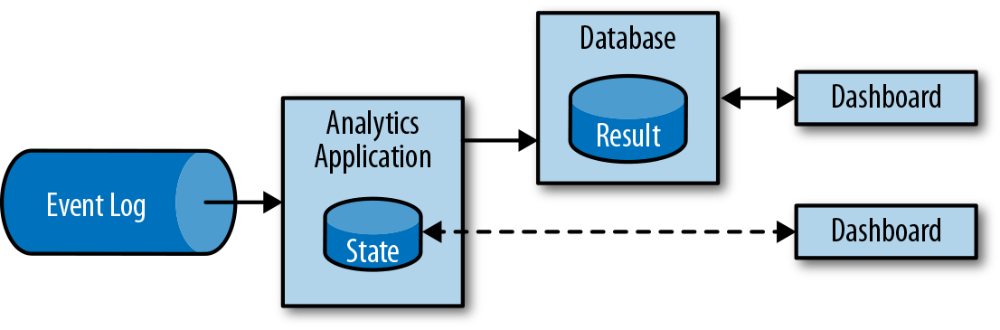

### 流分析

ETL作业定期将数据导入数据存储区，数据的处理是由即席查询（用户自定义查询）或设定好的通常查询来做的。无论架构是基于数据仓库还是基于Hadoop生态系统的组件，这都是批处理。多年来最好的处理方式就是，定期将数据加载到数据分析系统中，但它给分析管道带了的延迟相当大，而且无法避免。

根据设定好的时间间隔，可能需要数小时或数天才能将数据点包含在报告中。我们前面已经提到，数据管道可以实现低延迟的ETL，所以在某种程度上，可以通过使用数据管道将数据导入存储区来减少延迟。但是，即使持续不停地进行ETL操作，在用查询来处理事件之前总会有延迟。虽然这种延迟在过去可能是可以接受的，但是今天的应用程序，往往要求必须能够实时收集数据，并立即对其进行操作（例如，在手机游戏中去适应不断变化的条件，或者在电商网站中提供个性化的用户体验）。

流式分析应用程序不是等待定期触发，而是连续地提取事件流，并且通过纳入最新事件来更新其计算结果，这个过程是低延迟的。这有些类似于数据库中用于更新视图（views）的技术。通常，流应用程序将其结果存储在支持更新的外部数据存储中，例如数据库或键值（key-value）存储。流分析应用程序的实时更新结果可用于驱动监控仪表板（dashboard）应用程序，如图1-6所示。

流分析应用程序最大的优势就是，将每个事件纳入到分析结果所需的时间短得多。除此之外，流分析应用程序还有另一个不太明显的优势。传统的分析管道由几个独立的组件组成，例如ETL过程、存储系统、对于基于Hadoop的环境，还包括用于触发任务（jobs）的数据处理和调度程序。相比之下，如果我们运行一个有状态流应用程序，那么流处理器就会负责所有这些处理步骤，包括事件提取、带有状态维护的连续计算以及更新结果。此外，流处理器可以从故障中恢复，并且具有精确一次（exactly-once）的状态一致性保证，还可以调整应用程序的计算资源。像Flink这样的流处理器还支持事件时间（event-time）处理，这可以保证产生正确和确定的结果，并且能够在很短的时间内处理大量数据。

流分析应用程序通常用于：

* 监控手机网络的质量分析
* 移动应用中的用户行为
* 实时数据的即席分析

虽然我们不在此处介绍，但Flink还提供对流上的分析SQL查询的支持。

