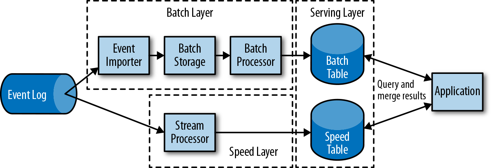

### 流处理的历史

第一代分布式开源流处理器（2011）专注于具有毫秒延迟的事件处理，并提供了在发生故障时防止事件丢失的保证。这些系统具有相当低级的API，并且对于流应用程序的准确性和结果的一致性，不提供内置支持，因为结果会取决于到达事件的时间和顺序。另外，即使事件没有丢失，也可能不止一次地处理它们。与批处理器相比，第一代开源流处理器牺牲了结果准确性，用来获得更低的延迟。为了让当时的数据处理系统，可以同时提供快速和准确的结果，人们设计了所谓的lambda架构，如图1-7所示。

lambda架构增强了传统的批处理架构，其“快速层”（speed layer）由低延迟的流处理器来支持。数据到达之后由流处理器提取出来，并写入批处理存储。流处理器近乎实时地计算近似结果并将它们写入“快速表”（speed table）。批处理器定期处理批量存储中的数据，将准确的结果写入批处理表，并从速度表中删除相应的不准确结果。应用程序会合并快速表中的近似结果和批处理表中的准确结果，然后消费最终的结果。

lambda架构现在已经不再是最先进的，但仍在许多地方使用。该体系结构的最初目标是改善原始批处理分析体系结构的高延迟。但是，它有一些明显的缺点。首先，它需要对一个应用程序，做出两个语义上等效的逻辑实现，用于两个独立的、具有不同API的处理系统。其次，流处理器计算的结果只是近似的。第三，lambda架构很难建立和维护。

通过在第一代基础上进行改进，下一代分布式开源流处理器（2013）提供了更好的故障保证，并确保在发生故障时，每个输入记录仅对结果产生一次影响（exactly -once）。此外，编程API从相当低级的操作符接口演变为高级API。但是，一些改进（例如更高的吞吐量和更好的故障保证）是以将处理延迟从毫秒增加到几秒为代价的。此外，结果仍然取决于到达事件的时间和顺序。

第三代分布式开源流处理器（2015）解决了结果对到达事件的时间和顺序的依赖性。结合精确一次（exactly-once）的故障语义，这一代系统是第一个具有计算一致性和准确结果的开源流处理器。通过基于实际数据来计算结果（“重演”数据），这些系统还能够以与“实时”数据相同的方式处理历史数据。另一个改进是解决了延迟/吞吐量无法同时保证的问题。先前的流处理器仅能提供高吞吐量或者低延迟（其中之一），而第三代系统能够同时提供这两个特性。这一代的流处理器使得lambda架构过时了。当然，这一代流处理以flink为代表。

除了目前讨论的特性，例如容错、性能和结果准确性之外，流处理器还不断添加新的操作功能，例如高可用性设置，与资源管理器（如YARN或Kubernetes）的紧密集成，以及能够动态扩展流应用程序。其他功能包括：支持升级应用程序代码，或将作业迁移到其他群集或新版本的流处理器，而不会丢失当前状态。

