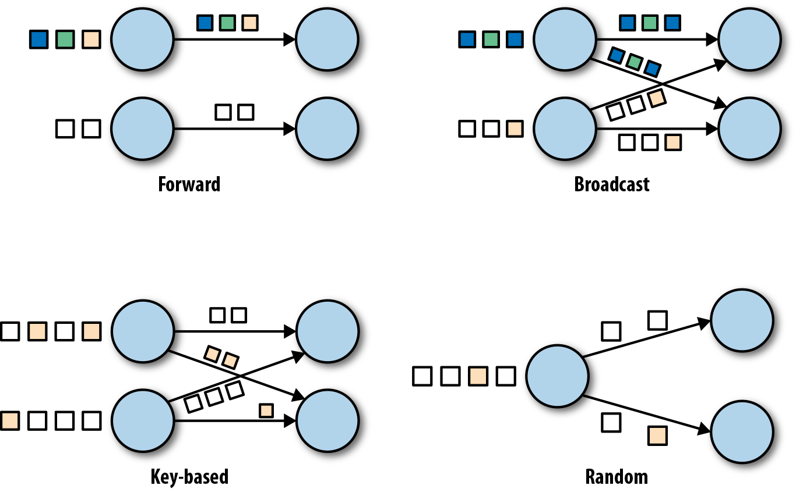

### 数据交换策略

数据交换策略定义了在物理执行流图中如何将数据分配给任务。数据交换策略可以由执行引擎自动选择，具体取决于算子的语义或我们明确指定的语义。在这里，我们简要回顾一些常见的数据交换策略，如图2-3所示。

* 前向策略将数据从一个任务发送到接收任务。如果两个任务都位于同一台物理计算机上（这通常由任务调度器确保），这种交换策略可以避免网络通信。
* 广播策略将所有数据发送到算子的所有的并行任务上面去。因为这种策略会复制数据和涉及网络通信，所以代价相当昂贵。
* 基于键控的策略通过Key值(键)对数据进行分区保证具有相同Key的数据将由同一任务处理。在图2-2中，输出“Extract hashtags”算子使用键来分区（hashtag），以便count算子的任务可以正确计算每个#标签的出现次数。
* 随机策略统一将数据分配到算子的任务中去，以便均匀地将负载分配到不同的计算任务。

