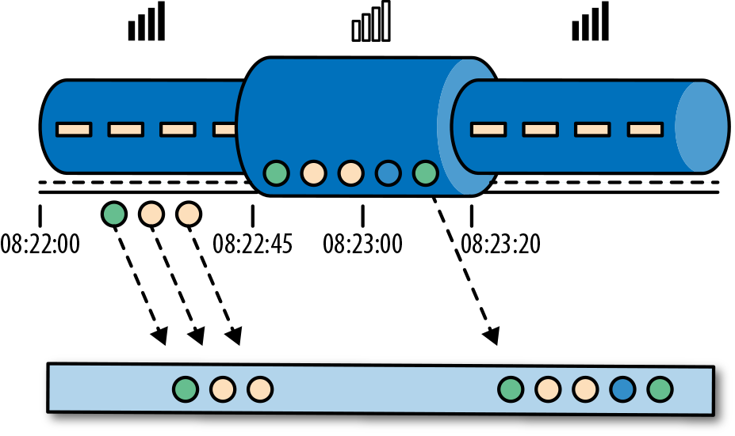

### 在流处理中一分钟代表什么？

在处理可能是无限的事件流（包含了连续到达的事件），时间成为流处理程序的核心方面。假设我们想要连续的计算结果，可能每分钟就要计算一次。在我们的流处理程序上下文中，一分钟的意思是什么？

考虑一个程序需要分析一款移动端的在线游戏的用户所产生的事件流。游戏中的用户分了组，而应用程序将收集每个小组的活动数据，基于小组中的成员多快达到了游戏设定的目标，然后在游戏中提供奖励。例如额外的生命和用户升级。例如，如果一个小组中的所有用户在一分钟之内都弹出了500个泡泡，他们将升一级。Alice是一个勤奋的玩家，她在每天早晨的通勤时间玩游戏。问题在于Alice住在柏林，并且乘地铁去上班。而柏林的地铁手机信号很差。我们设想一个这样的场景，Alice当她的手机连上网时，开始弹泡泡，然后游戏会将数据发送到我们编写的应用程序中，这时地铁突然进入了隧道，她的手机也断网了。Alice还在玩这个游戏，而产生的事件将会缓存在手机中。当地铁离开隧道，Alice的手机又在线了，而手机中缓存的游戏事件将发送到应用程序。我们的应用程序应该如何处理这些数据？在这个场景中一分钟的意思是什么？这个一分钟应该包含Alice离线的那段时间吗？下图展示了这个问题。

在线手游是一个简单的场景，展示了应用程序的运算应该取决于事件实际发生的时间，而不是应用程序收到事件的时间。如果我们按照应用程序收到事件的时间来进行处理的话，最糟糕的后果就是，Alice和她的朋友们再也不玩这个游戏了。但是还有很多时间语义非常关键的应用程序，我们需要保证时间语义的正确性。如果我们只考虑我们在一分钟之内收到了多少数据，我们的结果会变化，因为结果取决于网络连接的速度或处理的速度。相反，定义一分钟之内的事件数量，这个一分钟应该是数据本身的时间。

在Alice的这个例子中，流处理程序可能会碰到两个不同的时间概念：处理时间和事件时间。我们将在接下来的部分，讨论这两个概念。

