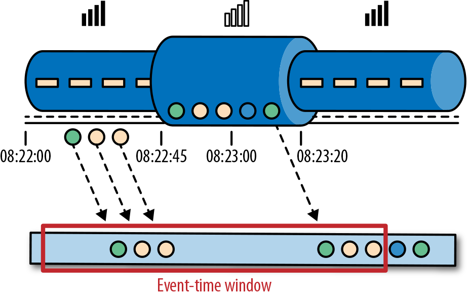

### 事件时间

事件时间是流中的事件实际发生的时间。事件时间基于流中的事件所包含的时间戳。通常情况下，在事件进入流处理程序前，事件数据就已经包含了时间戳。下图展示了事件时间窗口将会正确的将事件分发到窗口中去。可以如实反应事情是怎么发生的。即使事件可能存在延迟。

事件时间使得计算结果的过程不需要依赖处理数据的速度。基于事件时间的操作是可以预测的，而计算结果也是确定的。无论流处理程序处理流数据的速度快或是慢，无论事件到达流处理程序的速度快或是慢，事件时间窗口的计算结果都是一样的。

可以处理迟到的事件只是我们使用事件时间所克服的一个挑战而已。普遍存在的事件乱序问题可以使用事件时间得到解决。考虑和Alice玩同样游戏的Bob，他恰好和Alice在同一趟地铁上。Alice和Bob虽然玩的游戏一样，但他们的手机信号是不同的运营商提供的。当Alice的手机没信号时，Bob的手机依然有信号，游戏数据可以正常发送出去。

如果使用事件时间，即使碰到了事件乱序到达的情况，我们也可以保证结果的正确性。还有，当我们在处理可以重播的流数据时，由于时间戳的确定性，我们可以快进过去。也就是说，我们可以重播一条流，然后分析历史数据，就好像流中的事件是实时发生一样。另外，我们可以快进历史数据来使我们的应用程序追上现在的事件，然后应用程序仍然是一个实时处理程序，而且业务逻辑不需要改变。

