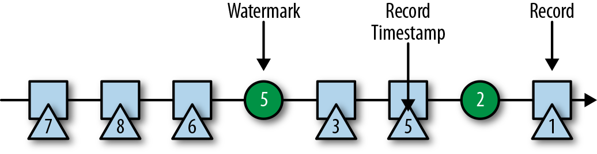

### 水位线

除了时间戳，基于事件时间的Flink应用程序还必须支持水位线（watermark）。在基于事件时间的应用中，水位线用于生成每个任务的当前事件时间。基于时间的算子使用这个“当前事件时间”来触发计算和处理操作。例如，一个时间窗口任务（time-window task）会在任务的事件时间超出窗口的关闭边界时，完成窗口计算，并输出计算结果。

在Flink中，水位线被实现为一条特殊的数据记录，它里面以长整型值保存了一个时间戳。水位线在带有时间戳的数据流中，跟随着其它数据一起流动，如图3-8所示。

水位线有两个基本属性：

* 必须单调递增，以确保任务的事件时间时钟在向前推进，而不是在后退。
* 它们与数据的时间戳相关。带有时间戳T的水位线表示，所有后续数据的时间戳都应该大于T。

上面的第二个属性用于处理带有乱序时间戳的数据流，比如图3-8中时间戳3和5的数据。基于时间的算子任务会收集和处理数据（这些数据可能具有乱序的时间戳），并在事件时间时钟到达某个时刻时完成计算。这个时刻就表示数据收集的截止，具有之前时间戳的数据应该都已经到达、不再需要了；而其中的事件时间时钟，正是由当前接收到的水位线来指示的。如果任务再接收到的数据违反了watermark的这一属性，也就是时间戳小于以前接收到的水位线时，它所属的那部分计算可能已经完成了。这种数据被称为延迟数据（late records）。Flink提供了处理延迟数据的不同方式，我们会在“处理延迟数据”一节中讨论。

水位线还有一个很有趣的特性，它允许应用程序自己来平衡结果的完整性和延迟。如果水位线与数据的时间戳非常接近，那么我们可以得到较低的处理延迟，因为任务在完成计算之前只会短暂地等待更多数据到达。而同时，结果的完整性可能会受到影响，因为相关数据可能因为迟到而被视为“延迟数据”，这样就不会包含在结果中。相反，非常保守的水位线提供了足够的时间去等待所有数据到达，这样会增加处理延迟，但提高了结果的完整性。

