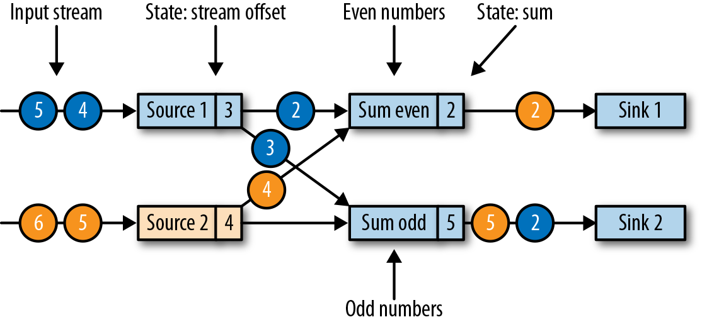

### Flink的检查点算法

Flink的恢复机制，基于它的一致性检查点。前面我们已经了解了从流应用中创建检查点的简单方法——先暂停应用，保存检查点，然后再恢复应用程序，这种方法很好理解，但它的理念是“停止一切”，这对于即使是中等延迟要求的应用程序而言也是不实用的。所以Flink没有这么简单粗暴，而是基于Chandy-Lamport算法实现了分布式快照的检查点保存。该算法并不会暂停整个应用程序，而是将检查点的保存与数据处理分离，这样就可以实现在其它任务做检查点状态保存状态时，让某些任务继续进行而不受影响。接下来我们将解释此算法的工作原理。

Flink的检查点算法用到了一种称为“检查点分界线”（checkpoint barrier）的特殊数据形式。与水位线（watermark）类似，检查点分界线由source算子注入到常规的数据流中，它的位置是限定好的，不能超过其他数据，也不能被后面的数据超过。检查点分界线带有检查点ID，用来标识它所属的检查点；这样，这个分界线就将一条流逻辑上分成了两部分。分界线之前到来的数据导致的状态更改，都会被包含在当前分界线所属的检查点中；而基于分界线之后的数据导致的所有更改，就会被包含在之后的检查点中。

我们用一个简单的流应用程序作为示例，来一步一步解释这个算法。该应用程序有两个源（source）任务，每个任务都消费一个增长的数字流。源任务的输出被划分为两部分：偶数和奇数的流。每个分区由一个任务处理，该任务计算所有收到的数字的总和，并将更新的总和转发给输出（sink）任务。这个应用程序的结构如图3-19所示。

作业管理器会向每个数据源（source）任务发送一条带有新检查点ID的消息，通过这种方式来启动检查点，如图3-20所示。

当source任务收到消息时，它会暂停发出新的数据，在状态后端触发本地状态的检查点保存，并向所有传出的流分区广播带着检查点ID的分界线（barriers）。状态后端在状态检查点完成后会通知任务，而任务会向作业管理器确认检查点完成。在发出所有分界线后，source任务就可以继续常规操作，发出新的数据了。通过将分界线注入到输出流中，源函数（source function）定义了检查点在流中所处的位置。图3-21显示了两个源任务将本地状态保存到检查点，并发出检查点分界线之后的流应用程序。

源任务发出的检查点分界线（barrier），将被传递给所连接的任务。与水位线（watermark）类似，barrier会被广播到所有连接的并行任务，以确保每个任务从它的每个输入流中都能接收到。当任务收到一个新检查点的barrier时，它会等待这个检查点的所有输入分区的barrier到达。在等待的过程中，任务并不会闲着，而是会继续处理尚未提供barrier的流分区中的数据。对于那些barrier已经到达的分区，如果继续有新的数据到达，它们就不会被立即处理，而是先缓存起来。这个等待所有分界线到达的过程，称为“分界线对齐”（barrier alignment），如图3-22所示。

当任务从所有输入分区都收到barrier时，它就会在状态后端启动一个检查点的保存，并继续向所有下游连接的任务广播检查点分界线，如图3-23所示。

所有的检查点barrier都发出后，任务就开始处理之前缓冲的数据。在处理并发出所有缓冲数据之后，任务就可以继续正常处理输入流了。图3-24显示了此时的应用程序。

最终，检查点分界线会到达输出（sink）任务。当sink任务接收到barrier时，它也会先执行“分界线对齐”，然后将自己的状态保存到检查点，并向作业管理器确认已接收到barrier。一旦从应用程序的所有任务收到一个检查点的确认信息，作业管理器就会将这个检查点记录为已完成。图3-25显示了检查点算法的最后一步。这样，当发生故障时，我们就可以用已完成的检查点恢复应用程序了。

