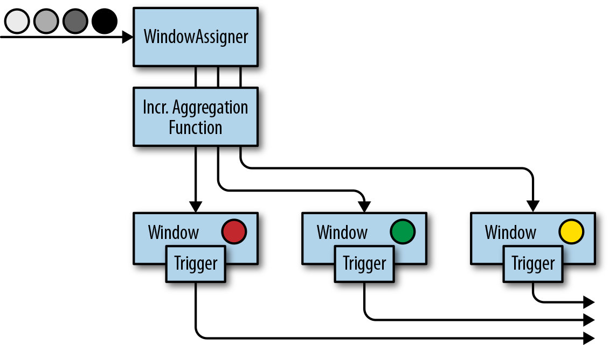

### 自定义窗口操作符

Flink内置的window operators分配器已经已经足够应付大多数应用场景。尽管如此，如果我们需要实现一些复杂的窗口逻辑，例如：可以发射早到的事件或者碰到迟到的事件就更新窗口的结果，或者窗口的开始和结束决定于特定事件的接收。

DataStream API暴露了接口和方法来自定义窗口操作符。

* 自定义窗口分配器
* 自定义窗口计算触发器(trigger)
* 自定义窗口数据清理功能(evictor)

当一个事件来到窗口操作符，首先将会传给WindowAssigner来处理。WindowAssigner决定了事件将被分配到哪些窗口。如果窗口不存在，WindowAssigner将会创建一个新的窗口。

如果一个window operator接受了一个增量聚合函数作为参数，例如ReduceFunction或者AggregateFunction，新到的元素将会立即被聚合，而聚合结果result将存储在window中。如果window operator没有使用增量聚合函数，那么新元素将被添加到ListState中，ListState中保存了所有分配给窗口的元素。

新元素被添加到窗口时，这个新元素同时也被传给了window的trigger。trigger定义了window何时准备好求值，何时window被清空。trigger可以基于window被分配的元素和注册的定时器来对窗口的所有元素求值或者在特定事件清空window中所有的元素。

当window operator只接收一个增量聚合函数作为参数时：

当window operator只接收一个全窗口函数作为参数时：

当window operator接收一个增量聚合函数和一个全窗口函数作为参数时：

evictor是一个可选的组件，可以被注入到ProcessWindowFunction之前或者之后调用。evictor可以清除掉window中收集的元素。由于evictor需要迭代所有的元素，所以evictor只能使用在没有增量聚合函数作为参数的情况下。

下面的代码说明了如果使用自定义的trigger和evictor定义一个window operator：

```java
stream
  .keyBy(...)
  .window(...)
 [.trigger(...)]
 [.evictor(...)]
  .reduce/aggregate/process(...)
```

注意：每个WindowAssigner都有一个默认的trigger。

*窗口生命周期*

当WindowAssigner分配某个窗口的第一个元素时，这个窗口才会被创建。所以不存在没有元素的窗口。

一个窗口包含了如下状态：

* Window content
    * 分配到这个窗口的元素
    * 增量聚合的结果(如果window operator接收了ReduceFunction或者AggregateFunction作为参数)。
* Window object
    * WindowAssigner返回0个，1个或者多个window object。
    * window operator根据返回的window object来聚合元素。
    * 每一个window object包含一个windowEnd时间戳，来区别于其他窗口。
* 触发器的定时器：一个触发器可以注册定时事件，到了定时的时间可以执行相应的回调函数，例如：对窗口进行求值或者清空窗口。
* 触发器中的自定义状态：触发器可以定义和使用自定义的、per-window或者per-key状态。这个状态完全被触发器所控制。而不是被window operator控制。

当窗口结束时间来到，window operator将删掉这个窗口。窗口结束时间是由window object的end timestamp所定义的。无论是使用processing time还是event time，窗口结束时间是什么类型可以调用WindowAssigner.isEventTime()方法获得。

*窗口分配器(window assigners)*

WindowAssigner将会把元素分配到0个，1个或者多个窗口中去。我们看一下WindowAssigner接口：

```java
public abstract class WindowAssigner<T, W extends Window>
    implements Serializable {

  public abstract Collection<W> assignWindows(
    T element,
    long timestamp,
    WindowAssignerContext context);

  public abstract Trigger<T, W> getDefaultTriger(
    StreamExecutionEnvironment env);

  public abstract TypeSerializer<W> getWindowSerializer(
    ExecutionConfig executionConfig);

  public abstract boolean isEventTime();

  public abstract static class WindowAssignerContext {
    public abstract long getCurrentProcessingTime();
  }
}
```

WindowAssigner有两个泛型参数：

* T: 事件的数据类型
* W: 窗口的类型

下面的代码创建了一个自定义窗口分配器，是一个30秒的滚动事件时间窗口。

```scala
class ThirtySecondsWindows
    extends WindowAssigner[Object, TimeWindow] {

  val windowSize: Long = 30 * 1000L

  override def assignWindows(
    o: Object,
    ts: Long,
    ctx: WindowAssigner.WindowAssignerContext
  ): java.util.List[TimeWindow] = {

    val startTime = ts - (ts % windowSize)
    val endTime = startTime + windowSize
    Collections.singletonList(new TimeWindow(startTime, endTime))
  }

  override def getDefaultTrigger(
    env: environment.StreamExecutionEnvironment
  ): Trigger[Object, TimeWindow] = {
      EventTimeTrigger.create()
  }

  override def getWindowSerializer(
    executionConfig: ExecutionConfig
  ): TypeSerializer[TimeWindow] = {
    new TimeWindow.Serializer
  }

  override def isEventTime = true
}
```

增量聚合示意图



全窗口聚合示意图


增量聚合和全窗口聚合结合使用的示意图


*触发器(Triggers)*

触发器定义了window何时会被求值以及何时发送求值结果。触发器可以到了特定的时间触发也可以碰到特定的事件触发。例如：观察到事件数量符合一定条件或者观察到了特定的事件。

默认的触发器将会在两种情况下触发

* 处理时间：机器时间到达处理时间
* 事件时间：水位线超过了窗口的结束时间

触发器可以访问流的时间属性以及定时器，还可以对state状态编程。所以触发器和process function一样强大。例如我们可以实现一个触发逻辑：当窗口接收到一定数量的元素时，触发器触发。再比如当窗口接收到一个特定元素时，触发器触发。还有就是当窗口接收到的元素里面包含特定模式(5秒钟内接收到了两个同样类型的事件)，触发器也可以触发。在一个事件时间的窗口中，一个自定义的触发器可以提前(在水位线没过窗口结束时间之前)计算和发射计算结果。这是一个常见的低延迟计算策略，尽管计算不完全，但不像默认的那样需要等待水位线没过窗口结束时间。

每次调用触发器都会产生一个TriggerResult来决定窗口接下来发生什么。TriggerResult可以取以下结果：

* CONTINUE：什么都不做
* FIRE：如果window operator有ProcessWindowFunction这个参数，将会调用这个ProcessWindowFunction。如果窗口仅有增量聚合函数(ReduceFunction或者AggregateFunction)作为参数，那么当前的聚合结果将会被发送。窗口的state不变。
* PURGE：窗口所有内容包括窗口的元数据都将被丢弃。
* FIRE_AND_PURGE：先对窗口进行求值，再将窗口中的内容丢弃。

TriggerResult可能的取值使得我们可以实现很复杂的窗口逻辑。一个自定义触发器可以触发多次，可以计算或者更新结果，可以在发送结果之前清空窗口。

接下来我们看一下Trigger API：

```java
public abstract class Trigger<T, W extends Window>
    implements Serializable {

  TriggerResult onElement(
    long timestamp,
    W window,
    TriggerContext ctx);

  public abstract TriggerResult onProcessingTime(
    long timestamp,
    W window,
    TriggerContext ctx);

  public abstract TriggerResult onEventTime(
    long timestamp,
    W window,
    TriggerContext ctx);

  public boolean canMerge();

  public void onMerge(W window, OnMergeContext ctx);

  public abstract void clear(W window, TriggerContext ctx);
}

public interface TriggerContext {

  long getCurrentProcessingTime();

  long getCurrentWatermark();

  void registerProcessingTimeTimer(long time);

  void registerEventTimeTimer(long time);

  void deleteProcessingTimeTimer(long time);

  void deleteEventTimeTimer(long time);

  <S extends State> S getPartitionedState(
    StateDescriptor<S, ?> stateDescriptor);
}

public interface OnMergeContext extends TriggerContext {

  void mergePartitionedState(
    StateDescriptor<S, ?> stateDescriptor
  );
}
```

这里要注意两个地方：清空state和merging合并触发器。

当在触发器中使用per-window state时，这里我们需要保证当窗口被删除时state也要被删除，否则随着时间的推移，window operator将会积累越来越多的数据，最终可能使应用崩溃。

当窗口被删除时，为了清空所有状态，触发器的clear()方法需要需要删掉所有的自定义per-window state，以及使用TriggerContext对象将处理时间和事件时间的定时器都删除。

下面的例子展示了一个触发器在窗口结束时间之前触发。当第一个事件被分配到窗口时，这个触发器注册了一个定时器，定时时间为水位线之前一秒钟。当定时事件执行，将会注册一个新的定时事件，这样，这个触发器每秒钟最多触发一次。

**scala version**

```scala
class OneSecondIntervalTrigger
    extends Trigger[SensorReading, TimeWindow] {

  override def onElement(
    SensorReading r,
    timestamp: Long,
    window: TimeWindow,
    ctx: Trigger.TriggerContext
  ): TriggerResult = {
    val firstSeen: ValueState[Boolean] = ctx
      .getPartitionedState(
        new ValueStateDescriptor[Boolean](
          "firstSeen", classOf[Boolean]
        )
      )

    if (!firstSeen.value()) {
      val t = ctx.getCurrentWatermark
       + (1000 - (ctx.getCurrentWatermark % 1000))
      ctx.registerEventTimeTimer(t)
      ctx.registerEventTimeTimer(window.getEnd)
      firstSeen.update(true)
    }

    TriggerResult.CONTINUE
  }

  override def onEventTime(
    timestamp: Long,
    window: TimeWindow,
    ctx: Trigger.TriggerContext
  ): TriggerResult = {
    if (timestamp == window.getEnd) {
      TriggerResult.FIRE_AND_PURGE
    } else {
      val t = ctx.getCurrentWatermark
       + (1000 - (ctx.getCurrentWatermark % 1000))
      if (t < window.getEnd) {
        ctx.registerEventTimeTimer(t)
      }
      TriggerResult.FIRE
    }
  }

  override def onProcessingTime(
    timestamp: Long,
    window: TimeWindow,
    ctx: Trigger.TriggerContext
  ): TriggerResult = {
    TriggerResult.CONTINUE
  }

  override def clear(
    window: TimeWindow,
    ctx: Trigger.TriggerContext
  ): Unit = {
    val firstSeen: ValueState[Boolean] = ctx
      .getPartitionedState(
        new ValueStateDescriptor[Boolean](
          "firstSeen", classOf[Boolean]
        )
      )
    firstSeen.clear()
  }
}
```

**java version**

```java
public class TriggerExample {
    public static void main(String[] args) throws Exception {
        StreamExecutionEnvironment env = StreamExecutionEnvironment.getExecutionEnvironment();
        env.setStreamTimeCharacteristic(TimeCharacteristic.EventTime);
        env.setParallelism(1);

        env
                .socketTextStream("localhost", 9999)
                .map(new MapFunction<String, Tuple2<String, Long>>() {
                    @Override
                    public Tuple2<String, Long> map(String s) throws Exception {
                        String[] arr = s.split(" ");
                        return Tuple2.of(arr[0], Long.parseLong(arr[1]) * 1000L);
                    }
                })
                .assignTimestampsAndWatermarks(
                        WatermarkStrategy.<Tuple2<String, Long>>forMonotonousTimestamps()
                        .withTimestampAssigner(new SerializableTimestampAssigner<Tuple2<String, Long>>() {
                            @Override
                            public long extractTimestamp(Tuple2<String, Long> stringLongTuple2, long l) {
                                return stringLongTuple2.f1;
                            }
                        })
                )
                .keyBy(r -> r.f0)
                .timeWindow(Time.seconds(5))
                .trigger(new OneSecondIntervalTrigger())
                .process(new ProcessWindowFunction<Tuple2<String, Long>, String, String, TimeWindow>() {
                    @Override
                    public void process(String s, Context context, Iterable<Tuple2<String, Long>> iterable, Collector<String> collector) throws Exception {
                        long count = 0L;
                        for (Tuple2<String, Long> i : iterable) count += 1;
                        collector.collect("窗口中有 " + count + " 条元素");
                    }
                })
                .print();

        env.execute();
    }

    public static class OneSecondIntervalTrigger extends Trigger<Tuple2<String, Long>, TimeWindow> {
        // 来一条调用一次
        @Override
        public TriggerResult onElement(Tuple2<String, Long> r, long l, TimeWindow window, TriggerContext ctx) throws Exception {
            ValueState<Boolean> firstSeen = ctx.getPartitionedState(
                    new ValueStateDescriptor<Boolean>("first-seen", Types.BOOLEAN)
            );

            if (firstSeen.value() == null) {
                // 4999 + (1000 - 4999 % 1000) = 5000
                System.out.println("第一条数据来的时候 ctx.getCurrentWatermark() 的值是 " + ctx.getCurrentWatermark());
                long t = ctx.getCurrentWatermark() + (1000L - ctx.getCurrentWatermark() % 1000L);
                ctx.registerEventTimeTimer(t);
                ctx.registerEventTimeTimer(window.getEnd());
                firstSeen.update(true);
            }
            return TriggerResult.CONTINUE;
        }

        // 定时器逻辑
        @Override
        public TriggerResult onEventTime(long ts, TimeWindow window, TriggerContext ctx) throws Exception {
            if (ts == window.getEnd()) {
                return TriggerResult.FIRE_AND_PURGE;
            } else {
                System.out.println("当前水位线是：" + ctx.getCurrentWatermark());
                long t = ctx.getCurrentWatermark() + (1000L - ctx.getCurrentWatermark() % 1000L);
                if (t < window.getEnd()) {
                    ctx.registerEventTimeTimer(t);
                }
                return TriggerResult.FIRE;
            }
        }

        @Override
        public TriggerResult onProcessingTime(long l, TimeWindow timeWindow, TriggerContext triggerContext) throws Exception {
            return TriggerResult.CONTINUE;
        }

        @Override
        public void clear(TimeWindow timeWindow, TriggerContext ctx) throws Exception {
            ValueState<Boolean> firstSeen = ctx.getPartitionedState(
                    new ValueStateDescriptor<Boolean>("first-seen", Types.BOOLEAN)
            );
            firstSeen.clear();
        }
    }
}
```

*清理器(EVICTORS)*

evictor可以在window function求值之前或者之后移除窗口中的元素。

我们看一下Evictor的接口定义：

```java
public interface Evictor<T, W extends Window>
    extends Serializable {
  void evictBefore(
    Iterable<TimestampedValue<T>> elements,
    int size,
    W window,
    EvictorContext evictorContext);

  void evictAfter(
    Iterable<TimestampedValue<T>> elements,
    int size,
    W window,
    EvictorContext evictorContext);

  interface EvictorContext {

    long getCurrentProcessingTime();

    long getCurrentWatermark();
  }
}
```

evictBefore()和evictAfter()分别在window function计算之前或者之后调用。Iterable迭代器包含了窗口所有的元素，size为窗口中元素的数量，window object和EvictorContext可以访问当前处理时间和水位线。可以对Iterator调用remove()方法来移除窗口中的元素。

evictor也经常被用在GlobalWindow上，用来清除部分元素，而不是将窗口中的元素全部清空。

