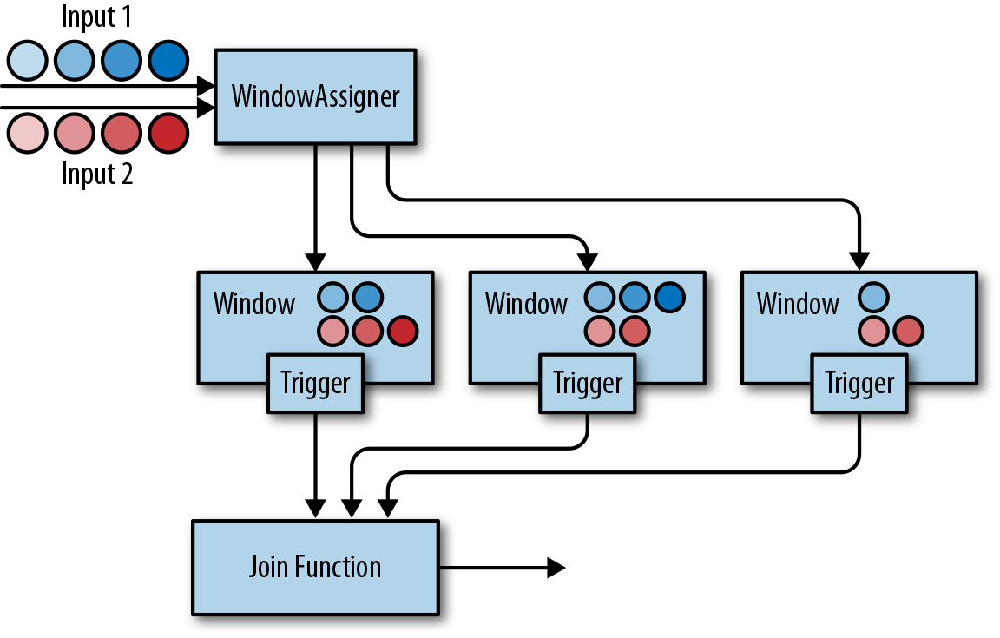

### 基于窗口的Join

顾名思义，基于窗口的Join需要用到Flink中的窗口机制。其原理是将两条输入流中的元素分配到公共窗口中并在窗口完成时进行Join（或Cogroup）。

下面的例子展示了如何定义基于窗口的Join。

```scala
input1.join(input2)
  .where(...)       // 为input1指定键值属性
  .equalTo(...)     // 为input2指定键值属性
  .window(...)      // 指定WindowAssigner
  [.trigger(...)]   // 选择性的指定Trigger
  [.evictor(...)]   // 选择性的指定Evictor
  .apply(...)       // 指定JoinFunction
```

下图展示了DataStream API中基于窗口的Join是如何工作的。



两条输入流都会根据各自的键值属性进行分区，公共窗口分配器会将二者的事件映射到公共窗口内（其中同时存储了两条流中的数据）。当窗口的计时器触发时，算子会遍历两个输入中元素的每个组合（叉乘积）去调用JoinFunction。同时你也可以自定义触发器或移除器。由于两条流中的事件会被映射到同一个窗口中，因此该过程中的触发器和移除器与常规窗口算子中的完全相同。

除了对窗口中的两条流进行Join，你还可以对它们进行Cogroup，只需将算子定义开始位置的join改为coGroup()即可。Join和Cogroup的总体逻辑相同，二者的唯一区别是：Join会为两侧输入中的每个事件对调用JoinFunction；而Cogroup中用到的CoGroupFunction会以两个输入的元素遍历器为参数，只在每个窗口中被调用一次。

>注意，对划分窗口后的数据流进行Join可能会产生意想不到的语义。例如，假设你为执行Join操作的算子配置了1小时的滚动窗口，那么一旦来自两个输入的元素没有被划分到同一窗口，它们就无法Join在一起，即使二者彼此仅相差1秒钟。

**scala version**

```scala
object TwoWindowJoinExample {
  def main(args: Array[String]): Unit = {
    val env = StreamExecutionEnvironment.getExecutionEnvironment
    env.setStreamTimeCharacteristic(TimeCharacteristic.EventTime)
    env.setParallelism(1)

    val stream1 = env
      .fromElements(
        ("a", 1000L),
        ("a", 2000L)
      )
      .assignAscendingTimestamps(_._2)

    val stream2 = env
      .fromElements(
        ("a", 3000L),
        ("a", 4000L)
      )
      .assignAscendingTimestamps(_._2)

    stream1
      .join(stream2)
      // on A.id = B.id
      .where(_._1)
      .equalTo(_._1)
      .window(TumblingEventTimeWindows.of(Time.seconds(5)))
      .apply(new JoinFunction[(String, Long), (String, Long), String] {
        override def join(in1: (String, Long), in2: (String, Long)): String = {
          in1 + " => " + in2
        }
      })
      .print()

    env.execute()
  }
}
```

**java version**

```java
public class TwoWindowJoinExample {
    public static void main(String[] args) throws Exception {
        StreamExecutionEnvironment env = StreamExecutionEnvironment.getExecutionEnvironment();
        env.setParallelism(1);
        env.setStreamTimeCharacteristic(TimeCharacteristic.EventTime);

        DataStream<Tuple2<String, Long>> stream1 = env
                .fromElements(
                        Tuple2.of("a", 1000L),
                        Tuple2.of("b", 1000L),
                        Tuple2.of("a", 2000L),
                        Tuple2.of("b", 2000L)
                )
                .assignTimestampsAndWatermarks(
                        WatermarkStrategy
                                .<Tuple2<String, Long>>forMonotonousTimestamps()
                                .withTimestampAssigner(
                                        new SerializableTimestampAssigner<Tuple2<String, Long>>() {
                                            @Override
                                            public long extractTimestamp(Tuple2<String, Long> stringLongTuple2, long l) {
                                                return stringLongTuple2.f1;
                                            }
                                        }
                                )
                );

        DataStream<Tuple2<String, Long>> stream2 = env
                .fromElements(
                        Tuple2.of("a", 3000L),
                        Tuple2.of("b", 3000L),
                        Tuple2.of("a", 4000L),
                        Tuple2.of("b", 4000L)
                )
                .assignTimestampsAndWatermarks(
                        WatermarkStrategy
                                .<Tuple2<String, Long>>forMonotonousTimestamps()
                                .withTimestampAssigner(
                                        new SerializableTimestampAssigner<Tuple2<String, Long>>() {
                                            @Override
                                            public long extractTimestamp(Tuple2<String, Long> stringLongTuple2, long l) {
                                                return stringLongTuple2.f1;
                                            }
                                        }
                                )
                );

        stream1
                .join(stream2)
                .where(r -> r.f0)
                .equalTo(r -> r.f0)
                .window(TumblingEventTimeWindows.of(Time.seconds(5)))
                .apply(new JoinFunction<Tuple2<String, Long>, Tuple2<String, Long>, String>() {
                    @Override
                    public String join(Tuple2<String, Long> stringLongTuple2, Tuple2<String, Long> stringLongTuple22) throws Exception {
                        return stringLongTuple2 + " => " + stringLongTuple22;
                    }
                })
                .print();

        env.execute();
    }
}
```
