# Flink简介

## 初识Flink

Flink起源于Stratosphere项目，Stratosphere是在2010～2014年由3所地处柏林的大学和欧洲的一些其他的大学共同进行的研究项目，2014年4月Stratosphere的代码被复制并捐赠给了Apache软件基金会，参加这个孵化项目的初始成员是Stratosphere系统的核心开发人员，2014年12月，Flink一跃成为Apache软件基金会的顶级项目。

在德语中，Flink一词表示快速和灵巧，项目采用一只松鼠的彩色图案作为logo，这不仅是因为松鼠具有快速和灵巧的特点，还因为柏林的松鼠有一种迷人的红棕色，而Flink的松鼠logo拥有可爱的尾巴，尾巴的颜色与Apache软件基金会的logo颜色相呼应，也就是说，这是一只Apache风格的松鼠。


Flink主页在其顶部展示了该项目的理念: "Apache Flink是为分布式、高性能、随时可用以及准确的流处理应用程序打造的开源流处理框架"。

Apache Flink是一个框架和分布式处理引擎，用于对无界和有界数据流进行有状态计算。Flink被设计在所有常见的集群环境中运行，以内存执行速度和任意规模来执行计算。

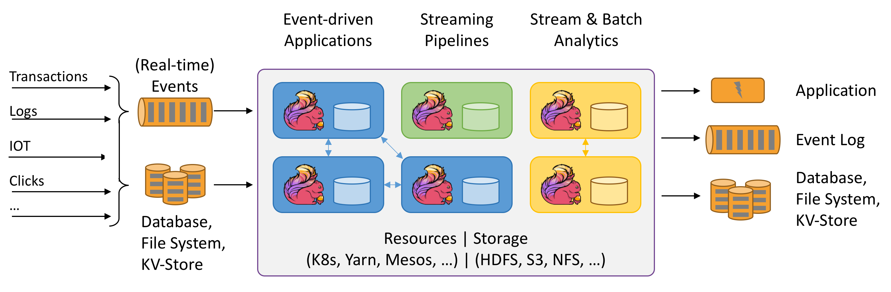

**Flink几大模块**

- Flink Table and SQL(还没开发完)
- Flink Gelly(图计算)
- Flink CEP(复杂事件处理)

## 为什么选择Flink

许多系统都会产生连续的事件流，如行驶中的汽车发射出GPS信号，金融交易，移动通信基站与繁忙的智能手机进行信号交换，网络流量，机器日志，工业传感器和可穿戴设备的测量结果，等等。如果能够高效地分析大规模流数据，我们对上述系统的理解将会更清楚、更快速。简而言之，流数据更真实地反映了我们的生活方式。

实际上，企业常见的数据架构仍旧假设数据是有头有尾的有限集。这个假设存在的大部分原因在于，与有限集匹配的数据存储及处理系统建起来比较简单。但是，这样做无疑给那些天然的流式场景人为地加了限制。

我们渴望按照流的方式处理数据，但要做好很困难; 随着大规模数据在各行各业中出现，难度越来越大。这是一个属于物理学范畴的难题: 在大型分布式系统中，数据一致性和对事件发生顺序的理解必然都是有限的。

而Flink为大容量数据提供流处理，并用同一种技术实现批处理。

### 流处理欠佳的后果

谁需要和流数据打交道呢? 首先映入脑海的是从事传感器测量和金融交易的工作人员。对于他们来说，流处理非常有用。但是流数据来源非常广泛，两个常见的例子是: 网站获得的能够反映用户行为的点击流数据，以及私有数据中心的机器日志。事实上，流数据来源无处不在，但是从连续事件中获得数据并不意味着可以在批量计算中使用这些数据。如今，处理大规模流数据的新技术正在改变这一状况。

#### 零售业和市场营销

在现代零售业中，网站点击量就代表了销量。网站获得的点击数据可能是大量、连续、不均匀的。用以往的技术很难处理好如此规模的数据。仅是构建批量系统处理这些数据流就很有挑战性: 结果很可能是需要一个庞大且复杂的系统。并且，传统的做法还会带来数据丢失、延迟、错误的聚合结果等问题。这样的结果怎能对商业领域有所帮助呢?

假设你正在向首席执行官汇报上一季度的销售数据，你肯定不想事后因为使用了不准确的数据而不得不向首席执行官更正汇报结果。如果不能良好地处理点击数据，你很可能对网站点击量进行不准确的计算，这将导致广告投放报价和业绩数字不准确。

航空旅客服务业面临同样的挑战: 航空公司需要快速、准确地处理从各种渠道获得的大量数据。例如，当为一名旅客办理登机手续时，需要对该旅客的机票预订数据进行核对，还需要核对行李处理信息、航班状态信息和账单信息。如果没有强大的技术来支持流处理，这种规模的数据是很难不出错的。近几年，美国四大航空公司中有三家都出现了大面积的服务中断，这几次故障都可以归咎于大规模实时数据处理失败。

当然，很多相关问题(如怎样避免重复预订酒店或演唱会门票)，一般都能够通过有效的数据库操作来解决，但是这种操作相当费钱，也费精力。尤其当数据量增加时，成本会飙升，并且在某些情况下，数据库的反应速度会变得特别慢。由于缺乏灵活性，开发速度受到影响，项目在庞大又复杂或者不断发生变化的系统中进展缓慢。想要在大型系统中处理流数据，并且在保持一致性的同时有效地控制成本，难度非常大。

幸运的是，现代的流处理器经常可以用新的方式解决这些问题，这使得实时处理大规模数据的成本更低。流处理还激发了新的尝试，比如构建一个系统，该系统能够基于顾客当下购买的商品实时给出相关的建议，看看他们是否还需要买一些别的商品。这不代表流处理器替代了数据库(远远不能替代)，而是说在数据库处理不好时，流处理器提供了更好的解决方案。这样做也使数据库得以解脱，不用再参与对当前业务状态的实时分析。

#### 物联网

物联网是流数据被普遍应用的领域。在物联网中，低延迟的数据传输和处理，以及准确的数据分析通常很关键。各类仪器中的传感器频繁地获得测量数据，并将它们以流的形式传输至数据中心。在数据中心内，实时或者接近实时的应用程序将更新显示板，运行机器学习模型，发布警告，并就许多不同的服务项目提供反馈。

交通运输业也体现了流处理的重要性。举例来说，先进的列车系统依靠的是传感器测量数据，这些数据从轨道传至列车，再从列车传至沿途的传感器; 与此同时，报告也被发送回控制中心。测量数据包括列车的速度和位置，以及轨道周边的状况。如果流数据没有被正确处理，调整意见和警告就不能相应产生，从而也就不能通过对危险状况做出反应来避免事故发生。

另一个例子是"智能"汽车，或称联网汽车，它们通过移动网络将数据传输回制造商。在有些国家(北欧国家、法国和英国，美国则刚开始)，联网汽车甚至可以将信息传给保险公司; 如果是赛车，信息还可以通过射频链路传送至维修站进行分析。此外，一些智能手机应用程序还支持数百万司机共享实时路况信息。

物联网对公用事业也有影响。相关公司已经开始安装智能计量表，以替换每个月需要人工读数的旧表。智能计量表可以定期将用电量反馈给公司(例如每15分钟一次)。有些公司正在尝试每30秒就进行一次测量。使用智能计量表的这一转变带来了大量的流数据，同时也获得了大量的潜在收益。其中一个好处就是通过机器学习模型来检测设备故障或者窃电等使用异常。如果不能对流数据进行高吞吐、低延迟和准确的处理，这些新的目标都无法实现。

如果流处理做得不好，其他物联网项目也会遭殃。大型设备，比如风力涡轮机、生产设备和钻井泵，都依赖对传感器测量数据的分析来获得故障警告。如果不能及时地处理好这些设备的流数据，将可能付出高昂的代价，甚至导致灾难性后果。

#### 电信业

电信业是一个特殊的例子，它广泛地应用了基于各种目的而产生的跨地域的事件流数据。如果电信公司不能很好地处理流数据，就不能在某个移动通信基站出现流量高峰前预先将流量分配给其他的基站，也不能在断电时快速做出反应。通过处理流数据来进行异常检测，如检测通话中断或者设备故障，对于电信业来说至关重要。

#### 银行和金融业

因为流处理做得不好而给银行以及金融业带来的潜在问题是极其显著的。从事零售业务的银行不希望客户交易被延迟或者因为错误统计而造成账户余额出错。曾有一个说法叫作"银行家工作时间"，指的就是银行需要在下午早早关门进行结算，这样才能保证第二天营业之前算出准确的账。这种批量作业的营业模式早已消失。如今，交易和报表都必须快速且准确地生成; 有些新兴的银行甚至提供实时的推送通知，以及随时随地访问手机银行的服务。在全球化经济中，能够提供24小时服务变得越来越重要。

那么，如果缺少能够灵敏地实时检测出用户行为异常的应用程序，会对金融机构带来什么后果呢? 信用卡欺诈检测需要及时的监控和反馈。对异常登录的检测能发现钓鱼式攻击，从而避免巨大的损失。

### 连续事件处理的目标

能够以非常低的延迟处理数据，这并不是流处理的唯一优势。人们希望流处理不仅做到低延迟和高吞吐，还可以处理中断。优秀的流处理技术应该能使系统在崩溃之后重新启动，并且产出准确的结果; 换句话说，优秀的流处理技术可以容错，而且能保证exactly-once。

与此同时，获得这种程度的容错性所采用的技术还需要在没有数据错误的情况下不产生太大的开销。这种技术需要能够基于事件发生的时间(而不是随意地设置处理间隔)来保证按照正确的顺序跟踪事件。对于开发人员而言，不论是写代码还是修正错误，系统都要容易操作和维护。同样重要的是，系统生成的结果需要与事件实际发生的顺序一致，比如能够处理乱序事件流(一个很不幸但无法避免的事实)，以及能够准确地替换流数据(在审计或者调试时很有用)。

### 流处理技术的演变

分开处理连续的实时数据和有限批次的数据，可以使系统构建工作变得更加简单，但是这种做法将管理两套系统的复杂性留给了系统用户: 应用程序的开发团队和DevOps团队需要自己使用并管理这两套系统。

为了处理这种情况，有些用户开发出了自己的流处理系统。在开源世界里，Apache Storm项目(以下简称Storm)是流处理先锋。Storm提供了低延迟的流处理，但是它为实时性付出了一些代价: 很难实现高吞吐，并且其正确性没能达到通常所需的水平。换句话说，它并不能保证exactly-once; 即便是它能够保证的正确性级别，其开销也相当大。

>若要依靠多个流事件来计算结果，必须将数据从一个事件保留到下一个事件。这些保存下来的数据叫作计算的状态。准确处理状态对于计算结果的一致性至关重要。在故障或中断之后能够继续准确地更新状态是容错的关键。

在低延迟和高吞吐的流处理系统中维持良好的容错性是非常困难的，但是为了得到有保障的准确状态，人们想出了一种替代方法: 将连续事件中的流数据分割成一系列微小的批量作业。如果分割得足够小(即所谓的微批处理作业)，计算就几乎可以实现真正的流处理。因为存在延迟，所以不可能做到完全实时，但是每个简单的应用程序都可以实现仅有几秒甚至几亚秒的延迟。这就是在Spark批处理引擎上运行的Apache Spark Streaming所使用的方法。

更重要的是，使用微批处理方法，可以实现exactly-once语义，从而保障状态的一致性。如果一个微批处理作业失败了，它可以重新运行。这比连续的流处理方法更容易。Storm Trident是对Storm的延伸，它的底层流处理引擎就是基于微批处理方法来进行计算的，从而实现了exactly-once语义，但是在延迟性方面付出了很大的代价。

然而，通过间歇性的批处理作业来模拟流处理，会导致开发和运维相互交错。完成间歇性的批处理作业所需的时间和数据到达的时间紧密耦合，任何延迟都可能导致不一致(或者说错误)的结果。这种技术的潜在问题是，时间由系统中生成小批量作业的那一部分全权控制。Spark Streaming等一些流处理框架在一定程度上弱化了这一弊端，但还是不能完全避免。另外，使用这种方法的计算有着糟糕的用户体验，尤其是那些对延迟比较敏感的作业，而且人们需要在写业务代码时花费大量精力来提升性能。

为了实现理想的功能，人们继续改进已有的处理器(比如Storm Trident的开发初衷就是试图克服Storm的局限性)。当已有的处理器不能满足需求时，产生的各种后果则必须由应用程序开发人员面对和解决。以微批处理方法为例，人们往往期望根据实际情况分割事件数据，而处理器只能根据批量作业时间(恢复间隔)的倍数进行分割。当灵活性和表现力都缺乏的时候，开发速度变慢，运维成本变高。

于是，Flink出现了。这一数据处理器可以避免上述弊端，并且拥有所需的诸多功能，还能按照连续事件高效地处理数据。Flink 的一些功能如下图所示。

与Storm和Spark Streaming类似，其他流处理技术同样可以提供一些有用的功能，但是没有一个像Flink那样功能如此齐全。举例来说，Apache Samza(以下简称Samza)是早期的一个开源流处理器，它不仅没能实现exactly-once语义，而且只能提供底层的API; 同样，Apache Apex提供了与Flink相同的一些功能，但不全面(比如只提供底层的API，不支持事件时间，也不支持批量计算)。这些项目没有一个能和Flink在开源社区的规模上相提并论。


Flink的一个优势是，它拥有诸多重要的流式计算功能。其他项目为了实现这些功能，都不得不付出代价。比如，Storm实现了低延迟，但是做不到高吞吐，也不能在故障发生时准确地处理计算状态; Spark Streaming通过采用微批处理方法实现了高吞吐和容错性，但是牺牲了低延迟和实时处理能力，也不能使窗口与自然时间相匹配，并且表现力欠佳。

### Spark Streaming vs Flink

**两者最重要的区别(流和微批)**

- Micro Batching模式(spark)

Micro-Batching计算模式认为“流是批的特例”，流计算就是将连续不断的批进行持续计算，如果批足够小那么就有足够小的延时，在一定程度上满足了99%的实时计算场景。那么那1%为啥做不到呢? 这就是架构的魅力，在Micro-Batching模式的架构实现上就有一个自然流数据流入系统进行攒批的过程，这在一定程度上就增加了延时。具体如下示意图：


从上面可以看到是把输入的数据, 分成微小的批次, 然后一个批次一个批次的处理, 然后也是一片批次的输出. 很显然Micro-Batching模式有其天生的低延时瓶颈，但任何事物的存在都有两面性，在大数据计算的发展历史上，最初Hadoop上的MapReduce就是优秀的批模式计算框架，Micro-Batching在设计和实现上可以借鉴很多成熟实践。

- Native Streaming模式(flink)

Native Streaming计算模式认为批是流的特例"，这个认知更贴切流的概念，比如一些监控类的消息流，数据库操作的binlog，实时的支付交易信息等等自然流数据都是一条，一条的流入。Native Streaming计算模式每条数据的到来都进行计算，这种计算模式显得更自然，并且延时性能达到更低。具体如下示意图：

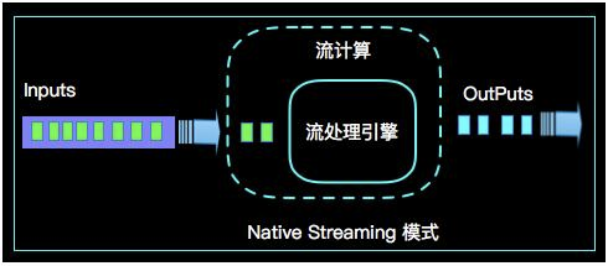

从上图可以看到输入的数据过来一条处理一条, 然后输出, 几乎不存在延迟, 很明显Native Streaming模式占据了流计算领域"低延时"的核心竞争力, 当然Native Streaming模式的实现框架是一个历史先河，第一个实现Native Streaming模式的流计算框架是第一个吃螃蟹的人，需要面临更多的挑战，后续章节我们会慢慢介绍。当然Native Streaming模式的框架实现上面很容易实现Micro-Batching和Batching模式的计算，Apache Flink就是Native Streaming计算模式的流批统一的计算引擎。

**数据模型**


Spark最早采用RDD模型，达到比MapReduce计算快100倍的显著优势，对Hadoop生态大幅升级换代。RDD弹性数据集是分割为固定大小的批数据，RDD提供了丰富的底层API对数据集做操作。为持续降低使用门槛，Spark社区开始开发高阶API：DataFrame/DataSet，Spark SQL作为统一的API，掩盖了底层，同时针对性地做SQL逻辑优化和物理优化，非堆存储优化也大幅提升了性能。

Spark Streaming里的DStream和RDD模型类似，把一个实时进来的无限数据分割为一个个小批数据集合DStream，定时器定时通知处理系统去处理这些微批数据。劣势非常明显，API少、难胜任复杂的流计算业务，调大吞吐量而不触发背压是个体力活。不支持乱序处理，或者说很难处理乱序的问题。Spark Streaming仅适合简单的流处理，这里稍微解释一下，因为Spark的创始人在当时认为延迟不是那么的重要，他认为现实生活中没有那么多低延迟的应用场景，所以就没太注重延迟的问题，但是随着生活多样化场景的不断增加，对实时性的要求越来越高，所以Spark也注意到了这个问题，开始在延迟方面发力，进而推出了Structured Streaming，相信很快Spark Streaming就会被Structured Streaming替代掉。

Spark Structured Streaming提供了微批和流式两个处理引擎。微批的API虽不如Flink丰富，窗口、消息时间、trigger、watermarker、流表join、流流join这些常用的能力都具备了。时延仍然保持最小100毫秒。当前处在试验阶段的流式引擎，提供了1毫秒的时延，但不能保证exactly-once语义，支持at-least-once语义。同时，微批作业打了快照，作业改为流式模式重启作业是不兼容的。这一点不如Flink做的完美。当然了现在还在优化阶段.

综上，Spark Streaming和Structured Streaming是用批计算的思路做流计算。其实，用流计算的思路开发批计算才是最合理的。对Spark来讲，大换血不大可能，只有局部优化。其实，Spark里core、streaming、structured streaming、graphx四个模块，是四种实现思路，通过上层SQL统一显得不纯粹和谐。

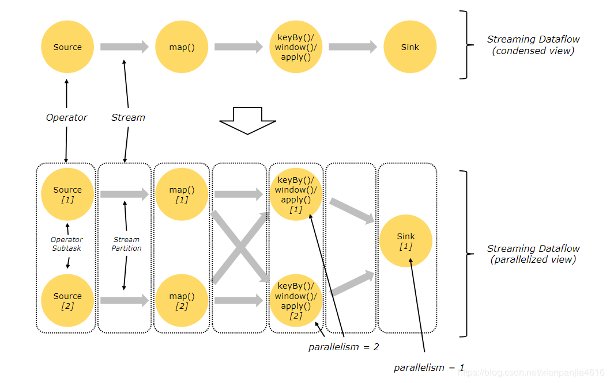

Flink的基本数据模型是数据流，及事件(Event)的序列。数据流作为数据的基本模型可能没有表或者数据块直观熟悉，但是可以证明是完全等效的。流可以是无边界的无限流，即一般意义上的流处理。也可以是有边界的有限流，这样就是批处理。

Flink采用Dataflow模型，和Lambda模式不同。Dataflow是纯粹的节点组成的一个图，图中的节点可以执行批计算，也可以是流计算，也可以是机器学习算法，流数据在节点之间流动，被节点上的处理函数实时apply处理，节点之间是用netty连接起来，两个netty之间keepalive，网络buffer是自然反压的关键。经过逻辑优化和物理优化，Dataflow的逻辑关系和运行时的物理拓扑相差不大。这是纯粹的流式设计，时延和吞吐理论上是最优的。


**运行时架构**

- Spark运行时架构

批计算是把DAG划分为不同stage，DAG节点之间有血缘关系，在运行期间一个stage的task任务列表执行完毕，销毁再去执行下一个stage；Spark Streaming则是对持续流入的数据划分一个批次，定时去执行批次的数据运算。Structured Streaming将无限输入流保存在状态存储中，对流数据做微批或实时的计算，跟Dataflow模型比较像。

- Flink运行时架构

Flink有统一的runtime，在此之上可以是Batch API、Stream API、ML、Graph、CEP等，DAG中的节点上执行上述模块的功能函数，DAG会一步步转化成ExecutionGraph，即物理可执行的图，最终交给调度系统。节点中的逻辑在资源池中的task上被apply执行，task和Spark中的task类似，都对应线程池中的一个线程。

在DAG的执行上，Spark和Flink有一个比较显著的区别。在Flink的流执行模式中，一个事件在一个节点处理完后的输出就可以发到下一个节点立即处理。这样执行引擎并不会引入额外的延迟。与之相应的，所有节点是需要同时运行的。而Spark的micro batch和一般的batch执行一样，处理完上游的stage得到输出之后才开始下游的stage。

在流计算的运行时架构方面，Flink明显更为统一且优雅一些。

>Lambda架构的问题是改变代码后需要重新在两个复杂的分布式系统中再次处理输出结果是非常痛苦的，而且我不认为这个问题能够解决。相当于同一套数据集的处理逻辑，使用Spark Core需要写一遍，使用Spark Streaming需要再写一遍，无法复用，这是致命缺陷。

## Flink的重要特点

### 事件驱动型(Event-Driven)

事件驱动型应用是一类具有状态的应用，它从一个或多个事件流提取数据，并根据到来的事件触发计算、状态更新或其他外部动作。比较典型的就是以Kafka为代表的消息队列几乎都是事件驱动型应用。

与之不同的就是Spark Streaming微批次，如图：


事件驱动型：

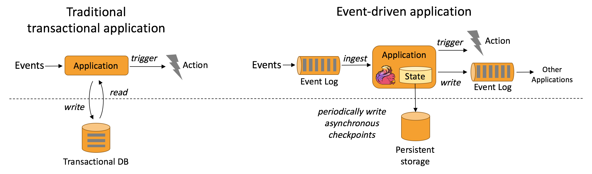

### 流与批的世界观

**批处理**的特点是有界、持久、大量，非常适合需要访问全套记录才能完成的计算工作，一般用于离线统计。

**流处理**的特点是无界、实时，无需针对整个数据集执行操作，而是对通过系统传输的每个数据项执行操作，一般用于实时统计。

在Spark的世界观中，一切都是由批次组成的，离线数据是一个大批次，而实时数据是由一个一个无限的小批次组成的。

而在Flink的世界观中，一切都是由流组成的，离线数据是有界限的流，实时数据是一个没有界限的流，这就是所谓的有界流和无界流。

**无界数据流**：无界数据流有一个开始但是没有结束，它们不会在生成时终止并提供数据，必须连续处理无界流，也就是说必须在获取后立即处理event。对于无界数据流我们无法等待所有数据都到达，因为输入是无界的，并且在任何时间点都不会完成。处理无界数据通常要求以特定顺序(例如事件发生的顺序)获取event，以便能够推断结果完整性。

**有界数据流**：有界数据流有明确定义的开始和结束，可以在执行任何计算之前通过获取所有数据来处理有界流，处理有界流不需要有序获取，因为可以始终对有界数据集进行排序，有界流的处理也称为批处理。


这种以流为世界观的架构，获得的最大好处就是具有极低的延迟。

### 分层api


最底层级的抽象仅仅提供了有状态流，它将通过在DataStream API中嵌入Process Function来处理数据。Process Function与DataStream API相集成，使其可以对某些特定的操作进行底层的抽象，它允许用户可以自由地处理来自一个或多个数据流的事件，并使用一致的容错的状态。除此之外，用户可以注册事件时间并处理时间回调，从而使程序可以处理复杂的计算。

实际上，大多数应用并不需要上述的底层抽象，而是针对核心API(Core APIs)进行编程，比如DataStream API(有界或无界流数据)以及DataSet API(有界数据集)。这些API为数据处理提供了通用的构建模块，比如由用户定义的多种形式的转换(transformations)，连接(joins)，聚合(aggregations)，窗口操作(window)等等。DataSet API为有界数据集提供了额外的支持，例如循环与迭代。这些API处理的数据类型以类(classes)的形式由各自的编程语言所表示。

Table API是以表为中心的声明式编程，其中表可能会动态变化(在表达流数据时)。Table API遵循(扩展的)关系模型：表有二维数据结构(schema)(类似于关系数据库中的表)，同时API提供与RDBMS相似的操作，例如select、project、join、group-by、aggregate等。Table API程序声明式地定义了什么逻辑操作应该执行，而不是准确地确定这些操作代码看上去如何(过程式编程风格)。尽管Table API可以通过多种类型的用户自定义函数(UDF)进行扩展，其仍不如核心API更具表达能力，但是使用起来却更加简洁(代码量更少)。除此之外，Table API程序在执行之前会经过内置优化器进行优化。

你可以在表与DataStream/DataSet之间无缝切换，以允许程序将Table API与DataStream以及DataSet混合使用。

Flink提供的最高层级的抽象是SQL。这一层抽象在语法与表达能力上与Table API类似，但是是以SQL查询表达式的形式表现程序。SQL抽象与Table API交互密切，同时SQL查询可以直接在Table API定义的表上执行。

>目前Flink作为批处理还不是主流，不如Spark成熟，所以DataSet使用的并不是很多。Flink Table API和Flink SQL也并不完善，大多都由各大厂商自己定制。所以我们主要学习DataStream API的使用。实际上Flink作为最接近Google DataFlow模型的实现，是流批统一的观点，所以基本上使用DataStream就可以了。

# 流处理基础

## 数据流编程简介

在我们深入研究流处理的基础知识之前，让我们来看看在数据流程编程的背景和使用的术语。

### 数据流图(dataflow graph)

顾名思义，数据流程序描述了数据如何在算子之间流动。数据流程序通常表示为有向图，其中节点称为算子，用来表示计算，边表示数据之间的依赖性。算子是数据流程序的基本功能单元。他们从输入消耗数据，对它们执行计算，并生成数据输出用于进一步处理。一个数据流图必须至少有一个数据源和一个数据接收器。


像图2-1中的数据流图被称为逻辑流图，因为它们表示了计算逻辑的高级视图。为了执行一个数据流程序，Flink会将逻辑流图转换为物理数据流图，详细说明程序的执行方式。例如，如果我们使用分布式处理引擎，每个算子在不同的物理机器可能有几个并行的任务运行。图2-2显示了图2-1逻辑图的物理数据流图。而在逻辑数据流图中节点表示算子，在物理数据流图中，节点是任务。“Extract hashtags”和“Count”算子有两个并行算子任务，每个算子任务对输入数据的子集执行计算。


### 数据并行和任务并行

我们可以以不同方式利用数据流图中的并行性。第一，我们可以对输入数据进行分区，并在数据的子集上并行执行具有相同算子的任务并行。这种类型的并行性被称为数据并行性。数据并行是有用的，因为它允许处理大量数据，并将计算分散到不同的计算节点上。第二，我们可以将不同的算子在相同或不同的数据上并行执行。这种并行性称为任务并行性。使用任务并行性，我们可以更好地利用计算资源。

### 数据交换策略

数据交换策略定义了在物理执行流图中如何将数据分配给任务。数据交换策略可以由执行引擎自动选择，具体取决于算子的语义或我们明确指定的语义。在这里，我们简要回顾一些常见的数据交换策略，如图2-3所示。


- 前向策略将数据从一个任务发送到接收任务。如果两个任务都位于同一台物理计算机上（这通常由任务调度器确保），这种交换策略可以避免网络通信。
- 广播策略将所有数据发送到算子的所有的并行任务上面去。因为这种策略会复制数据和涉及网络通信，所以代价相当昂贵。
- 基于键控的策略通过Key值(键)对数据进行分区保证具有相同Key的数据将由同一任务处理。在图2-2中，输出“Extract hashtags”算子使用键来分区（hashtag），以便count算子的任务可以正确计算每个`#`标签的出现次数。
- 随机策略统一将数据分配到算子的任务中去，以便均匀地将负载分配到不同的计算任务。

## 并行处理流数据

既然我们熟悉了数据流编程的基础知识，现在是时候看看这些概念如何应用于并行的处理数据流了。但首先，让我们定义术语数据流：数据流是一个可能无限的事件序列。

数据流中的事件可以表示监控数据，传感器测量数据，信用卡交易数据，气象站观测数据，在线用户交互数据，网络搜索数据等。在本节中，我们将学习如何并行处理无限流，使用数据流编程范式。

### 延迟和吞吐量

流处理程序不同与批处理程序。在评估性能时，要求也有所不同。对于批处理程序，我们通常关心一个作业的总的执行时间，或我们的处理引擎读取输入所需的时间，执行计算，并回写结果。由于流处理程序是连续运行的，输入可能是无界的，所以数据流处理中没有总执行时间的概念。
相反，流处理程序必须尽可能快的提供输入数据的计算结果。我们使用延迟和吞吐量来表征流处理的性能要求。

### 延迟

延迟表示处理事件所需的时间。它是接收事件和看到在输出中处理此事件的效果之间的时间间隔。要直观的理解延迟，考虑去咖啡店买咖啡。当你进入咖啡店时，可能还有其他顾客在里面。因此，你排队等候直到轮到你下订单。收银员收到你的付款并通知准备饮料的咖啡师。一旦你的咖啡准备好了，咖啡师会叫你的名字，你可以到柜台拿你的咖啡。服务延迟是从你进入咖啡店的那一刻起，直到你喝上第一口咖啡之间的时间间隔。

在数据流中，延迟是以时间为单位测量的，例如毫秒。根据应用程序，我们可能会关心平均延迟，最大延迟或百分位延迟。例如，平均延迟值为10ms意味着处理事件的平均时间在10毫秒内。或者，延迟值为95% 10ms表示95%的事件在10ms内处理完毕。平均值隐藏了处理延迟的真实分布，可能会让人难以发现问题。如果咖啡师在准备卡布奇诺之前用完了牛奶，你必须等到他们从供应室带来一些。虽然你可能会因为这么长时间的延迟而生气，但大多数其他客户仍然会感到高兴。

确保低延迟对于许多流应用程序来说至关重要，例如欺诈检测，系统警报，网络监控和提供具有严格服务水平协议的服务。低延迟是流处理的关键特性，它实现了我们所谓的实时应用程序。像Apache Flink这样的现代流处理器可以提供低至几毫秒的延迟。相比之下，传统批处理程序延迟通常从几分钟到几个小时不等。在批处理中，首先需要收集事件批次，然后才能处理它们。因此，延迟是受每个批次中最后一个事件的到达时间的限制。所以自然而然取决于批的大小。真正的流处理不会引入这样的人为延迟，因此可以实现真正的低延迟。真的流模型，事件一进入系统就可以得到处理。延迟更密切地反映了在每个事件上必须进行的实际工作。

### 吞吐量

吞吐量是衡量系统处理能力的指标，也就是处理速率。也就是说，吞吐量告诉我们每个时间单位系统可以处理多少事件。重温咖啡店的例子，如果商店营业时间为早上7点至晚上7点。当天为600个客户提供了服务，它的平均吞吐量将是每小时50个客户。虽然我们希望延迟尽可能低，但我们通常也需要吞吐量尽可能高。

吞吐量以每个时间单位系统所能处理的事件数量或操作数量来衡量。值得注意的是，事件处理速率取决于事件到达的速率，低吞吐量并不一定表示性能不佳。
在流式系统中，我们通常希望确保我们的系统可以处理最大的预期事件到达的速率。也就是说，我们主要的关注点在于确定的峰值吞吐量是多少，当系统处于最大负载时性能怎么样。为了更好地理解峰值吞吐量的概念，让我们考虑一个流处理
程序没有收到任何输入的数据，因此没有消耗任何系统资源。当第一个事件进来时，它会尽可能以最小延迟立即处理。例如，如果你是第一个出现在咖啡店的顾客，在早上开门后，你将立即获得服务。理想情况下，您希望此延迟保持不变
，并且独立于传入事件的速率。但是，一旦我们达到使系统资源被完全使用的事件传入速率，我们将不得不开始缓冲事件。在咖啡店里
，午餐后会看到这种情况发生。许多人出现在同一时间，必须排队等候。在此刻，咖啡店系统已达到其峰值吞吐量，进一步增加
事件传入的速率只会导致更糟糕的延迟。如果系统继续以可以处理的速率接收数据，缓冲区可能变为不可用，数据可能会丢失。这种情况是众所周知的
作为背压，有不同的策略来处理它。

### 延迟与吞吐量的对比

此时，应该清楚延迟和吞吐量不是独立指标。如果事件需要在处理流水线中待上很长时间，我们不能轻易确保高吞吐量。同样，如果系统容量很小，事件将被缓冲，而且必须等待才能得到处理。

让我们重温一下咖啡店的例子来阐明一下延迟和吞吐量如何相互影响。首先，应该清楚存在没有负载时的最佳延迟。也就是说，如果你是咖啡店的唯一客户，会很快得到咖啡。然而，在繁忙时期，客户将不得不排队等待，并且会有延迟增加。另一个影响延迟和吞吐量的因素是处理事件所花费的时间或为每个客户提供服务所花费的时间。想象一下，期间圣诞节假期，咖啡师不得不为每杯咖啡画圣诞老人。这意味着准备一杯咖啡需要的时间会增加，导致每个人花费
更多的时间在等待咖啡师画圣诞老人，从而降低整体吞吐量。

那么，你可以同时获得低延迟和高吞吐量吗？或者这是一个无望的努力？我们可以降低得到咖啡的延迟
，方法是：聘请一位更熟练的咖啡师来准备咖啡。在高负载时，这种变化也会增加吞吐量，因为会在相同的时间内为更多的客户提供服务。
实现相同结果的另一种方法是雇用第二个咖啡师来利用并行性。这里的主要想法是降低延迟来增加吞吐量。当然，如果系统可以更快的执行操作，它可以在相同的时间内执行更多操作。
事实上，在流中利用并行性时也会发生这种情况。通过并行处理多个流，在同时处理更多事件的同时降低延迟。

## 数据流上的操作

流处理引擎通常提供一组内置操作：摄取(ingest)，转换(transform)和输出流(output)。这些操作可以
结合到数据流图中来实现逻辑流处理程序。在本节中，我们描述最常见的流处理操作。

操作可以是无状态的或有状态的。无状态操作不保持任何内部状态。也就是说，事件的处理不依赖于过去看到的任何事件，也没有保留历史。
无状态操作很容易并行化，因为事件可以彼此独立地处理，也独立于事件到达的顺序(和事件到达顺序没有关系)。
而且，在失败的情况下，无状态操作可以是简单的重新启动并从中断处继续处理。相反，
有状态操作可能会维护之前收到的事件的信息。此状态可以通过传入事件更新，也可以用于未来事件的处理逻辑。有状态的流
处理应用程序更难以并行化和以容错的方式来运行，因为状态需要有效的进行分区和在发生故障的情况下可靠地恢复。

### 数据摄入和数据吞吐量

数据摄取和数据出口操作允许流处理程序与外部系统通信。数据摄取是操作从外部源获取原始数据并将其转换为其他格式(ETL)。实现数据提取逻辑的运算符被称为数据源。数据源可以从TCP Socket，文件，Kafka Topic或传感器数据接口中提取数据。数据出口是以适合消费的形式产出到外部系统。执行数据出口的运算符称为数据接收器，包括文件，数据库，消息队列和监控接口。

### 转换算子


转换算子是单遍处理算子，碰到一个事件处理一个事件。这些操作在使用后会消费一个事件，然后对事件数据做一些转换，产生一个新的输出流。转换逻辑可以集成在
操作符中或由UDF函数提供，如图所示图2-4。程序员编写实现自定义计算逻辑。

操作符可以接受多个输入流并产生多个输出流。他们还可以通过修改数据流图的结构要么将流分成多个流，要么将流合并为一条流。

### 滚动聚合

滚动聚合是一种聚合，例如sum，minimum和maximum，为每个输入事件不断更新。聚合操作是有状态的，并将当前状态与传入事件一起计算以产生更新的聚合值。请注意能够有效地将当前状态与事件相结合产生单个值，聚合函数必须是关联的和可交换的。否则，操作符必须存储完整的流数据历史。图2-5显示了最小滚动聚合。操作符保持当前的最小值和相应地为每个传入的事件来更新最小值。


### 窗口操作符

转换和滚动聚合一次处理一个事件产生输出事件并可能更新状态。但是，有些操作必须收集并缓冲数据以计算其结果。例如，考虑不同流之间的连接或整体聚合这样的操作，例如中值函数。为了在无界流上高效运行这些操作符，我们需要限制这些操作维护的数据量。在本节中，我们将讨论窗口操作，提供此服务。

窗口还可以在语义上实现关于流的比较复杂的查询。我们已经看到了滚动聚合的方式，以聚合值编码整个流的历史数据来为每个事件提供低延迟的结果。
但如果我们只对最近的数据感兴趣的话会怎样？考虑给司机提供实时交通信息的应用程序。这个程序可以使他们避免拥挤的路线。在这种场景下，你想知道某个位置在最近几分钟内是否有事故发生。
另一方面，了解所有发生过的事故在这个应用场景下并没有什么卵用。更重要的是，通过将流历史缩减为单一聚合值，我们将丢失这段时间内数据的变化。例如，我们可能想知道每5分钟有多少车辆穿过
某个路口。

窗口操作不断从无限事件流中创建有限的事件集，好让我们执行有限集的计算。通常会基于数据属性或基于时间的窗口来分配事件。要正确定义窗口运算符语义，我们需要确定如何给窗口分配事件以及对窗口中的元素进行求值的频率是什么样的。窗口的行为由一组策略定义。窗口策略决定何时创建新的窗口以及要分配的事件属于哪个窗口，以及何时对窗口中的元素进行求值。而窗口的求值基于触发条件。一旦触发条件得到满足，窗口的内容将会被发送到求值函数，求值函数会将计算逻辑应用于窗口中的元素。求值函数可以是sum或minimal或自定义的聚合函数。求值策略可以根据时间或者数据属性计算(例如，在过去五秒内收到的事件或者最近的一百个事件等等)。接下来，我们描述常见窗口类型的语义。

- 滚动窗口是将事件分配到固定大小的不重叠的窗口中。当通过窗口的结尾时，全部事件被发送到求值函数进行处理。基于计数的滚动窗口定义了在触发求值之前需要收集多少事件。图2-6显示了一个基于计数的翻滚窗口，每四个元素一个窗口。基于时间的滚动窗口定义一个时间间隔，包含在此时间间隔内的事件。图2-7显示了基于时间的滚动窗口，将事件收集到窗口中每10分钟触发一次计算。


- 滑动窗口将事件分配到固定大小的重叠的窗口中去。因此，事件可能属于多个桶。我们通过提供窗口的长度和滑动距离来定义滑动窗口。滑动距离定义了创建新窗口的间隔。基于滑动计数的窗口，图2-8的长度为四个事件，三个为滑动距离。

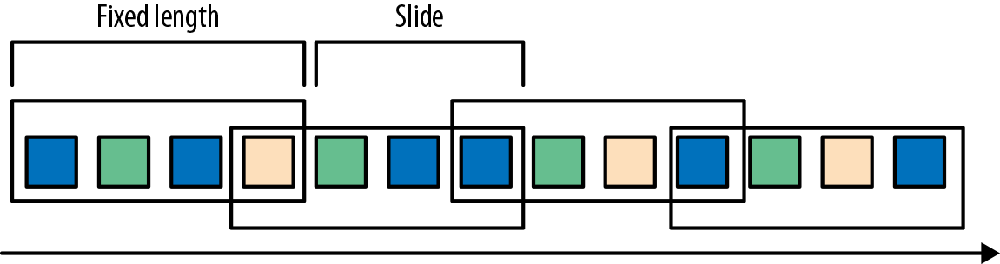

- 会话窗口在常见的真实场景中很有用，一些场景既不能使用滚动窗口也不能使用滑动窗口。考虑一个分析在线用户行为的应用程序。在应用程序里，我们想把源自同一时期的用户活动或会话事件分组在一起。会话由一系列相邻时间发生的事件组成，接下来有一段时间没有活动。例如，用户在App上浏览一系列的新闻，然后关掉App，那么浏览新闻这段时间的浏览事件就是一个会话。会话窗口事先没有定义窗口的长度，而是取决于数据的实际情况，滚动窗口和滑动窗口无法应用于这个场景。相反，我们需要将同一会话中的事件分配到同一个窗口中去，而不同的会话可能窗口长度不一样。会话窗口会定义一个间隙值来区分不同的会话。间隙值的意思是：用户一段时间内不活动，就认为用户的会话结束了。图2-9显示了一个会话窗口。


到目前为止，所有窗口类型都是在整条流上去做窗口操作。但实际上你可能想要将一条流分流成多个逻辑流并定义并行窗口。例如，如果我们正在接收来自不同传感器的测量结果，那么可能想要在做窗口计算之前按传感器ID对流进行分流操作。在并行窗口中，每条流都独立于其他流，然后应用了窗口逻辑。图2-10显示了一个基于计数的长度为2的并行滚动窗口，根据事件颜色分流。


在流处理中，窗口操作与两个主要概念密切相关：时间语义和状态管理。时间也许是流处理最重要的方面。即使低延迟是流处理的一个有吸引力的特性，它的真正价值不仅仅是快速分析。真实世界的系统，网络和通信渠道远非完美，流数据经常被推迟或无序(乱序)到达。理解如何在这种条件下提供准确和确定的结果是至关重要的。更重要的是，流处理程序可以按原样处理事件制作的也应该能够处理相同的历史事件方式，从而实现离线分析甚至时间旅行分析。当然，前提是我们的系统可以保存状态，因为可能有故障发生。到目前为止，我们看到的所有窗口类型在产生结果前都需要保存之前的数据。实际上，如果我们想计算任何指标，即使是简单的计数，我们也需要保存状态。考虑到流处理程序可能会运行几天，几个月甚至几年，我们需要确保状态可以在发生故障的情况下可靠地恢复。并且即使程序崩溃，我们的系统也能保证计算出准确的结果。本章，我们将在流处理应用可能发生故障的语境下，深入探讨时间和状态的概念。

# Flink快速上手

## 使用Maven搭建工程

**IDE推荐使用Idea**

我们使用Flink官方提供的flink-quickstart-scala原型来创建我们的工程，因为Flink官方提供的pom.xml经过了精心配置，可以打包出很小的Jar包。


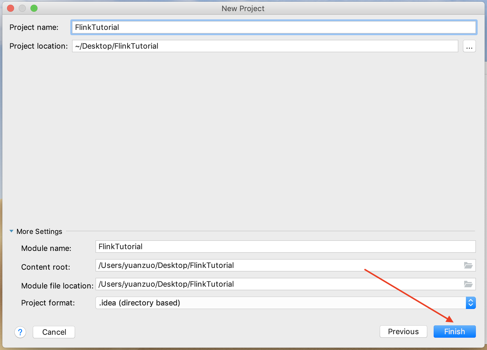

目录结构如下：

```
$ tree quickstart/
quickstart/
├── pom.xml
└── src
    └── main
        ├── resources
        │   └── log4j.properties
        └── scala
            └── org
                └── myorg
                    └── quickstart
                        ├── BatchJob.scala
                        └── StreamingJob.scala
```

```scala
package com.atguigu

import org.apache.flink.streaming.api.scala._ // 导入隐式类型转换
import org.apache.flink.streaming.api.windowing.time.Time

object StreamingJob {

  /** Main program method */
  def main(args: Array[String]) : Unit = {

    // get the execution environment
    val env: StreamExecutionEnvironment = StreamExecutionEnvironment
      .getExecutionEnvironment

    // get input data by connecting to the socket
    val text: DataStream[String] = env.socketTextStream("localhost", 9999, '\n')

    // parse the data, group it, window it, and aggregate the counts
    val windowCounts = text
      // flatMap的函数签名：
      // def flatMap[A,B](as: List[A])(f: A => List[B]): List[B]
      // 例如: flatMap(List(1,2,3))(i => List(i,i))}
      // 结果是
      // List(1,1,2,2,3,3)
      // List("a b", "c d").flatMap(line => line.split(" "))
      // 结果是
      // List(a, b, c, d)
      .flatMap { w => w.split("\\s") }
      .map { w => WordWithCount(w, 1) }
      .keyBy("word")
      .timeWindow(Time.seconds(5))
      .sum("count")

    // print the results with a single thread, rather than in parallel
    windowCounts.print().setParallelism(1)

    env.execute("Socket Window WordCount")
  }

  /** Data type for words with count */
  case class WordWithCount(word: String, count: Long)
}
```

新建一个Terminal终端，然后运行以下:

```
$ nc -lk 9999
```

查看结果，在flink文件夹中的log文件夹里，后缀名为`.out`, 和在Idea里面执行的样子不一样，不会打印到控制台。

## Flink部署

### 下载Hadoop Free版本的Flink

```
https://www.apache.org/dyn/closer.lua/flink/flink-1.7.2/flink-1.7.2-bin-scala_2.11.tgz
```

### 解压缩

```
$ tar xvfz flink-1.7.2-bin-scala_2.11.tgz
```

### 启动Flink集群

```
cd flink-1.7.2
./bin/start-cluster.sh
```

### 在浏览器中打开Flink的Web UI

http://localhost:8081

### 打包编写好的StreamingJob程序

在Idea中使用maven package功能打包。

### 提交打包好的程序

```
$ ./bin/flink run xxxx.jar
```

### 在Flink Web UI查看Dashboard中job的执行状态

### 停止Flink集群

```
$ ./bin/stop-cluster.sh
```

# Flink运行架构

## 任务调度原理


客户端不是运行时和程序执行的一部分，但它用于准备并发送Dataflow(JobGraph)给Master(JobManager)，然后，客户端断开连接或者维持连接以等待接收计算结果。

当Flink集群启动后，首先会启动一个JobManger和一个或多个的TaskManager。由Client提交任务给JobManager，JobManager再调度任务到各个TaskManager去执行，然后TaskManager将心跳和统计信息汇报给JobManager。TaskManager之间以流的形式进行数据的传输。上述三者均为独立的JVM进程。

Client为提交Job的客户端，可以运行在任何机器上(与JobManager环境连通即可)。提交Job后，Client可以结束进程(Streaming的任务)，也可以不结束并等待结果返回。

JobManager主要负责调度Job并协调Task做Checkpoint。从Client处接收到Job和JAR包等资源后，会生成优化后的执行计划，并以Task为单元调度到各个TaskManager去执行。

TaskManager在启动的时候就设置好了槽位数(Slot)，每个Slot能启动一个Task，Task为线程。从JobManager处接收需要部署的Task，部署启动后，与自己的上游建立Netty连接，接收数据并处理。

**关于执行图**

Flink中的执行图可以分成四层：

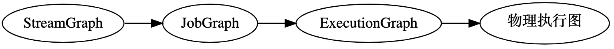

**StreamGraph**：是根据用户通过Stream API编写的代码生成的最初的图。用来表示程序的拓扑结构。

**JobGraph**：StreamGraph经过优化后生成了JobGraph，提交给JobManager的数据结构。主要的优化为，将多个符合条件的节点chain在一起作为一个节点，这样可以减少数据在节点之间流动所需要的序列化/反序列化/传输消耗。

**ExecutionGraph**：JobManager根据JobGraph生成ExecutionGraph。ExecutionGraph是JobGraph的并行化版本，是调度层最核心的数据结构。

**物理执行图**：JobManager根据ExecutionGraph对Job进行调度后，在各个TaskManager上部署Task后形成的"图"，并不是一个具体的数据结构。


## Worker与Slots

每一个Worker(TaskManager)是一个JVM进程，它可能会在独立的线程上执行一个或多个SubTask。为了控制一个Worker能接收多少个Task，Worker通过Task Slot来进行控制(一个Worker至少有一个Task Slot)。

每个Task Slot表示TaskManager拥有资源的一个固定大小的子集。假如一个TaskManager有三个Slot，那么它会将其管理的内存分成三份给各个Slot。资源Slot化意味着一个SubTask将不需要跟来自其他Job的SubTask竞争被管理的内存，取而代之的是它将拥有一定数量的内存储备。需要注意的是，这里不会涉及到CPU的隔离，Slot目前仅仅用来隔离Task的受管理的内存。

通过调整Task Slot的数量，允许用户定义SubTask之间如何互相隔离。如果一个TaskManager一个Slot，那将意味着每个Task Group运行在独立的JVM中(该JVM可能是通过一个特定的容器启动的)，而一个TaskManager多个Slot意味着更多的SubTask可以共享同一个JVM。而在同一个JVM进程中的Task将共享TCP连接(基于IO多路复用)和心跳消息。它们也可能共享数据集和数据结构，因此这减少了每个Task的负载。

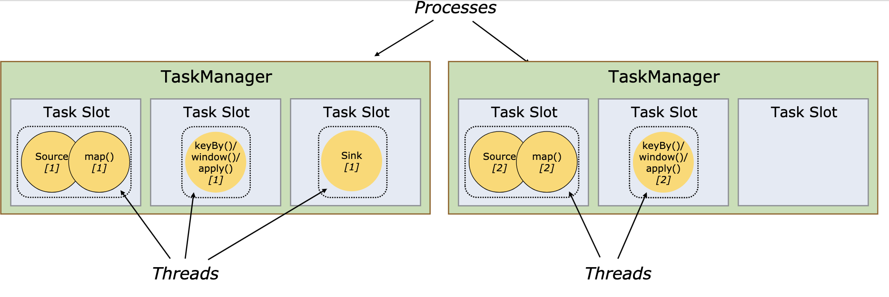

Task Slot是静态的概念，是指TaskManager具有的并发执行能力，可以通过参数taskmanager.numberOfTaskSlots进行配置，而并行度parallelism是动态概念，即TaskManager运行程序时实际使用的并发能力，可以通过参数parallelism.default进行配置。

也就是说，假设一共有3个TaskManager，每一个TaskManager中的分配3个Task Slot，也就是每个TaskManager可以接收3个Task，一共9个Task Slot，如果我们设置parallelism.default=1，即运行程序默认的并行度为1，9个TaskSlot只用了1个，有8个空闲，因此，设置合适的并行度才能提高效率。


## 程序与数据流


所有的Flink程序都是由三部分组成的：Source、Transformation和Sink。

Source负责读取数据源，Transformation利用各种算子进行处理加工，Sink负责输出。

在运行时，Flink上运行的程序会被映射成Streaming Dataflows，它包含了这三部分。每一个Dataflow以一个或多个sources开始以一个或多个sinks结束。dataflow类似于任意的有向无环图(DAG)。在大部分情况下，程序中的transformations跟dataflow中的operator是一一对应的关系，但有时候，一个transformation可能对应多个operator。

## 并行数据流

Flink程序的执行具有并行、分布式的特性。在执行过程中，一个stream包含一个或多个stream partition，而每一个operator包含一个或多个operator subtask，这些operator subtasks在不同的线程、不同的物理机或不同的容器中彼此互不依赖的执行。

一个特定operator的subtask的个数被称之为其parallelism(并行度)。一个stream的并行度总是等同于其producing operator的并行度。一个程序中，不同的operator可能具有不同的并行度。


Stream在operator之间传输数据的形式可以是one-to-one(forwarding)的模式也可以是redistributing的模式，具体是哪一种形式，取决于operator的种类。

**One-To-One**：stream(比如在source和map operator之间)维护着分区以及元素的顺序。那意味着map operator的subtask看到的元素的个数以及顺序跟source operator的subtask生产的元素的个数、顺序相同，map、fliter、flatMap等算子都是one-to-one的对应关系。类似于spark中的窄依赖

**Redistributing**：stream(map()跟keyBy/window之间或者keyBy/window跟sink之间)的分区会发生改变。每一个operator subtask依据所选择的transformation发送数据到不同的目标subtask。例如，keyBy()基于hashCode重分区、broadcast和rebalance会随机重新分区，这些算子都会引起redistributing过程，而redistributing过程就类似于Spark中的shuffle过程。类似于spark中的宽依赖

## task与operator chains

相同并行度的one to one操作，Flink这样相连的operator链接在一起形成一个task，原来的operator成为里面的subtask。将operators链接成task是非常有效的优化：它能减少线程之间的切换和基于缓存区的数据交换，在减少时延的同时提升吞吐量。链接的行为可以在编程API中进行指定。


## 系统架构

Flink是一个用于有状态的并行数据流处理的分布式系统。它由多个进程构成，这些进程一般会分布运行在不同的机器上。对于分布式系统来说，面对的常见问题有：集群中资源的分配和管理、进程协调调度、持久化和高可用的数据存储，以及故障恢复。

对于这些分布式系统的经典问题，业内已有比较成熟的解决方案和服务。所以Flink并不会自己去处理所有的问题，而是利用了现有的集群架构和服务，这样它就可以把精力集中在核心工作——分布式数据流处理上了。Flink与一些集群资源管理工具有很好的集成，比如Apache Mesos、YARN和Kubernetes；同时，也可以配置为独立（stand-alone）集群运行。Flink自己并不提供持久化的分布式存储，而是直接利用了已有的分布式文件系统（比如HDFS）或者对象存储（比如S3）。对于高可用的配置，Flink需要依靠Apache ZooKeeper来完成。

在本节中，我们将介绍Flink的不同组件，以及在运行程序时它们如何相互作用。我们会讨论部署Flink应用程序的两种模式，并且了解每种模式下分发和执行任务的方式。最后，我们还会解释一下Flink的高可用性模式是如何工作的。

### Flink运行时组件

Flink运行时架构主要包括四个不同的组件，它们会在运行流处理应用程序时协同工作：作业管理器（JobManager）、资源管理器（ResourceManager）、任务管理器（TaskManager），以及分发器（Dispatcher）。因为Flink是用Java和Scala实现的，所以所有组件都会运行在Java虚拟机（JVMs）上。每个组件的职责如下：

- 作业管理器（JobManager）是控制一个应用程序执行的主进程，也就是说，每个应用程序都会被一个不同的JobManager所控制执行。JobManager会先接收到要执行的应用程序。这个应用程序会包括：作业图（JobGraph）、逻辑数据流图（logical dataflow graph）和打包了所有的类、库和其它资源的JAR包。JobManager会把JobGraph转换成一个物理层面的数据流图，这个图被叫做“执行图”（ExecutionGraph），包含了所有可以并发执行的任务。JobManager会向资源管理器（ResourceManager）请求执行任务必要的资源，也就是任务管理器（TaskManager）上的插槽（slot）。一旦它获取到了足够的资源，就会将执行图分发到真正运行它们的TaskManager上。而在运行过程中，JobManager会负责所有需要中央协调的操作，比如说检查点（checkpoints）的协调。
- ResourceManager主要负责管理任务管理器（TaskManager）的插槽（slot），TaskManger插槽是Flink中定义的处理资源单元。Flink为不同的环境和资源管理工具提供了不同资源管理器（ResourceManager），比如YARN、Mesos、K8s，以及standalone部署。当JobManager申请插槽资源时，ResourceManager会将有空闲插槽的TaskManager分配给JobManager。如果ResourceManager没有足够的插槽来满足JobManager的请求，它还可以向资源提供平台发起会话，以提供启动TaskManager进程的容器。另外，ResourceManager还负责终止空闲的TaskManager，释放计算资源。
- 任务管理器（TaskManager）是Flink中的工作进程。通常在Flink中会有多个TaskManager运行，每一个TaskManager都包含了一定数量的插槽（slots）。插槽的数量限制了TaskManager能够执行的任务数量。启动之后，TaskManager会向资源管理器注册它的插槽；收到资源管理器的指令后，TaskManager就会将一个或者多个插槽提供给JobManager调用。JobManager就可以向插槽分配任务（tasks）来执行了。在执行过程中，一个TaskManager可以跟其它运行同一应用程序的TaskManager交换数据。任务的执行和插槽的概念会在“任务执行”一节做具体讨论。
- 分发器（Dispatcher）可以跨作业运行，它为应用提交提供了REST接口。当一个应用被提交执行时，分发器就会启动并将应用移交给一个JobManager。由于是REST接口，所以Dispatcher可以作为集群的一个HTTP接入点，这样就能够不受防火墙阻挡。Dispatcher也会启动一个Web UI，用来方便地展示和监控作业执行的信息。Dispatcher在架构中可能并不是必需的，这取决于应用提交运行的方式。


>上图是从一个较为高层级的视角，来看应用中各组件的交互协作。如果部署的集群环境不同（例如YARN，Mesos，Kubernetes，standalone等），其中一些步骤可以被省略，或是有些组件会运行在同一个JVM进程中。

### 应用部署

Flink应用程序可以用以下两种不同的方式部署：

**框架(Framework)方式**

在这个模式下，Flink应用被打包成一个Jar文件，并由客户端提交给一个运行服务（running service）。这个服务可以是一个Flink的Dispatcher，也可以是一个Flink的JobManager，或是Yarn的ResourceManager。如果application被提交给一个JobManager，则它会立即开始执行这个application。如果application被提交给了一个Dispatcher，或是Yarn ResourceManager，则它会启动一个JobManager，然后将application交给它，再由JobManager开始执行此应用。

**库(Library)方式**

在这个模式下，Flink Application 会被打包在一个容器（container） 镜像里，例如一个Docker 镜像。此镜像包含了运行JobManager和ResourceManager的代码。当一个容器从镜像启动后，它会自动启动ResourceManager和JobManager，并提交打包好的应用。另一种方法是：将应用打包到镜像后，只用于部署TaskManager容器。从镜像启动的容器会自动启动一个TaskManager，然后连接ResourceManager并注册它的slots。这些镜像的启动以及失败重启，通常都会由一个外部的资源管理器管理（比如Kubernetes）。

框架模式遵循了传统的任务提交方式，从客户端提交到Flink运行服务。而在库模式下，没有运行的Flink服务。它是将Flink作为一个库，与应用程序一同打包到了一个容器镜像。这种部署方式在微服务架构中较为常见。我们会在“运行管理流式应用程序”一节对这个话题做详细讨论。

### 任务执行

一个TaskManager可以同时执行多个任务（tasks）。这些任务可以是同一个算子（operator）的子任务（数据并行），也可以是来自不同算子的（任务并行），甚至可以是另一个不同应用程序的（作业并行）。TaskManager提供了一定数量的处理插槽（processing slots），用于控制可以并行执行的任务数。一个slot可以执行应用的一个分片，也就是应用中每一个算子的一个并行任务。图3-2展示了TaskManagers，slots，tasks以及operators之间的关系：


最左边是一个“作业图”（JobGraph），包含了5个算子——它是应用程序的非并行表示。其中算子A和C是数据源（source），E是输出端（sink）。C和E并行度为2，而其他的算子并行度为4。因为最高的并行度是4，所以应用需要至少四个slot来执行任务。现在有两个TaskManager，每个又各有两个slot，所以我们的需求是满足的。JobManager将JobGraph转化为“执行图”（ExecutionGraph），并将任务分配到四个可用的slot上。对于有4个并行任务的算子，它的task会分配到每个slot上。而对于并行度为2的operator C和E，它们的任务被分配到slot 1.1、2.1 以及 slot 1.2、2.2。将tasks调度到slots上，可以让多个tasks跑在同一个TaskManager内，也就可以是的tasks之间的数据交换更高效。然而将太多任务调度到同一个TaskManager上会导致TaskManager过载，继而影响效率。之后我们会在“控制任务调度”一节继续讨论如何控制任务的调度。

TaskManager在同一个JVM中以多线程的方式执行任务。线程较进程会更轻量级，但是线程之间并没有对任务进行严格隔离。所以，单个任务的异常行为有可能会导致整个TaskManager进程挂掉，当然也同时包括运行在此进程上的所有任务。通过为每个TaskManager配置单独的slot，就可以将应用在TaskManager上相互隔离开来。TaskManager内部有多线程并行的机制，而且在一台主机上可以部署多个TaskManager，所以Flink在资源配置上非常灵活，在部署应用时可以充分权衡性能和资源的隔离。我们将会在第九章对Flink集群的配置和搭建继续做详细讨论。

### 高可用配置

流式应用程序一般被设计为7x24小时运行。所以很重要的一点是：即使出现了进程挂掉的情况，应用仍需要继续保持运行。为了从故障恢复，系统首先需要重启进程、然后重启应用并恢复它的状态。接下来，我们就来了解Flink如何重启失败的进程。

**TaskManager故障**

如前所述，Flink需要足够数目的slot，来执行一个应用的所有任务。假设一个Flink环境有4个TaskManager，每个提供2个插槽，那么流应用程序执行的最高并行度为8。如果其中一个TaskManager挂掉了，那么可用的slots会降到6。在这种情况下，JobManager会请求ResourceManager提供更多的slots。如果此请求无法满足——例如应用跑在一个standalone集群——那么JobManager在有足够的slots之前，无法重启应用。应用的重启策略决定了JobManager的重启频率，以及两次重启尝试之间的时间间隔。

**JobManager故障**

比TaskManager故障更严重的问题是JobManager故障。JobManager控制整个流应用程序的执行，并维护执行中的元数据——例如指向已完成检查点的指针。若是对应的JobManager挂掉，则流程序无法继续运行。所以这就导致在Flink应用中，JobManager是单点故障。为了解决这个问题，Flink提供了高可用模式。在原先的JobManager挂掉后，可以将一个作业的状态和元数据迁移到另一个JobManager，并继续执行。

Flink的高可用模式基于Apache ZooKeeper，我们知道，ZooKeeper是用来管理需要协调和共识的分布式服务的系统。Flink主要利用ZooKeeper来进行领导者（leader）的选举，并把它作为一个高可用和持久化的数据存储。当在高可用模式下运行时，JobManager会将JobGraph以及所有需要的元数据（例如应用程序的jar文件），写入到一个远程的持久化存储系统中。而且，JobManager会将指向存储位置的指针，写入到ZooKeeper的数据存储中。在执行一个应用的过程中，JobManager会接收每个独立任务检查点的状态句柄（也就是存储位置）。当一个检查点完成时（所有任务已经成功地将它们的状态写入到远程存储）， JobManager把状态句柄写入远程存储，并将指向这个远程存储的指针写入ZooKeeper。这样，一个JobManager挂掉之后再恢复，所需要的所有数据信息已经都保存在了远程存储，而ZooKeeper里存有指向此存储位置的指针。图3-3描述了这个设计：


当一个JobManager失败，所有属于这个应用的任务都会自动取消。一个新的JobManager接管工作，会执行以下操作：

1. 从ZooKeeper请求存储位置（storage location），从远端存储获取JobGraph，Jar文件，以及应用最近一次检查点（checkpoint）的状态句柄（state handles）
2. 从ResourceManager请求slots，用来继续运行应用
3. 重启应用，并将所有任务的状态，重设为最近一次已完成的检查点

如果我们是在容器环境里运行应用（如Kubernetes），故障的JobManager或TaskManager 容器通常会由容器服务自动重启。当运行在YARN或Mesos之上时，JobManager或TaskManager进程会由Flink的保留进程自动触发重启。而在standalone模式下，Flink并未提供重启故障进程的工具。所以，此模式下我们可以增加备用（standby）的 JobManager和TaskManager，用于接管故障的进程。我们将会在“高可用配置”一节中做进一步讨论。

## Flink中的数据传输

运行中的应用任务，会持续不断地交换数据。TaskManager负责将数据从“发送任务”（sending tasks）传递到“接收任务”（receiving tasks）。TaskManager的网络组件会在缓冲区中收集数据，然后再将其发送，也就是说，数据不是逐条发送的，而是在缓冲区中“攒”成了一批。这种技术是有效利用网络资源和实现高吞吐量的基础，机制类似于网络或磁盘I/O协议中使用的缓冲技术。

>通过缓冲区来传递数据，意味着Flink的处理模型是基于微批的。

每个TaskManager都有一个网络缓冲池（默认大小为32KB），用于发送和接收数据。如果发送任务和接收任务运行在不同的TaskManager进程中，那么它们会通过操作系统的网络栈来进行通信。流应用程序需要以管道方式传递数据，所以每对TaskManager之间都需要维护一个永久TCP连接，用来交换数据。在无序连接模式下，每个发送任务都需要能向任何接收任务传递数据。所以我们发现，TaskManager需要为每一个接收任务设置一个专用的网络缓冲区，因为其中的每一个任务都需要接收数据。图3-4展示了这种架构。


如图3-4所示，四个发送任务中的每一个都需要至少四个网络缓冲区，用来向每个接收任务发送数据，而每个接收任务也需要至少四个缓冲区来接收数据。需要发送到另一个TaskManager的缓冲数据，会复用同一网络连接。为了实现平滑的管道数据传输，TaskManager必须能够提供足够的缓冲，来同时为所有传出和传入连接提供服务。对于无序或广播连接，每个发送任务都需要为每个接收任务提供一个缓冲；所以，所需缓冲区的数量是相关算子任务数量的平方。Flink网络缓冲区的默认配置足以满足中小型应用；对于更大的应用场景，就需要按照“主内存和网络缓冲区”一节中的叙述调整配置了。

当发送任务和接收任务在同一个TaskManager进程中运行时，发送任务会将传出的数据序列化，放入字节缓冲区，并在缓冲区填满后将其放入队列。接收任务从队列中提取缓冲数据并对其进行反序列化。因此，在同一个TaskManager上运行的任务，它们之间的数据传输不会导致网络通信。

Flink采用不同的技术来降低任务之间的通信成本。在下面的部分中，我们会简要讨论基于信任度（Credit）的流控制和任务链。

### 基于信任度(credit)的流控制

通过网络连接来发送每条数据的效率很低，会导致很大的开销。为了充分利用网络连接的带宽，就需要进行缓冲了。在流处理的上下文中，缓冲的一个缺点是会增加延迟，因为数据需要在缓冲区中进行收集，而不是立即发送。

Flink实现了一个基于信任度的流量控制机制，其工作原理如下。接收任务授予发送任务一些“信任度”（credit），也就是为了接收其数据而保留的网络缓冲区数。当发送者收到一个信任度通知，它就会按照被授予的信任度，发送尽可能多的缓冲数据，并且同时发送目前积压数据的大小——也就是已填满并准备发送的网络缓冲的数量。接收者用保留的缓冲区处理发来的数据，并对发送者传来的积压量进行综合考量，为其所有连接的发送者确定下一个信用度授权的优先级。

基于信用度的流控制可以减少延迟，因为发送者可以在接收者有足够的资源接受数据时立即发送数据。此外，在数据倾斜的情况下，这样分配网络资源是一种很有效的机制，因为信用度是根据发送者积压数据量的规模授予的。因此，基于信用的流量控制是Flink实现高吞吐量和低延迟的重要组成部分。

### 任务链(Task Chaining)

Flink采用了一种称为任务链的优化技术，可以在特定条件下减少本地通信的开销。为了满足任务链的要求，必须将两个或多个算子设为相同的并行度，并通过本地转发（local forward）的方式进行连接。图3-5所示的算子管道满足这些要求。它由三个算子组成，这些算子的任务并行度都被设为2，并且通过本地转发方式相连接。


图3-6展示了管道以任务链方式运行的过程。算子的函数被融合成了一个单一的任务，由一个线程执行。由函数生成的数据通过一个简单的方法调用移交给下一个函数；这样在函数之间直接传递数据，基本上没有序列化和通信成本。


任务链可以显著降低本地任务之间的通信成本，但也有一些场景，在没有链接的情况下运行管道操作是有意义的。例如，如果任务链中某个函数执行的开销巨大，那就可以将一条长的任务链管道断开，或者将一条链断开为两个任务，从而可以将这个开销大的函数调度到不同的槽（slots）中。图3-7显示了在没有任务链的情况下相同管道操作的执行情况。所有函数都由独立的单个任务来评估，每个任务都在专有的线程中运行。


任务链在Flink中默认会启用。在“控制任务链”一节中，我们展示了如何禁用应用程序的任务链，以及如何控制各个算子的链接行为。

## 事件时间(Event-Time)处理

在“时间语义”一节，我们重点强调了时间语义在流处理应用中的重要性，并且解释了处理时间（processing time）和事件时间（event time）的不同。处理时间比较好理解，因为它是基于处理器本地时间的；但同时，它会带来比较混乱、不一致、并且不可重现的结果。相比之下，事件时间语义能够产生可重现且一致的结果，这也是许多流处理场景希望解决的一大难题。但是，与处理时间应用程序相比，事件时间应用程序会更复杂，需要额外的配置。另外，支持事件时间的流处理器，也比纯粹在处理时间中运行的系统内部更为复杂。

Flink为常见的事件时间处理操作提供了直观且易于使用的原语，同时暴露了表达性很强的API，用户可以使用自定义算子实现更高级的事件时间应用程序。很好地理解Flink的内部时间处理，对于实现这样的高级应用程序会有很大帮助，有时也是必需的。上一章介绍了Flink利用两个概念来支持事件时间语义：记录时间戳（timestamps）和水位线（watermarks）。接下来，我们将描述Flink如何在内部实现并处理时间戳和水位线，进而支持具有事件时间语义的流式应用程序。

### 时间戳(Timestamps)

由Flink事件时间流应用程序处理的所有记录都必须伴有时间戳。时间戳将数据与特定时间点相关联，通常就是数据所表示的事件发生的时间点。而只要时间戳大致跟数据流保持一致，基本上随着数据流的前进而增大，应用程序就可以自由选择时间戳的含义。不过正如“时间语义”一节中所讨论的，在现实场景中，时间戳基本上都是乱序的，所以采用“事件时间”而非“处理事件”往往会显得更为重要。

当Flink以事件时间模式处理数据流时，它会根据数据记录的时间戳来处理基于时间的算子。例如，时间窗口算子根据相关时间戳将数据分配给不同的时间窗口。Flink将时间戳编码为16字节的长整型值，并将其作为元数据附加到数据记录中。它的内置运算符会将这个长整型值解释为一个具有毫秒精度的Unix时间戳，也就是1970-01-01-00:00:00.000以来的毫秒数。当然，如果用户进行了自定义，那么运算符可以有自己的解释，例如，可以将精度调整到微秒。

### 水位线(Watermarks)

除了时间戳，基于事件时间的Flink应用程序还必须支持水位线（watermark）。在基于事件时间的应用中，水位线用于生成每个任务的当前事件时间。基于时间的算子使用这个“当前事件时间”来触发计算和处理操作。例如，一个时间窗口任务（time-window task）会在任务的事件时间超出窗口的关闭边界时，完成窗口计算，并输出计算结果。

在Flink中，水位线被实现为一条特殊的数据记录，它里面以长整型值保存了一个时间戳。水位线在带有时间戳的数据流中，跟随着其它数据一起流动，如图3-8所示。


水位线有两个基本属性：

1. 必须单调递增，以确保任务的事件时间时钟在向前推进，而不是在后退。
2. 它们与数据的时间戳相关。带有时间戳T的水位线表示，所有后续数据的时间戳都应该大于T。

上面的第二个属性用于处理带有乱序时间戳的数据流，比如图3-8中时间戳3和5的数据。基于时间的算子任务会收集和处理数据（这些数据可能具有乱序的时间戳），并在事件时间时钟到达某个时刻时完成计算。这个时刻就表示数据收集的截止，具有之前时间戳的数据应该都已经到达、不再需要了；而其中的事件时间时钟，正是由当前接收到的水位线来指示的。如果任务再接收到的数据违反了watermark的这一属性，也就是时间戳小于以前接收到的水位线时，它所属的那部分计算可能已经完成了。这种数据被称为延迟数据（late records）。Flink提供了处理延迟数据的不同方式，我们会在“处理延迟数据”一节中讨论。

水位线还有一个很有趣的特性，它允许应用程序自己来平衡结果的完整性和延迟。如果水位线与数据的时间戳非常接近，那么我们可以得到较低的处理延迟，因为任务在完成计算之前只会短暂地等待更多数据到达。而同时，结果的完整性可能会受到影响，因为相关数据可能因为迟到而被视为“延迟数据”，这样就不会包含在结果中。相反，非常保守的水位线提供了足够的时间去等待所有数据到达，这样会增加处理延迟，但提高了结果的完整性。

### watermark的传递和事件时间

在本节中，我们将讨论算子如何处理水位线。Flink把watermark作为一条特殊的数据来实现，它也会由算子任务接收和发送。任务会有一个内部的时间服务，它会维护定时器，并在收到watermark时触发。任务可以在计时器服务中注册定时器，以便在将来特定的时间点执行计算。例如，窗口算子为每个活动窗口注册一个定时器，当事件时间超过窗口的结束时间时，该计时器将清除窗口的状态。

当任务收到watermark时，将执行以下操作：

1. 任务根据watermark的时间戳更新其内部事件时钟。
2. 任务的时间服务会将所有过期的计时器标识出来，它们的时间小于当前的事件时间。对于每个过期的计时器，任务调用一个回调函数，该函数可以执行计算并发送结果。
3. 任务会发出一个带有更新后的事件时间的watermark。

>Flink限制通过DataStream API访问时间戳和watermark。函数不能读取或修改数据的时间戳和watermark，但底层的“处理函数”（process functions）除外，它们可以读取当前处理数据的时间戳、请求算子的当前事件时间，还可以注册定时器。通常的函数都不会暴露这些可以设置时间戳、操作任务事件时间时钟、或者发出水位线的API。而基于时间的数据流算子任务则会配置发送出的数据的时间戳，以确保它们能够与已到达的水位线平齐。例如，窗口计算完成后，时间窗口的算子任务会将窗口的结束时间作为时间戳附加到将要发送出的结果数据上，然后再使用触发窗口计算的时间戳发出watermark。

现在，让我们更详细地解释一下任务在接收到新的watermark时，如何继续发送watermark并更新其事件时钟。正如我们在“数据并发和任务并发”中所了解的，Flink将数据流拆分为多个分区，并通过单独的算子任务并行地处理每个分区。每个分区都是一个流，里面包含了带着时间戳的数据和watermark。一个算子与它前置或后续算子的连接方式有多种情况，所以它对应的任务可以从一个或多个“输入分区”接收数据和watermark，同时也可以将数据和watermark发送到一个或多个“输出分区”。接下来，我们将详细描述一个任务如何向多个输出任务发送watermark，以及如何通过接收到的watermark来驱动事件时间时钟前进。

任务为每个输入分区维护一个分区水位线（watermark）。当从一个分区接收到watermark时，它会比较新接收到的值和当前水位值，然后将相应的分区watermark更新为两者的最大值。然后，任务会比较所有分区watermark的大小，将其事件时钟更新为所有分区watermark的最小值。如果事件时间时钟前进了，任务就将处理所有被触发的定时器操作，并向所有连接的输出分区发送出相应的watermark，最终将新的事件时间广播给所有下游任务。

图3-9显示了具有四个输入分区和三个输出分区的任务如何接收watermark、更新分区watermark和事件时间时钟，以及向下游发出watermark。


具有两个或多个输入流（如Union或CoFlatMap）的算子任务（参见“多流转换”一节）也会以所有分区watermark的最小值作为事件时间时钟。它们并不区分不同输入流的分区watermark，所以两个输入流的数据都是基于相同的事件时间时钟进行处理的。当然我们可以想到，如果应用程序的各个输入流的事件时间不一致，那么这种处理方式可能会导致问题。

Flink的水位处理和传递算法，确保了算子任务发出的时间戳和watermark是“对齐”的。不过它依赖一个条件，那就是所有分区都会提供不断增长的watermark。一旦一个分区不再推进水位线的上升，或者完全处于空闲状态、不再发送任何数据和watermark，任务的事件时间时钟就将停滞不前，任务的定时器也就无法触发了。对于基于时间的算子来说，它们需要依赖时钟的推进来执行计算和清除状态，这种情况显然就会有问题。如果任务没有定期从所有输入任务接收到新的watermark，那么基于时间的算子的处理延迟和状态空间的大小都会显著增加。

对于具有两个输入流而且watermark明显不同的算子，也会出现类似的情况。具有两个输入流的任务的事件时间时钟，将会同较慢的那条流的watermark保持一致，而通常较快流的数据或者中间结果会在state中缓冲，直到事件时间时钟达到这条流的watermark，才会允许处理它们。

### 时间戳的分配和水位线的产生

我们已经解释了什么是时间戳和水位线，以及它们是如何由Flink内部处理的；然而我们还没有讨论它们的产生。流应用程序接收到数据流时，通常就会先分配时间戳并生成水位线（watermark）。因为时间戳的选择是由不同的应用程序决定的，而且watermark取决于时间戳和流的特性，所以应用程序必须首先显式地分配时间戳并生成watermark。Flink流应用程序可以通过三种方式分配时间戳和生成watermark：

1. 在数据源（source）处分配：当数据流被摄入到应用程序中时，可以由“源函数”SourceFunction分配和生成时间戳和watermark。SourceFunction可以产生并发送一个数据流；数据会与相关的时间戳一起发送出去，而watermark可以作为一条特殊数据在任何时间点发出。如果SourceFunction（暂时）不再发出watermark，它可以声明自己处于“空闲”（idle）状态。Flink会在后续算子的水位计算中，把空闲的SourceFunction产生的流分区排除掉。source的这一空闲机制，可以用来解决前面提到的水位不再上升的问题。源函数（Source Function）在“实现自定义源函数”一节中进行了更详细的讨论。
2. 定期分配：在Flink中，DataStream API提供一个名为AssignerWithPeriodicWatermarks的用户定义函数，它可以从每个数据中提取时间戳，并被定期调用以生成当前watermark。提取出的时间戳被分配给相应的数据，而生成的watermark也会添加到流中。这个函数将在“分配时间戳和生成水位线”一节中讨论。
3. 间断分配：AssignerWithPunctuatedWatermarks是另一个用户定义的函数，它同样会从每个数据中提取一个时间戳。它可以用于生成特殊输入数据中的watermark。与AssignerWithPeriodicWatermarks相比，此函数可以（但不是必须）从每个记录中提取watermark。我们在“分配时间戳和生成水位线”一节中同样讨论了该函数。

用户定义的时间戳分配函数并没有严格的限制，通常会放在尽可能靠近source算子的位置，因为当经过一些算子处理后，数据及其时间戳的顺序就更加难以解释了。所以尽管我们可以在流应用程序的中段覆盖已有的时间戳和watermark——Flink通过用户定义的函数提供了这种灵活性，但这显然并不是推荐的做法。

## 状态管理

在第2章中，我们已经知道大多数流应用程序都是有状态的。许多算子会不断地读取和更新状态，例如在窗口中收集的数据、读取输入源的位置，或者像机器学习模型那样的用户定制化的算子状态。 Flink用同样的方式处理所有的状态，无论是内置的还是用户自定义的算子。本节我们将会讨论Flink支持的不同类型的状态，并解释“状态后端”是如何存储和维护状态的。

一般来说，由一个任务维护，并且用来计算某个结果的所有数据，都属于这个任务的状态。你可以认为状态就是一个本地变量，可以被任务的业务逻辑访问。图3-10显示了任务与其状态之间的交互。


任务会接收一些输入数据。在处理数据时，任务可以读取和更新状态，并根据输入数据和状态计算结果。最简单的例子，就是统计接收到多少条数据的任务。当任务收到新数据时，它会访问状态以获取当前的计数，然后让计数递增，更新状态并发送出新的计数。

应用程序里，读取和写入状态的逻辑一般都很简单直接，而有效可靠的状态管理会复杂一些。这包括如何处理很大的状态——可能会超过内存，并且保证在发生故障时不会丢失任何状态。幸运的是，Flink会帮我们处理这相关的所有问题，包括状态一致性、故障处理以及高效存储和访问，以便开发人员可以专注于应用程序的逻辑。

在Flink中，状态始终与特定算子相关联。为了使运行时的Flink了解算子的状态，算子需要预先注册其状态。总的说来，有两种类型的状态：算子状态（operator state）和键控状态（keyed state），它们有着不同的范围访问，我们将在下面展开讨论。

### 算子状态

算子状态的作用范围限定为算子任务。这意味着由同一并行任务所处理的所有数据都可以访问到相同的状态，状态对于同一任务而言是共享的。算子状态不能由相同或不同算子的另一个任务访问。图3-11显示了任务如何访问算子状态。


Flink为算子状态提供三种基本数据结构：

**列表状态(List state)**

将状态表示为一组数据的列表。

**联合列表状态(Union list state)**

也将状态表示为数据的列表。它与常规列表状态的区别在于，在发生故障时，或者从保存点（savepoint）启动应用程序时如何恢复。我们将在后面继续讨论。

**广播状态(Broadcast state)**

如果一个算子有多项任务，而它的每项任务状态又都相同，那么这种特殊情况最适合应用广播状态。在保存检查点和重新调整算子并行度时，会用到这个特性。这两部分内容将在本章后面讨论。

### 键控状态(Keyed State)

顾名思义，键控状态是根据输入数据流中定义的键（key）来维护和访问的。Flink为每个键值维护一个状态实例，并将具有相同键的所有数据，都分区到同一个算子任务中，这个任务会维护和处理这个key对应的状态。当任务处理一条数据时，它会自动将状态的访问范围限定为当前数据的key。因此，具有相同key的所有数据都会访问相同的状态。图3-12显示了任务如何与键控状态进行交互。


我们可以将键控状态看成是在算子所有并行任务上，对键进行分区（或分片）之后的一个键值映射（key-value map）。 Flink为键控状态提供不同的数据结构，用于确定map中每个key存储的值的类型。我们简单了解一下最常见的键控状态。

**值状态(Value state)**

为每个键存储一个任意类型的单个值。复杂数据结构也可以存储为值状态。

**列表状态(List state)**

为每个键存储一个值的列表。列表里的每个数据可以是任意类型。

**映射状态(Map state)**

为每个键存储一个键值映射(map)。map的key和value可以是任意类型。

状态的数据结构可以让Flink实现更有效的状态访问。我们将在“在运行时上下文(RuntimeContext)中声明键控状态”中做进一步讨论。

### 状态后端(State Backends)

每传入一条数据，有状态的算子任务都会读取和更新状态。由于有效的状态访问对于处理数据的低延迟至关重要，因此每个并行任务都会在本地维护其状态，以确保快速的状态访问。状态到底是如何被存储、访问以及维护的？这件事由一个可插入的组件决定，这个组件就叫做状态后端（state backend）。状态后端主要负责两件事：本地的状态管理，以及将检查点（checkpoint）状态写入远程存储。

对于本地状态管理，状态后端会存储所有键控状态，并确保所有的访问都被正确地限定在当前键范围。 Flink提供了默认的状态后端，会将键控状态作为内存中的对象进行管理，将它们存储在JVM堆上。另一种状态后端则会把状态对象进行序列化，并将它们放入RocksDB中，然后写入本地硬盘。第一种方式可以提供非常快速的状态访问，但它受内存大小的限制；而访问RocksDB状态后端存储的状态速度会较慢，但其状态可以增长到非常大。

状态检查点的写入也非常重要，这是因为Flink是一个分布式系统，而状态只能在本地维护。 TaskManager进程（所有任务在其上运行）可能在任何时间点挂掉。因此，它的本地存储只能被认为是不稳定的。状态后端负责将任务的状态检查点写入远程的持久存储。写入检查点的远程存储可以是分布式文件系统，也可以是数据库。不同的状态后端在状态检查点的写入机制方面有所不同。例如，RocksDB状态后端支持增量的检查点，这对于非常大的状态来说，可以显著减少状态检查点写入的开销。

我们将在“选择状态后端”一节中更详细地讨论不同的状态后端及其优缺点。

### 调整有状态算子的并行度

流应用程序的一个常见要求是，为了增大或较小输入数据的速率，需要灵活地调整算子的并行度。对于无状态算子而言，并行度的调整没有任何问题，但更改有状态算子的并行度显然就没那么简单了，因为它们的状态需要重新分区并分配给更多或更少的并行任务。 Flink支持四种模式来调整不同类型的状态。

具有键控状态的算子通过将键重新分区为更少或更多任务来缩放并行度。不过，并行度调整时任务之间会有一些必要的状态转移。为了提高效率，Flink并不会对单独的key做重新分配，而是用所谓的“键组”（key group）把键管理起来。键组是key的分区形式，同时也是Flink为任务分配key的方式。图3-13显示了如何在键组中重新分配键控状态。


具有算子列表状态的算子，会通过重新分配列表中的数据项目来进行并行度缩放。从概念上讲，所有并行算子任务的列表项目会被收集起来，并将其均匀地重新分配给更少或更多的任务。如果列表条目少于算子的新并行度，则某些任务将以空状态开始。图3-14显示了算子列表状态的重新分配。


具有算子联合列表状态的算子，会通过向每个任务广播状态的完整列表，来进行并行度的缩放。然后，任务可以选择要使用的状态项和要丢弃的状态项。图3-15显示了如何重新分配算子联合列表状态。


具有算子广播状态的算子，通过将状态复制到新任务，来增大任务的并行度。这是没问题的，因为广播状态保证了所有任务都具有相同的状态。而对于缩小并行度的情况，我们可以直接取消剩余任务，因为状态是相同的，已经被复制并且不会丢失。图3-16显示了算子广播状态的重新分配。


## 检查点，保存点和状态恢复

Flink是一个分布式数据处理系统，因此必须有一套机制处理各种故障，比如被杀掉的进程，故障的机器和中断的网络连接。任务都是在本地维护状态的，所以Flink必须确保状态不会丢失，并且在发生故障时能够保持一致。

在本节中，我们将介绍Flink的检查点（checkpoint）和恢复机制，这保证了“精确一次”（exactly-once）的状态一致性。我们还会讨论Flink独特的保存点（savepoint）功能，这是一个“瑞士军刀”式的工具，可以解决许多操作数据流时面对的问题。

### 一致的检查点（Checkpoints）

Flink的恢复机制的核心，就是应用状态的一致检查点。有状态流应用的一致检查点，其实就是所有任务状态在某个时间点的一份拷贝，而这个时间点应该是所有任务都恰好处理完一个相同的输入数据的时候。这个过程可以通过一致检查点的一个简单算法步骤来解释。这个算法的步骤是：

1. 暂停所有输入流的摄取，也就是不再接收新数据的输入。
2. 等待所有正在处理的数据计算完毕，这意味着结束时，所有任务都已经处理了所有输入数据。
3. 通过将每个任务的状态复制到远程持久存储，来得到一个检查点。所有任务完成拷贝操作后，检查点就完成了。
4. 恢复所有输入流的摄取。

需要注意，Flink实现的并不是这种简单的机制。我们将在本节后面介绍Flink更精妙的检查点算法。

图3-17显示了一个简单应用中的一致检查点。


上面的应用程序中具有单一的输入源（source）任务，输入数据就是一组不断增长的数字的流——1,2,3等。数字流被划分为偶数流和奇数流。求和算子（sum）的两个任务会分别实时计算当前所有偶数和奇数的总和。源任务会将其输入流的当前偏移量存储为状态，而求和任务则将当前的总和值存储为状态。在图3-17中，Flink在输入偏移量为5时，将检查点写入了远程存储，当前的总和为6和9。

### 从一致检查点中恢复状态

在执行流应用程序期间，Flink会定期检查状态的一致检查点。如果发生故障，Flink将会使用最近的检查点来一致恢复应用程序的状态，并重新启动处理流程。图3-18显示了恢复过程。


应用程序从检查点的恢复分为三步：

1. 重新启动整个应用程序。
2. 将所有的有状态任务的状态重置为最近一次的检查点。
3. 恢复所有任务的处理。

这种检查点的保存和恢复机制可以为应用程序状态提供“精确一次”（exactly-once）的一致性，因为所有算子都会保存检查点并恢复其所有状态，这样一来所有的输入流就都会被重置到检查点完成时的位置。至于数据源是否可以重置它的输入流，这取决于其实现方式和消费流数据的外部接口。例如，像Apache Kafka这样的事件日志系统可以提供流上之前偏移位置的数据，所以我们可以将源重置到之前的偏移量，重新消费数据。而从套接字（socket）消费数据的流就不能被重置了，因为套接字的数据一旦被消费就会丢弃掉。因此，对于应用程序而言，只有当所有的输入流消费的都是可重置的数据源时，才能确保在“精确一次”的状态一致性下运行。

从检查点重新启动应用程序后，其内部状态与检查点完成时的状态完全相同。然后它就会开始消费并处理检查点和发生故障之间的所有数据。尽管这意味着Flink会对一些数据处理两次（在故障之前和之后），我们仍然可以说这个机制实现了精确一次的一致性语义，因为所有算子的状态都已被重置，而重置后的状态下还不曾看到这些数据。

我们必须指出，Flink的检查点保存和恢复机制仅仅可以重置流应用程序的内部状态。对于应用中的一些的输出（sink）算子，在恢复期间，某些结果数据可能会多次发送到下游系统，比如事件日志、文件系统或数据库。对于某些存储系统，Flink提供了具有精确一次输出功​​能的sink函数，比如，可以在检查点完成时提交发出的记录。另一种适用于许多存储系统的方法是幂等更新。在“应用程序一致性保证”一节中，我们还会详细讨论如何解决应用程序端到端的精确一次一致性问题。

### Flink的检查点算法

Flink的恢复机制，基于它的一致性检查点。前面我们已经了解了从流应用中创建检查点的简单方法——先暂停应用，保存检查点，然后再恢复应用程序，这种方法很好理解，但它的理念是“停止一切”，这对于即使是中等延迟要求的应用程序而言也是不实用的。所以Flink没有这么简单粗暴，而是基于Chandy-Lamport算法实现了分布式快照的检查点保存。该算法并不会暂停整个应用程序，而是将检查点的保存与数据处理分离，这样就可以实现在其它任务做检查点状态保存状态时，让某些任务继续进行而不受影响。接下来我们将解释此算法的工作原理。

Flink的检查点算法用到了一种称为“检查点分界线”（checkpoint barrier）的特殊数据形式。与水位线（watermark）类似，检查点分界线由source算子注入到常规的数据流中，它的位置是限定好的，不能超过其他数据，也不能被后面的数据超过。检查点分界线带有检查点ID，用来标识它所属的检查点；这样，这个分界线就将一条流逻辑上分成了两部分。分界线之前到来的数据导致的状态更改，都会被包含在当前分界线所属的检查点中；而基于分界线之后的数据导致的所有更改，就会被包含在之后的检查点中。

我们用一个简单的流应用程序作为示例，来一步一步解释这个算法。该应用程序有两个源（source）任务，每个任务都消费一个增长的数字流。源任务的输出被划分为两部分：偶数和奇数的流。每个分区由一个任务处理，该任务计算所有收到的数字的总和，并将更新的总和转发给输出（sink）任务。这个应用程序的结构如图3-19所示。


JobManager会向每个数据源（source）任务发送一条带有新检查点ID的消息，通过这种方式来启动检查点，如图3-20所示。


当source任务收到消息时，它会暂停发出新的数据，在状态后端触发本地状态的检查点保存，并向所有传出的流分区广播带着检查点ID的分界线（barriers）。状态后端在状态检查点完成后会通知任务，而任务会向JobManager确认检查点完成。在发出所有分界线后，source任务就可以继续常规操作，发出新的数据了。通过将分界线注入到输出流中，源函数（source function）定义了检查点在流中所处的位置。图3-21显示了两个源任务将本地状态保存到检查点，并发出检查点分界线之后的流应用程序。


源任务发出的检查点分界线（barrier），将被传递给所连接的任务。与水位线（watermark）类似，barrier会被广播到所有连接的并行任务，以确保每个任务从它的每个输入流中都能接收到。当任务收到一个新检查点的barrier时，它会等待这个检查点的所有输入分区的barrier到达。在等待的过程中，任务并不会闲着，而是会继续处理尚未提供barrier的流分区中的数据。对于那些barrier已经到达的分区，如果继续有新的数据到达，它们就不会被立即处理，而是先缓存起来。这个等待所有分界线到达的过程，称为“分界线对齐”（barrier alignment），如图3-22所示。


当任务从所有输入分区都收到barrier时，它就会在状态后端启动一个检查点的保存，并继续向所有下游连接的任务广播检查点分界线，如图3-23所示。


所有的检查点barrier都发出后，任务就开始处理之前缓冲的数据。在处理并发出所有缓冲数据之后，任务就可以继续正常处理输入流了。图3-24显示了此时的应用程序。


最终，检查点分界线会到达输出（sink）任务。当sink任务接收到barrier时，它也会先执行“分界线对齐”，然后将自己的状态保存到检查点，并向JobManager确认已接收到barrier。一旦从应用程序的所有任务收到一个检查点的确认信息，JobManager就会将这个检查点记录为已完成。图3-25显示了检查点算法的最后一步。这样，当发生故障时，我们就可以用已完成的检查点恢复应用程序了。


### 检查点的性能影响

Flink的检查点算法可以在不停止整个应用程序的情况下，生成一致的分布式检查点。但是，它可能会增加应用程序的处理延迟。Flink对此有一些调整措施，可以在某些场景下显得对性能的影响没那么大。

当任务将其状态保存到检查点时，它其实处于一个阻塞状态，而此时新的输入会被缓存起来。由于状态可能变得非常大，而且检查点需要通过网络将数据写入远程存储系统，检查点的写入很容易就会花费几秒到几分钟的时间——这对于要求低延迟的应用程序而言，显然是不可接受的。在Flink的设计中，真正负责执行检查点写入的，其实是状态后端。具体怎样复制任务的状态，取决于状态后端的实现方式。例如，文件系统（FileSystem）状态后端和RocksDB状态后端都支持了异步（asynchronous）检查点。触发检查点操作时，状态后端会先创建状态的本地副本。本地拷贝完成后，任务就将继续常规的数据处理，这往往并不会花费太多时间。一个后台线程会将本地快照异步复制到远程存储，并在完成检查点后再回来通知任务。异步检查点的机制，显著减少了任务继续处理数据之前的等待时间。此外，RocksDB状态后端还实现了增量的检查点，这样可以大大减少要传输的数据量。

为了减少检查点算法对处理延迟的影响，另一种技术是调整分界线对齐的步骤。对于需要非常低的延迟、并且可以容忍“至少一次”（at-least-once）状态保证的应用程序，Flink可以将检查点算法配置为，在等待barrier对齐期间处理所有到达的数据，而不是把barrier已经到达的那些分区的数据缓存起来。当检查点的所有barrier到达，算子任务就会将状态写入检查点——当然，现在的状态中，就可能包括了一些“提前”的更改，这些更改由本该属于下一个检查点的数据到来时触发。如果发生故障，从检查点恢复时，就将再次处理这些数据：这意味着检查点现在提供的是“至少一次”（at-least-once）而不是“精确一次”（exactly-once）的一致性保证。

### 保存点（Savepoints）

Flink的恢复算法是基于状态检查点的。Flink根据可配置的策略，定期保存并自动丢弃检查点。检查点的目的是确保在发生故障时可以重新启动应用程序，所以当应用程序被显式地撤销（cancel）时，检查点会被删除掉。除此之外，应用程序状态的一致性快照还可用于除故障恢复之外的更多功能。

Flink中一个最有价值，也是最独特的功能是保存点（savepoints）。原则上，创建保存点使用的算法与检查点完全相同，因此保存点可以认为就是具有一些额外元数据的检查点。 Flink不会自动创建保存点，因此用户（或者外部调度程序）必须明确地触发创建操作。同样，Flink也不会自动清理保存点。第10章将会具体介绍如何触发和处理保存点。

#### 使用保存点

有了应用程序和与之兼容的保存点，我们就可以从保存点启动应用程序了。这会将应用程序的状态初始化为保存点的状态，并从保存点创建时的状态开始运行应用程序。虽然看起来这种行为似乎与用检查点从故障中恢复应用程序完全相同，但实际上故障恢复只是一种特殊情况，它只是在相同的集群上以相同的配置启动相同的应用程序。而从保存点启动应用程序会更加灵活，这就可以让我们做更多事情了。

- 可以从保存点启动不同但兼容的应用程序。这样一来，我们就可以及时修复应用程序中的逻辑bug，并让流式应用的源尽可能多地提供之前发生的事件，然后重新处理，以便修复之前的计算结果。修改后的应用程序还可用于运行A/B测试，或者具有不同业务逻辑的假设场景。这里要注意，应用程序和保存点必须兼容才可以这么做——也就是说，应用程序必须能够加载保存点的状态。
- 可以使用不同的并行度来启动相同的应用程序，可以将应用程序的并行度增大或减小。
- 可以在不同的集群上启动同样的应用程序。这非常有意义，意味着我们可以将应用程序迁移到较新的Flink版本或不同的集群上去。
- 可以使用保存点暂停应用程序，稍后再恢复。这样做的意义在于，可以为更高优先级的应用程序释放集群资源，或者在输入数据不连续生成时释放集群资源。
- 还可以将保存点设置为某一版本，并归档（archive）存储应用程序的状态。

保存点是非常强大的功能，所以许多用户会定期创建保存点以便能够及时退回之前的状态。我们见到的各种场景中，保存点一个最有趣的应用是不断将流应用程序迁移到更便宜的数据中心上去。

#### 从保存点启动应用程序

前面提到的保存点的所有用例，都遵循相同的模式。那就是首先创建正在运行的应用程序的保存点，然后在一个新启动的应用程序中用它来恢复状态。之前我们已经知道，保存点的创建和检查点非常相似，而接下来我们就将介绍对于一个从保存点启动的应用程序，Flink如何初始化其状态。

应用程序由多个算子组成。每个算子可以定义一个或多个键控状态和算子状态。算子由一个或多个算子任务并行执行。因此，一个典型的应用程序会包含多个状态，这些状态分布在多个算子任务中，这些任务可以运行在不同的TaskManager进程上。

图3-26显示了一个具有三个算子的应用程序，每个算子执行两个算子任务。一个算子（OP-1）具有单一的算子状态（OS-1），而另一个算子（OP-2）具有两个键控状态（KS-1和KS-2）。当保存点创建时，会将所有任务的状态复制到持久化的存储位置。

保存点中的状态拷贝会以算子标识符（operator ID）和状态名称（state name）组织起来。算子ID和状态名称必须能够将保存点的状态数据，映射到一个正在启动的应用程序的算子状态。从保存点启动应用程序时，Flink会将保存点的数据重新分配给相应的算子任务。

>请注意，保存点不包含有关算子任务的信息。这是因为当应用程序以不同的并行度启动时，任务数量可能会更改。

如果我们要从保存点启动一个修改过的应用程序，那么保存点中的状态只能映射到符合标准的应用程序——它里面的算子必须具有相应的ID和状态名称。默认情况下，Flink会自动分配唯一的算子ID。然而，一个算子的ID，是基于它之前算子的ID确定性地生成的。因此，算子的ID会在其前序算子改变时改变，比如，当我们添加了新的或移除掉一个算子时，前序算子ID改变，当前算子ID就会变化。所以对于具有默认算子ID的应用程序而言，如果想在不丢失状态的前提下升级，就会受到极大的限制。因此，我们强烈建议在程序中为算子手动分配唯一ID，而不是依靠Flink的默认分配。我们将在“指定唯一的算子标识符”一节中详细说明如何分配算子标识符。

# Flink DataStream API

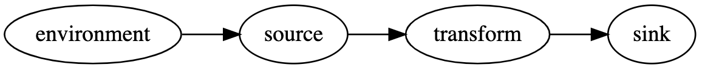

## Environment

**getExecutionEnvironment**

创建一个执行环境，表示当前执行程序的上下文。如果程序是独立调用的，则此方法返回本地执行环境；如果从命令行客户端调用程序以提交到集群，则此方法返回此集群的执行环境，也就是说，getExecutionEnvironment会根据查询运行的方式决定返回什么样的运行环境，是最常用的一种创建执行环境的方式。

```scala
// 获取执行环境
val env: ExecutionEnvironment = StreamExecutionEnvironment
  .getExecutionEnvironment
// 设置流的时间为Event Time
env.setStreamTimeCharacteristic(TimeCharacteristic.EventTime)
// 设置并行度为1，如果不设置，那么默认为当前机器的cpu的数量
env.setParallelism(1)
```

## Source

从批读取数据

```scala
// 传感器id，时间戳，温度
case class SensorReading(
  id: String,
  timestamp: Long,
  temperature: Double
)

val stream = env
  .fromCollection(List(
    SensorReading("sensor_1", 1547718199, 35.80018327300259),
    SensorReading("sensor_6", 1547718199, 15.402984393403084),
    SensorReading("sensor_7", 1547718199, 6.720945201171228),
    SensorReading("sensor_10", 1547718199, 38.101067604893444)
  ))
```

从文件读取数据

```scala
val stream = env.readTextFile(filePath)
```

以Kafka消息队列的数据为数据来源

```scala
val properties = new Properties()
properties.setProperty("bootstrap.servers", "localhost:9092")
properties.setProperty("group.id", "consumer-group")
properties.setProperty("key.deserializer", "org.apache.kafka.common.serialization.StringDeserializer")
properties.setProperty("value.deserializer", "org.apache.kafka.common.serialization.StringDeserializer")
properties.setProperty("auto.offset.reset", "latest")
val env = StreamExecutionEnvironment.getExecutionEnvironment
env.setStreamTimeCharacteristic(TimeCharacteristic.EventTime)
env.setParallelism(1)
val stream = env
  // source为来自Kafka的数据，这里我们实例化一个消费者，topic为hotitems
  .addSource(new FlinkKafkaConsumer[String]("hotitems", new SimpleStringSchema(), properties))
```

我们也可以自定义Source，这里举一个例子。

```scala
import java.util.Calendar

import org.apache.flink.streaming.api.functions.source.RichParallelSourceFunction
import org.apache.flink.streaming.api.functions.source.SourceFunction.SourceContext

import scala.util.Random

/**
  * Flink SourceFunction to generate SensorReadings with random temperature values.
  *
  * Each parallel instance of the source simulates 10 sensors which emit one sensor
  * reading every 100 ms.
  *
  * Note: This is a simple data-generating source function that does not checkpoint its state.
  * In case of a failure, the source does not replay any data.
  */

// 传感器id，时间戳，温度
case class SensorReading(id: String, timestamp: Long, temperature: Double)

// 需要extends RichParallelSourceFunction, 泛型为SensorReading
class SensorSource extends RichParallelSourceFunction[SensorReading] {

  // flag indicating whether source is still running.
  // flag: 表示数据源是否还在正常运行
  var running: Boolean = true

  /** run() continuously emits SensorReadings by emitting them through the SourceContext. */
  // run()函数连续的发送SensorReading数据，使用SourceContext
  // 需要override
  override def run(srcCtx: SourceContext[SensorReading]): Unit = {

    // initialize random number generator
    // 初始化随机数发生器
    val rand = new Random()
    // look up index of this parallel task
    // 查找当前运行时上下文的任务的索引
    val taskIdx = this.getRuntimeContext.getIndexOfThisSubtask

    // initialize sensor ids and temperatures
    // 初始化10个(温度传感器的id, 温度值)元组
    var curFTemp = (1 to 10).map {
      // nextGaussian产生高斯随机数
      i => ("sensor_" + (taskIdx * 10 + i), 65 + (rand.nextGaussian() * 20))
    }

    // emit data until being canceled
    // 无限循环，产生数据流
    while (running) {

      // update temperature
      // 更新温度
      curFTemp = curFTemp.map( t => (t._1, t._2 + (rand.nextGaussian() * 0.5)) )
      // get current time
      // 获取当前时间戳
      val curTime = Calendar.getInstance.getTimeInMillis

      // emit new SensorReading
      // 发射新的传感器数据, 注意这里srcCtx.collect
      curFTemp.foreach( t => srcCtx.collect(SensorReading(t._1, curTime, t._2)))

      // wait for 100 ms
      Thread.sleep(100)
    }

  }

  /** Cancels this SourceFunction. */
  // override cancel函数
  override def cancel(): Unit = {
    running = false
  }

}
```

使用方法

```scala
// ingest sensor stream
val sensorData: DataStream[SensorReading] = env
  // SensorSource generates random temperature readings
  .addSource(new SensorSource)
```

## Basic Transformations(基本转换算子)

### map


我们需要实现接口**MapFunction}

```text
// T: the type of input elements
// O: the type of output elements
MapFunction[T, O]
    > map(T): O
```

例如

```scala
val readings: DataStream[SensorReading] = ...
val sensorIds: DataStream[String] = readings.map(new MyMapFunction)

class MyMapFunction extends MapFunction[SensorReading, String] {
  override def map(r: SensorReading): String = r.id
}
```

上面的代码实现了将SensorReading的id抽取出来的操作, 当然我们更推荐匿名函数的写法。

```scala
val readings: DataStream[SensorReading] = ...
val sensorIds: DataStream[String] = readings.map(r => r.id)
```

### flatMap

flatMap的函数签名：

```scala
def flatMap[A,B](as: List[A])(f: A => List[B]): List[B]
```

, 例如:

```scala
flatMap(List(1,2,3))(i => List(i,i))
```

结果是List(1,1,2,2,3,3),

```scala
List("a b", "c d").flatMap(line => line.split(" "))
```

结果是List(a, b, c, d)。

我们需要实现`FlatMapFunction`接口

```text
// T: the type of input elements
// O: the type of output elements
FlatMapFunction[T, O]
    > flatMap(T, Collector[O]): Unit
```


白框不变，黑框复制，灰框过滤

flatmap类似map，但可以生成0个或者1个或者多个数据, 所以最后需要一个集合Collector来收集输出数据

flatmap可以实现map和filter

```scala
def filterViaFlatMap[A](l: List[A])(f: A => Boolean): List[A] =
  flatMap(l)(a => if (f(a)) List(a) else Nil)
```

```scala
val sentences: DataStream[String] = ...
val words: DataStream[String] = sentences
  .flatMap(id => id.split(" "))
```

### Filter

我们需要实现接口`FilterFunction`

```text
// T: the type of elements
FilterFunction[T]
    > filter(T): Boolean
```

例如, 过滤出温度大于等于25度的传感器数据

```scala
val readings: DataStream[SensorReadings] = ...
val filteredSensors = readings
    .filter( r =>  r.temperature >= 25 )
```

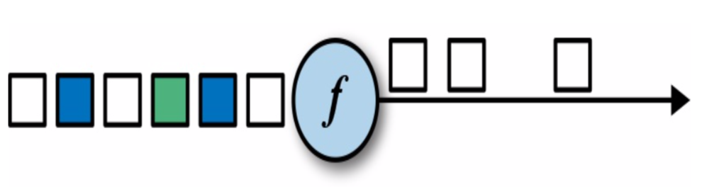

## KeyedStream Transformations(键控流转换算子)

### keyBy

分流算子, 流的类型改变了

DataStream -> KeyedStream


黑色去一条流，剩下的去另一条流

```scala
// 以数据的id为key分流
stream.keyBy(r => r.id)
// 以case class的word字段为key分流
stream.keyBy("word")
// 以Tuple的第0个元素为key分流
stream.keyBy(0)
```

### Rolling Aggregations

针对KeyedStream的每一条流做聚合

- sum()
- min()
- max()
- minBy()
- maxBy()

```scala
val inputStream: DataStream[(Int, Int, Int)] = env.fromElements(
  (1, 2, 2), (2, 3, 1), (2, 2, 4), (1, 5, 3))

val resultStream: DataStream[(Int, Int, Int)] = inputStream
  .keyBy(0) // key on first field of the tuple
  .sum(1)   // sum the second field of the tuple in place
```

### Reduce

我们需要实现`ReduceFunction`接口

```text
// T: the element type
ReduceFunction[T]
    > reduce(T, T): T
}
```

流的类型转换, KeyedStream -> DataStream：一个分组数据流的聚合操作，合并当前的元素和上次聚合的结果，产生一个新的值，返回的流中包含每一次聚合的结果，而不是只返回最后一次聚合的最终结果。

```scala
val inputStream: DataStream[(String, List[String])] = env.fromElements(
  ("en", List("tea")), ("fr", List("vin")), ("en", List("cake")))

val resultStream: DataStream[(String, List[String])] = inputStream
  .keyBy(0)
  .reduce((x, y) => (x._1, x._2 ::: y._2))
```

reduce匿名函数将连续两个tuple的第一个字段(key字段)继续发送出去，然后将两个tuple的第二个字段List[String]连接。

## Multistream Transformations(多流转换算子)

### Union


将事件类型相同的多条DataStream合并到一起，在进入到合流时，使用FIFO先进先出的原则。Union算子不会对事件的顺序做处理。

```scala
val parisStream: DataStream[SensorReading] = ...
val tokyoStream: DataStream[SensorReading] = ...
val rioStream: DataStream[SensorReading] = ...
val allCities: DataStream[SensorRreading] = parisStream
  .union(tokyoStream, rioStream)
```

### Connect, Comap and Coflatmap

联合两条流的事件是非常常见的流处理需求。例如监控一片森林然后发出高危的火警警报。报警的Application接收两条流，一条是温度传感器传回来的数据，一条是烟雾传感器传回来的数据。当两条流都超过各自的阈值时，报警。

DataStream.connect()方法就实现了这个功能。流的类型转换: DataStream -> ConnectedStreams。

```scala
// first stream
val first: DataStream[Int] = ...
// second stream
val second: DataStream[String] = ...

// connect streams
val connected: ConnectedStreams[Int, String] =
first.connect(second)
```

ConnectedStream提供了map和flatMap方法。

- map: 需要CoMapFunction作为参数
- flatMap: 需要CoFlatMapFunction作为参数

CoMapFunction和CoFlatMapFunction都需要两条输入流的类型，还需要输出流的类型，还需要定义两个方法，一个方法对应一条流。map1()和flatMap1()处理第一条流，map2()和flatMap2()处理第二条流。

```text
// IN1: 第一条流的事件类型
// IN2: 第二条流的事件类型
// OUT: 输出流的事件类型
CoMapFunction[IN1, IN2, OUT]
    > map1(IN1): OUT
    > map2(IN2): OUT

CoFlatMapFunction[IN1, IN2, OUT]
    > flatMap1(IN1, Collector[OUT]): Unit
    > flatMap2(IN2, Collector[OUT]): Unit
```

两条流直接connect，其实是没有意义的。因为我们相当于将两条流随机的合并成了一条流，结果没什么价值。为了获得确定性的结果，connect必须和keyBy或者broadcast一起使用。

**keyBy**

以两条流的事件的第一个元素为key，做连接join

```scala
val one: DataStream[(Int, Long)] = ...
val two: DataStream[(Int, String)] = ...

// keyBy two connected streams
val keyedConnect1: ConnectedStreams[(Int, Long), (Int, String)] = one
  .connect(two)
  .keyBy(0, 0) // key both input streams on first attribute

// alternative: connect two keyed streams
val keyedConnect2: ConnectedStreams[(Int, Long), (Int, String)] = one.keyBy(0)
  .connect(two.keyBy(0))
```

无论使用keyBy()算子操作ConnectedStreams还是使用connect()算子连接两条KeyedStreams，connect()算子会将两条流的含有相同Key的所有事件都发送到相同的算子。两条流的key必须是一样的类型和值，就像SQL中的JOIN。select * from A join B on A.id=B.id。connect()算子操作以后的Keyed Streams可以访问keyed state状态。

**broadcast**

```scala
val first: DataStream[(Int, Long)] = ...
val second: DataStream[(Int, String)] = ...

// connect streams with broadcast
val keyedConnect: ConnectedStreams[(Int, Long), (Int, String)] = first
  // broadcast second input stream
  .connect(second.broadcast())
```

上面的例子显示了如何将一条为分流的数据流和一条广播流进行连接。

被广播的流中的所有事件都将被复制并发送到接下来的Process Function的所有的并行算子实例中去，未被广播的流直接向前发送。

一条流如果broadcast, 将会广播到所有的分布式节点，如果不广播，将会向前发送，并不会广播。

```text
详细请参考: https://www.ververica.com/blog/a-practical-guide-to-broadcast-state-in-apache-flink
```

### Split and Select

Split是Union的反函数。

```text
// IN: the type of the split elements
OutputSelector[IN]
    > select(IN): Iterable[String]
```


流的类型转换: DataStream -> SplitStream

```scala
val inputStream: DataStream[(Int, String)] = ...

val splitted: SplitStream[(Int, String)] = inputStream
  .split(t => if (t._1 > 1000) Seq("large") else Seq("small"))

val large: DataStream[(Int, String)] = splitted.select("large")
val small: DataStream[(Int, String)] = splitted.select("small")
val all: DataStream[(Int, String)] = splitted.select("small", "large")
```

Connect与Union区别：

- Union之前两个流的类型必须是一样，Connect可以不一样，在之后的CoMapFunction中再去调整成为一样的。
- Connect只能操作两个流，Union可以操作多个。

## 支持的数据类型

### Primitives(基础数据类型)

所有的基础数据类型都支持，Int, Double, Long, String, ...

```scala
val numbers: DataStream[Long] = env.fromElements(1L, 2L, 3L, 4L)
numbers.map( n => n + 1 )
```

### Tuples

```scala
val persons: DataStream[(String, Integer)] =
env.fromElements(
  ("Adam", 17),
  ("Sarah", 23)
)

persons.filter(p => p._2 > 18)
```

### Scala case classes

```scala
case class Person(name: String, age: Int)

val persons: DataStream[Person] = env.fromElements(
  Person("Adam", 17),
  Person("Sarah", 23)
)

persons.filter(p => p.age > 18)
```

### others

- Hadoop Writable types
- Java's POJOs, ArrayList, HashMap, Enum
- ...

## keyBy相关用法

```scala
val input: DataStream[(Int, String, Long)] = ...
val keyed = input.keyBy(1)
val keyed2 = input.keyBy(1, 2)
```

```scala
case class SensorReading(
  id: String,
  timestamp: Long,
  temperature: Double
)

val sensorStream: DataStream[SensorReading] = ...
val keyedSensors = sensorStream.keyBy("id")
```

```scala
val input: DataStream[(Int, String, Long)] = ...
val keyed1 = input.keyBy("2") // key by 3rd field
val keyed2 = input.keyBy("_1") // key by 1st field
```

```scala
case class Address (
  address: String,
  zip: String,
  country: String
)

case class Person (
  name: String,
  birthday: (Int, Int, Int), // year, month, day
  address: Address
)

val persons: DataStream[Person] = ...
persons.keyBy("address.zip") // key by nested POJO field
persons.keyBy("birthday._1") // key by field of nested tuple
persons.keyBy("birthday._") // key by all fields of nested tuple
```

```scala
val sensorData: DataStream[SensorReading] = ...
val byId: KeyedStream[SensorReading, String] = sensorData.keyBy(r => r.id)
```

```scala
val input: DataStream[(Int, Int)] = ...
val keyedStream = input.keyBy(value => math.max(value._1, value._2))
```

## 实现UDF函数，更细粒度的控制流

### Function Classes

Flink暴露了所有udf函数的接口(实现方式为接口或者抽象类)。例如MapFunction, FilterFunction, ProcessFunction等等。

例子实现了FilterFunction接口

```scala
class FilterFilter extends FilterFunction[String] {
  override def filter(value: String): Boolean = {
    value.contains("flink")
  }
}

val flinkTweets = tweets.filter(new FlinkFilter)
```

还可以将函数实现成匿名类

```scala
val flinkTweets = tweets.filter(
  new RichFilterFunction[String] {
    override def filter(value: String): Boolean = {
      value.contains("flink")
    }
  }
)
```

我们filter的字符串"flink"还可以当作参数传进去。

```scala
val tweets: DataStream[String] = ...
val flinkTweets = tweets.filter(new KeywordFilter("flink"))

class KeywordFilter(keyWord: String) extends FilterFunction[String] {
  override def filter(value: String): Boolean = {
    value.contains(keyWord)
  }
}
```

### Lambda Functions

```scala
val tweets: DataStream[String] = ...
val flinkTweets = tweets.filter(_.contains("flink"))
```

### Rich Functions

- RichMapFunction
- RichFlatMapFunction
- RichFilterFunction
- ...

所有Flink提供的Function都有Rich版本，提供了更丰富的功能。

Rich Function有一个生命周期的概念

- open()方法是rich function的初始化方法，当一个算子例如map或者filter被调用之前open()会被调用。
- close()方法是生命周期中的最后一个调用的方法，做一些清理工作。
- getRuntimeContext()方法提供了函数的RuntimeContext的一些信息，例如函数执行的并行度，任务的名字，以及state状态

```scala
class MyFlatMap extends RichFlatMapFunction[Int, (Int, Int)] {
  var subTaskIndex = 0

  override def open(configuration: Configuration): Unit = {
    subTaskIndex = getRuntimeContext.getIndexOfThisSubtask
    // 做一些初始化工作
    // 例如建立一个和HDFS的连接
  }

  override def flatMap(in: Int, out: Collector[(Int, Int)]): Unit = {
    if (in % 2 == subTaskIndex) {
      out.collect((subTaskIndex, in))
    }
  }

  override def close(): Unit = {
    // 清理工作，断开和HDFS的连接。
  }
}
```

## Sink

Flink没有类似于Spark中foreach方法，让用户进行迭代的操作。所有对外的输出操作都要利用Sink完成。最后通过类似如下方式完成整个任务最终输出操作。

```scala
stream.addSink(new MySink(xxxx))
```

官方提供了一部分的框架的sink。除此以外，需要用户自定义实现sink。

### Elasticsearch

```xml
<dependency>
    <groupId>org.apache.flink</groupId>
    <artifactId>flink-connector-elasticsearch6_${scala.binary.version}</artifactId>
    <version>${flink.version}</version>
</dependency>
```

```scala
package com.atguigu

import org.apache.flink.streaming.api.scala.StreamExecutionEnvironment
import org.apache.flink.streaming.connectors.elasticsearch.ElasticsearchSinkFunction
import org.apache.flink.streaming.connectors.elasticsearch6.ElasticsearchSink
import org.apache.http.HttpHost
import org.elasticsearch.action.index.IndexRequest
import org.elasticsearch.client.Requests
import org.apache.flink.api.common.functions.RuntimeContext
import org.apache.flink.streaming.connectors.elasticsearch.RequestIndexer

import org.apache.flink.streaming.api.scala._

object StreamingJob {
  def main(args: Array[String]): Unit = {
    val env = StreamExecutionEnvironment.getExecutionEnvironment
    env.setParallelism(1)

    val stream = env.fromCollection(List(
      "a",
      "b"
    ))

    val httpHosts = new java.util.ArrayList[HttpHost]
    httpHosts.add(new HttpHost("127.0.0.1", 9200, "http"))

    val esSinkBuilder = new ElasticsearchSink.Builder[String](
      httpHosts,
      new ElasticsearchSinkFunction[String] {
        def createIndexRequest(element: String): IndexRequest = {
          val json = new java.util.HashMap[String, String]
          json.put("data", element)

          Requests.indexRequest()
                  .index("my-index")
                  .`type`("my-type")
                  .source(json)
        }

        override def process(element: String, ctx: RuntimeContext, indexer: RequestIndexer): Unit = {
          indexer.add(createIndexRequest(element))
        }
      }
    )

    // finally, build and add the sink to the job's pipeline
    stream.addSink(esSinkBuilder.build)

    env.execute
  }

}
```

## Distribution Transformations(分布式转换算子)

**Random**

随机数据交换由DataStream.shuffle()方法实现。shuffle方法将数据随机的分配到并行的任务中去。

**Round-Robin**

Round-Robin是一种负载均衡算法。可以将数据平均分配到并行的任务中去。

**Rescale**

rescale方法使用的也是round-robin算法，但只会将数据发送到接下来的task slots中的一部分task slots中。

**Broadcast**

broadcast方法将数据复制并发送到所有的并行任务中去。

**Global**

global方法将所有的数据都发送到下游算子的第一个并行任务中去。这个操作需要很谨慎，因为将所有数据发送到同一个task，将会对应用造成很大的压力。

**Custom**

自定义数据分配策略。

下面的例子将一条整数流做partition，使得所有的负整数都发送到第一个任务中，剩下的数随机分配。

```scala
val numbers: DataStream[(Int)] = ...
numbers.partitionCustom(myPartitioner, 0)

object myPartitioner extends Partitioner[Int] {
  val r = scala.util.Random

  override def partition(key: Int, numPartitions: Int): Int = {
    if (key < 0) 0 else r.nextInt(numPartitions)
  }
}
```

# Time与Window

## Time

在Flink的流式处理中，会涉及到时间的不同概念，如下图所示：


- Event Time：是事件创建的时间。它通常由事件中的时间戳描述，例如采集的日志数据中，每一条日志都会记录自己的生成时间，Flink通过时间戳分配器访问事件时间戳。
- Ingestion Time：是数据进入Flink的时间。
- Processing Time：是每一个执行基于时间操作的算子的本地系统时间，与机器相关，默认的时间属性就是Processing Time。

**著名的星球大战的例子**


例如，一条日志进入Flink的时间为2017-11-12 10:00:00.123，到达Window的系统时间为2017-11-12 10:00:01.234，日志的内容如下:

```text
2017-11-02 18:37:15.624 INFO Fail over to rm2
```

对于业务来说，要统计1min内的故障日志个数，哪个时间是最有意义的？—— Event Time，因为我们要根据日志的生成时间进行统计。

设置时间：

```scala
object AverageSensorReadings {
    def main(args: Array[String]) {
        val env = StreamExecutionEnvironment.getExecutionEnvironment

        env.setStreamTimeCharacteristic(TimeCharacteristic.EventTime)

        val sensorData: DataStream[SensorReading] = env.addSource(...)
    }
}
```

如果想设置为Processing Time，将TimeCharacteristic.EventTime替换为TimeCharacteristic.ProcessingTime即可。

## Window

### Window概述

Streaming流式计算是一种被设计用于处理无限数据集的数据处理引擎，而无限数据集是指一种不断增长的本质上无限的数据集，而Window是一种切割无限数据为有限块进行处理的手段。

Window是无限数据流处理的核心，Window将一个无限的Stream拆分成有限大小的”Buckets”桶，我们可以在这些桶上做计算操作。

### Window类型

Window可以分成两类：

- CountWindow：按照指定的数据条数生成一个Window，与时间无关。
- TimeWindow：按照时间生成Window。

对于TimeWindow，可以根据窗口实现原理的不同分成三类：滚动窗口(Tumbling Window)、滑动窗口(Sliding Window)和会话窗口(Session Window)。

**滚动窗口(Tumbling Windows)**

将数据依据固定的窗口长度对数据进行切片。

特点：时间对齐，窗口长度固定，没有重叠。

滚动窗口分配器将每个元素分配到一个指定窗口大小的窗口中，滚动窗口有一个固定的大小，并且不会出现重叠。例如：如果你指定了一个5分钟大小的滚动窗口，窗口的创建如下图所示：


适用场景：适合做BI统计等(做每个时间段的聚合计算)。

**滑动窗口(Sliding Windows)**

滑动窗口是固定窗口的更广义的一种形式，滑动窗口由固定的窗口长度和滑动间隔组成。

特点：时间对齐，窗口长度固定，有重叠。

滑动窗口分配器将元素分配到固定长度的窗口中，与滚动窗口类似，窗口的大小由窗口大小参数来配置，另一个窗口滑动参数控制滑动窗口开始的频率。因此，滑动窗口如果滑动参数小于窗口大小的话，窗口是可以重叠的，在这种情况下元素会被分配到多个窗口中。

例如，你有10分钟的窗口和5分钟的滑动，那么每个窗口中5分钟的窗口里包含着上个10分钟产生的数据，如下图所示：


适用场景：对最近一个时间段内的统计(求某接口最近5min的失败率来决定是否要报警)。

**会话窗口(Session Windows)**

由一系列事件组合一个指定时间长度的timeout间隙组成，类似于web应用的session，也就是一段时间没有接收到新数据就会生成新的窗口。

特点：时间无对齐。

session窗口分配器通过session活动来对元素进行分组，session窗口跟滚动窗口和滑动窗口相比，不会有重叠和固定的开始时间和结束时间的情况，相反，当它在一个固定的时间周期内不再收到元素，即非活动间隔产生，那个这个窗口就会关闭。一个session窗口通过一个session间隔来配置，这个session间隔定义了非活跃周期的长度，当这个非活跃周期产生，那么当前的session将关闭并且后续的元素将被分配到新的session窗口中去。

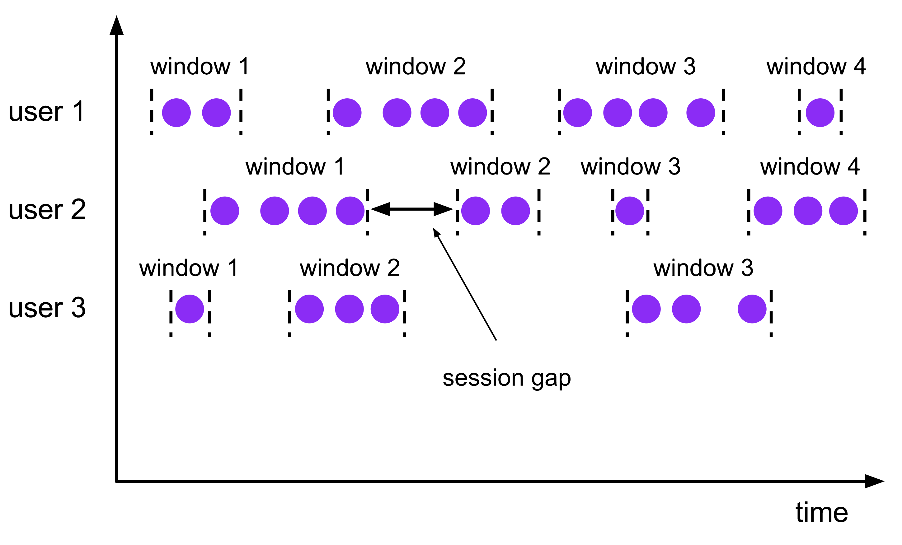

## Window API

**TimeWindow**

TimeWindow是将指定时间范围内的所有数据组成一个Window，一次对一个Window里面的所有数据进行计算。

**滚动窗口**

Flink默认的时间窗口根据Processing Time进行窗口的划分，将Flink获取到的数据根据进入Flink的时间划分到不同的窗口中。

```scala
// 每个传感器每个滚动窗口(15s)的最小温度值
val minTempPerWindow: DataStream[(String, Double)] = sensorData
  .map(r => (r.id, r.temperature))
  // 按照传感器id分流
  .keyBy(_._1)
  .timeWindow(Time.seconds(15))
  .reduce((r1, r2) => (r1._1, r1._2.min(r2._2))
```

时间间隔可以通过Time.milliseconds(x)，Time.seconds(x)，Time.minutes(x)等其中的一个来指定。

**滑动窗口**

滑动窗口和滚动窗口的函数名是完全一致的，只是在传参数时需要传入两个参数，一个是window_size，一个是sliding_size。

下面代码中的sliding_size设置为了5s，也就是说，窗口每5s就计算一次，每一次计算的window范围是15s内的所有元素。

```scala
val minTempPerWindow: DataStream[(String, Double)] = sensorData
  .map(r => (r.id, r.temperature))
  // 按照传感器id分流
  .keyBy(_._1)
  .timeWindow(Time.seconds(15), Time.seconds(5))
  .reduce((r1, r2) => (r1._1, r1._2.min(r2._2))
```

时间间隔可以通过Time.milliseconds(x)，Time.seconds(x)，Time.minutes(x)等其中的一个来指定。

# Event Time与Window

## Configure Time Characteristic

### Event Time的引入

在Flink的流式处理中，绝大部分的业务都会使用Event Time，一般只在Event Time无法使用时，才会被迫使用Processing Time或者Ingestion Time。
如果要使用Event Time，那么需要引入Event Time的时间属性，引入方式如下所示：

```scala
val env = StreamExecutionEnvironment.getExecutionEnvironment

// 从调用时刻开始给env创建的每一个stream追加时间特征
env.setStreamTimeCharacteristic(TimeCharacteristic.EventTime)
```

### Watermark

#### 基本概念

我们知道，流处理从事件产生，到流经source，再到operator，中间是有一个过程和时间的，虽然大部分情况下，流到operator的数据都是按照事件产生的时间顺序来的，但是也不排除由于网络、分布式等原因，导致乱序的产生，所谓乱序，就是指Flink接收到的事件的先后顺序不是严格按照事件的Event Time顺序排列的。


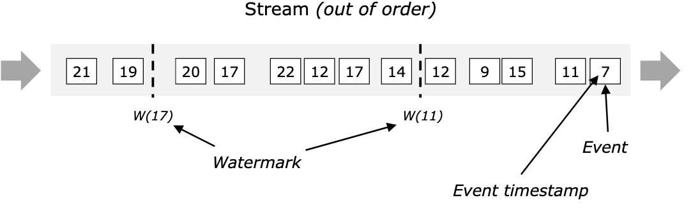

那么此时出现一个问题，一旦出现乱序，如果只根据Event Time决定Window的运行，我们不能明确数据是否全部到位，但又不能无限期的等下去，此时必须要有个机制来保证一个特定的时间后，必须触发Window去进行计算了，这个特别的机制，就是Watermark。

- Watermark是一种衡量Event Time进展的机制，它是数据本身的一个隐藏属性，数据本身携带着对应的Watermark。
- Watermark是用于处理乱序事件的，而正确的处理乱序事件，通常用Watermark机制结合Window来实现。
- 数据流中的Watermark用于表示timestamp小于Watermark的数据，都已经到达了，因此，Window的执行也是由Watermark触发的。
- Watermark可以理解成一个延迟触发机制，我们可以设置Watermark的延时时长t，每次系统会校验已经到达的数据中最大的maxEventTime，然后认定Event Time小于maxEventTime - t的所有数据都已经到达，如果有窗口的停止时间等于maxEventTime – t，那么这个窗口被触发执行。

有序流的Watermarker如下图所示：(Watermark的延时时长设置为0)

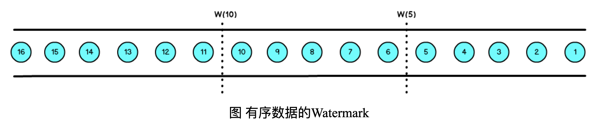

乱序流的Watermarker如下图所示：(Watermark的延时时长设置为2)


当Flink接收到每一条数据时，都会产生一条Watermark，这条Watermark就等于当前所有到达数据中的maxEventTime - 延迟时长，也就是说，Watermark是由数据携带的，一旦数据携带的Watermark比当前未触发的窗口的停止时间要晚，那么就会触发相应窗口的执行。由于Watermark是由数据携带的，因此，如果运行过程中无法获取新的数据，那么没有被触发的窗口将永远都不被触发。

上图中，我们设置的允许最大延迟到达时间为2s，所以时间戳为7s的事件对应的Watermark是5s，时间戳为12s的事件的Watermark是10s，如果我们的窗口1是1s～5s，窗口2是6s～10s，那么时间戳为7s的事件到达时的Watermarker恰好触发窗口1，时间戳为12s的事件到达时的Watermark恰好触发窗口2。

Watermark就是触发前一窗口的"关窗时间"，一旦触发关门那么以当前时刻为准在窗口范围内的所有数据都会收入窗中。

只要没有达到水位那么不管现实中的时间推进了多久都不会触发关窗。

### Watermark的引入

Event Time的使用一定要**指定数据源中的时间戳}。否则程序无法知道事件的事件时间是什么(数据源里的数据没有时间戳的话，就只能使用Processing Time了)。

Flink暴露了TimestampAssigner接口供我们实现，使我们可以自定义如何从事件数据中抽取时间戳。

```scala
val env = StreamExecutionEnvironment.getExecutionEnvironment

// 从调用时刻开始给env创建的每一个stream追加时间特征
env.setStreamTimeCharacteristic(TimeCharacteristic.EventTime)

val readings: DataStream[SensorReading] = env
  .addSource(new SensorSource)
  .assignTimestampsAndWatermarks(new MyAssigner())
```

MyAssigner有两种类型

- AssignerWithPeriodicWatermarks
- AssignerWithPunctuatedWatermarks

以上两个接口都继承自TimestampAssigner。

**Assigner with periodic watermarks**

周期性的生成水印：系统会周期性的将水印插入到流中(水印也是一种特殊的事件!)。默认周期是200毫秒。可以使用ExecutionConfig.setAutoWatermarkInterval()方法进行设置。

```scala
val env = StreamExecutionEnvironment.getExecutionEnvironment
env.setStreamTimeCharacteristic(TimeCharacteristic.EventTime)
// 每隔5秒产生一个水印
env.getConfig.setAutoWatermarkInterval(5000)
```

产生水印的逻辑：每隔5秒钟，Flink会调用AssignerWithPeriodicWatermarks的getCurrentWatermark()方法。如果方法返回一个时间戳大于之前水印的时间戳，新的水印会被插入到流中。这个检查保证了水印是单调递增的。如果方法返回的时间戳小于等于之前水印的时间戳，则不会产生新的水印。

例子，自定义一个周期性的时间戳抽取

```scala
class PeriodicAssigner extends AssignerWithPeriodicWatermarks[SensorReading] {
  val bound: Long = 60 * 1000 // 延时为1分钟
  var maxTs: Long = Long.MinValue // 观察到的最大时间戳

  override def getCurrentWatermark: Watermark = {
    new Watermark(maxTs - bound)
  }

  override def extractTimestamp(r: SensorReading, previousTS: Long) = {
    maxTs = maxTs.max(r.timestamp)
    r.timestamp
  }
}
```

如果我们事先得知数据流的时间戳是单调递增的，也就是说没有乱序。我们可以使用assignAscendingTimestamps，方法会直接使用数据的时间戳生成水印。

```scala
val stream: DataStream[SensorReading] = ...
val withTimestampsAndWatermarks = stream
  .assignAscendingTimestamps(e => e.timestamp)
```

```text
E(1), W(1), E(2), W(2), ...
```

如果我们能大致估算出数据流中的事件的最大延迟时间，可以使用如下代码

```scala
val stream: DataStream[SensorReading] = ...
val withTimestampsAndWatermarks = stream.assignTimestampsAndWatermarks(
  new SensorTimeAssigner
)

class SensorTimeAssigner
  extends BoundedOutOfOrdernessTimestampExtractor[SensorReading](Time.seconds(5)) {

  // 抽取时间戳
  override def extractTimestamp(r: SensorReading): Long = r.timestamp
}
```

```text
E(10), W(0), E(8), E(7), E(11), W(1), ...
```

**Assigner with punctuated watermarks**

直接上代码，只给sensor_1的传感器的数据流插入水印

```scala
class PunctuatedAssigner extends AssignerWithPunctuatedWatermarks[SensorReading] {
  val bound: Long = 60 * 1000

  override def checkAndGetNextWatermark(r: SensorReading, extractedTS: Long): Watermark = {
    if (r.id == "sensor_1") {
      new Watermark(extractedTS - bound)
    } else {
      null
    }
  }

  override def extractTimestamp(r: SensorReading, previousTS: Long): Long = {
    r.timestamp
  }
}
```

在Flink中，水印由应用程序开发人员生成，这通常需要对相应的领域有一定的了解。完美的水印永远不会错：时间戳小于水印标记时间的事件不会再出现。在特殊情况下(例如非乱序事件流)，最近一次事件的时间戳就可能是完美的水印。启发式水印则相反，它只估计时间，因此有可能出错，即迟到的事件(其时间戳小于水印标记时间)晚于水印出现。针对启发式水印，Flink提供了处理迟到元素的机制。

设定水印通常需要用到领域知识。举例来说，如果知道事件的迟到时间不会超过5秒，就可以将水印标记时间设为收到的最大时间戳减去5秒。另一种做法是，采用一个Flink作业监控事件流，学习事件的迟到规律，并以此构建水印生成模型。

如果水印迟到得太久，收到结果的速度可能就会很慢，解决办法是在水印到达之前输出近似结果(Flink可以实现)。如果水印到达得太早，则可能收到错误结果，不过Flink处理迟到数据的机制可以解决这个问题。上述问题看起来很复杂，但是恰恰符合现实世界的规律——大部分真实的事件流都是乱序的，并且通常无法了解它们的乱序程度(因为理论上不能预见未来)。水印是唯一让我们直面乱序事件流并保证正确性的机制; 否则只能选择忽视事实，假装错误的结果是正确的。

## Process Function(Low-Level API)

我们之前学习的转换算子是无法访问事件的时间戳信息和水印信息的。而这在一些应用场景下，极为重要。例如MapFunction这样的map转换算子就无法访问时间戳或者当前事件的事件时间。

基于此，DataStream API提供了一系列的Low-Level转换算子。可以访问时间戳、水印以及注册定时事件。还可以输出特定的一些事件，例如超时事件等。Process Function用来构建事件驱动的应用以及实现自定义的业务逻辑(使用之前的window函数和转换算子无法实现)。例如，Flink-SQL就是使用Process Function实现的。

Flink提供了8个Process Function：

- ProcessFunction
- KeyedProcessFunction
- CoProcessFunction
- ProcessJoinFunction
- BroadcastProcessFunction
- KeyedBroadcastProcessFunction
- ProcessWindowFunction
- ProcessAllWindowFunction

重点介绍KeyedProcessFunction

KeyedProcessFunction用来操作KeyedStream。KeyedProcessFunction会处理流的每一个元素，输出为0个、1个或者多个元素。所有的Process Function都继承自RichFunction接口，所以都有open()、close()和getRuntimeContext()等方法。而KeyedProcessFunction[KEY, IN, OUT]还额外提供了两个方法:

- processElement(v: IN, ctx: Context, out: Collector[OUT]), 流中的每一个元素都会调用这个方法，调用结果将会放在Collector数据类型中输出。Context可以访问元素的时间戳，元素的key，以及TimerService时间服务。Context还可以将结果输出到别的流(side outputs)。
- onTimer(timestamp: Long, ctx: OnTimerContext, out: Collector[OUT])是一个回调函数。当之前注册的定时器触发时调用。参数timestamp为定时器所设定的触发的时间戳。Collector为输出结果的集合。OnTimerContext和processElement的Context参数一样，提供了上下文的一些信息，例如firing trigger的时间信息(事件时间或者处理时间)。

### TimerService and Timers

Context和OnTimerContext所持有的TimerService对象拥有以下方法:

- currentProcessingTime(): Long 返回当前处理时间
- currentWatermark(): Long 返回当前水印的时间戳
- registerProcessingTimeTimer(timestamp: Long): Unit 会注册当前key的processing time的timer。当processing time到达定时时间时，触发timer。
- registerEventTimeTimer(timestamp: Long): Unit 会注册当前key的event time timer。当水印大于等于定时器注册的时间时，触发定时器执行回调函数。
- deleteProcessingTimeTimer(timestamp: Long): Unit 删除之前注册处理时间定时器。如果没有这个时间戳的定时器，则不执行。
- deleteEventTimeTimer(timestamp: Long): Unit 删除之前注册的事件时间定时器，如果没有此时间戳的定时器，则不执行。

当定时器timer触发时，执行回调函数onTimer()。

>定时器timer只能在keyed streams上面使用。

举个例子说明KeyedProcessFunction如何操作KeyedStream。

需求：监控温度传感器的温度值，如果温度值在一秒钟之内(processing time)连续上升，报警。

```scala
val warnings = readings
  // key by sensor id
  .keyBy(_.id)
  // apply ProcessFunction to monitor temperatures
  .process(new TempIncreaseAlertFunction)
```

看一下TempIncreaseAlertFunction如何实现, 程序中使用了ValueState这样一个状态变量, 后面会详细讲解。

```scala
class TempIncreaseAlertFunction extends KeyedProcessFunction[String, SensorReading, String] {
  // 保存上一个传感器温度值
  lazy val lastTemp: ValueState[Double] = getRuntimeContext.getState(
    new ValueStateDescriptor[Double]("lastTemp", Types.of[Double])
  )

  // 保存注册的定时器的时间戳
  lazy val currentTimer: ValueState[Long] = getRuntimeContext.getState(
    new ValueStateDescriptor[Long]("timer", Types.of[Long])
  )

  override def processElement(r: SensorReading,
                              ctx: KeyedProcessFunction[String, SensorReading, String]#Context,
                              out: Collector[String]): Unit = {
    // get previous temperature
    // 取出上一次的温度
    val prevTemp = lastTemp.value()
    // update last temperature
    // 将当前温度更新到上一次的温度这个变量中
    lastTemp.update(r.temperature)

    val curTimerTimestamp = currentTimer.value()
    if (prevTemp == 0.0 || r.temperature < prevTemp) {
      // temperature decreased; delete current timer
      // 温度下降或者是第一个温度值，删除定时器
      ctx.timerService().deleteProcessingTimeTimer(curTimerTimestamp)
      // 清空状态变量
      currentTimer.clear()
    } else if (r.temperature > prevTemp && curTimerTimestamp == 0) {
      // temperature increased and we have not set a timer yet
      // set processing time timer for now + 1 second
      // 温度上升且我们并没有设置定时器
      val timerTs = ctx.timerService().currentProcessingTime() + 1000
      ctx.timerService().registerProcessingTimeTimer(timerTs)
      // remember current timer
      currentTimer.update(timerTs)
    }
  }

  override def onTimer(ts: Long,
                       ctx: KeyedProcessFunction[String, SensorReading, String]#OnTimerContext,
                       out: Collector[String]): Unit = {
    out.collect("传感器id为: " + ctx.getCurrentKey + "的传感器温度值已经连续1s上升了。")
    currentTimer.clear()
  }
}
```

### Emitting to Side Outputs(侧输出)

大部分的DataStream API的算子的输出是单一输出，也就是某种数据类型的流。除了split算子，可以将一条流分成多条流，这些流的数据类型也都相同。process function的side outputs功能可以产生多条流，并且这些流的数据类型可以不一样。一个side output可以定义为OutputTag[X]对象，X是输出流的数据类型。process function可以通过Context对象发射一个事件到一个或者多个side outputs。

例子

```scala
val monitoredReadings: DataStream[SensorReading] = readings
  .process(new FreezingMonitor)

monitoredReadings
  .getSideOutput(new OutputTag[String]("freezing-alarms"))
  .print()

readings.print()
```

接下来我们实现FreezingMonitor函数，用来监控传感器温度值，将温度值低于32F的温度输出到side output。

```scala
class FreezingMonitor extends ProcessFunction[SensorReading, SensorReading] {
  // define a side output tag
  // 定义一个侧输出标签
  lazy val freezingAlarmOutput: OutputTag[String] =
    new OutputTag[String]("freezing-alarms")

  override def processElement(r: SensorReading,
                              ctx: ProcessFunction[SensorReading, SensorReading]#Context,
                              out: Collector[SensorReading]): Unit = {
    // emit freezing alarm if temperature is below 32F
    if (r.temperature < 32.0) {
      ctx.output(freezingAlarmOutput, s"Freezing Alarm for ${r.id}")
    }
    // forward all readings to the regular output
    out.collect(r)
  }
}
```

### CoProcessFunction

对于两条输入流，DataStream API提供了CoProcessFunction这样的low-level操作。CoProcessFunction提供了操作每一个输入流的方法: processElement1()和processElement2()。类似于ProcessFunction，这两种方法都通过Context对象来调用。这个Context对象可以访问事件数据，定时器时间戳，TimerService，以及side outputs。CoProcessFunction也提供了onTimer()回调函数。下面的例子展示了如何使用CoProcessFunction来合并两条流。

```scala
// ingest sensor stream
val readings: DataStream[SensorReading] = ...

// filter switches enable forwarding of readings
val filterSwitches: DataStream[(String, Long)] = env
  .fromCollection(Seq(
    ("sensor_2", 10 * 1000L),
    ("sensor_7", 60 * 1000L)
  ))

val forwardedReadings = readings
  // connect readings and switches
  .connect(filterSwitches)
  // key by sensor ids
  .keyBy(_.id, _._1)
  // apply filtering CoProcessFunction
  .process(new ReadingFilter)
```

```scala
class ReadingFilter extends CoProcessFunction[SensorReading, (String, Long), SensorReading] {
  // switch to enable forwarding
  // 传送数据的开关
  lazy val forwardingEnabled: ValueState[Boolean] = getRuntimeContext.getState(
    new ValueStateDescriptor[Boolean]("filterSwitch", Types.of[Boolean]))

  // hold timestamp of currently active disable timer
  lazy val disableTimer: ValueState[Long] = getRuntimeContext.getState(new ValueStateDescriptor[Long]("timer", Types.of[Long]))

  override def processElement1(reading: SensorReading,
                               ctx: CoProcessFunction[SensorReading, (String, Long), SensorReading]#Context,
                               out: Collector[SensorReading]): Unit = {
    // check if we may forward the reading
    // 决定我们是否要将数据继续传下去
    if (forwardingEnabled.value()) {
      out.collect(reading)
    }
  }

  override def processElement2(switch: (String, Long),
                               ctx: CoProcessFunction[SensorReading, (String, Long), SensorReading]#Context,
                               out: Collector[SensorReading]): Unit = {
    // enable reading forwarding
    // 允许继续传输数据
    forwardingEnabled.update(true)
    // set disable forward timer
    val timerTimestamp = ctx.timerService().currentProcessingTime() + switch._2
    val curTimerTimestamp = disableTimer.value()

    if (timerTimestamp > curTimerTimestamp) {
      // remove current timer and register new timer
      ctx.timerService().deleteEventTimeTimer(curTimerTimestamp)
      ctx.timerService().registerProcessingTimeTimer(timerTimestamp)
      disableTimer.update(timerTimestamp)
    }
  }

  override def onTimer(ts: Long,
                       ctx: CoProcessFunction[SensorReading, (String, Long), SensorReading]#OnTimerContext,
                       out: Collector[SensorReading]): Unit = {
     // remove all state; forward switch will be false by default
     forwardingEnabled.clear()
     disableTimer.clear()
  }
}
```

## Window Operators(窗口操作符)

### define window operators(定义窗口操作符)

window算子可以在keyed stream或者nokeyed stream上面使用。

创建一个window算子，需要指定两个部分：

1. window assigner定义了流的元素如何分配到window中。window assigner将会产生一条WindowedStream(或者AllWindowedStream，如果是nonkeyed DataStream的话)

2. window function用来处理WindowedStream(AllWindowedStream)中的元素。

例子：

```scala
stream
  .keyBy(...)
  .window(...)  // 指定window assigner
  .reduce/aggregate/process(...) // 指定window function

stream
  .windowAll(...) // 指定window assigner
  .reduce/aggregate/process(...) // 指定window function
```

### 内置的window assigner(窗口分配器)

#### tumbling windows(滚动窗口)

```scala
val sensorData: DataStream[SensorReading] = ...

val avgTemp = sensorData
  .keyBy(_.id)
  // group readings in 1s event-time windows
  .window(TumblingEventTimeWindows.of(Time.seconds(1)))
  .process(new TemperatureAverager)

val avgTemp = sensorData
  .keyBy(_.id)
  // group readings in 1s processing-time windows
  .window(TumblingProcessingTimeWindows.of(Time.seconds(1)))
  .process(new TemperatureAverager)

// 其实就是之前的
// shortcut for window.(TumblingEventTimeWindows.of(size))
val avgTemp = sensorData
  .keyBy(_.id)
  .timeWindow(Time.seconds(1))
  .process(new TemperatureAverager)
```

如果滚动窗口的时间长度为1小时，那么默认设定的窗口为：[00:00, 01:00), [01:00, 02:00), ...

#### sliding window(滑动窗口)

```scala
val slidingAvgTemp = sensorData
  .keyBy(_.id)
  .window(SlidingEventTimeWindows.of(Time.hours(1), Time.minutes(15)))
  .process(new TemperatureAverager)

val slidingAvgTemp = sensorData
  .keyBy(_.id)
  .window(SlidingProcessingTimeWindows.of(Time.hours(1), Time.minutes(15)))
  .process(new TemperatureAverager)

val slidingAvgTemp = sensorData
  .keyBy(_.id)
  .timeWindow(Time.hours(1), Time.minutes(15))
  .process(new TemperatureAverager)
```

#### session windows(会话窗口)

```scala
val sessionWindows = sensorData
  .keyBy(_.id)
  .window(EventTimeSessionWindows.withGap(Time.minutes(15)))
  .process(...)

val sessionWindows = sensorData
  .keyBy(_.id)
  .window(ProcessingTimeSessionWindows.withGap(Time.minutes(15)))
  .process(...)
```

### Applying Functions on Windows(在窗口上应用函数)

window functions定义了窗口中数据的计算逻辑。有两种计算逻辑：

1. 增量聚合函数(Incremental aggregation functions)：当一个事件被添加到窗口时，触发函数计算，并且更新window的状态(单个值)。最终聚合的结果将作为输出。ReduceFunction和AggregateFunction是增量聚合函数。

2. 全窗口函数(Full window functions)：这个函数将会收集窗口中所有的元素，可以做一些复杂计算。ProcessWindowFunction是window function。

#### ReduceFunction

例子: 计算每个传感器15s窗口中的温度最小值

```scala
val minTempPerWindow: DataStream[(String, Double)] = sensorData
  .map(r => (r.id, r.temperature))
  .keyBy(_._1)
  .timeWindow(Time.seconds(15))
  .reduce((r1, r2) => (r1._1, r1._2.min(r2._2)))
```

#### AggregateFunction

先来看接口定义

```java
public interface AggregateFunction<IN, ACC, OUT> extends Function, Serializable {

  // create a new accumulator to start a new aggregate
  ACC createAccumulator();

  // add an input element to the accumulator and return the accumulator
  ACC add(IN value, ACC accumulator);

  // compute the result from the accumulator and return it.
  OUT getResult(ACC accumulator);

  // merge two accumulators and return the result.
  ACC merge(ACC a, ACC b);
}
```

IN是输入元素的类型，ACC是累加器的类型，OUT是输出元素的类型。

例子

```scala
val avgTempPerWindow: DataStream[(String, Double)] = sensorData
  .map(r => (r.id, r.temperature))
  .keyBy(_._1)
  .timeWindow(Timeseconds(15))
  .aggregate(new AvgTempFunction)

// An AggregateFunction to compute the average temperature per sensor.
// The accumulator holds the sum of temperatures and an event count.
class AvgTempFunction extends AggregateFunction[(String, Double), (String, Double, Int), (String, Double)] {

  override def createAccumulator() = {
    ("", 0.0, 0)
  }

  override def add(in: (String, Double), acc: (String, Double, Int)) = {
    (in._1, in._2 + acc._2, 1 + acc._3)
  }

  override def getResult(acc: (String, Double, Int)) = {
    (acc._1, acc._2 / acc._3)
  }

  override def merge(acc1: (String, Double, Int), acc2: (String, Double, Int)) = {
    (acc1._1, acc1._2 + acc2._2, acc1._3 + acc2._3)
  }
}
```

#### ProcessWindowFunction

一些业务场景，我们需要收集窗口内所有的数据进行计算，例如计算窗口数据的中位数，或者计算窗口数据中出现频率最高的值。这样的需求，使用ReduceFunction和AggregateFunction就无法实现了。这个时候就需要ProcessWindowFunction了。

先来看接口定义

```java
public abstract class ProcessWindowFunction<IN, OUT, KEY, W extends Window> extends AbstractRichFunction {
  
  // Evaluates the window
  void process(KEY key, Context ctx, Iterable<IN> vals, Collector<OUT> out) throws Exception;

  // Deletes any custom per-window state when the window is purged
  public void clear(Context ctx) throws Exception {}

  // The context holding window metadata
  public abstract class Context implements Serializable {
    // Returns the metadata of the window
    public abstract W window();

    // Returns the current processing time
    public abstract long currentProcessingTime();

    // Returns the current event-time watermark
    public abstract long currentWatermark();

    // State accessor for per-window state
    public abstract KeyedStateStore windowState();

    // State accessor for per-key global state
    public abstract KeyedStateStore globalState();

    // Emits a record to the side output identified by the OutputTag.
    public abstract <X> void output(OutputTag<X> outputTag, X value);
  }
}
```

process()方法接受的参数为：window的key，Iterable迭代器包含窗口的所有元素，Collector用于输出结果流。Context参数和别的process方法一样。而ProcessWindowFunction的Context对象还可以访问window的元数据(窗口开始和结束时间)，当前处理时间和水印，per-window state和per-key global state，side outputs。

- per-window state: 用于保存一些信息，这些信息可以被process()访问，只要process所处理的元素属于这个窗口。
- per-key global state: 同一个key，也就是在一条KeyedStream上，不同的window可以访问per-key global state保存的值。

例子：计算5s滚动窗口中的最低和最高的温度。输出的元素包含了(流的Key, 最低温度, 最高温度, 窗口结束时间)。

```scala
val minMaxTempPerWindow: DataStream[MinMaxTemp] = sensorData
  .keyBy(_.id)
  .timeWindow(Time.seconds(5))
  .process(new HighAndLowTempProcessFunction)

case class MinMaxTemp(id: String, min: Double, max: Double, endTs: Long)

class HighAndLowTempProcessFunction extends ProcessWindowFunction[SensorReading, MinMaxTemp, String, TimeWindow] {
  override def process(key: String,
                       ctx: Context,
                       vals: Iterable[SensorReading],
                       out: Collector[MinMaxTemp]): Unit = {
    val temps = vals.map(_.temperature)
    val windowEnd = ctx.window.getEnd

    out.collect(MinMaxTemp(key, temps.min, temps.max, windowEnd))
  }
}
```

我们还可以将ReduceFunction/AggregateFunction和ProcessWindowFunction结合起来使用。ReduceFunction/AggregateFunction做增量聚合，ProcessWindowFunction提供更多的对数据流的访问权限。如果只使用ProcessWindowFunction(底层的实现为将事件都保存在ListState中)，将会非常占用空间。分配到某个窗口的元素将被提前聚合，而当窗口的trigger触发时，也就是窗口收集完数据关闭时，将会把聚合结果发送到ProcessWindowFunction中，这时Iterable参数将会只有一个值，就是前面聚合的值。

例子

```scala
input
  .keyBy(...)
  .timeWindow(...)
  .reduce(
    incrAggregator: ReduceFunction[IN],
    function: ProcessWindowFunction[IN, OUT, K, W])

input
  .keyBy(...)
  .timeWindow(...)
  .aggregate(
    incrAggregator: AggregateFunction[IN, ACC, V],
    windowFunction: ProcessWindowFunction[V, OUT, K, W])
```

我们把之前的需求重新使用以上两种方法实现一下。

```scala
case class MinMaxTemp(id: String, min: Double, max: Double, endTs: Long)

val minMaxTempPerWindow2: DataStream[MinMaxTemp] = sensorData
  .map(r => (r.id, r.temperature, r.temperature))
  .keyBy(_._1)
  .timeWindow(Time.seconds(5))
  .reduce(
    (r1: (String, Double, Double), r2: (String, Double, Double)) => {
      (r1._1, r1._2.min(r2._2), r1._3.max(r2._3))
    },
    new AssignWindowEndProcessFunction()
  )

class AssignWindowEndProcessFunction extends ProcessWindowFunction[(String, Double, Double), MinMaxTemp, String, TimeWindow] {
  override def process(key: String,
                       ctx: Context,
                       minMaxIt: Iterable[(String, Double, Double)],
                       out: Collector[MinMaxTemp]): Unit = {
    val minMax = minMaxIt.head
    val windowEnd = ctx.window.getEnd
    out.collect(MinMaxTemp(key, minMax._2, minMax._3, windowEnd))
  }
}
```

## 自定义窗口操作符(windows operators)

Flink内置的window operators分配器已经已经足够应付大多数应用场景。尽管如此，如果我们需要实现一些复杂的窗口逻辑，例如：可以发射早到的事件或者碰到迟到的事件就更新窗口的结果，或者窗口的开始和结束决定于特定事件的接收。

DataStream API暴露了接口和方法来自定义窗口操作符。

- 自定义窗口分配器
- 自定义窗口计算触发器(trigger)
- 自定义窗口数据清理功能(evictor)

当一个事件来到窗口操作符，首先将会传给WindowAssigner来处理。WindowAssigner决定了事件将被分配到哪些窗口。如果窗口不存在，WindowAssigner将会创建一个新的窗口。

如果一个window operator接受了一个增量聚合函数作为参数，例如ReduceFunction或者AggregateFunction，新到的元素将会立即被聚合，而聚合结果result将存储在window中。如果window operator没有使用增量聚合函数，那么新元素将被添加到ListState中，ListState中保存了所有分配给窗口的元素。

新元素被添加到窗口时，这个新元素同时也被传给了window的trigger。trigger定义了window何时准备好求值，何时window被清空。trigger可以基于window被分配的元素和注册的定时器来对窗口的所有元素求值或者在特定事件清空window中所有的元素。

当window operator只接收一个增量聚合函数作为参数时：

当window operator只接收一个全窗口函数作为参数时：

当window operator接收一个增量聚合函数和一个全窗口函数作为参数时：

evictor是一个可选的组件，可以被注入到ProcessWindowFunction之前或者之后调用。evictor可以清除掉window中收集的元素。由于evictor需要迭代所有的元素，所以evictor只能使用在没有增量聚合函数作为参数的情况下。

下面的代码说明了如果使用自定义的trigger和evictor定义一个window operator：

```scala
stream
  .keyBy(...)
  .window(...)
 [.trigger(...)]
 [.evictor(...)]
  .reduce/aggregate/process(...)
```

注意：每个WindowAssigner都有一个默认的trigger。

## 窗口生命周期

当WindowAssigner分配某个窗口的第一个元素时，这个窗口才会被创建。所以不存在没有元素的窗口。

一个窗口包含了如下状态：

- Window content
  - 分配到这个窗口的元素
  - 增量聚合的结果(如果window operator接收了ReduceFunction或者AggregateFunction作为参数)。
- Window object
  - WindowAssigner返回0个，1个或者多个window object。
  - window operator根据返回的window object来聚合元素。
  - 每一个window object包含一个windowEnd时间戳，来区别于其他窗口。
- 触发器的定时器：一个触发器可以注册定时事件，到了定时的时间可以执行相应的回调函数，例如：对窗口进行求值或者清空窗口。
- 触发器中的自定义状态：触发器可以定义和使用自定义的、per-window或者per-key状态。这个状态完全被触发器所控制。而不是被window operator控制。

当窗口结束时间来到，window operator将删掉这个窗口。窗口结束时间是由window object的end timestamp所定义的。无论是使用processing time还是event time，窗口结束时间是什么类型可以调用WindowAssigner.isEventTime()方法获得。

## 窗口分配器(window assigners)

WindowAssigner将会把元素分配到0个，1个或者多个窗口中去。我们看一下WindowAssigner接口：

```java
public abstract class WindowAssigner<T, W extends Window>
    implements Serializable {

  public abstract Collection<W> assignWindows(
    T element,
    long timestamp,
    WindowAssignerContext context);

  public abstract Trigger<T, W> getDefaultTriger(
    StreamExecutionEnvironment env);

  public abstract TypeSerializer<W> getWindowSerializer(
    ExecutionConfig executionConfig);

  public abstract boolean isEventTime();

  public abstract static class WindowAssignerContext {
    public abstract long getCurrentProcessingTime();
  }
}
```

WindowAssigner有两个泛型参数：

- T: 事件的数据类型
- W: 窗口的类型

下面的代码创建了一个自定义窗口分配器，是一个30秒的滚动事件时间窗口。

```scala
class ThirtySecondsWindows
    extends WindowAssigner[Object, TimeWindow] {

  val windowSize: Long = 30 * 1000L

  override def assignWindows(
    o: Object,
    ts: Long,
    ctx: WindowAssigner.WindowAssignerContext): java.util.List[TimeWindow] = {

    val startTime = ts - (ts % windowSize)
    val endTime = startTime + windowSize
    Collections.singletonList(new TimeWindow(startTime, endTime))
  }

  override def getDefaultTrigger(
    env: environment.StreamExecutionEnvironment): Trigger[Object, TimeWindow] = {
      EventTimeTrigger.create()
  }

  override def getWindowSerializer(
    executionConfig: ExecutionConfig): TypeSerializer[TimeWindow] = {
    new TimeWindow.Serializer
  }

  override def isEventTime = true
}
```

## 触发器(Triggers)

触发器定义了window何时会被求值以及何时发送求值结果。触发器可以到了特定的时间触发也可以碰到特定的事件触发。例如：观察到事件数量符合一定条件或者观察到了特定的事件。

默认的触发器将会在两种情况下触发

- 处理时间：机器时间到达处理时间
- 事件时间：水位线超过了窗口的结束时间

触发器可以访问流的时间属性以及定时器，还可以对state状态编程。所以触发器和process function一样强大。例如我们可以实现一个触发逻辑：当窗口接收到一定数量的元素时，触发器触发。再比如当窗口接收到一个特定元素时，触发器触发。还有就是当窗口接收到的元素里面包含特定模式(5秒钟内接收到了两个同样类型的事件)，触发器也可以触发。在一个事件时间的窗口中，一个自定义的触发器可以提前(在水位线没过窗口结束时间之前)计算和发射计算结果。这是一个常见的低延迟计算策略，尽管计算不完全，但不像默认的那样需要等待水位线没过窗口结束时间。

每次调用触发器都会产生一个TriggerResult来决定窗口接下来发生什么。TriggerResult可以取以下结果：

- CONTINUE：什么都不做
- FIRE：如果window operator有ProcessWindowFunction这个参数，将会调用这个ProcessWindowFunction。如果窗口仅有增量聚合函数(ReduceFunction或者AggregateFunction)作为参数，那么当前的聚合结果将会被发送。窗口的state不变。
- PURGE：窗口所有内容包括窗口的元数据都将被丢弃。
- FIRE_AND_PURGE：先对窗口进行求值，再将窗口中的内容丢弃。

TriggerResult可能的取值使得我们可以实现很复杂的窗口逻辑。一个自定义触发器可以触发多次，可以计算或者更新结果，可以在发送结果之前清空窗口。

接下来我们看一下Trigger API：

```java
public abstract class Trigger<T, W extends Window>
    implements Serializable {

  TriggerResult onElement(
    long timestamp,
    W window,
    TriggerContext ctx);

  public abstract TriggerResult onProcessingTime(
    long timestamp,
    W window,
    TriggerContext ctx);

  public abstract TriggerResult onEventTime(
    long timestamp,
    W window,
    TriggerContext ctx);
  
  public boolean canMerge();

  public void onMerge(W window, OnMergeContext ctx);

  public abstract void clear(W window, TriggerContext ctx);
}

public interface TriggerContext {

  long getCurrentProcessingTime();

  long getCurrentWatermark();

  void registerProcessingTimeTimer(long time);

  void registerEventTimeTimer(long time);

  void registerEventTimeTimer(long time);

  void deleteProcessingTimeTimer(long time);

  void deleteEventTimeTimer(long time);

  <S extends State> S getPartitionedState(
    StateDescriptor<S, ?> stateDescriptor);
}

public interface OnMergeContext extends TriggerContext {

  void mergePartitionedState(
    StateDescriptor<S, ?> stateDescriptor
  );
}
```

这里要注意两个地方：清空state和merging合并触发器。

当在触发器中使用per-window state时，这里我们需要保证当窗口被删除时state也要被删除，否则随着时间的推移，window operator将会积累越来越多的数据，最终可能使应用崩溃。

当窗口被删除时，为了清空所有状态，触发器的clear()方法需要需要删掉所有的自定义per-window state，以及使用TriggerContext对象将处理时间和事件时间的定时器都删除。

下面的例子展示了一个触发器在窗口结束时间之前触发。当第一个事件被分配到窗口时，这个触发器注册了一个定时器，定时时间为水位线之前一秒钟。当定时事件执行，将会注册一个新的定时事件，这样，这个触发器每秒钟最多触发一次。

```scala
class OneSecondIntervalTrigger
    extends Trigger[SensorReading, TimeWindow] {

  override def onElement(
    r: SensorReading,
    timestamp: Long,
    window: TimeWindow,
    ctx: Trigger.TriggerContext
  ): TriggerResult = {
    val firstSeen: ValueState[Boolean] = ctx
      .getPartitionedState(
        new ValueStateDescriptor[Boolean](
          "firstSeen", classOf[Boolean]
        )
      )

    if (!firstSeen.value()) {
      val t = ctx.getCurrentWatermark + (1000 - (ctx.getCurrentWatermark % 1000))
      ctx.registerEventTimeTimer(t)
      ctx.registerEventTimeTimer(window.getEnd)
      firstSeen.update(true)
    }

    TriggerResult.CONTINUE
  }

  override def onEventTime(
    timestamp: Long,
    window: TimeWindow,
    ctx: Trigger.TriggerContext
  ): TriggerResult = {
    if (timestamp == window.getEnd) {
      TriggerResult.FIRE_AND_PURGE
    } else {
      val t = ctx.getCurrentWatermark + (1000 - (ctx.getCurrentWatermark % 1000))
      if (t < window.getEnd) {
        ctx.registerEventTimeTimer(t)
      }
      TriggerResult.FIRE
    }
  }

  override def onProcessingTime(
    timestamp: Long,
    window: TimeWindow,
    ctx: Trigger.TriggerContext
  ): TriggerResult = {
    TriggerResult.CONTINUE
  }

  override def clear(
    window: TimeWindow,
    ctx: Trigger.TriggerContext
  ): Unit = {
    val firstSeen: ValueState[Boolean] = ctx
      .getPartitionedState(
        new ValueStateDescriptor[Boolean](
          "firstSeen", classOf[Boolean]
        )
      )
    firstSeen.clear()
  }
}
```

## EVICTORS

evictor可以在window function求值之前或者之后移除窗口中的元素。

我们看一下Evictor的接口定义：

```java
public interface Evictor<T, W extends Window>
    extends Serializable {
  void evictBefore(
    Iterable<TimestampedValue<T>> elements,
    int size,
    W window,
    EvictorContext evictorContext);

  void evictAfter(
    Iterable<TimestampedValue<T>> elements,
    int size,
    W window,
    EvictorContext evictorContext);

  interface EvictorContext {

    long getCurrentProcessingTime();

    long getCurrentWatermark();
  }
}
```

evictBefore()和evictAfter()分别在window function计算之前或者之后调用。Iterable迭代器包含了窗口所有的元素，size为窗口中元素的数量，window object和EvictorContext可以访问当前处理时间和水位线。可以对Iterator调用remove()方法来移除窗口中的元素。

evictor也经常被用在GlobalWindow上，用来清楚部分元素，而不是将窗口中的元素全部清空。

## 处理迟到的元素(Handling Late Data)

水位线可以用来平衡计算的完整性和延迟两方面。除非我们选择一种非常保守的水位线策略(最大延时设置的非常大，以至于包含了所有的元素，但结果是非常大的延迟)，否则我们总需要处理迟到的元素。

迟到的元素是指当这个元素来到时，这个元素所对应的窗口已经计算完毕了(也就是说水位线已经没过窗口结束时间了)。这说明迟到这个特性只针对事件时间。

DataStream API提供了三种策略来处理迟到元素

- 直接抛弃迟到的元素
- 将迟到的元素发送到另一条流中去
- 可以更新窗口已经计算完的结果，并发出计算结果。

### 抛弃迟到元素

抛弃迟到的元素是event time window operator的默认行为。也就是说一个迟到的元素不会创建一个新的窗口。

process function可以通过比较迟到元素的时间戳和当前水位线的大小来很轻易的过滤掉迟到元素。

### 重定向迟到元素

迟到的元素也可以使用侧输出(side output)特性被重定向到另外的一条流中去。迟到元素所组成的侧输出流可以继续处理或者sink到持久化设施中去。

例子

```scala
val readings: DataStream[SensorReading] = ???

val countPer10Secs: DataStream[(String, Long, Int)] = readings
  .keyBy(_.id)
  .timeWindow(Time.seconds(10))
  .sideOutputLateData(new OutputTag[SensorReading]("late-readings"))
  .process(new CountFunction())

val lateStream: DataStream[SensorReading] = countPer10Secs
  .getSideOutput(new OutputTag[SensorReading]("late-readings"))
```

下面这个例子展示了ProcessFunction如何过滤掉迟到的元素然后将迟到的元素发送到侧输出流中去。

```scala
val readings: DataStream[SensorReading] = ???
val filteredReadings: DataStream[SensorReading] = readings
  .process(new LateReadingsFilter)

// retrieve late readings
val lateReadings: DataStream[SensorReading] = filteredReadings
  .getSideOutput(new OutputTag[SensorReading]("late-readings"))


/** A ProcessFunction that filters out late sensor readings and 
  * re-directs them to a side output */
class LateReadingsFilter 
    extends ProcessFunction[SensorReading, SensorReading] {

  val lateReadingsOut = new OutputTag[SensorReading]("late-readings")

  override def processElement(
      r: SensorReading,
      ctx: ProcessFunction[SensorReading, SensorReading]#Context,
      out: Collector[SensorReading]): Unit = {

    // compare record timestamp with current watermark
    if (r.timestamp < ctx.timerService().currentWatermark()) {
      // this is a late reading => redirect it to the side output
      ctx.output(lateReadingsOut, r)
    } else {
      out.collect(r)
    }
  }
}
```

### 使用迟到元素更新窗口计算结果(Updating Results by Including Late Events)

由于存在迟到的元素，所以已经计算出的窗口结果是不准确和不完全的。我们可以使用迟到元素更新已经计算完的窗口结果。

如果我们要求一个operator支持重新计算和更新已经发出的结果，就需要在第一次发出结果以后也要保存之前所有的状态。但显然我们不能一直保存所有的状态，肯定会在某一个时间点将状态清空，而一旦状态被清空，结果就再也不能重新计算或者更新了。而迟到的元素只能被抛弃或者发送到侧输出流。

window operator API提供了方法来明确声明我们要等待迟到元素。当使用event-time window，我们可以指定一个时间段叫做allowed lateness。window operator如果设置了allowed lateness，这个window operator在水位线没过窗口结束时间时也将不会删除窗口和窗口中的状态。窗口会在一段时间内(allowed lateness设置的)保留所有的元素。

当迟到元素在allowed lateness时间内到达时，这个迟到元素会被实时处理并发送到触发器(trigger)。当水位线没过了窗口结束时间+allowed lateness时间时，窗口会被删除，并且所有后来的迟到的元素都会被丢弃。

Allowed lateness可以使用allowedLateness()方法来指定，如下所示：

```scala
val readings: DataStream[SensorReading] = ???

val countPer10Secs: DataStream[(String, Long, Int, String)] = readings
  .keyBy(_.id)
  .timeWindow(Time.seconds(10))
  // process late readings for 5 additional seconds
  .allowedLateness(Time.seconds(5))
  // count readings and update results if late readings arrive
  .process(new UpdatingWindowCountFunction)

  /** A counting WindowProcessFunction that distinguishes between 
  * first results and updates. */
class UpdatingWindowCountFunction
    extends ProcessWindowFunction[
            SensorReading, (String, Long, Int, String), String, TimeWindow] {

  override def process(
      id: String,
      ctx: Context,
      elements: Iterable[SensorReading],
      out: Collector[(String, Long, Int, String)]): Unit = {

    // count the number of readings
    val cnt = elements.count(_ => true)

    // state to check if this is the first evaluation of the window or not
    val isUpdate = ctx.windowState.getState(
      new ValueStateDescriptor[Boolean]("isUpdate", Types.of[Boolean]))

    if (!isUpdate.value()) {
      // first evaluation, emit first result
      out.collect((id, ctx.window.getEnd, cnt, "first"))
      isUpdate.update(true)
    } else {
      // not the first evaluation, emit an update
      out.collect((id, ctx.window.getEnd, cnt, "update"))
    }
  }
}

```

# 有状态的计算

流式计算分为无状态和有状态两种情况。无状态的计算观察每个独立事件，并根据最后一个事件输出结果。例如，流处理应用程序从传感器接收温度读数，并在温度超过90度时发出警告。有状态的计算则会基于多个事件输出结果。以下是一些例子。

- 所有类型的窗口。例如，计算过去一小时的平均温度，就是有状态的计算。
- 所有用于复杂事件处理的状态机。例如，若在一分钟内收到两个相差20度以上的温度读数，则发出警告，这是有状态的计算。
- 流与流之间的所有关联操作，以及流与静态表或动态表之间的关联操作，都是有状态的计算。

下图展示了无状态流处理和有状态流处理的主要区别。无状态流处理分别接收每条记录(图中的黑条)，然后根据最新输入的记录生成输出记录(白条)。有状态流处理会维护状态(根据每条输入记录进行更新)，并基于最新输入的记录和当前的状态值生成输出记录(灰条)。


无状态流处理与有状态流处理的区别。输入记录由黑条表示。无状态流处理每次只转换一条输入记录，并且仅根据最新的输入记录输出结果(白条)。有状态 流处理维护所有已处理记录的状态值，并根据每条新输入的记录更新状态，因此输出记录(灰条)反映的是综合考虑多个事件之后的结果。

尽管无状态的计算很重要，但是流处理对有状态的计算更感兴趣。事实上，正确地实现有状态的计算比实现无状态的计算难得多。旧的流处理系统并不支持有状态的计算，而新一代的流处理系统则将状态及其正确性视为重中之重。

## 一致性

当在分布式系统中引入状态时，自然也引入了一致性问题。一致性实际上是"正确性级别"的另一种说法，即在成功处理故障并恢复之后得到的结果，与没有发生任何故障时得到的结果相比，前者有多正确? 举例来说，假设要对最近一小时登录的用户计数。在系统经历故障之后，计数结果是多少? 在流处理中，一致性分为3个级别。

- at-most-once: 这其实是没有正确性保障的委婉说法——故障发生之后，计数结果可能丢失。同样的还有udp。
- at-least-once: 这表示计数结果可能大于正确值，但绝不会小于正确值。也就是说，计数程序在发生故障后可能多算，但是绝不会少算。
- exactly-once: 这指的是系统保证在发生故障后得到的计数结果与正确值一致。

曾经，at-least-once非常流行。第一代流处理器(如Storm和Samza)刚问世时只保证at-least-once，原因有二。

1. 保证exactly-once的系统实现起来更复杂。这在基础架构层(决定什么代表正确，以及exactly-once的范围是什么)和实现层都很有挑战性。
2. 流处理系统的早期用户愿意接受框架的局限性，并在应用层想办法弥补(例如使应用程序具有幂等性，或者用批量计算层再做一遍计算)。

最先保证exactly-once的系统(Storm Trident和Spark Streaming)在性能和表现力这两个方面付出了很大的代价。为了保证exactly-once，这些系统无法单独地对每条记录运用应用逻辑，而是同时处理多条(一批)记录，保证对每一批的处理要么全部成功，要么全部失败。这就导致在得到结果前，必须等待一批记录处理结束。因此，用户经常不得不使用两个流处理框架(一个用来保证exactly-once，另一个用来对每个元素做低延迟处理)，结果使基础设施更加复杂。曾经，用户不得不在保证exactly-once与获得低延迟和效率之间权衡利弊。Flink避免了这种权衡。

>Flink的一个重大价值在于，它既保证了exactly-once，也具有低延迟和高吞吐的处理能力。

从根本上说，Flink通过使自身满足所有需求来避免权衡，它是业界的一次意义重大的技术飞跃。尽管这在外行看来很神奇，但是一旦了解，就会恍然大悟。

## 检查点: 保证exactly-once

Flink如何保证exactly-once呢? 它使用一种被称为"检查点"的特性，在出现故障时将系统重置回正确状态。下面通过简单的类比来解释检查点的作用。

假设你和两位朋友正在数项链上有多少颗珠子，如下图所示。你捏住珠子，边数边拨，每拨过一颗珠子就给总数加一。你的朋友也这样数他们手中的珠子。当你分神忘记数到哪里时，怎么办呢? 如果项链上有很多珠子，你显然不想从头再数一遍，尤其是当三人的速度不一样却又试图合作的时候，更是如此(比如想记录前一分钟三人一共数了多少颗珠子，回想一下一分钟滚动窗口)。


于是，你想了一个更好的办法: 在项链上每隔一段就松松地系上一根有色皮筋，将珠子分隔开; 当珠子被拨动的时候，皮筋也可以被拨动; 然后，你安排一个助手，让他在你和朋友拨到皮筋时记录总数。用这种方法，当有人数错时，就不必从头开始数。相反，你向其他人发出错误警示，然后你们都从上一根皮筋处开始重数，助手则会告诉每个人重数时的起始数值，例如在粉色皮筋处的数值是多少。

Flink检查点的作用就类似于皮筋标记。数珠子这个类比的关键点是: 对于指定的皮筋而言，珠子的相对位置是确定的; 这让皮筋成为重新计数的参考点。总状态(珠子的总数)在每颗珠子被拨动之后更新一次，助手则会保存与每根皮筋对应的检查点状态，如当遇到粉色皮筋时一共数了多少珠子，当遇到橙色皮筋时又是多少。当问题出现时，这种方法使得重新计数变得简单。

Flink检查点的核心作用是确保状态正确，即使遇到程序中断，也要正确。记住这一基本点之后，我们用一个例子来看检查点是如何运行的。Flink为用户提供了用来定义状态的工具。例如，以下这个Scala程序按照输入记录的第一个字段(一个字符串)进行分组并维护第二个字段的计数状态。

```scala
val stream: DataStream[(String, Int)] = ...
val counts: DataStream[(String, Int)] = stream
  .keyBy(record => record._1)
  .mapWithState((in: (String, Int), count: Option[Int]) =>
    count match {
      case Some(c) => ( (in._1, c + in._2), Some(c + in._2) )
      case None => ( (in._1, in._2), Some(in._2) )
})
```

该程序有两个算子: keyBy算子用来将记录按照第一个元素(一个字符串)进行分组，根据该key将数据进行重新分区，然后将记录再发送给下一个算子: 有状态的map算子(mapWithState)。map算子在接收到每个元素后，将输入记录的第二个字段的数据加到现有总数中，再将更新过的元素发射出去。下图表示程序的初始状态: 输入流中的6条记录被检查点屏障(checkpoint barrier)隔开，所有的map算子状态均为0(计数还未开始)。所有key为a的记录将被顶层的map算子处理，所有key为b的记录将被中间层的map算子处理，所有key为c的记录则将被底层的map算子处理。


程序的初始状态。注意，a、b、c三组的初始计数状态都是0，即三个圆柱上的值。ckpt表示检查点屏障。每条记录在处理顺序上严格地遵守在检查点之前或之后的规定，例如["b",2]在检查点之前被处理，["a",2]则在检查点之后被处理

当该程序处理输入流中的6条记录时，涉及的操作遍布3个并行实例(节点、CPU内核等)。那么，检查点该如何保证exactly-once呢?

检查点屏障和普通记录类似。它们由算子处理，但并不参与计算，而是会触发与检查点相关的行为。当读取输入流的数据源(在本例中与keyBy算子内联)遇到检查点屏障时，它将其在输入流中的位置保存到持久化存储中。如果输入流来自消息传输系统(Kafka)，这个位置就是偏移量。Flink的存储机制是插件化的，持久化存储可以是分布式文件系统，如HDFS。下图展示了这个过程。


当Flink数据源(在本例中与keyBy算子内联)遇到检查点屏障时，它会将其在输入流中的位置保存到持久化存储中。这让 Flink可以根据该位置重启输入

检查点屏障像普通记录一样在算子之间流动。当map算子处理完前3条记录并收到检查点屏障时，它们会将状态以异步的方式写入持久化存储，如下图所示。


位于检查点之前的所有记录(["b",2]、["b",3]和["c",1])被map算子处理之后的情况。此时，持久化存储已经备份了检查点屏障在输入流中的位置(备份操作发生在检查点屏障被输入算子处理的时候)。map算子接着开始处理检查点屏障，并触发将状态异步备份到稳定存储中这个动作

当map算子的状态备份和检查点屏障的位置备份被确认之后，该检查点操作就可以被标记为完成，如下图所示。我们在无须停止或者阻断计算的条件下，在一个逻辑时间点(对应检查点屏障在输入流中的位置)为计算状态拍了快照。通过确保备份的状态和位置指向同一个逻辑时间点，后文将解释如何基于备份恢复计算，从而保证exactly-once。值得注意的是，当没有出现故障时，Flink检查点的开销极小，检查点操作的速度由持久化存储的可用带宽决定。回顾数珠子的例子: 除了因为数错而需要用到皮筋之外，皮筋会被很快地拨过。


检查点操作完成，状态和位置均已备份到稳定存储中。输入流中的所有记录都已处理完成。值得注意的是，备份的状态值与实际的状态值是不同的。备份反映的是检查点的状态

如果检查点操作失败，Flink会丢弃该检查点并继续正常执行，因为之后的某一个检查点可能会成功。虽然恢复时间可能更长，但是对于状态的保证依旧很有力。只有在一系列连续的检查点操作失败之后，Flink才会抛出错误，因为这通常预示着发生了严重且持久的错误。

现在来看看下图所示的情况: 检查点操作已经完成，但故障紧随其后。


故障紧跟检查点，导致最底部的实例丢失

在这种情况下，Flink会重新拓扑(可能会获取新的执行资源)，将输入流倒回到上一个检查点，然后恢复状态值并从该处开始继续计算。在本例中，["a",2]、["a",2]和["c",2]这几条记录将被重播。

下图展示了这一重新处理过程。从上一个检查点开始重新计算，可以保证在剩下的记录被处理之后，得到的map算子的状态值与没有发生故障时的状态值一致。


Flink将输入流倒回到上一个检查点屏障的位置，同时恢复map算子的状态值。然后，Flink从此处开始重新处理。这样做保证了在记录被处理之后，map算子的状态值与没有发生故障时的一致

Flink检查点算法的正式名称是异步屏障快照(asynchronous barrier snapshotting)。该算法大致基于Chandy-Lamport分布式快照算法。

>检查点是Flink最有价值的创新之一，因为它使Flink可以保证exactly-once，并且不需要牺牲性能。

## Stateful Operators and Applications

Flink内置的很多算子，数据源source，数据存储sink都是有状态的，流中的数据都是buffer records，会保存一定的元素或者元数据。例如: ProcessWindowFunction会缓存输入流的数据，ProcessFunction会保存设置的定时器信息等等。

### 实现stateful functions

函数一般有两种类型的状态：

- keyed state
- operator state

#### 在RuntimeContext中声明Keyed State

- keyed state很类似于一个分布式的key-value map数据结构
- keyed state只能用于KeyedStream(keyBy算子)

Flink支持以下数据类型：

- ValueState[T]保存单个的值，值的类型为T。
  - get操作: ValueState.value()
  - set操作: ValueState.update(value: T)
- ListState[T]保存一个列表，列表里的元素的数据类型为T。基本操作如下：
  - ListState.add(value: T)
  - ListState.addAll(values: java.util.List[T])
  - ListState.get()返回Iterable[T]
  - ListState.update(values: java.util.List[T])
- MapState[K, V]保存Key-Value对。
  - MapState.get(key: K)
  - MapState.put(key: K, value: V)
  - MapState.contains(key: K)
  - MapState.remove(key: K)
- ReducingState[T]
- AggregatingState[I, O]

State.clear()是清空操作。

```scala
val sensorData: DataStream[SensorReading] = ...
val keyedData: KeyedStream[SensorReading, String] = sensorData.keyBy(_.id)

val alerts: DataStream[(String, Double, Double)] = keyedData
  .flatMap(new TemperatureAlertFunction(1.7))

class TemperatureAlertFunction(val threshold: Double) extends RichFlatMapFunction[SensorReading, (String, Double, Double)] {
  private var lastTempState: ValueState[Double] = _

  override def open(parameters: Configuration): Unit = {
    val lastTempDescriptor = new ValueStateDescriptor[Double]("lastTemp", classOf[Double])

    lastTempState = getRuntimeContext.getState[Double](lastTempDescriptor)
  }

  override def flatMap(reading: SensorReading,
                       out: Collector[(String, Double, Double)]): Unit = {
    val lastTemp = lastTempState.value()
    val tempDiff = (reading.temperature - lastTemp).abs
    if (tempDiff > threshold) {
      out.collect((reading.id, reading.temperature, tempDiff))
    }
    this.lastTempState.update(reading.temperature)
  }
}
```

- 通过RuntimeContext注册StateDescriptor。StateDescriptor以状态state的名字和存储的数据类型为参数。数据类型必须指定，因为Flink需要选择合适的序列化器。
- 在open()方法中创建state变量。注意复习之前的RichFunction相关知识。

当一个函数注册了StateDescriptor描述符，Flink会检查状态后端是否已经存在这个状态。这种情况通常出现在应用挂掉要从检查点或者保存点恢复的时候。在这两种情况下，Flink会将注册的状态连接到已经存在的状态。如果不存在状态，则初始化一个空的状态。

使用FlatMap with keyed ValueState的快捷方式flatMapWithState实现以上需求。还记得之前的例子mapWithState吗？

```scala
val alerts: DataStream[(String, Double, Double)] = keyedSensorData
  .flatMapWithState[(String, Double, Double), Double] {
    case (in: SensorReading, None) =>
      // no previous temperature defined. Just update the last temperature
      (List.empty, Some(in.temperature))
    case (r: SensorReading, lastTemp: Some[Double]) =>
      // compare temperature difference with threshold
      val tempDiff = (r.temperature - lastTemp.get).abs
      if (tempDiff > 1.7) {
        // threshold exceeded. Emit an alert and update the last temperature
        (List((r.id, r.temperature, tempDiff)), Some(r.temperature))
      } else {
        // threshold not exceeded. Just update the last temperature
        (List.empty, Some(r.temperature))
      }
  }
```

## 使用ListCheckpointed接口来实现操作符的列表状态(List State)

operator state会在operator的每一个并行实例中去维护。一个操作符并行实例上的所有事件都可以访问同一个状态。Flink支持三种操作符状态：list state, list union state, broadcast state。

一个函数可以实现ListCheckpointed接口来处理操作符list state。ListCheckpointed接口无法处理ValueState和ListState，因为这些状态是注册在状态后端的。操作符状态类似于成员变量，和状态后端的交互通过ListCheckpointed接口的回调函数实现。接口提供了两个方法：

```scala
// 返回函数状态的快照，返回值为列表
snapshotState(checkpointId: Long, timestamp: Long): java.util.List[T]
// 从列表恢复函数状态
restoreState(java.util.List[T] state): Unit
```

当Flink触发stateful functon的一次checkpoint时，snapshotState()方法会被调用。方法接收两个参数，checkpointId为唯一的单调递增的检查点Id，timestamp为当master机器开始做检查点操作时的墙上时钟。方法必须返回序列化好的状态对象的列表。

当宕机程序从检查点或者保存点恢复时会调用restoreState()方法。restoreState使用snapshotState保存的列表来恢复。

下面的例子展示了如何实现ListCheckpointed接口。业务场景为：一个对每一个并行实例的超过阈值的温度的计数程序。

```scala
class HighTempCounter(val threshold: Double)
    extends RichFlatMapFunction[SensorReading, (Int, Long)]
    with ListCheckpointed[java.lang.Long] {

  // index of the subtask
  private lazy val subtaskIdx = getRuntimeContext
    .getIndexOfThisSubtask
  // local count variable
  private var highTempCnt = 0L

  override def flatMap(
      in: SensorReading, 
      out: Collector[(Int, Long)]): Unit = {
    if (in.temperature > threshold) {
      // increment counter if threshold is exceeded
      highTempCnt += 1
      // emit update with subtask index and counter
      out.collect((subtaskIdx, highTempCnt))
    }
  }

  override def restoreState(
      state: util.List[java.lang.Long]): Unit = {
    highTempCnt = 0
    // restore state by adding all longs of the list
    for (cnt <- state.asScala) {
      highTempCnt += cnt
    }
  }

  override def snapshotState(
      chkpntId: Long, 
      ts: Long): java.util.List[java.lang.Long] = {
    // snapshot state as list with a single count
    java.util.Collections.singletonList(highTempCnt)
  }
}
```

The function in the above example counts per parallel instance how many temperature measurements exceeded a configured threshold. The function uses operator state and has a single state variable for each parallel operator instance that is checkpointed and restored using the methods of the ListCheckpointed interface. Note that the ListCheckpointed interface is implemented in Java and expects a java.util.List instead of a Scala native list.

Looking at the example, you might wonder why operator state is handled as a list of state objects. As discussed in “Scaling Stateful Operators”, the list structure supports changing the parallelism of functions with operator state. In order to increase or decrease the parallelism of a function with operator state, the operator state needs to be redistributed to a larger or smaller number of task instances. This requires splitting or merging of state objects. Since the logic for splitting and merging of state is custom for every stateful function, this cannot be automatically done for arbitrary types of state.

By providing a list of state objects, functions with operator state can implement this logic using the snapshotState() and restoreState() methods. The snapshotState() method splits the operator state into multiple parts and the restoreState() method assembles the operator state from possibly multiple parts. When the state of a function is restored, the parts of the state are distributed among all parallel instances of the function and handed to the restoreState() method. If there are more parallel subtasks than state objects, some subtasks are started with no state, and the restoreState() method is called with an empty list.

Looking again at the HighTempCounter function in Example 7-4, we see that each parallel instance of the operator exposes its state as a list with a single entry. If we increased the parallelism of this operator, some of the new subtasks would be initialized with an empty state, and start counting from zero. In order to achieve better state distribution behavior when the HighTempCounter function is rescaled, we can implement the snapshotState() method so that it splits its count into multiple partial counts as shown in Example 7-5.

```scala
override def snapshotState(
    chkpntId: Long, 
    ts: Long): java.util.List[java.lang.Long] = {
  // split count into ten partial counts
  val div = highTempCnt / 10
  val mod = (highTempCnt % 10).toInt
  // return count as ten parts
  (List.fill(mod)(new java.lang.Long(div + 1)) ++
    List.fill(10 - mod)(new java.lang.Long(div))).asJava
}
```

## 使用连接的广播状态(using connected broadcast state)

一个常见的需求就是流应用需要将同样的事件分发到操作符的所有的并行实例中，而这样的分发操作还得是可恢复的。

我们举个例子：一条流是一个规则(比如5秒钟内连续两个超过阈值的温度)，另一条流是待匹配的流。也就是说，规则流和事件流。所以每一个操作符的并行实例都需要把规则流保存在操作符状态中。也就是说，规则流需要被广播到所有的并行实例中去。

在Flink中，这样的状态叫做广播状态(broadcast state)。广播状态和DataStream或者KeyedStream都可以做连接操作。

下面的例子实现了一个温度报警应用，应用有可以动态设定的阈值，动态设定通过广播流来实现。

```scala
val sensorData: DataStream[SensorReading] = ???
val thresholds: DataStream[ThresholdUpdate] = ???
val keyedSensorData: KeyedStream[SensorReading, String] = sensorData.keyBy(_.id)

// the descriptor of the broadcast state
val broadcastStateDescriptor =
  new MapStateDescriptor[String, Double](
    "thresholds", classOf[String], classOf[Double])

val broadcastThresholds: BroadcastStream[ThresholdUpdate] = thresholds
  .broadcast(broadcastStateDescriptor)

// connect keyed sensor stream and broadcasted rules stream
val alerts: DataStream[(String, Double, Double)] = keyedSensorData
  .connect(broadcastThresholds)
  .process(new UpdatableTemperatureAlertFunction())
```

带有广播状态的函数在应用到两条流上时分三个步骤：

1. 调用DataStream.broadcast()来创建BroadcastStream，定义一个或者多个MapStateDescriptor对象。
2. 将BroadcastStream和DataStream/KeyedStream做connect操作。
3. 在connected streams上调用KeyedBroadcastProcessFunction/BroadcastProcessFunction。

下面的例子实现了动态设定温度阈值的功能。

```scala
class UpdatableTemperatureAlertFunction()
    extends KeyedBroadcastProcessFunction
      [String, SensorReading, ThresholdUpdate, (String, Double, Double)] {

  // the descriptor of the broadcast state
  private lazy val thresholdStateDescriptor =
    new MapStateDescriptor[String, Double](
      "thresholds", classOf[String], classOf[Double])

  // the keyed state handle
  private var lastTempState: ValueState[Double] = _

  override def open(parameters: Configuration): Unit = {
    // create keyed state descriptor
    val lastTempDescriptor = new ValueStateDescriptor[Double](
      "lastTemp", classOf[Double])
    // obtain the keyed state handle
    lastTempState = getRuntimeContext.getState[Double](lastTempDescriptor)
  }

  override def processBroadcastElement(
      update: ThresholdUpdate,
      ctx: KeyedBroadcastProcessFunction
        [String, SensorReading, ThresholdUpdate, (String, Double, Double)]#Context,
      out: Collector[(String, Double, Double)]): Unit = {
    // get broadcasted state handle
    val thresholds = ctx.getBroadcastState(thresholdStateDescriptor)

    if (update.threshold != 0.0d) {
      // configure a new threshold for the sensor
      thresholds.put(update.id, update.threshold)
    } else {
      // remove threshold for the sensor
      thresholds.remove(update.id)
    }
  }

  override def processElement(
      reading: SensorReading,
      readOnlyCtx: KeyedBroadcastProcessFunction
        [String, SensorReading, ThresholdUpdate, 
        (String, Double, Double)]#ReadOnlyContext,
      out: Collector[(String, Double, Double)]): Unit = {
    // get read-only broadcast state
    val thresholds = readOnlyCtx.getBroadcastState(thresholdStateDescriptor)
    // check if we have a threshold
    if (thresholds.contains(reading.id)) {
      // get threshold for sensor
      val sensorThreshold: Double = thresholds.get(reading.id)

      // fetch the last temperature from state
      val lastTemp = lastTempState.value()
      // check if we need to emit an alert
      val tempDiff = (reading.temperature - lastTemp).abs
      if (tempDiff > sensorThreshold) {
        // temperature increased by more than the threshold
        out.collect((reading.id, reading.temperature, tempDiff))
      }
    }

    // update lastTemp state
    this.lastTempState.update(reading.temperature)
  }
}
```

## 状态存储，恢复和清理

### 配置检查点

10秒钟保存一次检查点。

```scala
val env = StreamExecutionEnvironment.getExecutionEnvironment

// set checkpointing interval to 10 seconds (10000 milliseconds)
env.enableCheckpointing(10000L)
```

### 指定唯一的操作符标识符(operator identifiers)

每一个操作符都可以指定唯一的标识符。标识符将会作为操作符的元数据和状态数据一起保存到savepoint中去。当应用从保存点恢复时，标识符可以用来在savepoint中查找标识符对应的操作符的状态数据。标识符必须是唯一的，否则应用不知道从哪一个标识符恢复。

强烈建议为应用的每一个操作符定义唯一标识符。例子：

```scala
val alerts: DataStream[(String, Double, Double)] = keyedSensorData
  .flatMap(new TemperatureAlertFunction(1.1))  
  .uid("TempAlert")
```

### 指定操作符的最大并行度

操作符的最大并行度定义了操作符的keyed state可以被分到多少个key groups中。

```scala
val env = StreamExecutionEnvironment.getExecutionEnvironment

// set the maximum parallelism for this application
env.setMaxParallelism(512)

val alerts: DataStream[(String, Double, Double)] = keyedSensorData
  .flatMap(new TemperatureAlertFunction(1.1))
  // set the maximum parallelism for this operator and
  // override the application-wide value
  .setMaxParallelism(1024)
```

示意图：

### 防止状态泄露

流应用通常需要运行几个月或者几年。如果state数据不断增长的话，会爆炸。所以控制state数据的大小十分重要。而Flink并不会清理state和gc。所以所有的stateful operator都需要控制他们各自的状态数据大小，保证不爆炸。

例如我们之前讲过增量聚合函数ReduceFunction/AggregateFunction，就可以提前聚合而不给state太多压力。

我们来看一个例子，我们实现了一个KeyedProcessFunction，用来计算连续两次的温度的差值，如果差值超过阈值，报警。

我们之前实现过这个需求，但没有清理掉状态数据。比如一小时内不再产生温度数据的传感器对应的状态数据就可以清理掉了。

```scala
class SelfCleaningTemperatureAlertFunction(val threshold: Double)
    extends KeyedProcessFunction[String, SensorReading, (String, Double, Double)] {

  // the keyed state handle for the last temperature
  private var lastTempState: ValueState[Double] = _
  // the keyed state handle for the last registered timer
  private var lastTimerState: ValueState[Long] = _

  override def open(parameters: Configuration): Unit = {
    // register state for last temperature
    val lastTempDesc = new ValueStateDescriptor[Double]("lastTemp", classOf[Double])
    lastTempState = getRuntimeContext.getState[Double](lastTempDescriptor)
    // register state for last timer
    val lastTimerDesc = new ValueStateDescriptor[Long]("lastTimer", classOf[Long])
    lastTimerState = getRuntimeContext.getState(timestampDescriptor)
  }

  override def processElement(
      reading: SensorReading,
      ctx: KeyedProcessFunction
        [String, SensorReading, (String, Double, Double)]#Context,
      out: Collector[(String, Double, Double)]): Unit = {

    // compute timestamp of new clean up timer as record timestamp + one hour
    val newTimer = ctx.timestamp() + (3600 * 1000)
    // get timestamp of current timer
    val curTimer = lastTimerState.value()
    // delete previous timer and register new timer
    ctx.timerService().deleteEventTimeTimer(curTimer)
    ctx.timerService().registerEventTimeTimer(newTimer)
    // update timer timestamp state
    lastTimerState.update(newTimer)

    // fetch the last temperature from state
    val lastTemp = lastTempState.value()
    // check if we need to emit an alert
    val tempDiff = (reading.temperature - lastTemp).abs
    if (tempDiff > threshold) {
      // temperature increased by more than the threshold
      out.collect((reading.id, reading.temperature, tempDiff))
    }

    // update lastTemp state
    this.lastTempState.update(reading.temperature)
  }

  override def onTimer(
      timestamp: Long,
      ctx: KeyedProcessFunction
        [String, SensorReading, (String, Double, Double)]#OnTimerContext,
      out: Collector[(String, Double, Double)]): Unit = {

    // clear all state for the key
    lastTempState.clear()
    lastTimerState.clear()
  }
}
```

### 选择一个状态后端

- MemoryStateBackend将状态当作Java的对象(没有序列化操作)存储在TaskManager JVM进程的堆上。
- FsStateBackend将状态存储在本地的文件系统或者远程的文件系统如HDFS。
- RocksDBStateBackend将状态存储在RocksDB中。

```scala
val env = StreamExecutionEnvironment.getExecutionEnvironment

val checkpointPath: String = ???
// configure path for checkpoints on the remote filesystem
// env.setStateBackend(new FsStateBackend("file:///tmp/checkpoints"))

val backend = new RocksDBStateBackend(checkpointPath)
// configure the state backend
env.setStateBackend(backend)
```

# Flink CEP简介

**什么是复杂事件CEP？**

一个或多个由简单事件构成的事件流通过一定的规则匹配，然后输出用户想得到的数据，满足规则的复杂事件。

**特征**：

- 目标：从有序的简单事件流中发现一些高阶特征
- 输入：一个或多个由简单事件构成的事件流
- 处理：识别简单事件之间的内在联系，多个符合一定规则的简单事件构成复杂事件
- 输出：满足规则的复杂事件


CEP用于分析低延迟、频繁产生的不同来源的事件流。CEP可以帮助在复杂的、不相关的事件流中找出有意义的模式和复杂的关系，以接近实时或准实时的获得通知并阻止一些行为。

CEP支持在流上进行模式匹配，根据模式的条件不同，分为连续的条件或不连续的条件；模式的条件允许有时间的限制，当在条件范围内没有达到满足的条件时，会导致模式匹配超时。

看起来很简单，但是它有很多不同的功能：

- 输入的流数据，尽快产生结果
- 在2个event流上，基于时间进行聚合类的计算
- 提供实时/准实时的警告和通知
- 在多样的数据源中产生关联并分析模式
- 高吞吐、低延迟的处理

市场上有多种CEP的解决方案，例如Spark、Samza、Beam等，但他们都没有提供专门的library支持。但是Flink提供了专门的CEP library。

**Flink CEP**

Flink为CEP提供了专门的Flink CEP library，它包含如下组件：

- Event Stream
- pattern定义
- pattern检测
- 生成Alert


首先，开发人员要在DataStream流上定义出模式条件，之后Flink CEP引擎进行模式检测，必要时生成告警。

为了使用Flink CEP，我们需要导入依赖：

```xml
<dependency>
  <groupId>org.apache.flink</groupId>
  <artifactId>flink-cep-scala_${scala.binary.version}</artifactId>
  <version>${flink.version}</version>
</dependency>
```

**Event Streams**

登录事件流

```scala
case class LoginEvent(userId: String, ip: String, eventType: String, eventTime: String)

val env = StreamExecutionEnvironment.getExecutionEnvironment
env.setStreamTimeCharacteristic(TimeCharacteristic.EventTime)
env.setParallelism(1)

val loginEventStream = env.fromCollection(List(
  LoginEvent("1", "192.168.0.1", "fail", "1558430842"),
  LoginEvent("1", "192.168.0.2", "fail", "1558430843"),
  LoginEvent("1", "192.168.0.3", "fail", "1558430844"),
  LoginEvent("2", "192.168.10.10", "success", "1558430845")
)).assignAscendingTimestamps(_.eventTime.toLong * 1000)
```

**Pattern API**

每个Pattern都应该包含几个步骤，或者叫做state。从一个state到另一个state，通常我们需要定义一些条件，例如下列的代码：

```scala
val loginFailPattern = Pattern.begin[LoginEvent]("begin")
  .where(_.eventType.equals("fail"))
  .next("next")
  .where(_.eventType.equals("fail"))
  .within(Time.seconds(10)
```

每个state都应该有一个标示：

例如: `.begin[LoginEvent]("begin")`中的"begin"

每个state都需要有一个唯一的名字，而且需要一个filter来过滤条件，这个过滤条件定义事件需要符合的条件

例如: `.where(_.eventType.equals("fail"))`

我们也可以通过subtype来限制event的子类型：

```scala
start.subtype(SubEvent.class).where(...);
```

事实上，你可以多次调用subtype和where方法；而且如果where条件是不相关的，你可以通过or来指定一个单独的filter函数：

```scala
pattern.where(...).or(...);
```

之后，我们可以在此条件基础上，通过next或者followedBy方法切换到下一个state，next的意思是说上一步符合条件的元素之后紧挨着的元素；而followedBy并不要求一定是挨着的元素。这两者分别称为严格近邻和非严格近邻。

```scala
val strictNext = start.next("middle")
val nonStrictNext = start.followedBy("middle")
```

最后，我们可以将所有的Pattern的条件限定在一定的时间范围内：

```scala
next.within(Time.seconds(10))
```

这个时间可以是Processing Time，也可以是Event Time。

**Pattern 检测**

通过一个input DataStream以及刚刚我们定义的Pattern，我们可以创建一个PatternStream：

```scala
val input = ...
val pattern = ...

val patternStream = CEP.pattern(input, pattern)
```

```scala
val patternStream = CEP.pattern(loginEventStream.keyBy(_.userId), loginFailPattern)
```

一旦获得PatternStream，我们就可以通过select或flatSelect，从一个Map序列找到我们需要的告警信息。

**select**

select方法需要实现一个PatternSelectFunction，通过select方法来输出需要的警告。它接受一个Map对，包含string/event，其中key为state的名字，event则为真是的Event。

```scala
val loginFailDataStream = patternStream
  .select((pattern: Map[String, Iterable[LoginEvent]]) => {
    val first = pattern.getOrElse("begin", null).iterator.next()
    val second = pattern.getOrElse("next", null).iterator.next()

    (second.userId, second.ip, second.eventType)
  })
```

其返回值仅为1条记录。

**flatSelect**

通过实现PatternFlatSelectFunction，实现与select相似的功能。唯一的区别就是flatSelect方法可以返回多条记录。

**超时事件的处理**

通过within方法，我们的parttern规则限定在一定的窗口范围内。当有超过窗口时间后还到达的event，我们可以通过在select或flatSelect中，实现PatternTimeoutFunction/PatternFlatTimeoutFunction来处理这种情况。

```scala
val complexResult = patternStream.select(orderTimeoutOutput) {
  (pattern: Map[String, Iterable[OrderEvent]], timestamp: Long) => {
    val createOrder = pattern.get("begin")
    OrderTimeoutEvent(createOrder.get.iterator.next().orderId, "timeout")
  }
} {
  pattern: Map[String, Iterable[OrderEvent]] => {
    val payOrder = pattern.get("next")
    OrderTimeoutEvent(payOrder.get.iterator.next().orderId, "success")
  }
}

val timeoutResult = complexResult.getSideOutput(orderTimeoutOutput)

complexResult.print()
timeoutResult.print()
```

完整例子:

```scala
import org.apache.flink.cep.scala.CEP
import org.apache.flink.cep.scala.pattern.Pattern
import org.apache.flink.streaming.api.TimeCharacteristic
import org.apache.flink.streaming.api.scala._
import org.apache.flink.streaming.api.windowing.time.Time

import scala.collection.Map

object ScalaFlinkLoginFail {

  def main(args: Array[String]): Unit = {

    val env = StreamExecutionEnvironment.getExecutionEnvironment
    env.setStreamTimeCharacteristic(TimeCharacteristic.EventTime)
    env.setParallelism(1)

    val loginEventStream = env.fromCollection(List(
      LoginEvent("1", "192.168.0.1", "fail", "1558430842"),
      LoginEvent("1", "192.168.0.2", "fail", "1558430843"),
      LoginEvent("1", "192.168.0.3", "fail", "1558430844"),
      LoginEvent("2", "192.168.10.10", "success", "1558430845")
    )).assignAscendingTimestamps(_.eventTime.toLong)

    val loginFailPattern = Pattern.begin[LoginEvent]("begin")
      .where(_.eventType.equals("fail"))
      .next("next")
      .where(_.eventType.equals("fail"))
      .within(Time.seconds(10))

    val patternStream = CEP.pattern(loginEventStream.keyBy(_.userId), loginFailPattern)

    val loginFailDataStream = patternStream
      .select((pattern: Map[String, Iterable[LoginEvent]]) => {
        val first = pattern.getOrElse("begin", null).iterator.next()
        val second = pattern.getOrElse("next", null).iterator.next()

        (second.userId, second.ip, second.eventType)
      })

    loginFailDataStream.print

    env.execute
  }

}

case class LoginEvent(userId: String, ip: String, eventType: String, eventTime: String)
```

# 电商指标分析

## 项目整体介绍

### 电商的用户行为

电商平台中的用户行为频繁且较复杂，系统上线运行一段时间后，可以收集到大量的用户行为数据，进而利用大数据技术进行深入挖掘和分析，得到感兴趣的商业指标并增强对风险的控制。

电商用户行为数据多样，整体可以分为用户行为习惯数据和业务行为数据两大类。用户的行为习惯数据包括了用户的登录方式、上线的时间点及时长、点击和浏览页面、页面停留时间以及页面跳转等等，我们可以从中进行流量统计和热门商品的统计，也可以深入挖掘用户的特征；这些数据往往可以从web服务器日志中直接读取到。而业务行为数据就是用户在电商平台中针对每个业务（通常是某个具体商品）所作的操作，我们一般会在业务系统中相应的位置埋点，然后收集日志进行分析。业务行为数据又可以简单分为两类：一类是能够明显地表现出用户兴趣的行为，比如对商品的收藏、喜欢、评分和评价，我们可以从中对数据进行深入分析，得到用户画像，进而对用户给出个性化的推荐商品列表，这个过程往往会用到机器学习相关的算法；另一类则是常规的业务操作，但需要着重关注一些异常状况以做好风控，比如登录和订单支付。

### 项目主要模块

基于对电商用户行为数据的基本分类，我们可以发现主要有以下三个分析方向：

**热门统计**

利用用户的点击浏览行为，进行流量统计、近期热门商品统计等。

**偏好统计**

利用用户的偏好行为，比如收藏、喜欢、评分等，进行用户画像分析，给出个性化的商品推荐列表。

**风险控制**

利用用户的常规业务行为，比如登录、下单、支付等，分析数据，对异常情况进行报警提示。

例如订单失效监控，恶意登录(短时间内频繁登录失败)监控。

本项目限于数据，我们只实现热门统计和风险控制中的部分内容，将包括以下四大模块：

- 实时热门商品统计
- 实时流量统计
- 恶意登录监控
- 订单支付失效监控

由于对实时性要求较高，我们会用Flink作为数据处理的框架。在项目中，我们将综合运用flink的各种API，基于EventTime去处理基本的业务需求，并且灵活地使用底层的processFunction，基于状态编程和CEP去处理更加复杂的情形。

### 数据源解析

我们准备了一份淘宝用户行为数据集，保存为csv文件。本数据集包含了淘宝上某一天随机一百万用户的所有行为（包括点击、购买、收藏、喜欢）。数据集的每一行表示一条用户行为，由用户ID、商品ID、商品类目ID、行为类型和时间戳组成，并以逗号分隔。关于数据集中每一列的详细描述如下：

字段名 | 数据类型 | 说明
------|-------|------
userId | Long | 加密后的用户ID
itemId | Long | 加密后的商品ID
categoryId | Int | 加密后的商品所属类别ID
behavior | String | 用户行为类型，包括('pv', 'buy', 'cart', 'fav')
timestamp | Long | 行为发生的时间戳，单位秒

另外，我们还可以拿到web服务器的日志数据，这里以apache服务器的一份log为例，每一行日志记录了访问者的IP、userId、访问时间、访问方法以及访问的url，具体描述如下：

字段名 | 数据类型 | 说明
----|----|----
ip | String | 访问的IP
userId | Long | 访问的userID
eventTime | Long | 访问时间
method | String | 访问方法 GET/POST/PUT/DELETE
url | String | 访问的url

由于行为数据有限，在实时热门商品统计模块中可以使用UserBehavior数据集，而对于恶意登录监控和订单支付失效监控，我们只以示例数据来做演示。

### 业务需求

- 实时热门商品统计
- 实时热门品类统计(作业)
- 实时流量统计
- 恶意登陆监控
  - 使用Low-Level API实现
  - 使用Flink-CEP实现
- 订单支付超时事件实时监控
  - 使用Low-Level API实现
  - 使用Flink-CEP实现
- 订单支付信息与银行支付信息是否匹配的监控
- 用户访问指标计算
  - PV
  - UV
- 电商App渠道推广统计
  - 分渠道统计
  - 不分渠道统计
- 电商网站页面广告黑名单过滤
- 电商网站页面广告按省份统计点击量
- 电商网站访问ip地理位置实时热力图可视化

## 实时热门商品统计

首先要实现的是实时热门商品统计，我们将会基于UserBehavior数据集来进行分析。

**基本需求**

- 统计近1小时内的热门商品，每5分钟更新一次
- 热门度用浏览次数("pv")来衡量

**解决思路**

- 在所有用户行为数据中，过滤出浏览("pv")行为进行统计
- 构建滑动窗口，窗口长度为1小时，滑动距离为5分钟

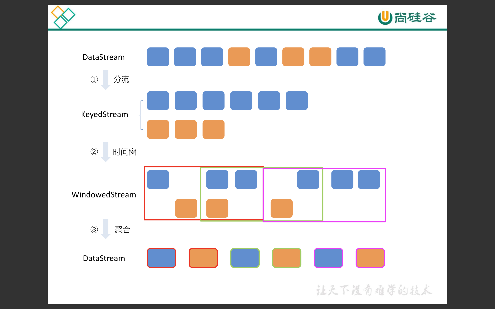
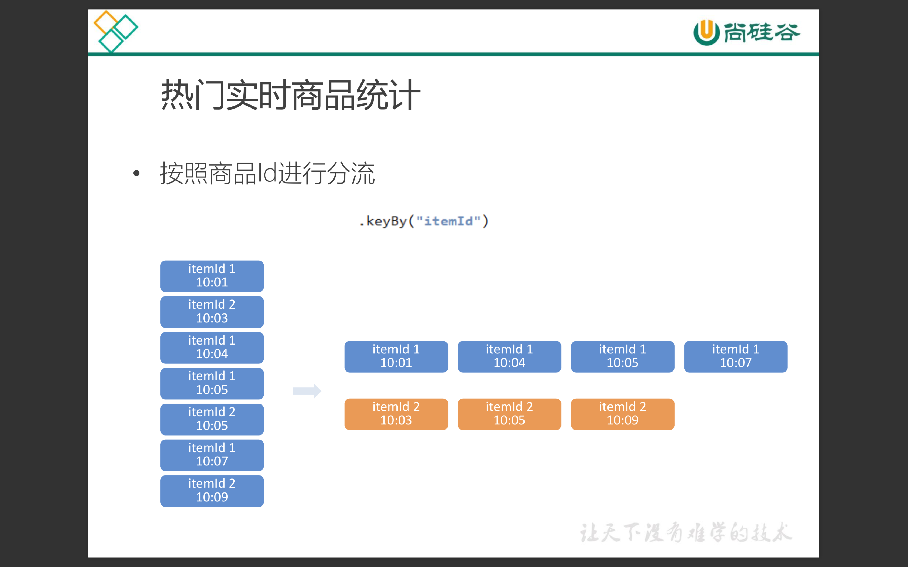
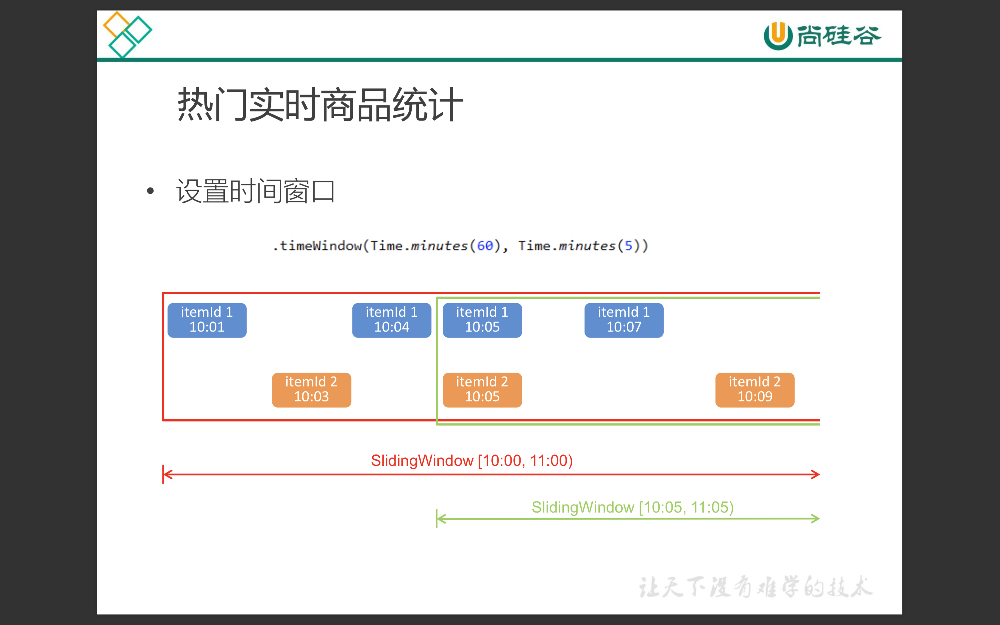
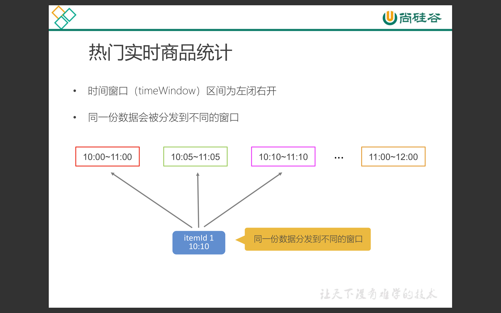


**窗口聚合策略——每出现一条记录就加一**

```scala
class CountAgg extends AggregateFunction[UserBehavior, Long, Long] {
  override def createAccumulator(): Long = 0L
  override def add(userBehavior: UserBehavior, acc: Long): Long = acc + 1
  override def getResult(acc: Long): Long = acc
  override def merge(acc1: Long, acc2: Long): Long = acc1 + acc2
}
```

- 累加规则——窗口内碰到一条数据就加一(add方法)
- 实现 AggregateFunction 接口
- interface AggregateFunction<IN, ACC, OUT>
- 定义输出结构 —— ItemViewCount(itemId, windowEnd, count)
- 实现WindowFunction接口
- trait WindowFunction[IN, OUT, KEY, W <: Window]
- IN: 输入为累加器的类型，Long
- OUT: 窗口累加以后输出的类型为 ItemViewCount(itemId: Long, windowEnd: Long, count: Long), windowEnd为窗口的结束 时间，也是窗口的唯一标识
- KEY: Tuple泛型，在这里是 itemId，窗口根据itemId聚合
- W: 聚合的窗口，w.getEnd 就能拿到窗口的结束时间
- override def apply

```scala
override def apply(key: Tuple, window: TimeWindow, aggregateResult: Iterable[Long], collector: Collector[ItemViewCount]) : Unit = {
  val itemId: Long = key.asInstanceOf[Tuple1[Long]].f0
  val count = aggregateResult.iterator.next
  collector.collect(ItemViewCount(itemId, window.getEnd, count))
}
```


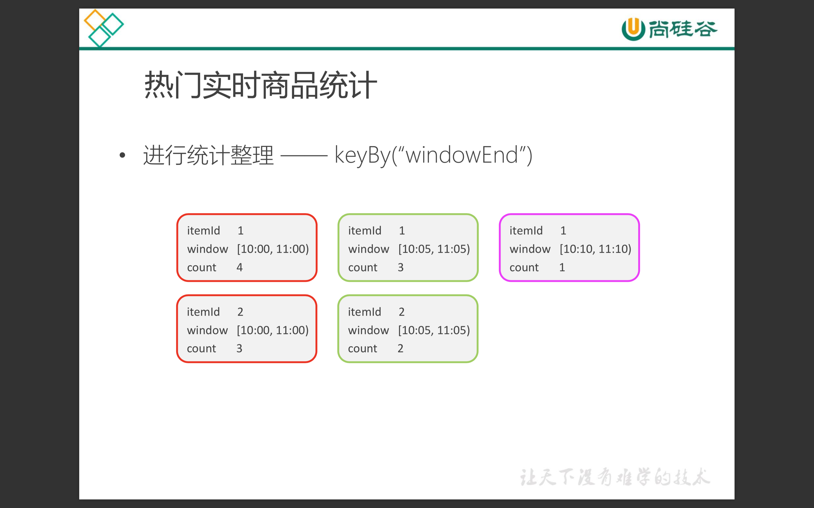


**最终排序输出 —— keyedProcessFunction**

- 针对有状态流的底层API
- KeyedProcessFunction会对分流后的每一条流进行处理
- 以windowEnd作为 key，保证分流以后每一条流的数据都在一个时间窗口内
- 从 ListState 中读取当前流的状态，存储数据进行排序输出

**用ProcessFunction来定义KeyedStream的处理逻辑**

**分流之后，每个KeyedStream都有其自己的生命周期**

- open: 初始化，在这里可以获取当前流的状态
- processElement: 处理流中每一个元素时调用
- onTimer: 定时调用，注册定时器Timer并触发之后的回调操作


项目主体用Scala编写，采用IDEA作为开发环境进行项目编写，采用maven作为项目构建和管理工具。首先我们需要搭建项目框架。

### 创建Maven项目

#### 项目框架搭建

打开IDEA，创建一个maven项目，命名为UserBehaviorAnalysis。由于包含了多个模块，我们可以以UserBehaviorAnalysis作为父项目，并在其下建一个名为HotItemsAnalysis的子项目，用于实时统计热门top N商品。

在UserBehaviorAnalysis下新建一个maven module作为子项目，命名为HotItemsAnalysis。

父项目只是为了规范化项目结构，方便依赖管理，本身是不需要代码实现的，所以UserBehaviorAnalysis下的src文件夹可以删掉。

#### 声明项目中工具的版本信息

我们整个项目需要的工具的不同版本可能会对程序运行造成影响，所以应该在最外层的UserBehaviorAnalysis中声明所有子模块共用的版本信息。

在pom.xml中加入以下配置：

```xml
<properties>
    <flink.version>1.7.2</flink.version>
    <scala.binary.version>2.11</scala.binary.version>
    <kafka.version>2.2.0</kafka.version>
</properties>
```

#### 添加项目依赖

对于整个项目而言，所有模块都会用到flink相关的组件，所以我们在UserBehaviorAnalysis中引入公有依赖：

```xml
<dependencies>
    <dependency>
        <groupId>org.apache.flink</groupId>
        <artifactId>flink-scala_${scala.binary.version}</artifactId>
        <version>${flink.version}</version>
    </dependency>
    <dependency>
        <groupId>org.apache.flink</groupId>
        <artifactId>flink-streaming-scala_${scala.binary.version}</artifactId>
        <version>${flink.version}</version>
    </dependency>
    <dependency>
        <groupId>org.apache.kafka</groupId>
        <artifactId>kafka_${scala.binary.version}</artifactId>
        <version>${kafka.version}</version>
    </dependency>
    <dependency>
        <groupId>org.apache.flink</groupId>
        <artifactId>flink-connector-kafka_${scala.binary.version}</artifactId>
        <version>${flink.version}</version>
    </dependency>
</dependencies>
```

同样，对于maven项目的构建，可以引入公有的插件：

```xml
<build>
    <plugins>
        <!-- 该插件用于将Scala代码编译成class文件 -->
        <plugin>
            <groupId>net.alchim31.maven</groupId>
            <artifactId>scala-maven-plugin</artifactId>
            <version>3.4.6</version>
            <executions>
                <execution>
                    <!-- 声明绑定到maven的compile阶段 -->
                    <goals>
                        <goal>testCompile</goal>
                    </goals>
                </execution>
            </executions>
        </plugin>

        <plugin>
            <groupId>org.apache.maven.plugins</groupId>
            <artifactId>maven-assembly-plugin</artifactId>
            <version>3.0.0</version>
            <configuration>
                <descriptorRefs>
                    <descriptorRef>
                        jar-with-dependencies
                    </descriptorRef>
                </descriptorRefs>
            </configuration>
            <executions>
                <execution>
                    <id>make-assembly</id>
                    <phase>package</phase>
                    <goals>
                        <goal>single</goal>
                    </goals>
                </execution>
            </executions>
        </plugin>
    </plugins>
</build>
```

在HotItemsAnalysis子模块中，我们并没有引入更多的依赖，所以不需要改动pom文件。

#### 数据准备

在src/main/目录下，可以看到已有的默认源文件目录是java，我们可以将其改名为scala。将数据文件UserBehavior.csv复制到资源文件目录src/main/resources下，我们将从这里读取数据。
至此，我们的准备工作都已完成，接下来可以写代码了。

### 模块代码实现

我们将实现一个“实时热门商品”的需求，可以将“实时热门商品”翻译成程序员更好理解的需求：每隔5分钟输出最近一小时内点击量最多的前N个商品。将这个需求进行分解我们大概要做这么几件事情：
抽取出业务时间戳，告诉Flink框架基于业务时间做窗口
过滤出点击行为数据
按一小时的窗口大小，每5分钟统计一次，做滑动窗口聚合（Sliding Window）
按每个窗口聚合，输出每个窗口中点击量前N名的商品

### 程序主体

在src/main/scala下创建HotItems.scala文件，新建一个单例对象。定义样例类UserBehavior和ItemViewCount，在main函数中创建StreamExecutionEnvironment 并做配置，然后从UserBehavior.csv文件中读取数据，并包装成UserBehavior类型。代码如下：

```scala
case class UserBehavior(userId: Long, itemId: Long, categoryId: Int, behavior: String, timestamp: Long)

case class ItemViewCount(itemId: Long, windowEnd: Long, count: Long)

object HotItems {
  def main(args: Array[String]): Unit = {
    // 创建一个 StreamExecutionEnvironment
    val env = StreamExecutionEnvironment.getExecutionEnvironment
    // 设定Time类型为EventTime
    env.setStreamTimeCharacteristic(TimeCharacteristic.EventTime)
    // 为了打印到控制台的结果不乱序，我们配置全局的并发为1，这里改变并发对结果正确性没有影响
    env.setParallelism(1)
    val stream = env
      // 以window下为例，需替换成自己的路径
      .readTextFile("YOUR_PATH\\resources\\UserBehavior.csv")
      .map(line => {
        val linearray = line.split(",")
        UserBehavior(linearray(0).toLong, linearray(1).toLong, linearray(2).toInt, linearray(3), linearray(4).toLong)
      })
      // 指定时间戳和watermark
      .assignAscendingTimestamps(_.timestamp * 1000)

    env.execute("Hot Items Job")
  }
}
```

这里注意，我们需要统计业务时间上的每小时的点击量，所以要基于EventTime来处理。那么如果让Flink按照我们想要的业务时间来处理呢？这里主要有两件事情要做。

第一件是告诉Flink我们现在按照EventTime模式进行处理，Flink默认使用ProcessingTime处理，所以我们要显式设置如下：

```scala
env.setStreamTimeCharacteristic(TimeCharacteristic.EventTime)
```

第二件事情是指定如何获得业务时间，以及生成Watermark。Watermark是用来追踪业务事件的概念，可以理解成EventTime世界中的时钟，用来指示当前处理到什么时刻的数据了。由于我们的数据源的数据已经经过整理，没有乱序，即事件的时间戳是单调递增的，所以可以将每条数据的业务时间就当做Watermark。这里我们用assignAscendingTimestamps来实现时间戳的抽取和Watermark的生成。

>真实业务场景一般都是乱序的，所以一般不用assignAscendingTimestamps，而是使用BoundedOutOfOrdernessTimestampExtractor。

```scala
.assignAscendingTimestamps(_.timestamp * 1000)
```

这样我们就得到了一个带有时间标记的数据流了，后面就能做一些窗口的操作。

### 过滤出点击事件

在开始窗口操作之前，先回顾下需求"每隔5分钟输出过去一小时内点击量最多的前N个商品"。由于原始数据中存在点击、购买、收藏、喜欢各种行为的数据，但是我们只需要统计点击量，所以先使用filter将点击行为数据过滤出来。

```scala
.filter(_.behavior == "pv")
```

### 设置滑动窗口，统计点击量

由于要每隔5分钟统计一次最近一小时每个商品的点击量，所以窗口大小是一小时，每隔5分钟滑动一次。即分别要统计[09:00, 10:00), [09:05, 10:05), [09:10, 10:10)…等窗口的商品点击量。是一个常见的滑动窗口需求（Sliding Window）。

```scala
.keyBy("itemId")
.timeWindow(Time.minutes(60), Time.minutes(5))
.aggregate(new CountAgg(), new WindowResultFunction());
```

我们使用.keyBy("itemId")对商品进行分组，使用.timeWindow(Time size, Time slide)对每个商品做滑动窗口（1小时窗口，5分钟滑动一次）。然后我们使用.aggregate(AggregateFunction af, WindowFunction wf)做增量的聚合操作，它能使用AggregateFunction提前聚合掉数据，减少state的存储压力。较之.apply(WindowFunction wf)会将窗口中的数据都存储下来，最后一起计算要高效地多。这里的CountAgg实现了AggregateFunction接口，功能是统计窗口中的条数，即遇到一条数据就加一。

```scala
// COUNT统计的聚合函数实现，每出现一条记录就加一
class CountAgg extends AggregateFunction[UserBehavior, Long, Long] {
  override def createAccumulator(): Long = 0L
  override def add(userBehavior: UserBehavior, acc: Long): Long = acc + 1
  override def getResult(acc: Long): Long = acc
  override def merge(acc1: Long, acc2: Long): Long = acc1 + acc2
}
```

聚合操作.aggregate(AggregateFunction af, WindowFunction wf)的第二个参数WindowFunction将每个key每个窗口聚合后的结果带上其他信息进行输出。我们这里实现的WindowResultFunction将<主键商品ID，窗口，点击量>封装成了ItemViewCount进行输出。

```scala
// 商品点击量(窗口操作的输出类型)
case class ItemViewCount(itemId: Long, windowEnd: Long, count: Long)
```

代码如下：

```scala
// 用于输出窗口的结果
class WindowResultFunction extends WindowFunction[Long, ItemViewCount, Tuple, TimeWindow] {
  override def apply(key: Tuple, window: TimeWindow, aggregateResult: Iterable[Long], collector: Collector[ItemViewCount]) : Unit = {
    val itemId: Long = key.asInstanceOf[Tuple1[Long]].f0
    val count = aggregateResult.iterator.next
    collector.collect(ItemViewCount(itemId, window.getEnd, count))
  }
}
```

现在我们就得到了每个商品在每个窗口的点击量的数据流。

#### 计算最热门TopN商品

为了统计每个窗口下最热门的商品，我们需要再次按窗口进行分组，这里根据ItemViewCount中的windowEnd进行keyBy()操作。然后使用ProcessFunction实现一个自定义的TopN函数TopNHotItems来计算点击量排名前3名的商品，并将排名结果格式化成字符串，便于后续输出。

```scala
.keyBy("windowEnd")
.process(new TopNHotItems(3)) // 求点击量前3名的商品
```

ProcessFunction是Flink提供的一个low-level API，用于实现更高级的功能。它主要提供了定时器timer的功能（支持EventTime或ProcessingTime）。本案例中我们将利用timer来判断何时收齐了某个window下所有商品的点击量数据。由于Watermark的进度是全局的，在processElement方法中，每当收到一条数据ItemViewCount，我们就注册一个windowEnd+1的定时器（Flink框架会自动忽略同一时间的重复注册）。windowEnd+1的定时器被触发时，意味着收到了windowEnd+1的Watermark，即收齐了该windowEnd下的所有商品窗口统计值。我们在onTimer()中处理将收集的所有商品及点击量进行排序，选出TopN，并将排名信息格式化成字符串后进行输出。

这里我们还使用了ListState<ItemViewCount>来存储收到的每条ItemViewCount消息，保证在发生故障时，状态数据的不丢失和一致性。ListState是Flink提供的类似Java List接口的State API，它集成了框架的checkpoint机制，自动做到了exactly-once的语义保证。

```scala
  // 求某个窗口中前 N 名的热门点击商品，key 为窗口时间戳，输出为 TopN 的结果字符串
  class TopNHotItems(topSize: Int) extends KeyedProcessFunction[Tuple, ItemViewCount, String] {
    private var itemState : ListState[ItemViewCount] = _

    override def open(parameters: Configuration): Unit = {
      super.open(parameters)
      // 命名状态变量的名字和状态变量的类型
      val itemsStateDesc = new ListStateDescriptor[ItemViewCount]("itemState-state", classOf[ItemViewCount])
      // 定义状态变量
      itemState = getRuntimeContext.getListState(itemsStateDesc)
    }

    override def processElement(input: ItemViewCount, context: KeyedProcessFunction[Tuple, ItemViewCount, String]#Context, collector: Collector[String]): Unit = {
      // 每条数据都保存到状态中
      itemState.add(input)
      // 注册 windowEnd+1 的 EventTime Timer, 当触发时，说明收齐了属于windowEnd窗口的所有商品数据
      // 也就是当程序看到windowend + 1的水位线watermark时，触发onTimer回调函数
      context.timerService.registerEventTimeTimer(input.windowEnd + 1)
    }

    override def onTimer(timestamp: Long, ctx: KeyedProcessFunction[Tuple, ItemViewCount, String]#OnTimerContext, out: Collector[String]): Unit = {
      // 获取收到的所有商品点击量
      val allItems: ListBuffer[ItemViewCount] = ListBuffer()
      import scala.collection.JavaConversions._
      for (item <- itemState.get) {
        allItems += item
      }
      // 提前清除状态中的数据，释放空间
      itemState.clear()
      // 按照点击量从大到小排序
      val sortedItems = allItems.sortBy(_.count)(Ordering.Long.reverse).take(topSize)
      // 将排名信息格式化成 String, 便于打印
      val result: StringBuilder = new StringBuilder
      result.append("====================================\n")
      result.append("时间: ").append(new Timestamp(timestamp - 1)).append("\n")

      for(i <- sortedItems.indices){
        val currentItem: ItemViewCount = sortedItems(i)
        // e.g.  No1：  商品ID=12224  浏览量=2413
        result.append("No").append(i+1).append(":")
              .append("  商品ID=").append(currentItem.itemId)
              .append("  浏览量=").append(currentItem.count).append("\n")
      }
      result.append("====================================\n\n")
      // 控制输出频率，模拟实时滚动结果
      Thread.sleep(1000)
      out.collect(result.toString)
    }
  }
```

最后我们可以在main函数中将结果打印输出到控制台，方便实时观测：

```scala
.print()
```

至此整个程序代码全部完成，我们直接运行main函数，就可以在控制台看到不断输出的各个时间点统计出的热门商品。

#### 完整代码

```scala
import java.sql.Timestamp
import java.util.{ArrayList, Comparator, List}

import org.apache.flink.streaming.api.TimeCharacteristic
import org.apache.flink.streaming.api.scala.StreamExecutionEnvironment
import org.apache.flink.streaming.api.scala._
import org.apache.flink.streaming.api.windowing.time.Time
import org.apache.flink.api.common.functions.AggregateFunction
import org.apache.flink.streaming.api.scala.function.WindowFunction
import org.apache.flink.streaming.api.windowing.windows.TimeWindow
import org.apache.flink.api.java.tuple.Tuple
import org.apache.flink.api.java.tuple.Tuple1
import org.apache.flink.util.Collector
import org.apache.flink.streaming.api.functions.KeyedProcessFunction
import org.apache.flink.api.common.state.ListState
import org.apache.flink.api.common.state.ListStateDescriptor
import org.apache.flink.configuration.Configuration

import scala.collection.mutable.ListBuffer

case class UserBehavior(userId: Long, itemId: Long, categoryId: Int, behavior: String, timestamp: Long)

case class ItemViewCount(itemId: Long, windowEnd: Long, count: Long)

object HotItems {

  def main(args: Array[String]): Unit = {
    val env = StreamExecutionEnvironment.getExecutionEnvironment
    env.setStreamTimeCharacteristic(TimeCharacteristic.EventTime)
    env.setParallelism(1)
    val stream = env
      .readTextFile("YOUR_PATH\\resources\\UserBehavior.csv")
      .map(line => {
        val linearray = line.split(",")
        UserBehavior(linearray(0).toLong, linearray(1).toLong, linearray(2).toInt, linearray(3), linearray(4).toLong)
      })
      .assignAscendingTimestamps(_.timestamp * 1000)
      .filter(_.behavior=="pv")
      .keyBy("itemId")
      .timeWindow(Time.minutes(60), Time.minutes(5))
      .aggregate(new CountAgg(), new WindowResultFunction())    
      .keyBy(1)
      .process(new TopNHotItems(3))
      .print()

    env.execute("Hot Items Job")
  }

  // COUNT 统计的聚合函数实现，每出现一条记录加一
  class CountAgg extends AggregateFunction[UserBehavior, Long, Long] {
    override def createAccumulator(): Long = 0L
    override def add(userBehavior: UserBehavior, acc: Long): Long = acc + 1
    override def getResult(acc: Long): Long = acc
    override def merge(acc1: Long, acc2: Long): Long = acc1 + acc2
  }
  // 用于输出窗口的结果
  class WindowResultFunction extends WindowFunction[Long, ItemViewCount, Tuple, TimeWindow] {
    override def apply(key: Tuple, window: TimeWindow, aggregateResult: Iterable[Long], collector: Collector[ItemViewCount]) : Unit = {
      val itemId: Long = key.asInstanceOf[Tuple1[Long]].f0
      val count = aggregateResult.iterator.next
      collector.collect(ItemViewCount(itemId, window.getEnd, count))
    }
  }

// 求某个窗口中前 N 名的热门点击商品，key 为窗口时间戳，输出为 TopN 的结果字符串
  class TopNHotItems(topSize: Int) extends KeyedProcessFunction[Tuple, ItemViewCount, String] {
    private var itemState : ListState[ItemViewCount] = _

    override def open(parameters: Configuration): Unit = {
      super.open(parameters)
      // 命名状态变量的名字和状态变量的类型
      val itemsStateDesc = new ListStateDescriptor[ItemViewCount]("itemState-state", classOf[ItemViewCount])
      // 从运行时上下文中获取状态并赋值
      itemState = getRuntimeContext.getListState(itemsStateDesc)
    }

    override def processElement(input: ItemViewCount, context: KeyedProcessFunction[Tuple, ItemViewCount, String]#Context, collector: Collector[String]): Unit = {
      // 每条数据都保存到状态中
      itemState.add(input)
      // 注册 windowEnd+1 的 EventTime Timer, 当触发时，说明收齐了属于windowEnd窗口的所有商品数据
      // 也就是当程序看到windowend + 1的水位线watermark时，触发onTimer回调函数
      context.timerService.registerEventTimeTimer(input.windowEnd + 1)
    }

    override def onTimer(timestamp: Long, ctx: KeyedProcessFunction[Tuple, ItemViewCount, String]#OnTimerContext, out: Collector[String]): Unit = {
      // 获取收到的所有商品点击量
      val allItems: ListBuffer[ItemViewCount] = ListBuffer()
      import scala.collection.JavaConversions._
      for (item <- itemState.get) {
        allItems += item
      }
      // 提前清除状态中的数据，释放空间
      itemState.clear()
      // 按照点击量从大到小排序
      val sortedItems = allItems.sortBy(_.count)(Ordering.Long.reverse).take(topSize)
      // 将排名信息格式化成 String, 便于打印
      val result: StringBuilder = new StringBuilder
      result.append("====================================\n")
      result.append("时间: ").append(new Timestamp(timestamp - 1)).append("\n")

      for(i <- sortedItems.indices){
        val currentItem: ItemViewCount = sortedItems(i)

        // e.g. No1：商品ID=12224 浏览量=2413
        result
          .append("No")
          .append(i+1)
          .append(":")
          .append("  商品ID=")
          .append(currentItem.itemId)
          .append("  浏览量=")
          .append(currentItem.count).append("\n")
      }

      result.append("====================================\n\n")
      // 控制输出频率，模拟实时滚动结果
      Thread.sleep(1000)
      out.collect(result.toString)
    }
  }
}
```

#### 更换Kafka作为数据源

实际生产环境中，我们的数据流往往是从Kafka获取到的。如果要让代码更贴近生产实际，我们只需将source更换为Kafka即可：

```scala
val properties = new Properties()
properties.setProperty("bootstrap.servers", "localhost:9092")
properties.setProperty("group.id", "consumer-group")
properties.setProperty("key.deserializer", "org.apache.kafka.common.serialization.StringDeserializer")
properties.setProperty("value.deserializer",
"org.apache.kafka.common.serialization.StringDeserializer")
properties.setProperty("auto.offset.reset", "latest")

val env = StreamExecutionEnvironment.getExecutionEnvironment
env.setStreamTimeCharacteristic(TimeCharacteristic.EventTime)
env.setParallelism(1)

val stream = env
  .addSource(new FlinkKafkaConsumer[String]("hotitems", new SimpleStringSchema(), properties))
```

当然，根据实际的需要，我们还可以将Sink指定为Kafka、ES、Redis或其它存储，这里就不一一展开实现了。

kafka生产者程序

```scala
import java.util.Properties
import org.apache.kafka.clients.producer.{KafkaProducer, ProducerRecord}

object KafkaProducerUtil {

  def main(args: Array[String]): Unit = {
    writeToKafka("hotitems")
  }

  def writeToKafka(topic: String): Unit = {
    val props = new Properties()
    props.put("bootstrap.servers", "localhost:9092")
    props.put("key.serializer", "org.apache.kafka.common.serialization.StringSerializer")
    props.put("value.serializer", "org.apache.kafka.common.serialization.StringSerializer")
    val producer = new KafkaProducer[String, String](props)
    val resourcesPath = getClass.getResource("/UserBehavior.csv")
    val bufferedSource = io.Source.fromFile(resourcesPath.getPath)
    for (line <- bufferedSource.getLines) {
      val record = new ProducerRecord[String, String](topic, line)
      producer.send(record)
    }
    producer.close()
  }
}
```

## 实时流量统计

**基本需求**

- 从web服务器的日志中，统计实时的访问流量
- 统计每分钟的ip访问量，取出访问量最大的5个地址，每5秒更新一次

**解决思路**

- 将apache服务器日志中的时间，转换为时间戳，作为Event Time
- 构建滑动窗口，窗口长度为1分钟，滑动距离为5秒

### 模块创建和数据准备

在UserBehaviorAnalysis下新建一个maven module作为子项目，命名为NetworkTrafficAnalysis。在这个子模块中，我们同样并没有引入更多的依赖，所以也不需要改动pom文件。

在src/main/目录下，将默认源文件目录java改名为scala。将apache服务器的日志文件apache.log复制到资源文件目录src/main/resources下，我们将从这里读取数据。

### 代码实现

我们现在要实现的模块是 “实时流量统计”。对于一个电商平台而言，用户登录的入口流量、不同页面的访问流量都是值得分析的重要数据，而这些数据，可以简单地从web服务器的日志中提取出来。我们在这里实现最基本的“页面浏览数”的统计，也就是读取服务器日志中的每一行log，统计在一段时间内用户访问url的次数。

具体做法为：每隔5秒，输出最近10分钟内访问量最多的前N个URL。可以看出，这个需求与之前“实时热门商品统计”非常类似，所以我们完全可以借鉴此前的代码。

在src/main/scala下创建TrafficAnalysis.scala文件，新建一个单例对象。定义样例类ApacheLogEvent，这是输入的日志数据流；另外还有UrlViewCount，这是窗口操作统计的输出数据类型。在main函数中创建StreamExecutionEnvironment并做配置，然后从apache.log文件中读取数据，并包装成ApacheLogEvent类型。

需要注意的是，原始日志中的时间是“dd/MM/yyyy:HH:mm:ss”的形式，需要定义一个DateTimeFormat将其转换为我们需要的时间戳格式：

```scala
.map(line => {
  val linearray = line.split(" ")
  val sdf = new SimpleDateFormat("dd/MM/yyyy:HH:mm:ss")
  val timestamp = sdf.parse(linearray(3)).getTime
  ApacheLogEvent(linearray(0), linearray(2), timestamp, linearray(5), linearray(6))
})
```

完整代码如下：

```scala
case class ApacheLogEvent(ip: String, userId: String, eventTime: Long, method: String, url: String)

case class UrlViewCount(url: String, windowEnd: Long, count: Long)

object TrafficAnalysis {

  def main(args: Array[String]): Unit = {
    val env = StreamExecutionEnvironment.getExecutionEnvironment
    env.setStreamTimeCharacteristic(TimeCharacteristic.EventTime)
    env.setParallelism(1)
    val stream = env
      // 以window下为例，需替换成自己的路径
      .readTextFile("YOUR_PATH\\resources\\apache.log")
      .map(line => {
        val linearray = line.split(" ")
        val simpleDateFormat = new SimpleDateFormat("dd/MM/yyyy:HH:mm:ss")
        val timestamp = simpleDateFormat.parse(linearray(3)).getTime
        ApacheLogEvent(linearray(0), linearray(2), timestamp, linearray(5), linearray(6))
      })
      .assignTimestampsAndWatermarks(new BoundedOutOfOrdernessTimestampExtractor[ApacheLogEvent](Time.milliseconds(1000)) {
        override def extractTimestamp(t: ApacheLogEvent): Long = {
          t.eventTime
        }
      })
      .keyBy("url")
      .timeWindow(Time.minutes(10), Time.seconds(5))
      .aggregate(new CountAgg(), new WindowResultFunction())
      .keyBy(1)
      .process(new TopNHotUrls(5))
      .print()

    env.execute("Traffic Analysis Job")
  }

  class CountAgg extends AggregateFunction[ApacheLogEvent, Long, Long] {
    override def createAccumulator(): Long = 0L
    override def add(apacheLogEvent: ApacheLogEvent, acc: Long): Long = acc + 1
    override def getResult(acc: Long): Long = acc
    override def merge(acc1: Long, acc2: Long): Long = acc1 + acc2
  }

  class WindowResultFunction extends WindowFunction[Long, UrlViewCount, Tuple, TimeWindow] {
    override def apply(key: Tuple, window: TimeWindow, aggregateResult: Iterable[Long], collector: Collector[UrlViewCount]) : Unit = {
      val url: String = key.asInstanceOf[Tuple1[String]].f0
      val count = aggregateResult.iterator.next
      collector.collect(UrlViewCount(url, window.getEnd, count))
    }
  }

  class TopNHotUrls(topsize: Int) extends KeyedProcessFunction[Tuple, UrlViewCount, String] {
    private var urlState : ListState[UrlViewCount] = _

    override def open(parameters: Configuration): Unit = {
      super.open(parameters)
      val urlStateDesc = new ListStateDescriptor[UrlViewCount]("urlState-state", classOf[UrlViewCount])
      urlState = getRuntimeContext.getListState(urlStateDesc)
    }

    override def processElement(input: UrlViewCount, context: KeyedProcessFunction[Tuple, UrlViewCount, String]#Context, collector: Collector[String]): Unit = { 
      // 每条数据都保存到状态中
      urlState.add(input)
      context.timerService.registerEventTimeTimer(input.windowEnd + 1)
    }

    override def onTimer(timestamp: Long, ctx: KeyedProcessFunction[Tuple, UrlViewCount, String]#OnTimerContext, out: Collector[String]): Unit = { 
      // 获取收到的所有URL访问量
      val allUrlViews: ListBuffer[UrlViewCount] = ListBuffer()
      import scala.collection.JavaConversions._
      for (urlView <- urlState.get) {
        allUrlViews += urlView
      }
      // 提前清除状态中的数据，释放空间
      urlState.clear()
      // 按照访问量从大到小排序
      val sortedUrlViews = allUrlViews.sortBy(_.count)(Ordering.Long.reverse)
.take(topSize)
      // 将排名信息格式化成 String, 便于打印
      var result: StringBuilder = new StringBuilder
      result.append("====================================\n")
      result.append("时间: ").append(new Timestamp(timestamp - 1)).append("\n")

      for (i <- sortedUrlViews.indices) {
        val currentUrlView: UrlViewCount = sortedUrlViews(i)
        // e.g.  No1：  URL=/blog/tags/firefox?flav=rss20  流量=55
        result.append("No").append(i+1).append(":")
              .append("  URL=").append(currentUrlView.url)
              .append("  流量=").append(currentUrlView.count).append("\n")
      }
      result.append("====================================\n\n")
      // 控制输出频率，模拟实时滚动结果
      Thread.sleep(1000)
      out.collect(result.toString)
    }
  }
}
```

## 恶意登录监控

**基本需求**

- 用户在短时间内频繁登录失败，有程序恶意攻击的可能
- 同一用户(可以是不同IP)在2秒内连续两次登录失败，需要报警

**解决思路**

- 将用户的登录失败行为存入ListState，设定定时器10秒后触发，查看ListState中有几次失败登录
- 更加精确的检测，可以使用CEP库实现事件流的模式匹配

### 模块创建和数据准备

继续在UserBehaviorAnalysis下新建一个maven module作为子项目，命名为LoginFailDetect。在这个子模块中，我们将会用到flink的CEP库来实现事件流的模式匹配，所以需要在pom文件中引入CEP的相关依赖：

```xml
<dependency>
    <groupId>org.apache.flink</groupId>
    <artifactId>flink-cep_${scala.binary.version}</artifactId>
    <version>${flink.version}</version>
</dependency>
<dependency>
    <groupId>org.apache.flink</groupId>
    <artifactId>flink-cep-scala_${scala.binary.version}</artifactId>
    <version>${flink.version}</version>
</dependency>
```

同样，在src/main/目录下，将默认源文件目录java改名为scala。

### 代码实现

对于网站而言，用户登录并不是频繁的业务操作。如果一个用户短时间内频繁登录失败，就有可能是出现了程序的恶意攻击，比如密码暴力破解。因此我们考虑，应该对用户的登录失败动作进行统计，具体来说，如果同一用户（可以是不同IP）在2秒之内连续两次登录失败，就认为存在恶意登录的风险，输出相关的信息进行报警提示。这是电商网站、也是几乎所有网站风控的基本一环。

#### 状态编程

由于同样引入了时间，我们可以想到，最简单的方法其实与之前的热门统计类似，只需要按照用户ID分流，然后遇到登录失败的事件时将其保存在ListState中，然后设置一个定时器，2秒后触发。定时器触发时检查状态中的登录失败事件个数，如果大于等于2，那么就输出报警信息。

在src/main/scala下创建LoginFail.scala文件，新建一个单例对象。定义样例类LoginEvent，这是输入的登录事件流。由于没有现成的登录数据，我们用几条自定义的示例数据来做演示。

代码如下：

```scala
case class LoginEvent(userId: Long, ip: String, eventType: String, eventTime: Long)

object LoginFail {

  def main(args: Array[String]): Unit = {

    val env = StreamExecutionEnvironment.getExecutionEnvironment
    env.setStreamTimeCharacteristic(TimeCharacteristic.EventTime)
    env.setParallelism(1)

    val loginEventStream = env
      .fromCollection(List(
        LoginEvent(1, "192.168.0.1", "fail", 1558430842),
        LoginEvent(1, "192.168.0.2", "fail", 1558430843),
        LoginEvent(1, "192.168.0.3", "fail", 1558430844),
        LoginEvent(2, "192.168.10.10", "success", 1558430845)
      ))
      .assignAscendingTimestamps(_.eventTime * 1000)
      .keyBy(_.userId)
      .process(new MatchFunction())
      .print()

    env.execute("Login Fail Detect Job")
  }

  class MatchFunction extends KeyedProcessFunction[Long, LoginEvent, LoginEvent] {

    // 定义状态变量
    lazy val loginState: ListState[LoginEvent] = getRuntimeContext.getListState(new ListStateDescriptor[LoginEvent]("saved login", classOf[LoginEvent]))

    override def processElement(login: LoginEvent,
                                context: KeyedProcessFunction[Long, LoginEvent, LoginEvent]#Context,
                                out: Collector[LoginEvent]): Unit = {

      if (login.eventType == "fail") {
        loginState.add(login)
      }
      // 注册定时器，触发事件设定为2秒后
      context.timerService.registerEventTimeTimer(login.eventTime + 2 * 1000)
    }

    override def onTimer(timestamp: Long,
                         ctx: KeyedProcessFunction[Long, LoginEvent, LoginEvent]#OnTimerContext,
                         out: Collector[LoginEvent]): Unit = {

      val allLogins: ListBuffer[LoginEvent] = ListBuffer()
      import scala.collection.JavaConversions._
      for (login <- loginState.get) {
        allLogins += login
      }
      loginState.clear()

      if (allLogins.length > 1) {
        out.collect(allLogins.head)
      }
    }
  }
}
```

#### CEP编程

上一节的代码实现中我们可以看到，直接把每次登录失败的数据存起来、设置定时器一段时间后再读取，这种做法尽管简单，但和我们开始的需求还是略有差异的。这种做法只能隔2秒之后去判断一下这期间是否有多次失败登录，而不是在一次登录失败之后、再一次登录失败时就立刻报警。这个需求如果严格实现起来，相当于要判断任意紧邻的事件，是否符合某种模式。这听起来就很复杂了，那有什么方式可以方便地实现呢？

很幸运，flink为我们提供了CEP（Complex Event Processing，复杂事件处理）库，用于在流中筛选符合某种复杂模式的事件。接下来我们就基于CEP来完成这个模块的实现。

在src/main/scala下继续创建LoginFailWithCep.scala文件，新建一个单例对象。样例类LoginEvent由于在LoginFail.scala已经定义，我们在同一个模块中就不需要再定义了。

代码如下：

```scala
object LoginFailWithCep {

  def main(args: Array[String]): Unit = {

    val env = StreamExecutionEnvironment.getExecutionEnvironment
    env.setStreamTimeCharacteristic(TimeCharacteristic.EventTime)
    env.setParallelism(1)

    val loginEventStream = env.fromCollection(List(
      LoginEvent(1, "192.168.0.1", "fail", 1558430842),
      LoginEvent(1, "192.168.0.2", "fail", 1558430843),
      LoginEvent(1, "192.168.0.3", "fail", 1558430844),
      LoginEvent(2, "192.168.10.10", "success", 1558430845)
    )).assignAscendingTimestamps(_.eventTime * 1000)


    // 定义匹配模式
    val loginFailPattern = Pattern
      .begin[LoginEvent]("begin")
      .where(_.eventType == "fail")
      .next("next")
      .where(_.eventType == "fail")
      .within(Time.seconds(2))


    // 在数据流中匹配出定义好的模式
    val patternStream = CEP.pattern(loginEventStream.keyBy(_.userId), loginFailPattern)

    // .select方法传入一个 pattern select function，当检测到定义好的模式序列时就会调用
    val loginFailDataStream = patternStream
      .select((pattern: Map[String, Iterable[LoginEvent]]) => {
        val first = pattern.getOrElse("begin", null).iterator.next()
        val second = pattern.getOrElse("next", null).iterator.next()
        (second.userId, second.ip, second.eventType)
      })
    // 将匹配到的符合条件的事件打印出来
    loginFailDataStream.print()
    env.execute("Login Fail Detect Job")
  }
}
```

## 订单支付实时监控

**基本需求**

- 用户下单之后，应设置订单失效时间，以提高用户支付的意愿，并降低系统风险
- 用户下单后15分钟未支付，则输出监控信息

**解决思路**

- 利用CEP库进行事件流的模式匹配，并设定匹配的时间间隔

### 模块创建和数据准备

同样地，在UserBehaviorAnalysis下新建一个maven module作为子项目，命名为OrderTimeoutDetect。在这个子模块中，我们同样将会用到flink的CEP库来实现事件流的模式匹配，所以需要在pom文件中引入CEP的相关依赖：

```xml
<dependency>
    <groupId>org.apache.flink</groupId>
    <artifactId>flink-cep_${scala.binary.version}</artifactId>
    <version>${flink.version}</version>
</dependency>
<dependency>
    <groupId>org.apache.flink</groupId>
    <artifactId>flink-cep-scala_${scala.binary.version}</artifactId>
    <version>${flink.version}</version>
</dependency>
```

同样，在src/main/目录下，将默认源文件目录java改名为scala。

### 代码实现

在电商平台中，最终创造收入和利润的是用户下单购买的环节；更具体一点，是用户真正完成支付动作的时候。用户下单的行为可以表明用户对商品的需求，但在现实中，并不是每次下单都会被用户立刻支付。当拖延一段时间后，用户支付的意愿会降低。所以为了让用户更有紧迫感从而提高支付转化率，同时也为了防范订单支付环节的安全风险，电商网站往往会对订单状态进行监控，设置一个失效时间（比如15分钟），如果下单后一段时间仍未支付，订单就会被取消。

我们将会利用CEP库来实现这个功能。我们先将事件流按照订单号orderId分流，然后定义这样的一个事件模式：在15分钟内，事件“create”与“pay”严格紧邻：

```scala
val orderPayPattern = Pattern.begin[OrderEvent]("begin")
  .where(_.eventType == "create")
  .next("next")
  .where(_.eventType == "pay")
  .within(Time.seconds(5))
```

这样调用.select方法时，就可以同时获取到匹配出的事件和超时未匹配的事件了。
在src/main/scala下继续创建OrderTimeout.scala文件，新建一个单例对象。定义样例类OrderEvent，这是输入的订单事件流；另外还有OrderResult，这是输出显示的订单状态结果。由于没有现成的数据，我们还是用几条自定义的示例数据来做演示。
完整代码如下：

```scala
import org.apache.flink.cep.scala.CEP
import org.apache.flink.cep.scala.pattern.Pattern
import org.apache.flink.streaming.api.scala._
import org.apache.flink.streaming.api.windowing.time.Time
import org.apache.flink.streaming.api.TimeCharacteristic
import org.apache.flink.util.Collector
import scala.collection.Map

case class OrderEvent(orderId: String, eventType: String, eventTime: String)

object OrderTimeout {

  def main(args: Array[String]): Unit = {

    val env = StreamExecutionEnvironment.getExecutionEnvironment
    env.setParallelism(1)
    env.setStreamTimeCharacteristic(TimeCharacteristic.EventTime)

    val orderEventStream = env.fromCollection(List(
      OrderEvent("1", "create", "1558430842"),
      OrderEvent("2", "create", "1558430843"),
      OrderEvent("2", "pay", "1558430844"),
      OrderEvent("3", "pay", "1558430942"),
      OrderEvent("4", "pay", "1558430943")
    )).assignAscendingTimestamps(_.eventTime.toLong * 1000)

//    val orders: DataStream[String] = env.socketTextStream("localhost", 9999)
//
//    val orderEventStream = orders
//      .map(s => {
//        println(s)
//        val slist = s.split("\\|")
//        println(slist)
//        OrderEvent(slist(0), slist(1), slist(2))
//      })
//      .assignAscendingTimestamps(_.eventTime.toLong * 1000)

    val orderPayPattern = Pattern.begin[OrderEvent]("begin")
      .where(_.eventType.equals("create"))
      .next("next")
      .where(_.eventType.equals("pay"))
      .within(Time.seconds(5))

    val orderTimeoutOutput = OutputTag[OrderEvent]("orderTimeout")

    val patternStream = CEP.pattern(orderEventStream.keyBy("orderId"), orderPayPattern)

    val timeoutFunction = (map: Map[String, Iterable[OrderEvent]], timestamp: Long, out: Collector[OrderEvent]) => {
      print(timestamp)
      val orderStart = map.get("begin").get.head
      out.collect(orderStart)
    }

    val selectFunction = (map: Map[String, Iterable[OrderEvent]], out: Collector[OrderEvent]) => {
    }

    val timeoutOrder = patternStream.flatSelect(orderTimeoutOutput)(timeoutFunction)(selectFunction)

    timeoutOrder.getSideOutput(orderTimeoutOutput).print()

    env.execute

  }
}
```

### 使用Process Function实现订单超时需求

```scala
import org.apache.flink.api.common.state.{ValueState, ValueStateDescriptor}
import org.apache.flink.streaming.api.TimeCharacteristic
import org.apache.flink.streaming.api.functions.KeyedProcessFunction
import org.apache.flink.streaming.api.scala.StreamExecutionEnvironment
import org.apache.flink.streaming.api.scala._
import org.apache.flink.util.Collector

case class OrderEvent1(orderId: String,
                      eventType: String,
                      eventTime: String)

object OrderTimeoutWithoutCep {
  def main(args: Array[String]): Unit = {
    val env = StreamExecutionEnvironment.getExecutionEnvironment
    env.setParallelism(1)
    env.setStreamTimeCharacteristic(TimeCharacteristic.EventTime)

    val orderEventsStream = env.fromCollection(List(
      OrderEvent1("1", "create", "1558430842"),
      OrderEvent1("2", "create", "1558430843"),
      OrderEvent1("2", "pay", "1558430844"),
      OrderEvent1("3", "pay", "1558430942"),
      OrderEvent1("4", "pay", "1558430943")
    )).assignAscendingTimestamps(_.eventTime.toLong * 1000)

    val orders = orderEventsStream
      .keyBy(_.orderId)
      .process(new OrderMatchFunction)
      .print()

    env.execute
  }

  class OrderMatchFunction extends KeyedProcessFunction[String,
    OrderEvent1, OrderEvent1] {
    lazy val orderState: ValueState[OrderEvent1] = getRuntimeContext
      .getState(new ValueStateDescriptor[OrderEvent1]("saved order",
        classOf[OrderEvent1]))

    override def processElement(order: OrderEvent1,
                                context: KeyedProcessFunction[
                                  String, OrderEvent1, OrderEvent1]#Context,
                                out: Collector[OrderEvent1]): Unit = {
      val timerService = context.timerService

      if (order.eventType == "create") {
        if (orderState.value() == null) {
          orderState.update(order)
        }
      } else {
        orderState.update(order)
      }

      timerService.registerEventTimeTimer(
        order.eventTime.toLong * 1000 + 5 * 1000
      )
    }

    override def onTimer(timestamp: Long,
                         ctx: KeyedProcessFunction[
                           String, OrderEvent1, OrderEvent1]#OnTimerContext,
                         out: Collector[OrderEvent1]): Unit = {
      val savedOrder = orderState.value()

      if (savedOrder != null &&
        (savedOrder.eventType == "create")) {
        out.collect(savedOrder)
      }

      orderState.clear()
    }
  }
}
```

## 实现两条流的join

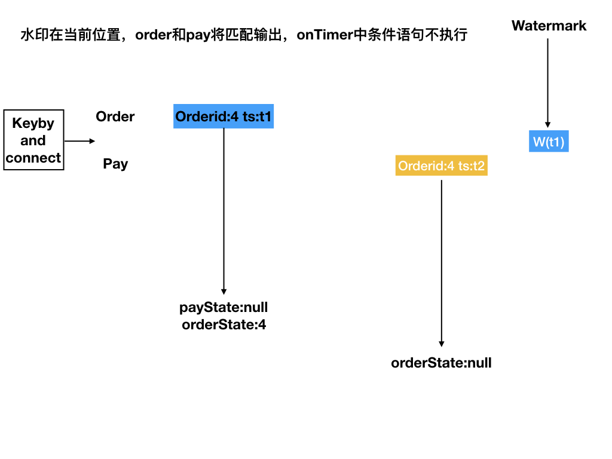

```scala
import org.apache.flink.api.common.state.{ValueState, ValueStateDescriptor}
import org.apache.flink.streaming.api.TimeCharacteristic
import org.apache.flink.streaming.api.functions.co.CoProcessFunction
import org.apache.flink.streaming.api.scala.OutputTag
import org.apache.flink.streaming.api.scala._
import org.apache.flink.util.Collector

case class OrderEvent(orderId: String,
                      eventType: String,
                      eventTime: String)

case class PayEvent(orderId: String,
                    eventType: String,
                    eventTime: String)

object TwoStreamsJoin {
  val unmatchedOrders = new OutputTag[OrderEvent]("unmatchedOrders"){}
  val unmatchedPays = new OutputTag[PayEvent]("unmatchedPays"){}

  def main(args: Array[String]): Unit = {
    val env = StreamExecutionEnvironment.getExecutionEnvironment
    env.setStreamTimeCharacteristic(TimeCharacteristic.EventTime)
    env.setParallelism(1)

    val orders = env
      .fromCollection(List(
      OrderEvent("1", "create", "1558430842"),
      OrderEvent("2", "create", "1558430843"),
      OrderEvent("1", "pay", "1558430844"),
      OrderEvent("2", "pay", "1558430845"),
      OrderEvent("3", "create", "1558430849"),
      OrderEvent("3", "pay", "1558430849")
    )).assignAscendingTimestamps(_.eventTime.toLong * 1000)
      .keyBy("orderId")

    val pays = env.fromCollection(List(
      PayEvent("1", "weixin", "1558430847"),
      PayEvent("2", "zhifubao", "1558430848"),
      PayEvent("4", "zhifubao", "1558430850")
    )).assignAscendingTimestamps(_.eventTime.toLong * 1000)
      .keyBy("orderId")

    val processed = orders
      .connect(pays)
      .process(new EnrichmentFunction)

    processed.getSideOutput[PayEvent](unmatchedPays).print()
    processed.getSideOutput[OrderEvent](unmatchedOrders).print()

    env.execute
  }

  class EnrichmentFunction extends CoProcessFunction[
    OrderEvent, PayEvent, (OrderEvent, PayEvent)] {
    lazy val orderState: ValueState[OrderEvent] = getRuntimeContext
      .getState(new ValueStateDescriptor[OrderEvent]("saved order",
        classOf[OrderEvent]))

    lazy val payState: ValueState[PayEvent] = getRuntimeContext
      .getState(new ValueStateDescriptor[PayEvent]("saved pay",
        classOf[PayEvent]))

    override def processElement1(order: OrderEvent,
                                 context: CoProcessFunction[
                                   OrderEvent,
                                   PayEvent,
                                   (OrderEvent, PayEvent)]#Context,
                                 out: Collector[(OrderEvent, PayEvent)]): Unit = {
      val pay = payState.value()

      if (pay != null) {
        payState.clear()
        out.collect((order, pay))
      } else {
        orderState.update(order)
        // as soon as the watermark arrives,
        // we can stop waiting for the corresponding pay
        context.timerService
          .registerEventTimeTimer(order.eventTime.toLong * 1000)
      }
    }

    override def processElement2(pay: PayEvent,
                                 context: CoProcessFunction[
                                   OrderEvent,
                                   PayEvent,
                                   (OrderEvent, PayEvent)]#Context,
                                 out: Collector[(OrderEvent, PayEvent)]): Unit = {
      val order = orderState.value()

      if (order != null) {
        orderState.clear()
        out.collect((order, pay))
      } else {
        payState.update(pay)
        context.timerService.registerEventTimeTimer(pay.eventTime.toLong * 1000)
      }
    }

    override def onTimer(timestamp: Long,
                         ctx: CoProcessFunction[OrderEvent,
                           PayEvent, (OrderEvent, PayEvent)]#OnTimerContext,
                         out: Collector[(OrderEvent, PayEvent)]): Unit = {
      if (payState.value != null) {
        ctx.output(unmatchedPays, payState.value)
        payState.clear()
      }

      if (orderState.value != null) {
        ctx.output(unmatchedOrders, orderState.value)
        orderState.clear()
      }
    }
  }
}
```

## 用户访问行为统计

### 准备数据源

使用UserBehavior.csv数据集。

### PV

```scala
import org.apache.flink.streaming.api.TimeCharacteristic
import org.apache.flink.streaming.api.scala.StreamExecutionEnvironment
import org.apache.flink.streaming.api.scala._
import org.apache.flink.streaming.api.windowing.time.Time

object UserBehaviorPv {

  def main(args: Array[String]): Unit = {
    val resourcesPath = getClass.getResource("/UserBehavior.csv")
    val env = StreamExecutionEnvironment.getExecutionEnvironment
    env.setStreamTimeCharacteristic(TimeCharacteristic.EventTime)
    env.setParallelism(1)
    val stream = env
      .readTextFile(resourcesPath.getPath)
      .map(line => {
        val linearray = line.split(",")
        UserBehavior(linearray(0).toLong, linearray(1).toLong, linearray(2).toInt, linearray(3), linearray(4).toLong)
      })
      .assignAscendingTimestamps(_.timestamp * 1000)
      .filter(_.behavior.equals("pv"))
      .timeWindowAll(Time.seconds(60 * 60))
      .sum(0)
      .print()

    env.execute("Hot Items Job")
  }

}
```

### UV

```scala
import org.apache.flink.streaming.api.TimeCharacteristic
import org.apache.flink.streaming.api.scala.StreamExecutionEnvironment
import org.apache.flink.streaming.api.scala._
import org.apache.flink.streaming.api.windowing.time.Time
import org.apache.flink.streaming.api.scala.function.{AllWindowFunction, ProcessAllWindowFunction}
import org.apache.flink.streaming.api.windowing.windows.TimeWindow
import org.apache.flink.util.Collector

object UserBehaviorUv {

  def main(args: Array[String]): Unit = {
    val resourcesPath = getClass.getResource("/UserBehavior.csv")
    val env = StreamExecutionEnvironment.getExecutionEnvironment
    env.setStreamTimeCharacteristic(TimeCharacteristic.EventTime)
    env.setParallelism(1)
    val stream = env
      .readTextFile(resourcesPath.getPath)
      .map(line => {
        val linearray = line.split(",")
        UserBehavior(linearray(0).toLong, linearray(1).toLong, linearray(2).toInt, linearray(3), linearray(4).toLong)
      })
      .assignAscendingTimestamps(_.timestamp * 1000)
      .filter(_.behavior.equals("pv"))
      .timeWindowAll(Time.seconds(60 * 60))
      .apply(new MyReduceProcessFunction)
      .print()

    env.execute("Hot Items Job")
  }

  class MyReduceProcessFunction extends AllWindowFunction[UserBehavior, Long, TimeWindow] {
    override def apply(window: TimeWindow,
                       vals: Iterable[UserBehavior],
                       out: Collector[Long]): Unit = {

      val s: collection.mutable.Set[Long] = collection.mutable.Set()

      for (v <- vals) {
        s += v.itemId
      }

      out.collect(s.size)
    }
  }
}
```

## 电商App渠道推广统计

### 数据源准备

```scala
class SimulatedEventSource extends RichParallelSourceFunction[(String, String)] {

  var running = true
  val channelSet: Seq[String] = Seq("a", "b", "c", "d")
  val behaviorTypes: Seq[String] = Seq(
    "INSTALL", "OPEN", "BROWSE", "CLICK",
    "PURCHASE", "CLOSE", "UNINSTALL")
  val rand: Random = Random

  override def run(ctx: SourceContext[(String, String)]): Unit = {
    val numElements = Long.MaxValue
    var count = 0L

    while (running && count < numElements) {
      val channel = channelSet(rand.nextInt(channelSet.size))
      val event = generateEvent()
      val ts = event.head.toLong
      ctx.collectWithTimestamp((channel, event.mkString("\t")), ts)
      count += 1
      TimeUnit.MILLISECONDS.sleep(5L)
    }
  }

  private def generateEvent(): Seq[String] = {
    val dt = readableDate
    val id = UUID.randomUUID().toString
    val behaviorType = behaviorTypes(rand.nextInt(behaviorTypes.size))
    // (ts, readableDT, id, behaviorType)
    Seq(dt._1.toString, dt._2, id, behaviorType)
  }

  private def readableDate = {
    val df = new SimpleDateFormat("yyyy-MM-dd HH:mm:ss")
    val ts = System.nanoTime
    val dt = new Date(ts)
    (ts, df.format(dt))
  }

  override def cancel(): Unit = running = false
}
```

### 分渠道统计

```scala
object ChannelStatistic {
  def main(args: Array[String]): Unit = {
    val env = StreamExecutionEnvironment.getExecutionEnvironment
    env.setStreamTimeCharacteristic(TimeCharacteristic.ProcessingTime)
    env.setParallelism(1)
    val stream: DataStream[(String, String)] = env.addSource(new SimulatedEventSource)

    stream
      .map(t => {
        val channel = t._1
        val eventFields = t._2.split("\t")
        val behaviorType = eventFields(3)
        ((channel, behaviorType), 1L)
      })
      .keyBy(0)
      .timeWindow(Time.seconds(5), Time.seconds(1))
      .process(new MyReduceWindowFunction)
      .map(t => {
        val key = t._1
        val count = t._2
        val windowStartTime = key._1
        val windowEndTime = key._2
        val channel = key._3
        val behaviorType = key._4
        Seq(windowStartTime, windowEndTime, channel, behaviorType, count).mkString("\t")
      })
      .print()

    env.execute(getClass.getSimpleName)
  }
}

class MyReduceWindowFunction
  extends ProcessWindowFunction[((String, String), Long), ((String, String, String, String), Long), Tuple, TimeWindow] {

  override def process(key: Tuple,
                       context: Context,
                       elements: Iterable[((String, String), Long)],
                       collector: Collector[((String, String, String, String), Long)]): Unit = {

    val startTs = context.window.getStart
    val endTs = context.window.getEnd

    for(group <- elements.groupBy(_._1)) {
      val myKey = group._1
      val myValue = group._2
      var count = 0L
      for(elem <- myValue) {
        count += elem._2
      }
      val channel = myKey._1
      val behaviorType = myKey._2
      val outputKey = (formatTs(startTs), formatTs(endTs), channel, behaviorType)
      collector.collect((outputKey, count))
    }
  }

  private def formatTs(ts: Long) = {
    val df = new SimpleDateFormat("yyyyMMddHHmmss")
    df.format(new Date(ts))
  }
}
```

### 不分渠道统计

```scala
object ChannelStatisticNonKey {
  def main(args: Array[String]): Unit = {

    val env = StreamExecutionEnvironment.getExecutionEnvironment
    env.setStreamTimeCharacteristic(TimeCharacteristic.EventTime)
    env.setParallelism(1)

    val stream: DataStream[(String, String)] = env.addSource(new SimulatedEventSource)

    stream
      .map(t => {
        val channel = t._1
        val eventFields = t._2.split("\t")
        val ts = eventFields(0).toLong
        val behaviorType = eventFields(3)
        (ts, channel, behaviorType)
      })
      .assignTimestampsAndWatermarks(new TimestampExtractor(10))
      .map(t => (t._2, t._3))
      .timeWindowAll(Time.milliseconds(1000))
      .process(new MyReduceWindowAllFunction())
      .map(t => {
        val key = t._1
        val count = t._2
        val windowStartTime = key._1
        val windowEndTime = key._2
        val channel = key._3
        val behaviorType = key._4
        Seq(windowStartTime, windowEndTime, channel, behaviorType, count).mkString("\t")
      })
      .print()

    env.execute(getClass.getSimpleName)
  }
}

class TimestampExtractor(val maxLaggedTime: Long)
  extends AssignerWithPeriodicWatermarks[(Long, String, String)] with Serializable {

  var currentWatermarkTs = 0L

  override def getCurrentWatermark: Watermark = {
    if(currentWatermarkTs <= 0) {
      new Watermark(Long.MinValue)
    } else {
      new Watermark(currentWatermarkTs - maxLaggedTime)
    }
  }

  override def extractTimestamp(element: (Long, String, String),
                                previousElementTimestamp: Long): Long = {
    val ts = element._1
    Math.max(ts, currentWatermarkTs)
  }
}

class MyReduceWindowAllFunction
  extends ProcessAllWindowFunction[(String, String),
    ((String, String, String, String), Long), TimeWindow] {

  override def process(context: Context,
                       elements: Iterable[(String, String)],
                       collector: Collector[((String, String, String, String), Long)]): Unit = {
    val startTs = context.window.getStart
    val endTs = context.window.getEnd
    val elems = elements.map(t => {
      ((t._1, t._2), 1L)
    })
    for(group <- elems.groupBy(_._1)) {
      val myKey = group._1
      val myValue = group._2
      var count = 0L
      for(elem <- myValue) {
        count += elem._2
      }
      val channel = myKey._1
      val behaviorType = myKey._2
      val outputKey = (formatTs(startTs), formatTs(endTs), channel, behaviorType)
      collector.collect((outputKey, count))
    }
  }

  private def formatTs(ts: Long) = {
    val df = new SimpleDateFormat("yyyyMMddHHmmss")
    df.format(new Date(ts))
  }

}
```

## 页面广告黑名单过滤

数据的格式为：

```scala
case class AdLog(userid: Int, adid: Int, province: String, city: String, timestamp: Long)
```

主体程序为：

```scala
val adLogStream = env.addSource(consumer)

// 对点击某一广告多于100的用户进行截流，从而一次性完成黑名单过滤和黑名单更新。
val withSideOutput = adLogStream
  .keyBy(adLog => (adLog.userid, adLog.adid))
  .process(new FilterBlackListUser)
```

FilterBlackListUser类的实现如下：

```scala
class FilterBlackListUser extends KeyedProcessFunction[(Int, Int), AdLog, ProvinceWithCount] {

  // 存储当前userId-adId键值的广告点击量
  var countState: ValueState[Int] = _
  // 标记当前userId-adId键值是否第一次进入黑名单的flag
  var firstSent: ValueState[Boolean] = _
  // 记录当前userId-adId键值state的生成时间
  var resetTime: ValueState[Long] = _

  // 初始化key state
  override def open(parameters: Configuration): Unit = {

    val countDescriptor = new ValueStateDescriptor[Int]("count", classOf[Int])
    countState = getRuntimeContext
      .getState[Int](countDescriptor)

    val firstSeenDescriptor = new ValueStateDescriptor[Boolean]("firstSent", classOf[Boolean])
    firstSent = getRuntimeContext
      .getState[Boolean](firstSeenDescriptor)

    val resetTimeDescriptor = new ValueStateDescriptor[Long]("resetTime", classOf[Long])
    resetTime = getRuntimeContext
      .getState[Long](resetTimeDescriptor)

  }

  override def processElement(value: AdLog,
                              ctx: KeyedProcessFunction[(Int, Int), AdLog, ProvinceWithCount]#Context,
                              out: Collector[ProvinceWithCount]): Unit = {
    val curCount = countState.value()
    // 第一次处理登记timer，24：00清除state
    if (curCount == 0) {
      val time = (ctx.timerService().currentProcessingTime() / 86400000 + 1) * 86400000
      resetTime.update(time)
      ctx.timerService().registerProcessingTimeTimer(time)
    }

    // 加入黑名单，并在side output输出，但只输出一次
    if (curCount >= 100) {
      // 默认初始为false
      if (!firstSent.value()) {
        firstSent.update(true)
        ctx.output(Launcher.realTimeBlackList, value.userid.toString)
      }
      return
    }
    // 点击次数+1
    countState.update(curCount + 1)
    out.collect(ProvinceWithCount(value.province, 1,1))
  }

  // 到达预定时间时清除state
  override def onTimer(timestamp: Long,
                       ctx: KeyedProcessFunction[(Int, Int), AdLog, ProvinceWithCount]#OnTimerContext,
                       out: Collector[ProvinceWithCount]): Unit = {
    if (timestamp == resetTime.value()) {
      firstSent.clear()
      countState.clear()
    }
  }
}
```

## 页面广告各省点击量统计

主程序如下：

```scala
// 实时统计广告点击量最多的前K个省份。同样此处只输出到控制台，有需要可以输出到其他端口。
adLogStream
  .keyBy(_.province)
  // 按province进行分组累加的stateful操作
  .process(new AccProvClick) // 这里也可以输出到数据库或者kafka等，从而对这些聚合好的数据进行不同需求的分析
```

AccProvClick类实现如下：

```scala
case class ProvinceWithCount(province: String, count: Int, dummyKey: Int)

class AccProvClick extends KeyedProcessFunction[String, ProvinceWithCount, ProvinceWithCount] {

  // 存储当前province键值的广告点击量
  var countState: ValueState[Int] = _
  var resetTime: ValueState[Long] = _

  override def open //和上面类似

  override def processElement(value: ProvinceWithCount,
                              ctx: KeyedProcessFunction[String, ProvinceWithCount, ProvinceWithCount]#Context,
                              out: Collector[ProvinceWithCount]): Unit = {
    // 和上面类似，如果countState值为0，先设置timer
    val curCount = countState.value() + 1
    countState.update(curCount)
    out.collect(ProvinceWithCount(value.province, curCount, 1))
  }

  override def onTimer // 和上面类似
}
```

## PV数据IP地址所属地区实时热力图可视化

数据在经过ETL之后，剩下了三个字段(访问时间，ip地址经度，ip地址纬度)，为pvlocation.csv。

```scala
import org.apache.flink.streaming.api.TimeCharacteristic
import org.apache.flink.streaming.api.scala.StreamExecutionEnvironment
import org.joda.time.format.DateTimeFormat
import org.joda.time.format.DateTimeFormatter
import org.joda.time.DateTime
import org.apache.flink.streaming.api.scala._
import java.util.Locale

import org.apache.flink.api.common.functions.RuntimeContext
import org.apache.flink.api.java.tuple.Tuple
import org.apache.flink.api.java.tuple.Tuple1
import org.apache.flink.streaming.api.functions.timestamps.BoundedOutOfOrdernessTimestampExtractor
import org.apache.flink.streaming.api.scala.function.WindowFunction
import org.apache.flink.streaming.api.windowing.time.Time
import org.apache.flink.streaming.api.windowing.windows.TimeWindow
import org.apache.flink.streaming.connectors.elasticsearch.{ElasticsearchSinkFunction, RequestIndexer}
import org.apache.flink.streaming.connectors.elasticsearch6.ElasticsearchSink
import org.apache.flink.util.Collector
import org.apache.http.HttpHost
import org.elasticsearch.action.index.IndexRequest
import org.elasticsearch.client.Requests

/**
  *
  * The task of the exercise is to identify every five minutes popular areas where many taxi rides
  * arrived or departed in the last 15 minutes.
  *
  * 滑动窗口：窗口的大小：15分钟；滑窗的步长：5分钟
  * 写入到es中
  *
  * The results are written into an Elasticsearch index.
  *
  * Parameters:
  * -input path-to-input-file
  *
  * ES和Kibana的版本为6.5.1
  *
  * kibana默认监听端口：5601
  *
  * 在命令行运行以下两条命令, 创建索引和mapping，告诉es数据的类型是什么
  *
  * curl -XPUT "http://localhost:9200/nyc-idx"
  *
  * curl -XPUT -H'Content-Type: application/json' "http://localhost:9200/nyc-idx/_mapping/popular-locations" -d'
  * {
  *  "popular-locations" : {
  *    "properties" : {
  *       "cnt": {"type": "integer"},
  *       "location": {"type": "geo_point"},
  *       "time": {"type": "date"}
  *     }
  *  }
  * }'
  *
  */

case class PvLocation(timestamp: Long, Longitude: Float, Latitude: Float)

//<cellId, windowTime, isStart, cnt>
case class PvAgg(cellId: Long, windowTime: Long, cnt: Long)

object PvLocationToES {
  // geo boundaries of the area of NYC
  var LON_EAST: Double = -73.7
  var LON_WEST: Double = -74.05
  var LAT_NORTH = 41.0
  var LAT_SOUTH = 40.5
  // delta step to create artificial grid overlay of NYC
  var DELTA_LON = 0.0014
  var DELTA_LAT = 0.00125

  // ( |LON_WEST| - |LON_EAST| ) / DELTA_LAT
  var NUMBER_OF_GRID_X = 250
  val timeFormatter: DateTimeFormatter = DateTimeFormat.forPattern("yyyy-MM-dd HH:mm:ss").withLocale(Locale.US).withZoneUTC

  def main(args: Array[String]): Unit = {
    val resourcesPath = getClass.getResource("/pvlocation.csv")
    val env = StreamExecutionEnvironment.getExecutionEnvironment
    env.setStreamTimeCharacteristic(TimeCharacteristic.EventTime)
    env.setParallelism(1)

    val stream = env
      .readTextFile(resourcesPath.getPath)
      .map(line => {
        val linearray = line.split(",")
        val ts: Long = DateTime.parse(linearray(0), timeFormatter).getMillis
        PvLocation(ts, linearray(1).toFloat, linearray(2).toFloat)
      })
      .assignTimestampsAndWatermarks(
        new LogTimeAssigner
      )
      .filter(l => isInNYC(l.Longitude, l.Latitude))
      // 将每一个行程映射到一个单元格里面，方便统计
      .map(l => mapToGridCell(l.Longitude, l.Latitude))
      .keyBy(0)
      .timeWindow(Time.minutes(15), Time.minutes(5))
      .apply(new PvCounter())
      .map(r => (
        getGridCellCenterLon(r.cellId.toInt),
        getGridCellCenterLat(r.cellId.toInt),
        r.windowTime,
        r.cnt
      ))

    val httpHosts = new java.util.ArrayList[HttpHost]
    httpHosts.add(new HttpHost("127.0.0.1", 9200, "http"))

    val esSinkBuilder = new ElasticsearchSink.Builder[(Float, Float, Long, Long)](
      httpHosts,
      new ElasticsearchSinkFunction[(Float, Float, Long, Long)] {
        def createIndexRequest(record: (Float, Float, Long, Long)): IndexRequest = {
          val json = new java.util.HashMap[String, String]
          json.put("time", record._3.toString)         // timestamp, windowend time
          json.put("location", record._2 + "," + record._1)  // lat,lon pair
          json.put("cnt", record._4.toString)

          Requests.indexRequest()
            .index("nyc-idx")
            .`type`("popular-locations")
            .source(json)
        }

        override def process(record: (Float, Float, Long, Long), ctx: RuntimeContext, indexer: RequestIndexer): Unit = {
          indexer.add(createIndexRequest(record))
        }
      }
    )

    stream.addSink(esSinkBuilder.build)

    env.execute
  }

  def isInNYC(lon: Float, lat: Float): Boolean = !(lon > LON_EAST || lon < LON_WEST) && !(lat > LAT_NORTH || lat < LAT_SOUTH)

  def mapToGridCell(lon: Float, lat: Float): Int = {
    val xIndex = Math.floor((Math.abs(LON_WEST) - Math.abs(lon)) / DELTA_LON).toInt
    val yIndex = Math.floor((LAT_NORTH - lat) / DELTA_LAT).toInt
    xIndex + (yIndex * NUMBER_OF_GRID_X)
  }

  def getGridCellCenterLon(gridCellId: Int): Float = {
    val xIndex = gridCellId % NUMBER_OF_GRID_X
    (Math.abs(LON_WEST) - (xIndex * DELTA_LON) - (DELTA_LON / 2)).asInstanceOf[Float] * -1.0f
  }

  def getGridCellCenterLat(gridCellId: Int): Float = {
    val xIndex = gridCellId % NUMBER_OF_GRID_X
    val yIndex = (gridCellId - xIndex) / NUMBER_OF_GRID_X
    (LAT_NORTH - (yIndex * DELTA_LAT) - (DELTA_LAT / 2)).asInstanceOf[Float]
  }

  class LogTimeAssigner
    extends BoundedOutOfOrdernessTimestampExtractor[PvLocation](Time.seconds(10)) {

    // 抽取时间戳
    override def extractTimestamp(r: PvLocation): Long = r.timestamp
  }

  class PvCounter extends WindowFunction[Int, PvAgg, Tuple, TimeWindow] {
    override def apply(key: Tuple, window: TimeWindow, aggregateResult: Iterable[Int], out: Collector[PvAgg]) : Unit = {
      val cellId = key.asInstanceOf[Tuple1].f0
      val windowTime = window.getEnd

      var cnt = 0
      // 单元格在窗口中出现的次数
      for (c <- aggregateResult) {
        cnt += 1
      }

      out.collect(PvAgg(cellId.toString.toLong, windowTime, cnt))
    }
  }
}
```

# Dataflow模型

一种能平衡准确性，延迟程度，处理成本的大规模无边界乱序数据处理实践方法

## 摘要

在日常商业运营中，无边界、乱序、大规模数据集越来越普遍了。(例如，网站日志，手机应用统计，传感器网络)。同时，对这些数据的消费需求也越来越复杂。比如说按事件发生时间序列处理数据，按数据本身的特征进行窗口计算等等。同时人们也越来越苛求立刻得到数据分析结果。然而，实践表明，我们永远无法同时优化数据处理的准确性、延迟程度和处理成本等各个维度。因此，数据工作者面临如何协调这些几乎相互冲突的数据处理技术指标的窘境，设计出来各种纷繁的数据处理系统和实践方法。

我们建议数据处理的方法必须进行根本性的改进。作为数据工作者，我们不能把无边界数据集(数据流)切分成有边界的数据，等待一个批次完整后处理。相反地，我们应该假设我们永远无法知道数据流是否终结，何时数据会变完整。唯一应该确信的是，新的数据会源源不断而来，老的数据可能会被撤销或更新。而能够让数据工作者应对这个挑战的唯一可行的方法是通过一个遵守原则的抽象来平衡折衷取舍数据处理的准确性、延迟程度和处理成本。在这篇论文中，我们提出了Dataflow模型，并详细地阐述了它的语义，设计的核心原则，以及在实践开发过程中对模型的检验。

## 简介

现代数据处理是一个复杂而又令人兴奋的领域。MapReduce和它的衍生系统(如Hadoop, Pig, Hive, Spark等)解决了处理数据的"量"上的问题。流处理SQL上社区也做了很多的工作(如查询系统，窗口，数据流，时间维度，语义模型)。在低延时处理上Spark Streaming, MillWheel, Storm等做了很多尝试。数据工作者现在拥有了很多强有力的工具把大规模无序的数据加工成结构化的数据，而结构化的数据拥有远大于原始数据的价值。但是我们仍然认为现存的模型和方法在处理一些常见的场景时有心无力。

考虑一个例子：一家流媒体平台提供商通过视频广告，向广告商收费把视频内容进行商业变现。收费标准按广告收看次数、时长来计费。这家流媒体的平台支持在线和离线播放。流媒体平台提供商希望知道每天向广告商收费的金额，希望按视频和广告进行汇总统计。另外，他们想在大量的历史离线数据上进行历史数据分析，进行各种实验。

广告商和内容提供者想知道视频被观看了多少次，观看了多长时间，视频被播放时投放了哪个广告，或者广告播放是投放在哪个视频内容中，观看的人群统计分布是什么。广告商也很想知道需要付多少钱，而内容提供者想知道赚到了多少钱。而他们需要尽快得到这些信息，以便调整预算/调整报价，改变受众，修正促销方案，调整未来方向。所有这些越实时越好，因涉及到金额，准确性是至关重要的。

尽管数据处理系统天生就是复杂的，视频平台还是希望一个简单而灵活的编程模型。最后，由于他们基于互联网的业务遍布全球，他们需要的系统要能够处理分散在全球的数据。

上述场景需要计算的指标包括每个视频观看的时间和时长，观看者、视频内容和广告是如何组合的(即按用户，按视频的观看"会话")。概念上这些指标都非常直观，但是现有的模型和系统并无法完美地满足上述的技术要求。

批处理系统如MapReduce(包括Hadoop的变种，如Pig，Hive)，FlumeJava, Spark等无法满足时延的要求，因为批处理系统需要等待收集所有的数据成一个批次后才开始处理。对有些流处理系统来说，目前不了解它们在大规模使用的情况下是否还能保持容错性(如(Aurora, TelegraphCQ, Niagara, Esper)，而那些提供了可扩展性和容错性的系统则缺乏准确性或语义的表达性。很多系统缺乏“恰好处理一次”的语义(如Storm, Samza, Pulsar)影响了数据的准确性。或者提供了窗口但语义局限于基于记录数或基于数据处理时间的窗口(Spark Streamming, Sonora, Trident)。而大多数提供了基于事件发生时间窗口的，或者依赖于消息必须有序(SQLStream)或者缺乏按事件发生时间触发窗口计算的语义(Stratosphere/Flink)。CEDR和Trill可能值得一提，它们不仅提供了有用的标记触发语义，而且提供了一种增量模型，这一点上和我们这篇论文一致，但它们的窗口语义无法有效地表达基于会话的窗口。它们基于标记的触发语义也无法有效处理3.3节中的某些场景。MillWheel和Spark Streaming的可扩展性良好，容错性不错，低延时，是一种合理的方案，但是对于会话窗口缺乏一种直观的高层编程模型。我们发现只有Pulsar系统对非对齐窗口(译者注：指只有部分记录进入某一特定窗口，会话窗口就是一种非对齐窗口)提供了高层次语义抽象，但是它缺乏对数据准确性的保证。Lambda架构能够达到上述的大部分要求，但是系统体系太过复杂，必须构建和维护两套系统(译者注：指离线和在线系统)。Summingbird改善了Lambda体系的复杂性，提供了针对批处理和流处理系统的一个统一封装抽象，但是这种抽象限制了能支持的计算的种类，并且仍然需要维护两套系统，运维复杂性仍然存在。

上述的问题并非无药可救，这些系统在活跃的发展中终究会解决这些问题。但是我们认为所有这些模型和系统(除了CEDR和Trill)存在一个比较大的问题。这个问题是他们假设输入数据(不管是无边界或者有边界的)在某个时间点后会变完整。我们认为这种假设是有根本性的问题。我们面临的一方面是庞大无序的数据，另一方面是数据消费者复杂的语义和时间线上的各种需求。对于当下如此多样化和多变的数据使用用例(更别说那些浮现在地平线上的, 译者注：应该是指新的，AI时代的到来带来的对数据使用的新玩法)，我们认为任何一种有广泛实用价值的方法必须提供简单，强有力的工具，可以为手上某个具体的使用案例平衡数据的准确性、延迟程度和处理成本(译者注：意指对某些用例可能需要低延迟更多，某些用例需要准确性更多。而一个好的工具需要能够动态根据用户的使用场景、配置进行适应，具体的技术细节由工具本身消化)。最后，我们认为需要摆脱目前一个主流的观点，认为执行引擎负责描述系统的语义。合理设计和构建的批，微批次，流处理系统能够保证同样程度的准确性。而这三种系统在处理无边界数据流时都非常常见。如果我们抽象出一个具有足够普遍性，灵活性的模型，那么执行引擎的选择就只是延迟程度和处理成本之间的选择。

从这个方面来说，这篇论文的概念性贡献在于提出了一个统一的模型能够

- 对无边界，无序的数据源，允许按数据本身的特征进行窗口计算，得到基于事件发生时间的有序结果，并能在准确性、延迟程度和处理成本之间调整。
- 解构数据处理管道的四个相关维度，使得它们透明地，灵活地进行组合。
  - 计算什么结果
  - 按事件发生时间计算
  - 在流计算处理时间时被真正触发计算
  - 早期的计算结果如何在后期被修正
- 分离数据处理的计算逻辑表示和对逻辑的物理实现，使得对批处理，微批处理，流计算引擎的选择成为简单的对准确性、延迟程度和处理成本之间的选择。

具体来说，上述的贡献包含：

- 一个支持非对齐事件发生时间窗口的模型，一组简单的窗口创建和使用的API。（参考2.2）
- 一个根据数据处理管道特征来决定计算结果输出次数的触发模型。一组强有力而灵活的描述触发语义的声明式API。
- 能把数据的更新和撤回和上述窗口、触发模型集成的增量处理模型。（2.3）
- 基于MillWheel流处理引擎和FlumeJava批处理引擎的可扩展实现。为Google Cloud Dataflow重写了外部实现，并提供了一个开源的运行引擎不特定的SDK。（3.1）
- 指导模型设计的一组核心设计原则。
- Google在处理大规模无边界乱序数据流的处理经验，这也是驱动我们开发这套模型的原因。

最后，不足为奇地，这个模型没有任何魔术效果。那些现有的强一致性批处理系统，微批处理系统，流处理系统，Lambda系统所无法计算的东西仍然无法解决。CPU, RAM, Disk的内在约束依然存在。我们所提供的是一个能够简单地定义表达并行计算的通用框架。这种表达的方式和底层的执行引擎无关，同时针对任何特定的问题域，提供了根据手上数据和资源的情况来精确地调整延时程度和准确性的能力。从这一点上来说，这个模型的目标是简化大规模数据处理管道的构建。

### 无边界、有边界与流处理、批处理

(本论文中)当描述无限/有限数据集时，我们更愿意使用有边界/无边界这组词汇，而不是流/批。因为流/批可能意味着使用某种特定的执行引擎。在现实中，无边界数据集可以用批处理系统反复调度来处理，而良好设计的流处理系统也可以完美地处理有边界数据集。从这个模型的角度来看，区分流/批的意义是不大的，因此我们保留这组词汇(流、批)用来专指执行引擎。

### 窗口

窗口操作把一个数据集切分为有限的数据片以便于聚合处理。当面对无边界的数据时，有些操作需要窗口(以定义大多数聚合操作需要的边界：汇总，外链接，以时间区域定义的操作；如最近5分钟xx等)。另一些则不需要(如过滤，映射，内链接等)。对有边界的数据，窗口是可选的，不过很多情况下仍然是一种有效的语义概念(如回填一大批的更新数据到之前读取无边界数据源处理过的数据, 译者注：类似于Lambda架构)。窗口基本上都是基于时间的；不过也有些系统支持基于记录数的窗口。这种窗口可以认为是基于一个逻辑上的时间域，该时间域中的元素包含顺序递增的逻辑时间戳。窗口可以是对齐的，也就是说窗口应用于所有落在窗口时间范围内的数据。也可以是非对齐的，也就是应用于部分特定的数据子集(如按某个键值筛选的数据子集)。图一列出了处理无边界数据时常见的三种窗口。

固定窗口(有时叫翻滚窗口)是按固定窗口大小定义的，比如说小时窗口或天窗口。它们一般是对齐窗口，也就是说，每个窗口都包含了对应时间段范围内的所有数据。有时为了把窗口计算的负荷均匀分摊到整个时间范围内，有时固定窗口会做成把窗口的边界的时间加上一个随机数，这样的固定窗口则变成了不对齐窗口。

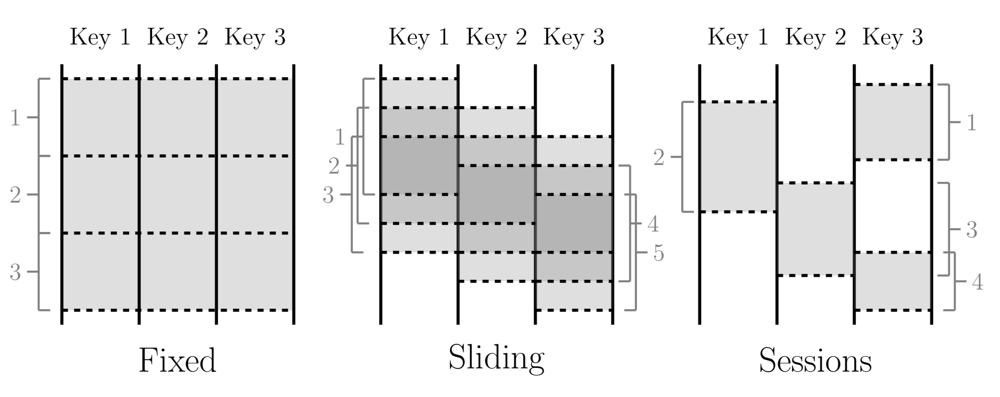

滑动窗口按窗口大小和滑动周期大小来定义，比如说小时窗口，每一分钟滑动一次。这个滑动周期一般比窗口大小小，也就是说窗口有相互重合之处。滑动窗口一般也是对齐的；尽管上面的图为了画出滑动的效果窗口没有遮盖到所有的键，但其实五个滑动窗口其实是包含了所有的3个键，而不仅仅是窗口3包含了所有的3个键。固定窗口可以看做是滑动窗口的一个特例，即窗口大小和滑动周期大小相等。

会话是在数据的子集上捕捉一段时间内的活动。一般来说会话按超时时间来定义，任何发生在超时时间以内的事件认为属于同一个会话。会话是非对齐窗口。如上图，窗口2只包含key 1，窗口3则只包含key 2。而窗口1和4都包含了key 3。(译者注：假设key是用户id，那么两次活动之间间隔超过了超时时间，因此系统需要重新定义一个会话窗口。)

### 时间域

当处理包含事件发生时间的数据时，有两个时间域需要考虑。尽管已经有很多文献提到(特别是时间管理，语义模型，窗口，乱序处理，标记，心跳，水位标记，帧)，这里仍然重复一下，因为这个概念清晰之后2.3节会更易于理解。这两个时间域是：

- 事件发生时间。事件发生时间是指当该事件发生时，该事件所在的系统记录下来的系统时间。
- 处理时间。处理时间是指在数据处理管道中处理数据时，一个事件被数据处理系统观察到的时间，是数据处理系统的时间。注意我们这里不假设在分布式系统中时钟是同步的。

一个事件的事件发生时间是永远不变的，但是一个事件的处理时间随着它在数据管道中一步步被处理时持续变化的。这个区别是非常重要的，特别是我们需要根据事件的发生时间进行分析的时候。

在数据处理过程中，由于系统本身的一些现实影响(通信延迟，调度算法，处理时长，管道中间数据序列化等)会导致这两个时间存在差值且动态波动(见图2)。使用记录全局数据处理进度的标记、或水位标记，是一种很好的方式来可视化这个差值。在本论文中，我们采用一种类似MillWheel的水位标记，它是一个时间戳，代表小于这个时间戳的数据已经完全被系统处理了(通常用启发式方法建立)。我们之前曾经说过，数据已经被完全处理的标记经常和数据的准确性是相互冲突的，因此，我们不会太过于依赖于水位标记。不过，它确实是一种有用的手段。系统可以用它猜测所有事件发生时间早于水位标记的数据已经完全被观察到。应用可以用它来可视化处理时间差，也用它来监控系统总体的健康状况和总体处理进展，也可以用它来做一些不影响数据准确性的决策，比如基本垃圾回收策略等。

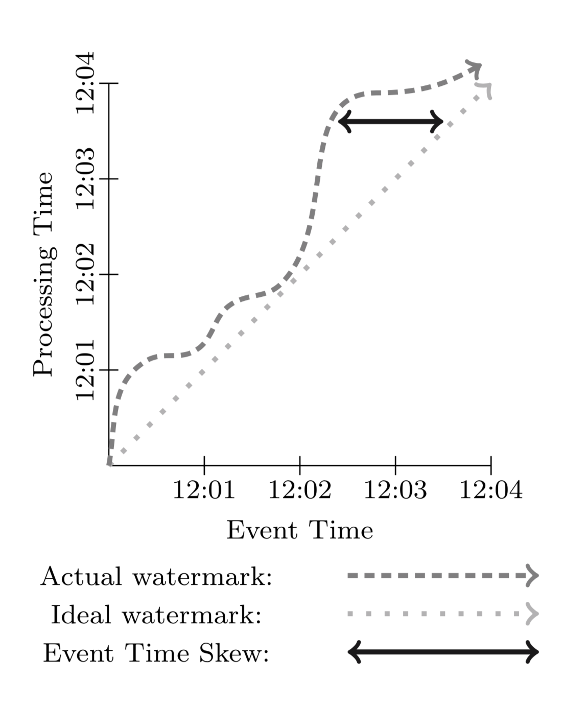

(译者注：假设事件发生系统和数据处理系统的时钟完全同步)在理想的情况下，两个时间的差值应该永远为零；事件一旦发生，我们就马上处理掉。现实则更像图2那样。从12点开始，由于数据处理管道的延迟，水位标记开始偏离真实时间，12:02时则靠近回来，而12:03的时候延迟变得更大。在分布式数据处理系统里，这种偏差波动非常普遍，在考虑数据处理系统如何提供一个正确的，可重复的结果时，把这种情况纳入考虑很关键。

水位标记的建立

对大多数现实世界中分布式数据集，系统缺乏足够的信息来建立一个100%准确的水位标记。举例来说，在视频观看"会话"的例子中，考虑离线观看。如果有人把他们的移动设备带到野外，系统根本没有办法知道他们何时会回到有网络连接的地带，然后开始上传他们在没有网络连接时观看视频的数据。因此，大多数的水位定义是基于有限的信息启发式地定义。对于带有未处理数据的元数据的结构化输入源，比如说日志文件(译者注：可能应该不是泛指一般的日志文件)，水位标记的猜测明显要准确些，因此大多数情况下可以作为一个处理完成的估计。另外，很重要的一点，一旦水位标记建立之后，它可以被传递到数据处理管道的下游(就像标记(Punctuation)那样, 译者注：类似于Flink的checkpoint barrier)。当然下游要明确知道这个水位标记仍然是一个猜测。

## DataFlow模型

在这一个小节中，我们将定义正式的系统模型。我们还会解释为什么它的语义足够泛化，能涵盖标准的批处理，微批次处理，流处理，以及混合了流批语义的Lambda架构。代码示例是基于Dataflow的Java SDK的一个简化版本，是从FlumeJava API演化而来。

### 核心编程模型

我们先从经典的批处理模型开始来考虑我们的核心编程模型。Dataflow SDK把所有的数据抽象为键值对，对键值对有两个核心的数据转换操作：

- ParDo用来进行通用的并行化处理。每个输入元素(这个元素本身有可能是一个有限的集合)都会使用一个UDF进行处理(在Dataflow中叫做DoFn)，输出是0或多个输出元素。这个例子是把键的前缀进行展开，然后把值复制到展开后的键构成新的键值对并输出。


- GroupByKey用来按键值把元素重新分组

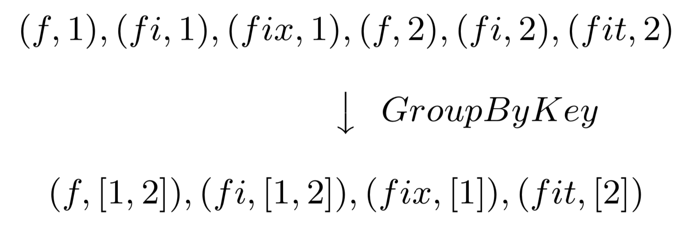

ParDo操作因为是对每个输入的元素进行处理，因此很自然地就可以适用于无边界的数据。而GroupByKey操作，在把数据发送到下游进行汇总前，需要收集到指定的键对应的所有数据。如果输入源是无边界的，那么我们不知道何时才能收集到所有的数据。所以通常的解决方案是对数据使用窗口操作。

### 窗口

支持聚合操作的系统经常把GroupByKey操作重新定义成为GroupByKeyAndWindow操作。我们在这一点上的主要贡献是支持非对齐窗口。这个贡献包含两个关键性的洞见：第一是从模型简化的角度上，把所有的窗口策略都当做非对齐窗口，而底层实现来负责把对齐窗口作为一个特例进行优化。第二点是窗口操作可以被分隔为两个互相相关的操作：

- set<Window> AssignWindows(T datum)即窗口分配操作。这个操作把元素分配到0或多个窗口中去。这个也就是Li在[22]中提到的桶操作符。
- set<Window> MergeWindows(Set<Window>  windows)即窗口合并操作，这个操作在汇总时合并窗口。这使得数据驱动的窗口在随着数据到达的过程中逐渐建立起来并进行汇总操作。

对于任何一种窗口策略，这两种操作都是密切相关的。滑动窗口分配需要滑动窗口合并，而会话窗口分配需要会话窗口合并。

注意，为了原生地支持事件发生时间窗口，我们现在定义系统中传递的数据不再仅仅是键值对(key, value)，而是一个四元组(key, value, event_time, window)。数据进入系统时需要自带事件发生时间戳(后期在管道处理过程中也可以修改)，然后初始化分配一个默认的覆盖所有事件发生时间的全局窗口。而全局窗口语义默认等同于标准的批处理模型。

#### 窗口分配

从模型角度来说，把一条数据分配给某几个窗口意味着把这条数据复制给了这些窗口。以图3为例，它是把两条记录分配给一个2分钟宽，每一分钟滑动一次的窗口。(简单起见，时间戳用HH:MM的格式给出)

在这个例子中，两条数据在两个窗口中冗余存在，因而最后变成了四条记录。另外注意一点，窗口是直接关联到数据元素本身的，因此，窗口的分配可以在处理管道的聚合发生前的任何一处进行。这一点很重要，因为聚合操作有可能是下游复杂组合数据转换的一个子操作。(如Sum.integersPerKey, 译者注：下文会提到，这个转换是指键值对中的值为整形，把整形值按键进行求和)。


#### 窗口合并

窗口合并作为GroupByKeyAndWindow的一部分出现，要解释清楚的话，我们最好拿例子来阐述。我们拿会话窗口来作为例子，因为会话窗口正是我们想要解决的用例之一。图4展示了例子数据4条，3条包含的键是k1，一条是k2，窗口按会话窗口组织，会话的过期时间是30分钟。所有4条记录初始时都属于默认的全局窗口。AssignWindows的会话窗口实现把每个元素都放入一个30分钟长的单个窗口，这个窗口的时间段如果和另外一个窗口的时间段相互重合，则意味着这两个窗口应该属于同一个会话。AssignWindows后是GroupByKeyAndWindow的操作，这个操作其实由五个部分组成：

- DropTimestamps – 删除数据上的时间戳，因为窗口合并后，后续的计算只关心窗口。
- GroupByKey – 把(值, 窗口)二元组按键进行分组
- MergeWindows – 窗口合并。把同一个键的(值, 窗口)进行窗口合并。具体的合并方式取决于窗口策略。在这个例子中，窗口v1和v4重叠，因此会话窗口策略把这两个窗口合并为一个新的，更长的会话窗口。(如粗体所示)
- GroupAlsoByWindow – 对每个键，把值按合并后的窗口进行进一步分组。在本例中，由于v1和v4已经合并进了同一个窗口，因此这一步里面v1和v4被分到了同一组。
- ExpandToElements – 把已经按键，按窗口分好组的元素扩展成(键, 值, 事件发生时间, 窗口)四元组。这里的时间戳是新的按窗口的时间戳。在这个例子里我们取窗口的结束时间作为这条记录的时间戳，但任何大于或等于窗口中最老的那条记录的时间戳都认为是符合水位标记正确性的。


#### API

下面我们使用Cloud Dataflow SDK来展示使用窗口操作的例子。

下面是计算对同一个键的整型数值求和

```java
PCollection<KV<String, Integer>> input = IO.read(...);
PCollection<KV<String, Integer>> output = input.apply(Sum.integersPerKey());
```

假如说要对30分钟长的会话窗口进行同样的计算，那么只要在求和前增加一个window.into调用就可以了

```java
PCollection<KV<String, Integer>> input = IO.read(...);
PCollection<KV<String, Integer>> output = input
  .apply(Window.into(Sessions.withGapDuration( Duration.standardMinutes(30))))
  .apply(Sum.integersPerKey());
```

### 触发器和增量处理

构建非对齐的事件发生时间窗口是一个进步，不过我们还有两个问题需要解决

- 我们需要提供基于记录和基于处理时间的窗口。否则我们会和现有的其他系统的窗口语义不兼容。
- 我们需要知道何时把窗口计算结果发往下游。由于数据事件发生时间的无序性，我们需要某种其他的信号机制来明确窗口已经完结(译者注：就是说，窗口所应该包含的数据已经完全到达并且被窗口观察到，包含到)。

关于第一点，基于记录数和基于处理时间的窗口，我们会在2.4里解决。而眼下需要讨论建立一个保证窗口完整性的方法。提到窗口完整性，一个最开始的想法是使用某种全局事件发生时间进展机制，比如水位标记来解决。然而，水位标记本身对数据处理的准确性有两个主要的影响:

- 水位标记可能设置的过短，因此在水位标记达到后仍然有记录到达。对于分布式的数据源头来说，很难去推断出一个完全完美的事件发生时间水位标记，因此无法完全依赖于水位标记，否则我们无法达到100%的准确性。
- 水位标记可能设置的过长。因为水位标记是全局性的进度指标，只要一个迟到的数据项就能影响到整个数据处理管道的水位标记。就算是一个正常工作的数据处理管道，它的处理延迟波动很小，受输入源的影响，这种延迟的基准仍然可能有几分钟甚至更高。因此，使用水位标记作为窗口完整信号并触发窗口计算结果很可能导致整个处理结果比Lambda架构有更高的延迟。

由于上述的原因，我们认为光使用水位标记是不够的。从Lambda架构中我们获得了规避完整性问题的启发：它不是尽快地提供完全准确的答案，而是说，它先是尽快通过流式处理管道提供一个最佳的低延迟估计，同时承诺最终会通过批处理管道提供正确的和一致的答案(当然前提条件是批处理作业启动时，需要的数据应该已经全部到达了；如果数据后期发生了变化，那么批处理要重新执行以获得准确答案)。如果我们要在一个单一的数据处理管道里做到同样的事情(不管采用哪种执行引擎)，那么我们需要一种对任一窗口能够提供多种答案(或者可以叫做窗格, 译者注：对窗口这个比喻的引申)的方式。我们把这种功能叫做“触发器”。这种"触发器"可以选择在何时触发指定窗口的输出结果。

简单来说，触发器是一种受内部或者外信号激励的激发GroupByKeyAndWindow执行并输出执行结果的机制。他们对窗口模型是互补的，各自从不同的时间维度上影响系统的行为：

- 窗口 决定哪些事件发生时间段(where)的数据被分组到一起来进行聚合操作
- 触发 决定在什么处理时间(when)窗口的聚合结果被处理输出成一个窗格

我们的系统提供了基于窗口的完成度估计的预定义触发器。(完成度估计基于水位标记。完成度估计也包括水位标记完成百分位。它提供了一种有效的处理迟到记录的语义，而且在批处理和流处理引擎中都适用。允许使用者处理少量的一部分的记录来快速获得结果，而不是痴痴地等待最后的一点点数据到来)。触发器也有基于处理时间的，基于数据抵达状况的(如记录数，字节数，数据到达标记(punctuations)，模式匹配等)。我们也支持对基础触发器进行逻辑组合(与，或)，循环，序列和其他一些复合构造方法。另外，用户可以基于执行引擎的元素(如水位计时器，处理时间计时器，数据到达，复合构造)和任意的外部相关信号(如数据注入请求，外部数据进展指标，RPC完成回调等)自定义触发器。在2.4里我们会更详细地看一些具体的例子。

除了控制窗口结果计算何时触发，触发器还提供了三种不同的模式来控制不同的窗格(计算结果)之间是如何相互关联的。

- 抛弃：窗口触发后，窗口内容被抛弃，而之后窗口计算的结果和之前的结果不存在相关性。当下游的数据消费者(不管是数据处理管道的内部还是外部)希望触发计算结果之间相互独立(比如对插入的数据进行求和的场景)，那么这种情况就比较适用。另外，抛弃因为不需要缓存历史数据，因此对比其他两种模式，抛弃模式在状态缓存上是最高效的。不过累积性的操作可以建模成Dataflow的Combiner，对窗口状态管理可以用增量的方式处理。对我们视频观看会话的用例来说，抛弃模式是不够的，因为要求下游消费者只关心会话的部分数据是不合理的。
- 累积：触发后，窗口内容被完整保留住持久化的状态中，而后期的计算结果成为对上一次结果的一个修正的版本。这种情况下，当下游的消费者收到同一个窗口的多次计算结果时，会用新的计算结果覆盖掉老的计算结果。这也是Lambda架构使用的方式，流处理管道产出低延迟的结果，之后被批处理管道的结果覆盖掉。对视频会话的用例来说，如果我们把会话窗口的内容进行计算然后把结果直接写入到支持更新的输出源(如数据库或者键值存储)，这种方案是足够的了。
- 累积和撤回：触发后，在进行累积语义的基础上，计算结果的一份复制也被保留到持久化状态中。当窗口将来再次触发时，上一次的结果值先下发做撤回处理，然后新的结果作为正常数据下发。如果数据处理管道有多个串行的GroupByKeyAndWindow操作时，撤回是必要的，因为同一个窗口的不同触发计算结果可能在下游会被分组到不同键中去。在这种情况下，除非我们通过一个撤回操作，撤回上一次聚合操作的结果，否则下游的第二次聚合操作会产生错误的结果。Dataflow的combiner操作是支持撤回的，只要调用uncombine方法就可以进行撤回。而对于视频会话用例来说，这种模型是非常理想的。比如说，如果我们在下游从会话创建一开始，我们就基于会话的某些属性进行汇总统计，例如检查不受欢迎的广告(比如说在很多会话中这个广告的被观察时长不长于5秒)。早期的计算结果随着输入的增加(比如说原来在野外观看视频的用户已经回来了并上传了他们的日志)可能变得无效。对于包含多个阶段的聚合操作的复杂数据处理管道，撤回方式帮助我们应对源头数据的变化，得到正确的数据处理结果。(简单的撤回实现只能支持确定性的计算，而非确定性计算的支持需要更复杂，代价也更高。我们已经看到这样的使用场景，比如说概率模型, 译者注：比如说基于布隆过滤器的UV统计)。

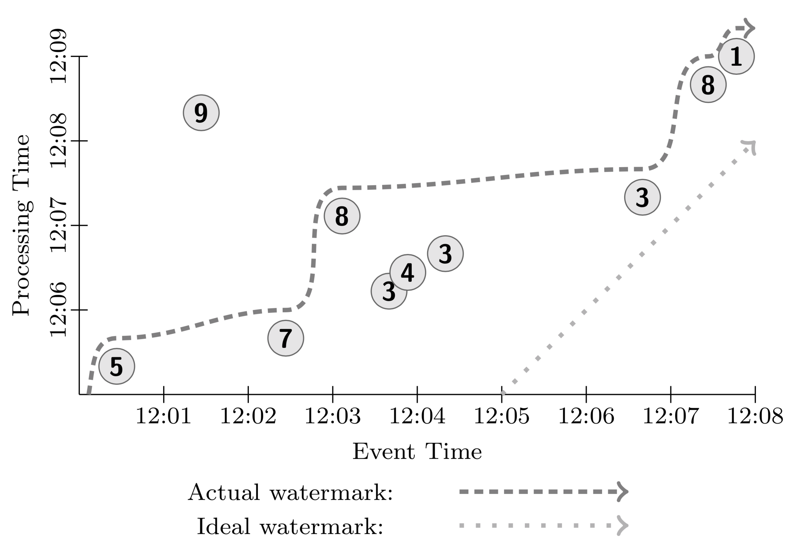

很多例子都要考虑水位线，因此我们的图当中也包括了理想的水位线，也包括了实际的水位线。直的虚线代表了理想的水位线，即，事件发生时间和数据处理时间不存在任何延迟，所有的数据一产生就马上消费了。不过考虑到分布式系统的不确定性，这两个时间之间有偏差是非常普遍的。在图5中，实际的水位线(黑色弯曲虚线)很好的说明了这一点。另外注意由于实际的水位线是猜测获得的，因此有一个迟到比较明显的数据点落在了水位线的后面。

如果我们在传统的批处理系统中构建上述的对数据进行求和的数据处理管道，那么我们会等待所有的数据到达，然后聚合成一个批次(因为我们现在假设所有的数据拥有同样的键)，再进行求和，得到了结果51。如图6所示黑色的长方形是这个运算的示意图。长方形的区域代表求和运算涵盖的处理时间和参与运算的数据的事件发生时间区间。长方形的上沿代表计算发生，获得结果的管道处理时间点。因为传统的批处理系统不关心数据的事件发生时间，所有的数据被涵盖在一个大的全局性窗口中，因此包含了所有事件发生时间内的数据。而且因为管道的输出在收到所有数据后只计算一次，因此这个输出包含了所有处理时间的数据(译者注：处理时间是数据系统观察到数据的时间，而不是运算发生时的时间。)


注意上图中包含了水位线。尽管在传统批处理系统中不存在水位线的概念，但是在语义上我们仍然可以引入它。批处理的水位线刚开始时一直停留不动。直到系统收到了所有数据并开始处理，水位线近似平行于事件发生时间轴开始平移，然后一直延伸到无穷远处。我们之所以讨论这一点，是因为如果让流处理引擎在收到所有数据之后启动来处理数据，那么水位线进展和传统批处理系统是一模一样的。(译者注：这提示我们其实水位线的概念可以同样适用于批处理)

现在假设我们要把上述的数据处理管道改造成能够接入无边界数据源的管道。在Dataflow模型中，默认的窗口触发方式是当水位线移过窗口时吐出窗口的执行结果。但如果对一个无边界数据源我们使用了全局性窗口，那么窗口就永远不会触发(译者注：因为窗口的大小在不停地扩大)。因此，我们要么用其他的触发器触发计算(而不是默认触发器)，或者按某种别的方式开窗，而不是一个唯一的全局性窗口。否则，我们永远不会获得计算结果输出。

我们先来尝试改变窗口触发方式，因为这会帮助我们产生概念上一致的输出(一个全局的包含所有时间的按键进行求和)，周期性地输出更新的结果。在这个例子中，我们使用了Window.trigger操作，按处理时间每分钟周期性重复触发窗口的计算。我们使用累积的方式对窗口结果进行修正(假设结果输出到一个数据库或者KV数据库，因而新的结果会持续地覆盖之前的计算结果)。这样，如图7所示，我们每分钟(处理时间)产生更新的全局求和结果。注意图中半透明的输出长方形是相互重叠的，这是因为累积窗格处理机制计算时包含了之前的窗口内容。

```java
PCollection<KV<String, Integer>> output = input
    .apply(Window.trigger(Repeat(AtPeriod(1, MINUTE)))
    .accumulating())
    .apply(Sum.integersPerKey());
```


如果我们想要求出每分钟的和的增量，那么我们可以使用窗格的抛弃模式，如图8所示。注意这是很多流处理引擎的处理时间窗口的窗口计算模式。窗格不再相互重合，因此窗口的结果包含了相互独立的时间区域内的数据。

```java
PCollection<KV<String, Integer>> output = input
    .apply(Window.trigger(Repeat(AtPeriod(1, MINUTE)))
    .discarding())
    .apply(Sum.integersPerKey());
```


另外一种更健壮的处理时间窗口的实现方式，是把数据摄入时的数据到达时间作为数据的事件发生时间，然后使用事件发生时间窗口。这样的另一个效果是系统对流入系统的数据的事件发生时间非常清楚，因而能够生成完美的水位线，不会存在迟到的数据。如果数据处理场景中不关心真正的事件发生时间，或者无法获得真正的事件发生时间，那么采用这种方式生成事件发生时间是一种非常低成本且有效的方式。

在我们讨论其他类型的窗口前，我们先来考虑下另外一种触发器。一种常见的窗口模式是基于记录数的窗口。我们可以通过改变触发器为每多少条记录到达触发一次的方式来实现基于记录数的窗口。图9是一个以两条记录为窗口大小的例子。输出是窗口内相邻的两条记录之和。更复杂的记录数窗口(比如说滑动记录数窗口)可以通过定制化的窗口触发器来支持。

```java
PCollection<KV<String, Integer>> output = input
    .apply(Window.trigger(Repeat(AtCount(2)))
    .discarding())
    .apply(Sum.integersPerKey());
```


我们接下来考虑支持无边界数据源的其他选项，不再仅仅考虑全局窗口。一开始，我们来观察固定的2分钟窗口，累积窗格。

```java
PCollection<KV<String, Integer>> output = input
    .apply(Window.into(FixedWindows.of(2, MINUTES)
    .accumulating())
    .apply(Sum.integersPerKey());
```

这里没有定义触发器，那么系统采用的是默认触发器。相当于

```java
PCollection<KV<String, Integer>> output = input
    .apply(Window.into(FixedWindows.of(2, MINUTES))
    .trigger(Repeat(AtWatermark())))
    .accumulating())
    .apply(Sum.integersPerKey());
```

水位线触发器是指当水位线越过窗口底线时窗口被触发。我们这里假设批处理和流处理系统都实现了水位线(详见3.1)。Repeat代表的含义是如何处理迟到的数据。在这里Repeat意味着当有迟于水位线的记录到达时，窗口都会立即触发再次进行计算，因为按定义，此时水位线早已经越过窗口底线了。

图10-12描述了上述窗口在三种不同的数据处理引擎上运行的情况。首先我们来观察下批处理引擎上这个数据处理管道如何执行的。受限于我们当前的实现，我们认为数据源现在是有边界的数据源，而传统的批处理引擎会等待所有的数据到来。之后，我们会根据数据的事件发生时间处理，在模拟的水位线到达后窗口计算触发吐出计算结果。整个过程如图10所示：


然后来考虑一下微批次引擎，每分钟做一次批次处理。系统会每分钟收集输入的数据进行处理，反复重复进行。每个批次开始后，水位线会从批次的开始时间迅速上升到批次的结束时间(技术上来看基本上是即刻完成的，取决于一分钟内积压的数据量和数据处理管道的吞吐能力)。这样每轮微批次完成后系统会达到一个新的水位线，窗口的内容每次都可能会不同(因为有迟到的数据加入进来)，输出结果也会被更新。这种方案很好的兼顾了低延迟和结果的最终准确性。如图11所示：


接下来考虑数据管道在流处理引擎上的执行情况，如图12所示。大多数窗口在水位线越过它们之后触发执行。注意值为9的那个数据点在水位线之后到达。不管什么原因(移动设备离线，网络故障分区等)，系统并没有意识到那一条数据并没有到达，仍然提升了水位线并触发了窗口计算。当值为9的那条记录到达后，窗口会重新触发，计算出一个新的结果值。

如果说我们一个窗口只有一个输出，而且针对迟到的数据仅做一次的修正，那么这个计算方式还是不错的。不过因为窗口要等待水位线进展，整体上的延迟比起微批次系统可能要更糟糕，这就是我们之前在2.3里所说的，单纯依赖水位线可能引起的问题(水位线可能太慢)


如果我们想降低整体的延迟，那么我们可以提供按数据处理时间的触发器进行周期性的触发，这样我们能够尽早得到窗口的计算结果，并且在随后得到周期性的更新，直到水位线越过窗口边界。参见图13。这样我们能够得到比微批次系统更低的延迟，因为数据一到达就进入了窗口随后就可能被触发，而不像在微批次系统里必须等待一个批次数据完全到达。假设微批次系统和流处理系统都是强一致的，那么我们选择哪种引擎，就是在能接受的延迟程度和计算成本之间的选择(对微批次系统也是批大小的选择)。这就是我们这个模型想要达到的目标之一。参见图13：固定窗口，流处理，部分窗格

```java
PCollection<KV<String, Integer>> output = input
    .apply(Window.into(FixedWindows.of(2, MINUTES))
        .trigger(SequenceOf(
            RepeatUntil(
                AtPeriod(1, MINUTE),
                AtWatermark()),
            Repeat(AtWatermark())))
        .accumulating())
    .apply(Sum.integersPerKey());
```

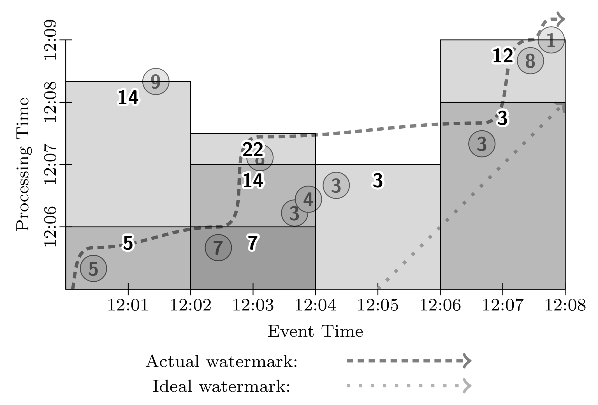

作为最后一个例子，我们来看一下如何支持之前提到的视频会话需求(为了保持例子之间的一致性，我们继续把求和作为我们的计算内容。改变成其他的聚合函数也是很容易的)。我们把窗口定义为会话窗口，会话超时时间为1分钟，并且支持回撤操作。这个例子也体现了我们把模型的四个维度拆开之后带来的灵活的可组合性(计算什么，在哪段事件发生时间里计算，在哪段处理时间里真正触发计算，计算产生的结果后期如何进行修正)。也演示了对之前的计算结果可以进行撤回是一个非常强力的工具，否则可能会让下游之前接收到的数据无法得到修正。

```java
PCollection<KV<String, Integer>> output = input
    .apply(Window.into(Sessions.withGapDuration(1, MINUTE))
        .trigger(SequenceOf(
            RepeatUntil(
                AtPeriod(1, MINUTE),
                AtWatermark()),
            Repeat(AtWatermark())))
        .accumulatingAndRetracting())
    .apply(Sum.integersPerKey());
```


在这个例子中，我们首先接收到了数据5和数据7。由于5和7之间事件发生时间大于1分钟，因此被当做了两个会话。在第一次窗口被触发时，产生了两条计算结果，和分别为5和7。在第二个因处理时间引起的窗口触发时，我们接收到了数据3,4,3，并且第一个3和上一个7之间时间大于1分钟，因此被分组到一个新的会话窗口，窗口触发计算并输出了计算结果10。紧接着，数据8到达了。数据8的到达使得数据7,3,4,3,8合并成了一个大窗口。当水位线越过数据点8后，新窗口计算被触发。触发后需要先撤回之前两个小窗口的计算结果，撤回方式是往下游发送两条键为之前的两个会话标记，值为-7和-10的记录，然后发送一个新的值为25的新窗口计算结果。同样，当值为9的记录迟于水位线到达后，之前的所有7条记录都合并成了一个会话，因此要对之前的会话再次进行撤回。值为-5和-25的记录又被发送往下游，新的值为39的会话记录随后也被发往下游。

同样的操作在处理最后3条值为3,8,1的记录时也会发生，先是输出了结果值3，随后回撤了这个计算结果，输出了合并会话后的结果值12。

## 实现和设计

### 实现

我们已经用FlumeJava实现了这个模型，使用MillWheel作为底层的流执行引擎；在本文写作的时候，针对公有云服务Cloud Dataflow的重新实现也接近完成。由于这些系统要么是谷歌的内部系统，要么是共有云服务，因此为简洁起见，实现的细节我们略掉了。可以提及的让人感兴趣的一点是，核心的窗口机制代码，触发机制代码是非常通用的，绝大部分都同时适用于批处理引擎实现和流处理引擎实现。这个实现本身也值得在将来进行更进一步的分析。

### 设计原则

尽管我们很多的设计其实是受到3.3节所描述的真实业务场景启发，我们在设计中也遵从了一系列的核心原则。这些原则我们认为是这个模型必须要遵循的。

- 永远不要依赖任何的数据完整性标记(译者注：如水位标记)
- 灵活性，要能覆盖已知的多样化的使用用例，并且覆盖将来可能的使用用例
- 对于每个预期中的执行引擎，(模型抽象)不但要正确合理，而且要有额外的附加价值
- 鼓励实现的透明性
- 支持对数据在它们产生的上下文中进行健壮的分析。

可以这么说，下述的使用案例决定了模型的具体功能，而这些设计原则决定了模型整体的特征和框架。我们认为这两者是我们设计的模型具有完全性，普遍性的根本原因。

### 业务场景

在我们设计Dataflow模型的过程中，我们考虑了FlumeJava和MillWheel系统在这些年遇到的各种真实场景。那些良好工作的设计，我们保留到了模型中，而那些工作不那么良好的设计激励我们采用新的方法重新设计。下面我们简单介绍一些影响过我们设计的场景。

#### 大规模数据回写和Lambda架构；统一模型

有一些团队在MillWheel上跑日志链接作业。这其中有一个特别大的日志链接处理作业在MillWheel上按流模式运行，而另外一个单独的FlumeJava批处理作业用来对流处理作业的结果进行大规模的回写。一个更好的设计是使用一个统一的模型，对数据处理逻辑只实现一次，但是能够在流处理引擎和批处理引擎不经修改而同时运行。这是第一个激发我们思考去针对批处理，微批次处理和流处理建立一个统一模型的业务场景。这也是图10-12所展示的。

另外一个激发我们设计统一模型的场景是Lambda架构的使用。尽管谷歌大多数数据处理的场景是由批处理系统和流处理系统分别单独承担的，不过有一个MillWheel的内部客户在弱一致性的模式下运行他们的流处理作业，用一个夜间的MR作业来生产正确的结果。他们发现他们的客户不信任弱一致性的实时结果，被迫重新实现了一个系统来支持强一致性，这样他们就能提供可靠的，低延时的数据处理结果。这个场景进一步激励我们能支持灵活地选择不同的执行引擎。

#### 非对齐窗口：会话

从一开始我们就知道我们需要支持会话；事实上这是我们窗口模型对现有模型而言一个重大的贡献。会话对谷歌来说是一个非常重要的使用场景(也是MillWheel创建的原因之一)。会话窗口在一系列的产品域中都有应用，如搜索，广告，分析，社交和YouTube。基本上任何关心把用户的分散活动记录进行相互关联分析都需要通过会话来进行处理。因此，支持会话成为我们设计中的最重要考虑。如图14所示，支持会话在Dataflow中是非常简单的。

#### 支付：触发器，累加和撤回

有两个在MillWheel上跑支付作业的团队遇到的问题对模型的一部分也有启发作用。当时我们的设计实践是使用水位线作为数据完全到达的指标。然后写额外的逻辑代码来处理迟到的数据或者更改源头数据。由于缺乏一个支持更新和撤回的系统，负责资源利用率方案的团队最终放弃了我们的平台，构建了自己独立的解决方案(他们最后使用的模型和我们同时设计开发的模型事实上非常类似)。另一个支付团队的数据源头有少部分缓慢到达的数据，造成了水位线延迟，这给他们带来了大问题。这些系统上的缺陷成为我们对现有系统需要进行改良设计的重要动因，并且把我们的考虑点从保证数据的完整性转移到了对迟到数据的可适应性。对于这个场景的思考总结带来了两个方面：一个方面是能够精确，灵活地确定何时将窗口内容物化的触发器(如图7～图14所示)，对同样的输入数据集也可以使用多种多样地结果输出模式进行处理。另外一方面是通过累积和撤回能够支持增量处理。(图14)

#### 统计计算：水位线触发器

很多MillWheel作业用来进行汇总统计(如平均延迟)。对这些作业来说，100%的准确性不是必须的，但是在合理的时间范围内得到一个接近完整的统计是必须的。考虑到对于结构化的输入(如日志文件)，使用水位线就能达到很高程度的准确度。这些客户发现使用单次的的基于水位线的触发器就可以获得高度准确的统计。水位线触发器如图12所示。

我们有一些滥用检测的作业运行在MillWheel中。滥用检测是另外一种快速处理大部分数据比缓慢处理掉所有数据要远远更有价值的场景。因此，他们会大量地使用水位线百分位触发器。这个场景促使我们在模型中加入了对水位线百分位触发器的支持。

与此相关的，批处理作业中的一个痛点是部分处理节点的缓慢进度会成为执行时间中的长尾，拖慢整个进度。除了可以通过动态平衡作业来缓解这个问题，FlumeJava也支持基于整体完成百分度来选择是否终止长尾节点。用统一模型来描述批处理中遇到的这个场景的时候，水位线百分位触发器可以很自然地进行表达，不需要在引入额外的定制功能、定制接口。

#### 推荐：处理时间触发器

另外一种我们考虑过的场景是从大量的谷歌数据资产中构建用户活动树(本质上是会话树)。这些树用来根据用户的兴趣来做推荐。在这些作业中我们使用处理时间作为触发器。这是因为，对于用户推荐来说，周期性更新的，即便是基于不完备数据的用户活动树比起持续等待水位线越过会话窗口边界(即会话结束)获得完全的数据要有意义的多。这也意味着由于部分少量数据引起的水位线进展延迟不影响基于其他已经到达的数据进行计算并获得有效的用户活动树。考虑到这种场景，我们包含了基于处理时间的触发器(如图7和图8所示)

#### 异常探测：数据驱动和组合触发器

在MillWheel的论文中，我们描述了一种用来检测谷歌网站搜索查询趋势的微分异常探测数据处理管道。当我们为模型设计触发器的时候，这种微分异常探测系统启发我们设计了数据驱动触发器。这种微分探测器检测网站检索流，通过统计学估计来计算搜索查询请求量是否存在一个毛刺。如果系统认为一个毛刺即将产生，系统将发出一个启动型号。当他们认为毛刺已经消除，那么他们会发出一个停止信号(译者注：可能会对接系统自动对系统扩容或缩容)。尽管我们可以采用别的方式来触发计算，比如说Trill的标点符(Punctuations)，但是对于异常探测你可能希望一旦系统确认有异常即将发生，系统应该立即输出这个判断。标点符的使用事实上把流处理系统转换成了微批次处理系统，引入了额外的延迟。在调查过一些用户场景后，我们认为标点符不完全适合我们。因此我们在模型中引入了可定制化数据驱动触发器。同时这个场景也驱使我们支持触发器组合，因为在现实场景中，一个系统可能在处理多种微分计算，需要根据定义的一组逻辑来支持多种多样的输出。图9中的AtCount触发器是数据驱动触发器的例子，而图10-14使用了组合触发器。

## 总结

数据处理的未来是无边界数据处理。 尽管有边界数据的处理永远都有着重要地位并且有用武之地，但是语义上它会被无边界数据处理模型所涵盖。一方面，无边界数据处理技术发展上步履蹒跚，另一方面对于数据进行处理并消费的要求在不断提高，比如说，需要对按事件发生时间对数据处理，或者支持非对齐窗口等。要发展能够支撑未来业务需要的数据处理系统，当前存在的系统和模型是一个非常好的基础，但我们坚持相信如果要完善地解决用户对无边界数据处理的需求，我们必须根本地改变我们的思维。

根据我们多年在谷歌处理大规模无边界数据的实践经验，我们相信我们提出的模型一个非常好的进展。它支持非对齐，事件发生时间窗口。这些都是当前用户所需要的。它提供了灵活的窗口触发机制，支持窗口累积和撤回，把关注点从寻求等待数据的完整性变为自动适应现实世界中持续变更的数据源。它对批处理，微批次，流处理提供了统一的抽象，允许数据开发人员灵活从三者中选择。同时，它避免了单一系统容易把系统本身的构建蔓延到数据处理抽象层面中去的问题。它的灵活性让数据开发者能根据使用场景恰当地平衡数据处理的准确性，成本和延迟程度。对于处理多样化的场景和需求来说，这一点很关键。最后，通过把数据处理的逻辑划分为计算什么，在哪个事件发生时间范围内计算，在什么处理时间点触发计算，如何用新的结果订正之前的数据处理结果让整个数据处理逻辑透明清晰。我们希望其他人能够认同这个模型并且和我们一起推进这个复杂而又令人着迷的领域的发展。
